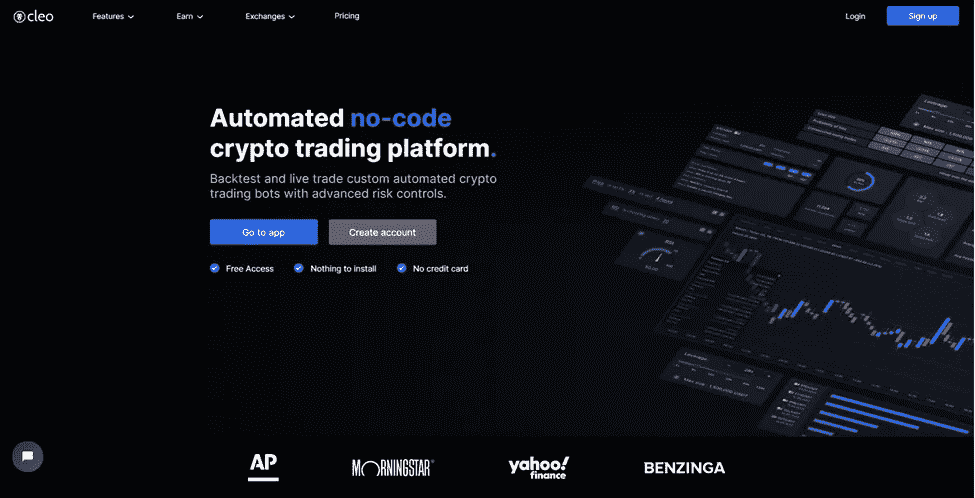

# 2023 年最佳 20 款免费加密交易机器人

> 原文：<https://medium.com/coinmonks/crypto-trading-bot-c2ffce8acb2a?source=collection_archive---------0----------------------->

## 审查，比较和选择最佳的加密交易机器人，以自动化您的交易策略，提高您的加密投资组合

现在，有很多付费和免费的密码交易机器人。对于你我这样的密码交易员来说，在这些服务之间做出选择是一件很麻烦的事情。因此，本文将帮助您选择最佳的交易加密机器人。

## 什么是加密交易机器人？

一个加密交易机器人是一个软件，可以帮助你自动化你的交易策略。换句话说，加密交易机器人会根据您在加密交易所的交易策略自动执行订单，无需人工干预。这降低了风险，让你比手工交易者更有优势。

在 [Mt.Gox](https://en.wikipedia.org/wiki/Mt._Gox) 的日子里，比特币交易员编写脚本买卖比特币来获利。随着时间的推移，这些加密机器人变得更加复杂。今天，你可以使用这些交易机器人交易任何替代硬币，如以太币、Dogecoin、Litecoin 等。

如今，超过 90%的加密交易都是通过这些机器人进行的。

交易所现在正步入交易机器人领域，推出网格机器人和 DCA 机器人，为客户提供更好的交易工具，增加交易量以赚取更多费用。

> 比如[***KuCoin***](https://www.kucoin.com/ucenter/signup?rcode=rJ45SVB)**，**[***Bybit***](https://coincodecap.com/go/coincodecap_page)， [**Bityard**](https://coincodecap.com/go/bityard) ， [**BINGX**](https://coincodecap.com/go/bingx) 也有内置交易机器人。
> 
> 也了解一下 [**复制交易 app**](/coinmonks/top-10-crypto-copy-trading-platforms-for-beginners-d0c37c7d698c)，它们现在很流行。
> 
> 还查看了名单 [**没有 KYC 密码交易所**](/coinmonks/no-kyc-crypto-exchanges-buy-crypto-without-kyc-3b2eda2b5397)

因此，如果你试图最大化你的回报，考虑使用这些工具。

然而，从一个加密交易机器人开始可能会令人困惑和不知所措。因此，我们为你挑选了最好的和易于使用的交易机器人。下面列出的一些最好的加密交易机器人是免费的开源软件。

如果你是一个初学者，从预先建立现成的交易策略模板开始，减少自动化策略时的错误风险。

# 20 大加密交易机器人👇

我试图让事情简短；正如科菲·安南所说，“知识就是力量。信息正在解放。”在本文中，我试图向您提供顶级加密交易机器人的所有功能。

Best Trading Bots

## 1. [Pionex](https://coincodecap.com/go/pionex) —免费的最佳加密交易机器人

使用 Pionex **时不需要与 API 键争论。**到目前为止，Pionex 上有 18 个**免费的加密货币 Bot:**Pionex[网格交易 Bot](https://coincodecap.com/grid-trading) ，Pionex 杠杆网格 Bot，Pionex 保证金网格 Bot，Pionex 无限网格 Bot，反向网格 Bot，杠杆反向网格 Bot，美元成本平均 Bot，TWAP Bot，尾随获利 Bot， **BTC Moon** ， **ETH Moon** ，现货期货套利 Bot ( [点击此处](https://coincodecap.com/pionex-arbitrage-bot))。

**Pionex** 是内置加密交易机器人的交易所。这是 2017 年以来我见过的最好的加密货币自由交易机器人平台之一。(我开始购买 crypto :P 的那一年)它聚集了来自 Binance.com 交易所和 T21 交易所的流动性，并提供了一个免费的交易机器人。

Pionex 还创造了一些期权交易产品，如彩票，你可以投资低至 1 美元。

Pionex Bots — best trading bots for crypto

Pionex 交易所最近推出了其[现货期货加密套利机器人](https://coincodecap.com/pionex-arbitrage-bot)，为传统套利机器人提供了另一种选择。

而且 Pionex 交易机器人很好用。所以，我更喜欢用这个交易机器人交易比特币。

Pionex 是安全的，并已获得新加坡和美国的 MAS 和 MBS 许可证。它是我列表中的第一个加密交易机器人，也是市场上最好的免费机器人。然而，与 Pionex 相比，Bitsgap 有一个更好的网格机器人，但 Bitsgap 不是免费的。

要了解更多，请阅读我们的 [**Pionex 评论**](https://coincodecap.com/pionex-review-exchange-with-crypto-trading-bot) **。**

Buy Pionex

## 2.[KuCoin](https://coincodecap.com/go/kucoin)——面向初学者的加密交易机器人

大家都知道 KuCoin 是一个简单易用又安全的加密货币交易所。

然而，KuCoin 几乎没有内置的交易机器人，如现货和期货市场的网格机器人和 DCA 机器人。

库币是交换；因此，这些机器人将能够比任何使用 API 密钥连接您的加密交换的第三方机器人更好地执行交易。

Kucoin — Crypto trading bots for beginners

与本文中的其他交易机器人相比，这提供了最好的性能。

不过，[***Pionex***](https://coincodecap.com/go/pionex)***的用户体验和 bot 覆盖率要好得多。***

此外，KuCoin 交易机器人可以让您享受免费的交易策略。

交易所现在正步入交易机器人领域，推出网格机器人和 DCA 机器人，为客户提供更好的交易工具，增加交易量以赚取更多费用。比如 [Gate.io](https://www.gate.io/ref/3674014) 和[火币](https://www.huobi.com/en-us/topic/invited/?invite_code=dsze8)也内置了交易机器人。

## 3. [Bitsgap](https://coincodecap.com/go/bitsgap) —币安网格交易机器人[ [加入 Bitsgap](https://coincodecap.com/go/bitsgap) ]

[Bitsgap](https://coincodecap.com/go/bitsgap) bot 以其独特的网格机器人而闻名。这些机器人允许你进行高频交易，这种交易只有大型对冲基金才能进行，或者你需要高价购买这些工具。

Bitsgap Grid Trading Bot

网格机器人在加密交易员预先定义的交易范围内按比例分配投资。

每次当限价单被执行时，机器人就会在这个价格之上下一个新的卖单。反之亦然，一个新的买入订单被置于任何已成交的卖出订单之下。只要价格保持在交易范围内，机器人就会不停地交易。

此外，Bitsgap 最近推出了其 [Bitsgap 期货交易机器人](https://coincodecap.com/bitsgap-futures-bot)，每天开设和关闭数百个小仓位。因此获得较小的回报和最小化风险。

Bitsgap 算法的设计目的是在每次价格波动时，通过低买高卖来最大化利润。自动机器人具有风险控制功能，如止损、跟踪、获利和几种退出策略。此外，Bitsgap 交易终端为您提供了一些顶级的工具。

*   一个基于云的解决方案，所以你不需要下载任何东西
*   交易机器人基于透明高效的逻辑
*   演示模式下的无风险 bot 交易模拟器
*   快速启动机器人的回溯测试策略

要了解更多，请阅读我们的 [**Bitsgap 评论**](/coinmonks/bitsgap-review-a-crypto-trading-bot-that-makes-easy-money-a5d88a336df2) **。**

Buy Bitsgap

## 4. [Cryptohopper](https://coincodecap.com/go/cryptohopper) —交易机器人策略和市场[ [注册链接](https://coincodecap.com/go/cryptohopper) ]

Cryptohopper 是一个用于比特币和其他加密货币的付费加密交易机器人。但在成为付费会员之前，你可以在 Cryptohopper 免费试用 7 天。

Cryptohopper bots for crypto trading

Cryptohopper 上比较知名的交易机器人之一就是做市机器人。然而，与网格机器人相比，Cryptohopper 允许您创建自己的交易策略，并使用 Cryptohopper marketplace 复制其他策略。

也可以复制交易信号和模板。

[CryptoHopper 电报机器人](https://coincodecap.com/cryptohopper-telegram-bot)将帮助你自动化你的[加密交易信号](/coinmonks/best-crypto-signals-telegram-5785cdbc4b2b)。

CryptoHopper Marketplace 允许您购买第三方服务，如[加密信号](https://coincodecap.com/what-are-crypto-trading-signals)、交易策略、应用程序和模板。此外，该机器人提供了一个演示交易账户，策略设计师，社交交易平台，纸张交易模式和市场套利工具。

Cryptohopper exchange 的标语对我来说相当醒目:最佳自动化加密交易机器人；)

要了解更多信息，请阅读我们的 [Cryptohopper 评论](https://coincodecap.com/cryptohopper-review) **。**

Buy Cryptohopper

## 5.你可以制作自己的比特币基地交易机器人！在这里加入

Coinrule 是面向初学者的下一级机器人。“if-this-then-that”规则允许更不先进的加密交易员在一分钟内建立他们的加密货币交易策略。用户友好的界面指导用户一步一步地制作交易机器人。

Coinrule — Build bots for crypto trading

模板库包括超过 150 个预设规则，帮助新手运行适合他们需要的交易系统。

此外，该平台允许各种加密货币交易策略，包括止损、止盈和整合领先的技术指标。

Coinrule 允许的交易策略列表是无限的，该公司定期在[平台的知识库](https://coinrule.io/help)中发布新想法。

另一个令人兴奋的功能是内置的演示交流。演示规则直接根据币安的价格运行，因此没有风险。因此，这个平台非常适合创建你自己的比特币基地机器人。

要了解更多，请阅读我们的 [**Coinrule Review**](/coinmonks/coinrule-review-2021-a-beginner-friendly-crypto-trading-bot-daf0504848ba) 。

Buy Coinrule

## 6. [Trality](https://coincodecap.com/go/Trality) —最先进的加密交易机器人触手可及

Trality 成立于 2019 年，一年后我发现了它，并继续对其不断扩展的创新功能印象深刻。他们的最新产品是 Trality Marketplace，在这里加密机器人的创造者和投资者为了互利的目的走到一起。

投资者可以租赁根据个人风险承受能力(低、中、高)和基于全套指标的投资目标定制的盈利机器人，而机器人创造者现在可以将他们的机器人货币化，并从世界各地的投资者那里获得被动收入。最重要的是，所有的 bot 算法都保持完全私有(每个创作者都保留完全的知识产权)。

Trality 还与币安合作提供 Trality 钱包，允许用户直接存款(信用卡、银行转账、Apple Pay 或 Google Pay)，并立即开始交易 350+密码。

Trality 凭借其独一无二的浏览器内代码编辑器[建立了其作为自动化领域领先的欧洲金融科技专家的声誉，该编辑器甚至允许用 Python 编写最复杂和最有创意的策略。不会编码？Trality 直观、用户友好的](https://www.trality.com/creator/code-editor?fpr=coinmonks)[规则生成器](https://www.trality.com/creator/rule-builder?fpr=coinmonks)为初学者提供了一个简单的拖放界面。

一个不错的附加功能是保证金交易，该平台还配备了一个 power backtester。将其与 Trality 的专有优化器配对，以微调参数并验证您的想法。一旦机器人准备就绪，它就可以在币安、比特币基地专业版、北海巨妖和 Bitpanda 等热门交易所进行实时交易。

展望未来，Trality 将很快提供两个奖励计划(推荐朋友和钱包奖励)及其 iOS 和 Android 移动应用程序。最后需要注意的是，平台对所有体验水平的用户都有一个公平的定价模型。他们的[启动计划是绝对免费的](https://www.trality.com/pricing?fpr=coinmonks)并且不受时间限制，所以你可以使用和测试基本容量，只要你想。

## 7.[3 条消息](https://coincodecap.com/go/3commas) —加密机器人交易和加密信号

3Commas 是顶级加密交易机器人之一。我把它放在列表中，因为 UI 更适合专业交易者。

最近，3Commas 发布了一个新的[网格机器人](https://3commas.io/grid-bo?c=coinmonks)和一个 DCA 机器人。

因此，如果你已经是一名专业的机器人交易员，你应该试试 3Commas。

3Commas — bots for crypto trading

*   它有两个订购级别—基本和专业。基本级别的 bot 价格为 29 美元/月，而后者的价格为 99 美元/月，并具有更多功能。
*   3Commas 上的加密货币交易机器人可以根据技术指标实施多种比特币交易策略，并实现交易比特币获利。
*   社区不错，可以用 3Commas 比特币交易机器人买一些在线课程。
*   此外，该平台还提供第三方加密信号市场。

要了解更多信息，请阅读我们的[**3 常见评论**](https://coincodecap.com/3commas-review-an-excellent-crypto-trading-bot) 。

Buy 3Commas

## 8.Cornix —自动化基于电报的加密信号

Cornix 是最好的自动化加密交易平台之一。

他们成功地将其尖端软件与简单、用户友好的界面相结合(只需三次点击即可创建您的机器人)，这是他们进入该榜单的主要原因之一。

他们还拥有最大的[加密信号](https://coincodecap.com/best-crypto-signals-telegram)提供商市场，他们的支持被评为业内最佳。

Cornix 认为任何人都可以交易密码，他们希望让人们访问一个简单的密码交易平台，而不损害安全性。

最近发布了一个新的高级 DCA 机器人。

免费试用 Cornix 不需要信用卡。

要了解更多信息，请阅读 [Cornix 评论](https://coincodecap.com/cornix-review)。

> 免费使用优惠券代码，在您的 cornix 订阅上获得 10%的折扣。

Cornix Bot

## 9.TradeSanta —自动加密交易软件[ [在此注册](https://coincodecap.com/go/tradesanta)

TradeSanta trading bot 在币安、Bittrex、HitBTC 和 Bitfinex 等八个主要交易所运行，帮助您在这些交易所同时进行加密交易。

这是一个基于云的加密交易机器人平台，自 2018 年以来已经上市。它已经帮助成千上万的用户简化了他们的日常交易:超过 210，000 名注册用户和超过 2，200 万笔交易已经完成。

TradeSanta Crypto Bot

**主要特点**

*   TradeSanta 机器人可以在期货和现货市场交易。
*   TradeSanta 提供了多种信号，如 TradingView 定制信号、基于 TradingView Screener 的预建信号和技术指标，如布林线、MACD、RSI 等。
*   止损、跟踪止损、跟踪止盈和其他风险管理工具。
*   DCA 和网格策略。
*   演示交易允许你在不投入任何真钱的情况下，在真实的市场条件下测试你的策略。
*   电报通知和实时跟踪，因此您可以随时检查您的机器人在做什么。
*   TradeSanta 还有一个很好的功能，可以让你快速平仓并将所有资产转移到 USDT 或 BTC。例如，当市场开始崩溃或你想调整你的收益时，如果你需要快速操作，它会很有帮助。

要了解更多，请阅读我们的 [**TradeSanta 评论**](https://coincodecap.com/tradesanta-crypto-trading-bot-review) **。**

Buy TradeSanta

## 10.Shrimpy——比特币的社交交易平台[ [加入 Shrimpy](https://coincodecap.com/go/Shrimpy) ]

Shrimpy 机器人是一个付费的加密交易机器人服务的再平衡。

此外，该功能使其不同于其他比特币交易机器人服务。它帮助你自动化你的投资组合，并重新平衡到一个特定的比例。

Shrimpy bots crypto trading

Shrimpy 交易机器人是 2022 年优秀的加密货币交易机器人之一，所以我在这里列出来。

然而，它是一个为投资组合管理、索引、再平衡和战略回溯测试而设计的机器人。

最好的部分是当你拿着硬币的时候重新平衡你的投资组合。它支持 10+加密交换。

Shrimpy 加密交易机器人每天只执行几笔交易。所以对霍德勒来说更好。

Shrimpy 还发布了一个复制交易功能，使用它你可以跟踪其他加密交易者。我喜欢 Shrimpy 的一点是它有一个聊天框，你可以在那里出售你最喜欢的硬币。😃

要了解更多信息，请阅读我们的[**Shrimpy review**](https://coincodecap.com/shrimpy-crypto-trading-bot-review)。

Buy Shrimpy

## 11.quade ncy——它是最好的 Bittrex 交易机器人吗？[ [加入 Qaudency](https://coincodecap.com/go/quadency)

Quadency bots crypto trading

Quadency 为新手和专业交易者提供了很多内置的机器人。他们的机器人是 TradingView 机器人。使用这个机器人，你可以在 Tradingview 上创建策略，并在你的经纪人/交易所账户上执行它们。

Quadency 交易机器人最好的部分是回溯测试功能，它允许你根据数据和数字回溯测试你的策略，而不是在黑暗中摸索。

这也是加密机器人的一个基本特征；在使用加密交易机器人之前，了解历史数据的表现总是好的。此外，该平台提供了一系列功能，是最好的 Bittrex 机器人之一。

*   Quadency 也发布了 QUAD 令牌。
*   它还允许你在 dex 上进行交换，并计划向分散化交换发展。

要了解更多，请阅读我们的**。**

**

Buy Quadency** 

## ****12。** [**Mizar**](https://coincodecap.com/go/mizar) **—免费最佳加密机器人复制交易平台****

**Mizar 是今年最有希望的新人 crypto bot copy 交易平台。它是 100%免费订阅的，可以无限制地使用所有功能来扩大您的交易规模和多样化您的投资组合。**

**用户从直观而简单的用户界面中获益，轻松构建自己的长短机器人，并全天候自动进行加密交易。他们可以从 TradingView 或其他系统管理他们的头寸，并从 [Mizar 的智能交易终端](https://coincodecap.com/go/mizar)进行交易。提供的功能类型包括多入口区、止损、止盈、跟踪、DCA &等高级功能，以最小化风险，同时最大化利润。**

**此外，Mizar 还提供了一个市场，官方交易员可以在这里分享他们的机器人。用户可以监控他们的表现，只需点击几下鼠标就可以复制交易最成功的策略。双边市场使得 Mizar 对新手和专业人士都很有吸引力。**

**以下是 Mizar 的一些主要优势:**

*   **没有每月订阅费或前期费用**
*   **利润共享的 Bot 复制交易**
*   **DCA 机器人和智能交易终端**
*   **测试无风险策略的纸质交易账户**
*   **保护用户数据和资金安全的国家级安全协议和措施**
*   **全天候客户支持**

**我们最近还将 Mizar 与 Cryptohopper 和 3commas 进行了比较。在这三个平台上，我们建议您使用 Mizar。查看为什么[在这里](https://coincodecap.com/mizar-vs-3commas-vs-cryptohopper)。你还在等什么？使用 Mizar 实现交易自动化**

****

## **13.haason line——最先进的 Algo 交易软件[ [加入此处](https://coincodecap.com/go/haasonline) ]**

**HaasOnline 是一款付费的加密货币交易软件，与众不同。与其他交易机器人类似，它们为套利、做市和其他工具等策略提供标准的预建交易机器人。**

**然而，随着他们的脚本语言 HaasScript 的发布，你可以使用拖放设计器或智能感知编辑器开发高度复杂的交易机器人。因此，它提供了一个最好的自动化交易软件。你也可以在超过 25 个交易所进行实时交易之前，对你的策略进行回溯测试或纸上交易。**

****

**HaasOnline Bot**

**他们目前的比特币交易软件是一个本地托管的非托管交易服务器，提供完全的自由裁量权和隐私，让窥探的目光远离你的交易数据和策略。他们还计划为零售交易者推出云版本。没有免费试用，但他们提供打折的 14 天试用许可。**

**要了解更多，请阅读我们的 [**哈森在线评论**](https://coincodecap.com/haasonline-review) 。**

**

Buy HassOnline** 

## **14. [Margin.de](https://margin.de/)**

**Margin.de 是一款功能强大的加密交易机器人，于 2014 年推出。该平台通过可下载的应用程序提供所有服务。该应用程序允许用户设置不同的策略来购买或出售加密货币。此外，Margin.de 平台为用户提供了图形用户界面(GUI ),该界面提供了详细图表和拖放选项等功能来编辑策略。**

****

**Margin.de trading bot**

**Margin.de 支持加密货币交易所，包括币安、Bitfinex、CEX、Bitstamp、北海巨妖、Kucoin、OKEx 和许多其他交易所。此外，在谈到定价计划时，该平台是建立在一次性许可费的基础上的，包括分别花费 129 美元、259 美元和 2，999 美元的初级、标准和专业计划。**

> **使用我们的优惠券代码，您可以获得 15%的保证金。**
> 
> ****优惠券代码- COINMONKS****

## **15.Wunderbit —自动化比特币机器人[ [链接](https://coincodecap.com/go/Wunderbit)**

**Wunderbit 方便了直接使用信用卡买卖加密资产，也就是说，你可以用信用卡购买比特币。此外，该平台还提供加密交易机器人，帮助您实现交易自动化。**

**Wunderbit**

**你也可以使用 Wunderbit 的[加密交易信号](https://coincodecap.com/best-crypto-signals-telegram)市场或[复制交易](/coinmonks/top-10-crypto-copy-trading-platforms-for-beginners-d0c37c7d698c)平台来跟踪最好的交易者，并完全自动化你的交易。此外，复制交易者可以从顶级交易者和机器人列表中选择。然而，首先，复制交易者必须从他/她的收益中支付佣金给有经验的交易者。**

**除了所有的功能，该平台还提供了一个 [DCA bot](https://blog.coincodecap.com/go/dca) ，点差交易，智能交易，加密投资组合跟踪器，多账户管理等。该平台使用 API 密钥。因此，你们所有的资金在各自的交易所都是安全的。**

**Wunderbit trading 甚至有自己的内部加密交换平台，让你可以零费用使用交易机器人。您可以直接将资金存入您的 Wunderbit 帐户，并开始您的自动化交易。该平台还将推出其网格和套利交易机器人。**

**要了解更多，请阅读 [**神童评论**](https://coincodecap.com/wunderbit-review) 。**

****

## **16.superalgos——免费和开源的加密交易机器人[ [链接](https://superalgos.org/)**

**如果你是一个交易者或开发者，想要用你自己的策略来构建复杂的加密交易机器人，只需看看 Superalgos 就够了。**

**它提供免费的加密货币交易机器人，是最强大、最灵活、最可扩展的平台之一。**

**此外，Github 上提供了开源的加密交易机器人，您可以通过对该项目做出贡献来获得 Superalgos (SA)令牌。**

****

**Superalgos — Automated crypto trading bots**

**Superalgos 的 AI 加密机器人可以防止您在基础设施问题上浪费时间，并帮助您专注于构建智能。Superalgos 被创造来拥有权力；免费的交易软件可以处理网络中多台机器之间的数据和交易任务的协调部署！**

**例如，从交易所下载原始市场数据，在本地将数据处理为标准和自定义指标，在内置图表系统上可视化数据，遵循专业框架的可视化策略设计，以及不同类型的交易会话，包括回溯测试、纸上交易、远期测试和实时交易，其中每一种都在图表上生成可视化模拟，您可以在可视化环境中随时随地进行调试。**

**尽管 Superalgos 是一个免费的比特币机器人，但不是每个人都可以简单地安装它并在一两天内开始使用它。掌握这个软件需要时间；但是，教程和文档将帮助您开始。软件释放了力量，为了优化这样一个东西，使其发挥最大的潜力，你必须随着时间的推移掌握它。**

**此外，使用 Superalgos 作为免费的比特币交易机器人还有额外的好处。比如为项目做贡献，就可以[赚到免费的比特币](https://coincodecap.com/earn-bitcoin)。**

**要了解更多信息，请阅读我们的 [**Superalgos 评论**](https://coincodecap.com/superalgos-review) 。**

**

Buy Superalgos** 

## **17. **Cleo.finance —无代码加密交易平台****

**Cleo.finance 允许密码交易员通过简单的输入，无需代码就能立即自动化他们的交易过程，以及市场上最具创新性的交易工具。**

**加密交易平台提供完全灵活、快速和数据丰富的交易工具，用户可以通过完全定制来回溯测试、分析、执行和自动化他们的交易想法。**

****

*   **用户可以通过智能交易功能，利用不断扩大的数据集创建自己的定制交易条件，并实现自动化**
*   **用户可以从 55+技术指标，价格行动，烛台模式创造他们的条件**

**从 1 分钟到 1 天，有 7 个时间段可供用户使用**

**通过资产管理功能实现高级风险管理控制—交易者可以设置多个止损并获利**

**所有目标和保护级别都会自动同步到集成的 TradingView 图表中。交易者可以很快看到你的交易如何适应当前的市场结构，所有级别都可以在图表中直接调整**

*   **考虑交易成本和费用的现实而快速的回溯测试工具**
*   **交易者可以创建他们的自定义交易条件，设置他们的止损和利润，并通过自动循环立即自动化**
*   **也有免费的交易模板提供给用户。他们可以立即使用它们，也可以按照自己的意愿定制它们**
*   **综合统计——让交易者跟踪他们的自动策略的表现和回溯测试结果**
*   **独特的分析工具，加密交易者可以通过位置回放功能在图表中详细回放他们的每个位置**
*   **可定制的参数和时间范围。交易者可以根据时间框架、交换、资产、周期和其他参数自定义每个条件。**

## **18.由[海恩钦](https://github.com/Haehnchen/crypto-trading-bot)开发的开源加密交易机器人**

**使用这个机器人，您可以创建新的策略并对它们进行回溯测试。**

*   **电报机器人支持**
*   **支持( [Bitmex](https://coincodecap.com/go/bitmex) 、[币安](https://coincodecap.com/go/Binance)(期货和保证金)、[比特币基地 Pro](https://coincodecap.com/go/Coinbase) 、 [Bitfinex](https://coincodecap.com/go/Bitfinex) (保证金钱包)、以及 [Bybit](https://coincodecap.com/go/Bybit) 带杠杆配置**
*   **免费和开源**
*   **充分利用 Websocket 进行 exchange 通信，以尽可能快的速度对市场做出反应**
*   **一个实例中的多对支持**
*   **sqlite3 储物空间，用于存放蜡烛、跑马灯等物品**
*   **web 服务器用户界面**
*   **支持“做空”和“做多”**
*   **成对信号浏览器仪表板**
*   **时差和电子邮件通知**
*   **加入外汇蜡烛(例如，在 Bitmex 上与更快移动的币安交易/蜡烛交易)**

****

# **新手最好的交易机器人有哪些？**

**如果你是初学者，你应该更喜欢 Shrimpy，Cryptohopper，和 Pionex。这些交易机器人易于使用，将减少复杂性。**

# **交易机器人真的有用吗？✅**

**交易机器人工作；给你制造问题的永远是你的策略😃。交易机器人的工作是根据你的配置执行订单。所以如果你的配置，也就是交易策略很好，你将势不可挡。**

# **❓Is 密码交易机器人有利可图？**

**你的交易策略为你带来利润，而不是交易机器人。然而，在某些情况下，比如网格交易机器人，如果你在一个横向市场运行足够长的时间，它们会产生利润。所以，如果你认为加密交易机器人值得吗？然后从一个免费的开始， [Pionex](https://www.pionex.com/offers/#/grid-4?r=BI2UEarX) 。**

# **什么时候应该使用加密交易机器人？**

***一个运行良好的机器人可以为你执行的许多功能是再平衡、投资组合管理、数据收集、智能订单路由等。***

**交易机器人到底能提高你什么？让我们来看看。**

## **#1 重复性任务**

**重复性的任务耗费大量的时间和精力。一个加密交易机器人将允许你虚拟地“复制和粘贴”特定的任务来轻松地进行交易。机器人帮助重复的最好方法之一是定期重新平衡。如果你想每小时进行一次再平衡，那么顾名思义，你需要每小时重新平衡你的投资组合。所以，你有两个选择:**

*   **每小时设置一次闹钟，重新平衡投资组合，并在此过程中失去理智。**
*   **创建一个交易机器人，让它每小时重新平衡你的投资组合，直到时间结束。**

## **#2 时机**

**在你的交易中，把握时机和达到高度的准确性是至关重要的。你做的每一笔秘密交易都会极大地影响你的潜在收入。我们举个例子。假设比特币的价格正在下跌，你想在 BTC 触及 59000 美元支撑线时卖出你的头寸。如果你要手动操作，你必须耐心仔细地观察价格图表，即使这样，你也可能不会在正确的时间扣动扳机。交易机器人可以很容易地被编程来监控市场并在正确的时间执行交易。**

## **#3 复杂问题可以简化**

***以“智能订单路由”为例***

*   **这个想法是通过大量的交易对来安排交易。**
*   **每一个交易对都需要根据其时机、资产数量和交易价格仔细确定。**
*   ***这条路线必须在市场条件改变之前的特定期限内完成。***

***这似乎很容易理解，对吗？然而，执行这项交易几乎是不可能的。这只是培训时应该考虑的复杂性的众多例子之一。有些策略几乎不可能实施。***

**交易机器人可以轻松地自动化这些复杂且看似不可能的策略。**

# **我如何挑选最好的加密交易机器人？🏅**

**这里有一些关键点，当选择一个新的加密交易机器人。**

*   ****非托管** —您的加密货币的安全性应该始终是第一位的，所以请始终选择不会要求您在他们的平台上存放密码的软件。在我们的列表中，只有 Pionex 需要那个，我每天都在用。Pionex 在后台使用币安和火币来保护你的加密。**
*   ****手机 App/手机视图** —在手机上，你可以轻松监控你的交易机器人。因此，始终选择有适当移动支持的交易机器人。我推荐 Pionex 他们有[最佳加密交易手机应用](/coinmonks/buy-bitcoin-in-india-feb50ddfef94)。**
*   ****预构建模板**——当我运行我的第一个交易机器人时，那是一种压倒性的体验。我犯了一些错误，尝试和错误，才能够让我的交易策略自动化。然而，今天许多交易机器人平台为您提供了预构建的、经过良好测试的交易机器人模板，您可以开始使用。看看 Cryptohopper 吧。**
*   ****拖放或编码脚本**——有两种方法可以实现你的交易策略:你为此编写一个代码，或者使用拖放工具，比如 Mudrex 提供的那些。拖放工具有局限性，但如果你是初学者，没有编码知识，我建议你坚持使用拖放工具。**
*   ****回溯测试**——在你的交易策略生效之前，一定要进行回溯测试。回溯测试时，你需要历史比特币和其他加密定价数据。所以，选择有足够定价历史的平台。**
*   **指标——在自动化你的策略时，你可能需要先进的交易指标；因此，要确保平台支持你要找的交易指标。此外，许多社会和链上数据指标是有益的，所以也寻找他们。**
*   ****指数提供商**—Mudrex 和 Napbots 等许多平台都提供预构建指数，这意味着他们已经创建了一桶令牌，你可以简单地投资你选择的任何一桶。然而，这更多的是投资而不是交易。**
*   **我相信你应该总是寻找最好的交易工具，而不要担心它是否有点贵，因为你的交易会自动为工具买单。**
*   ****基于云还是自托管** — Seft 托管解决方案适合安全性，但它适合有资源的人。我建议您选择基于云的解决方案，以获得最佳体验。**
*   ****交易社区**——在当今这个信息就是金钱的世界，交易社区帮助你获得最新的消息、新的交易趋势等等。初学者可以在这些社区学到很多东西。如果你愿意，你可以加入 [Coinmonks 社区](https://t.me/coincodecap)。**
*   ****支持和指导** —交易平台为用户开发了许多博客和视频，帮助他们了解自己的平台。对于新手来说超级有帮助。如果它不能提供好的产品文档或客户支持，它就不是一个好产品。尤其是涉及到钱的时候。**
*   ****与加密税务软件的集成**——我第一次运行网格交易机器人时，它在 45 分钟内完成了 900 多笔交易，我赚了一些快钱，但我担心我所有的利润都会落入我的会计师/注册会计师手中。这时候我才明白为什么交易机器人一定要集成税务软件。所以，一定要选择提供税务软件集成的交易机器人。我还写了一个指南，比较了[最好的加密税务软件](/coinmonks/best-crypto-tax-tool-for-my-money-72d4b430816b)；你可能也想去看看。**
*   ****团队，公司&历史** —最后，检查公司背景，因为这是必不可少的，因为你将通过软件访问你的交易所交易账户。因此，搜索一下软件是否被黑客攻击过，创始人的背景，以及公司的历史。**

# **加密交易机器人合法吗？🚤**

**正如我提到的，超过 90%的交易是通过自动化软件进行的。所以从上到下大家都在用，尤其是大玩家。所以加密交易机器人是完全合法的。**

# **加密交易机器人是如何工作的？🖥**

**有不同的机器人，因为它取决于如何加密交易机器人的工作。我们来看几大类。**

*   ****定制交易策略** —你使用技术指标或使用[美元成本平均法](https://blog.coincodecap.com/dca)进行长期投资，或实施瞬间交易或均值反转策略。你可以通过交易机器人实现任何定制交易策略的自动化。上述许多交易机器人，如 Trality 和 Haasbots，允许你在他们的平台上编写代码，使用它们你可以自动化任何复杂的交易方法。**
*   **[**加密套利机器人**](https://blog.coincodecap.com/pionex-arbitrage-bot) :套利就是从较低的价格买入，在另一个地方以较高的价格卖出。在 crypto 中有许多不同的方式进行[套利。但是，如果你想要无风险套利，可以看看 Pionex 的现货期货套利机器人。](/coinmonks/crypto-arbitrage-guide-how-to-make-money-as-a-beginner-62bfe5c868f6)**
*   **[**复制交易**](/coinmonks/top-10-crypto-copy-trading-platforms-for-beginners-d0c37c7d698c) :这里的中心概念是复制他人的交易者策略；你不需要做任何事。平台为你复制交易。你的主要任务是选择一个你想复制的好交易者。**
*   **[**网格机器人**](https://coincodecap.com/grid-trading) :网格机器人使您能够进行高频交易。网格机器人在非常接近的价格范围内进行交易，并试图为你创造利润。当然，您可以选择价格范围和电网配置。**
*   ****做市机器人**:做市机器人主要是创造流动性，类似电网机器人。然而，他们通过在订单簿的两侧创建订单并获得小额利润，在市场价格附近执行。**

## **如何建立一个加密交易机器人？**

**如果你是一个程序员，你可以尝试用 Python 来编写你的策略。不过，我建议你使用简单的拖放或 If-else 解决方案，如 HaasOnline、Cryptohopper 或 3commas 提供的解决方案，来实现交易自动化。它们很容易使用，而且几乎不收费。**

# **你如何为加密机器人交易报税？🏛**

**交易机器人在你的密码交易所执行交易。因此，您只需要将您的交易所与税务软件集成，就可以导出您的交易。一旦导出，该软件会自动计算您的利润和损失，并为您提供一份税务计算报告。**

# **你怎么能自己创造一个加密交易机器人？**

**交易机器人有多种类型，每种类型的入门都不一样。然而，几乎在所有情况下，您都需要将您的加密交换与交易机器人集成在一起。**

**然而，在币安或其他交易所创建 API 密钥只能提供与交易相关的必要权限。比如不提供钱包提现权限。**

**大多数交易机器人平台允许你用假钱测试你的交易策略。**

## **交易策略自动化**

**要使您的交易策略自动化，您应该在启动 bot 之前使用以下步骤。**

*   ****实施** —首先，你必须检查你将如何通过“拖放”或编码来实施策略。这将在平台上创建您的策略，以便您可以对其进行回溯测试。**
*   **回溯测试是交易策略的重要一步。交易机器人平台根据历史数据运行您的策略，并提供有价值的见解。确保你的回溯测试必须是现实的，以理解交易费用、滑点和延迟等变量的作用。根据表现结果，你可以微调你的策略。**
*   ****执行**——在这个阶段，你需要让你的战略活起来。**

# **使用交易机器人进行⭐️加密交易的利弊**

**让我们来看看使用交易机器人的一些好处:**

****自动化** —交易机器人使你能够自动化你的交易策略。因此，如果你的策略是合理的，机器人会 24*7 帮你挣钱。**

**分析和微调 —交易机器人提供了很多关于你的策略表现的信息。您可以分析这些信息来微调您的策略。**

**执行**—交易机器人执行交易的效率比人类高得多。这通过避免潜伏和情绪为你提供了额外的优势。****

****让我们也来看看交易机器人的一些缺点:****

******新手应该避免**——除了网格交易，也许还有复制交易，新手应该避免自定义编码交易策略。如果你在币安注册，并试图获得一个币安交易机器人，你很可能是在尝试改造自己。****

******监控** —密码市场非常不稳定。因此，你应该不断地监控你的机器人。有时它可能会让你彻夜难眠。****

******安全** —加密机器人可以进入你的交易所交易账户。因此，在创建用于与交易所集成的交易所 API 密钥时，请确保您只提供所需的权限，并描述交易机器人和团队的历史。****

# ****密码交易提示💲****

****在过去的 3 年里，我一直从事加密工作，这里有一些专业技巧给你。****

*   ****仅提供必要的权限。这是一个主要的安全措施，你应该在加密或处理一般的软件。****
*   ****只使用著名的交易所，如币安、比特币基地、双子座、北海巨妖等。查看我们的[最佳加密交易列表](/coinmonks/crypto-exchange-dd2f9d6f3769)。****
*   ****如果可能的话，给你的 IP 地址贴上白标，以限制特定 IP 对你账户的访问；然而，这只是建议有经验的人。一些交易机器人，比如库币加密交易机器人，允许你这么做。****
*   ****用你的手机监控你的交易机器人。****
*   ****试试[加密信号](/coinmonks/best-crypto-signals-telegram-5785cdbc4b2b)，也可以通过 [Cornix](https://blog.coincodecap.com/cornix-review) 这样的交易机器人实现自动化。****
*   ****永远记住，不是你的钥匙，不是你的密码。因此，慢慢地尝试购买一个[加密货币硬件钱包](/coinmonks/the-best-cryptocurrency-hardware-wallets-of-2020-e28b1c124069)，并接管你的资产。****

****如果你想深入了解，请阅读我们的[加密投资指南](https://blog.coincodecap.com/crypto-investing-guide)。****

# ****有哪些最好的 Bybit 交易机器人？****

****Bybit 是最好的加密交换平台之一，提供内部 bybit 机器人。你不需要需要 API 密匙和包月的第三方交易机器人提供商。此外，这个 Bybit 机器人完全免费供交易者使用。在自动化网格机器人上，你也不需要支付任何额外费用。****

# ****有哪些最好的比特币基地交易机器人？****

****你是美国居民，想知道如何在比特币基地使用交易机器人？那么，各种加密机器人提供商可以帮助你在这种情况下。根据我的个人经验，我建议你使用 [Bitsgap](https://blog.coincodecap.com/go/bitsgap) 或 [3Commas](https://blog.coincodecap.com/go/3commas) ，因为它们是市场上最好的[比特币基地专业版](https://blog.coincodecap.com/go/coinbase-pro)交易机器人。或者，如果你不想为包月支付额外费用，你可以选择 [Pionex](https://blog.coincodecap.com/go/pionex) 。****

# ****有哪些最好的币安交易机器人？****

****如果你作为初学者正在寻找最好的币安交易机器人，你可以从使用 CryptoHopper，Bitsgap，3Commas 等开始。此外，如果你喜欢完全控制你的交易机器人，Quadency 或 HaasOnline 可能是一个完美的选择。然而，如果你对使用 HassScript(他们的编码语言)来配置自动化机器人有一个基本的概念，那么只使用 HaasOnline 会有所帮助。****

# ****最好的 Bittrex 交易机器人有哪些？****

****最好的 Bittrex 交易机器人有 3Commas、 [CryptoHopper](https://blog.coincodecap.com/go/cryptohopper) 、 [Bitsgap](https://blog.coincodecap.com/go/bitsgap) 等。此外，你也可以自动化你的加密交易免费机器人。其中之一就是 SuperAlgos。然而，SuperAlgos 对于初学者来说相当复杂；因此，你可以使用 [Pionex](https://blog.coincodecap.com/go/Pionex) 的 16 个免费交易机器人中的一个。****

## ****最成功的交易机器人是什么？****

****很难回答，除非你有这些加密交易机器人提供商的内部数据。然而，基于流量分析，我们可以看到 Cryptohopper、Pionex 和 Bitsgap 是最成功的交易机器人。****

## ****加密机器人是免费的吗？****

****当然也有免费的加密机器人，比如 [Pionex](https://coincodecap.com/go/pionex) 。有些交易所内置了交易机器人，比如 [Gate.io](https://coincodecap.com/go/gate) 、 [Kucoin](https://coincodecap.com/go/kucoin) 和 [BingX](https://coincodecap.com/go/bingx) 。****

## ****交易机器人折扣和优惠券代码🔥****

> ******Margin.de** -使用我们的优惠券代码 COINMONKS，您可以获得 15%的保证金 de****
> 
> ****使用优惠券" **COINCODECAP** "在 [**HaasOnline**](https://www.haasonline.com/?ref=11087) 享受九折优惠。****
> 
> ****通过使用多种交易所分散您的资金并降低您的风险，阅读我们关于 [**加密副本交易**](/coinmonks/top-10-crypto-copy-trading-platforms-for-beginners-d0c37c7d698c) 的博客。****
> 
> ****用推荐代码 [**rJ45SVB**](https://www.kucoin.com/ucenter/signup?rcode=rJ45SVB) 换 [**Kucoin**](/coinmonks/kucoin-review-bb5e3071f0e) ，在交易费用上下车。****
> 
> ****使用推荐代码**UART 1 S1****为**[***币安***](https://accounts.binance.com/en/register?ref=UARTH1S1)******
> 
> ******加入我们的 [**电报频道**](https://t.me/coincodecap) 免费获取密码交易分析、[密码信号](/coinmonks/best-crypto-signals-telegram-5785cdbc4b2b)等新闻。******
> 
> ******对于印度人，加密社区检查[最佳印度加密交易所](/coinmonks/bitcoin-exchange-in-india-7f1fe79715c9)和[应用程序，以在印度购买比特币](/coinmonks/buy-bitcoin-in-india-feb50ddfef94)。******
> 
> ******使用[最佳加密税软件](/coinmonks/best-crypto-tax-tool-for-my-money-72d4b430816b)支付您的加密税，使用[最佳加密硬件钱包](/coinmonks/the-best-cryptocurrency-hardware-wallets-of-2020-e28b1c124069)保护您的加密。******

> ******加入 Coinmonks [电报频道](https://t.me/coincodecap)和 [Youtube 频道](https://www.youtube.com/c/coinmonks/videos)了解加密交易和投资******

## ******另外，阅读******

*   ******[3 商业评论](/coinmonks/3commas-review-an-excellent-crypto-trading-bot-2020-1313a58bec92) | [Pionex 评论](https://coincodecap.com/pionex-review-exchange-with-crypto-trading-bot) | [Coinrule 评论](/coinmonks/coinrule-review-2021-a-beginner-friendly-crypto-trading-bot-daf0504848ba)******
*   ******[莱杰 vs n rave](/coinmonks/ledger-vs-ngrave-zero-7e40f0c1d694)|[莱杰 nano s vs x](/coinmonks/ledger-nano-s-vs-x-battery-hardware-price-storage-59a6663fe3b0) | [币安评论](/coinmonks/binance-review-ee10d3bf3b6e)******
*   ******[Bybit Exchange 审查](/coinmonks/bybit-exchange-review-dbd570019b71) | [Bityard 审查](https://coincodecap.com/bityard-reivew) | [Jet-Bot 审查](https://coincodecap.com/jet-bot-review)******
*   ******[3 commas vs crypto hopper](/coinmonks/3commas-vs-pionex-vs-cryptohopper-best-crypto-bot-6a98d2baa203)|[赚取加密利息](/coinmonks/earn-crypto-interest-b10b810fdda3)******
*   ******最好的比特币[硬件钱包](/coinmonks/hardware-wallets-dfa1211730c6) | [BitBox02 回顾](/coinmonks/bitbox02-review-your-swiss-bitcoin-hardware-wallet-c36c88fff29)******
*   ******[BlockFi vs Celsius](/coinmonks/blockfi-vs-celsius-vs-hodlnaut-8a1cc8c26630)|[Hodlnaut 点评](/coinmonks/hodlnaut-review-best-way-to-hodl-is-to-earn-interest-on-your-bitcoin-6658a8c19edf) | [KuCoin 点评](https://coincodecap.com/kucoin-review)******
*   ******[Bitsgap 审查](/coinmonks/bitsgap-review-a-crypto-trading-bot-that-makes-easy-money-a5d88a336df2) | [Quadency 审查](/coinmonks/quadency-review-a-crypto-trading-automation-platform-3068eaa374e1) | [Bitbns 审查](/coinmonks/bitbns-review-38256a07e161)******
*   ******[密码本交易平台](/coinmonks/top-10-crypto-copy-trading-platforms-for-beginners-d0c37c7d698c) | [Coinmama 审核](/coinmonks/coinmama-review-ace5641bde6e)******
*   ******[密码电报信号](http://Top 4 Telegram Channels for Crypto Traders)******
*   ******[复制交易](/coinmonks/top-10-crypto-copy-trading-platforms-for-beginners-d0c37c7d698c) | [加密税务软件](/coinmonks/crypto-tax-software-ed4b4810e338)******
*   ******[网格交易](https://coincodecap.com/grid-trading) | [加密硬件钱包](/coinmonks/the-best-cryptocurrency-hardware-wallets-of-2020-e28b1c124069)******
*   ******[加密交易所](/coinmonks/crypto-exchange-dd2f9d6f3769) | [印度的加密应用](/coinmonks/buy-bitcoin-in-india-feb50ddfef94)******
*   ******[联合国硬币评论](https://coincodecap.com/unocoin-review) | [最佳加密赌注硬币](https://coincodecap.com/best-crypto-staking-coins)******
*   ******[如何使用 MetaMask Wallet 获得 KCC 地址？](https://coincodecap.com/kcc-address-metamask)******
*   ******[如何获得自己的。XYZ 领域？](https://coincodecap.com/xyz-domain)******
*   ******[最佳加密交换平台](https://coincodecap.com/best-crypto-swap-platforms) | [最佳加密交易所](https://coincodecap.com/crypto-exchange)******

> ******披露:文章包含附属链接******

************

******Crypto Trading Bots******