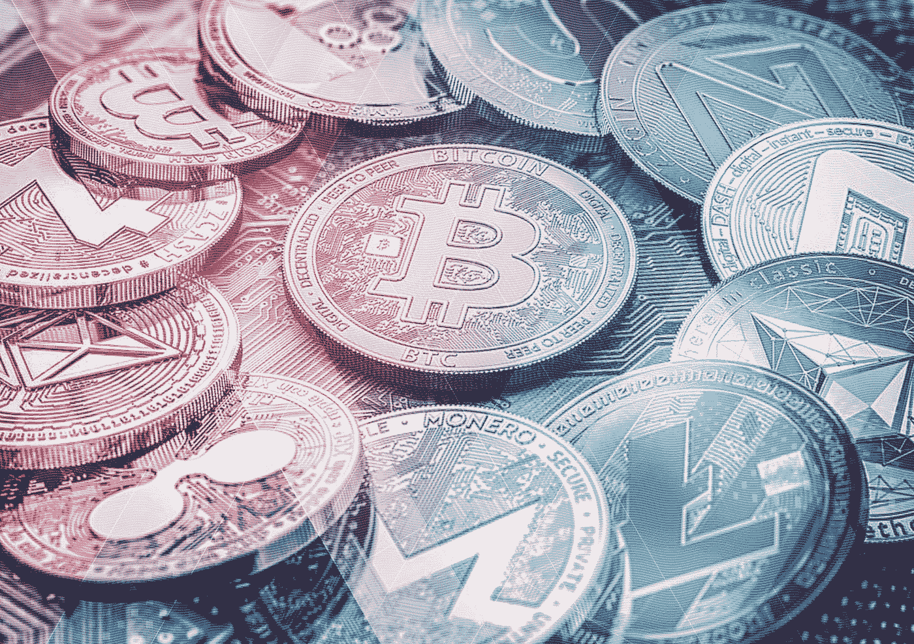

# 日常使用的密码词汇

> 原文：<https://medium.com/coinmonks/crypto-vocab-for-everyday-use-954a9231a85f?source=collection_archive---------5----------------------->

## ***你想 HODL 我吗？***

每个动作都有自己独特的行话。社交媒体的到来和最终普及创造了它自己的平行语言。当我们读到或看到有趣的东西时，我们学会了大笑。如果更有趣的话，我们甚至会被取笑。TBH，我们都是不同的 IRL，但 WTF，我们都喜欢一些 TLC 当谈到在社会上的乐趣。所以上 fleek，你会被原谅没有理解我们刚才说的一个字，但你必须在过去的几年里生活在岩石下。

通常，社交俚语描述了其潜在的哲学——时髦和不墨守成规，这些特点与年轻和急躁的一代有关。看一看加密俚语往往会给你类似的感觉。这是因为 crypto 本质上是不墨守成规和叛逆的。这就像是对传统金融市场伸出的又大又粗的中指。它的民主和开放的本质与传统金融的本质背道而驰，颠覆是它的基因。

让我们来看看投资者和交易者在日常加密交易中使用的一些流行的加密俚语。

**1。****HODL**——可能是定义加密热潮的最重要术语。这个幽默的首字母缩略词的意思是“为了亲爱的生命坚持住”,是普通投资术语“坚持”的巧妙变形。因此，一个霍德勒，意味着一个人谁投资了一个特定的硬币，并不预见在不久的将来出售它。这个词起源于 2013 年 12 月一名显然喝醉了的参与者在一个受欢迎的比特币论坛上发布的帖子，他宣布“我是霍德林！”他可能想说他“持有”他的比特币。这个词很快成为坚守比特币(或任何其他加密货币)的战斗口号，不要在价格暴跌时投降。

**2。****FOMO**——意思是“害怕错过”当大多数新投资者和交易者看到一条绿线时，就会发生这种情况，因为他们不拥有那枚硬币，出售其他硬币来购买这枚硬币，担心如果他们不这样做，他们会错过一个大机会。FOMO 是理解密码仍然是由人类情感驱动的一个重要方面。

**3。FUD**——恐惧、不确定和怀疑。约翰又在 xcoin 上传播 FUD 了！

**4。** **ATH** —历史新高。

**5。鲸鱼**——一个拥有大量资金投资于加密市场的大玩家。

6。泵送和倾倒——反复出现、几乎令人痛苦的峰值和崩溃循环。

7。**Shill**——在公共论坛上主动为一枚硬币背书。

**8。BTFD**——买他妈的蘸酱！当人们疯狂抛售的时候，就是买入的时候了！

**9。** **到月球**！—一枚硬币极其看涨的走势。

10。**—“Satoshis”的缩写，以比特币的神秘发明者中本聪命名。它指的是可以发送的比特币的最小分数——一个比特币的 0.00000001 分之一。"*这个价位你买多少 sat？***

****11。****bag holder**——被落在后面“拿着袋子”的可怜、不幸的人，这意味着他们得到了一枚他们想以更高价格出售的硬币，但由于市场变化太快，他们无法以更低的价格出售这枚硬币。**

****12。** **蓝宝**——兰博基尼的简称，这是一种已经成为各种加密图标的快速汽车，在加密交易员彼得·萨丁顿卖掉几个他早先购买的仅花了 115 美元的比特币后买了一辆。**

**加密爱好者和加密运动的支持者经常穿的 t 恤上的巧妙信息也越来越受欢迎。您肯定会遇到的一些信息是**

**老实说，我只是来找 T21 的——这是一种巧妙的说法，说我是来发财的！**

**保持冷静和 HODL 以太坊——这是一个明智的建议，不要动摇，只要抓住你的硬币**

**我接受比特币，一个真正的加密爱好者**

**在物质上开采——去开采一些加密硬币吧！**

**在加密领域，我们信任另一位加密爱好者**

**我是中本聪— 好吧，我们该怎么说呢？**

****我在 15 分钟前的大加密崩溃中幸存下来**——指的是加密市场中常见的极端市场波动。**

**所以，不要传播 FUD，不要抬举 BTFD。**

**与此同时，让我 HODL！**

**如果有机会，也可以看看我们的社交渠道:**

**[https://pecun.io](https://pecun.io?/utm_source=medium)**

**[https://facebook.com/PecunioFund/](https://facebook.com/PecunioFund/?utm_source=medium)**

**[https://bitcointalk.org/index.php?topic=2461272](https://bitcointalk.org/index.php?topic=2461272?utm_source=medium)**

**[https://medium.com/pecunio](https://medium.com/pecunio?utm_source=medium)**

**【https://twitter.com/Pecun_io/ **

**[https://t.me/pecuniochat](https://t.me/pecuniochat?utm_source=medium)**

> **[在您的收件箱中直接获得最佳软件交易](https://coincodecap.com/?utm_source=coinmonks)**

****