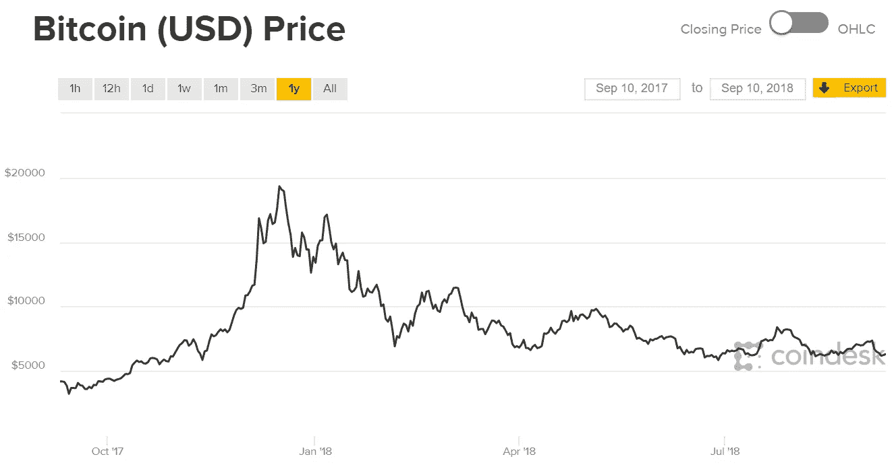
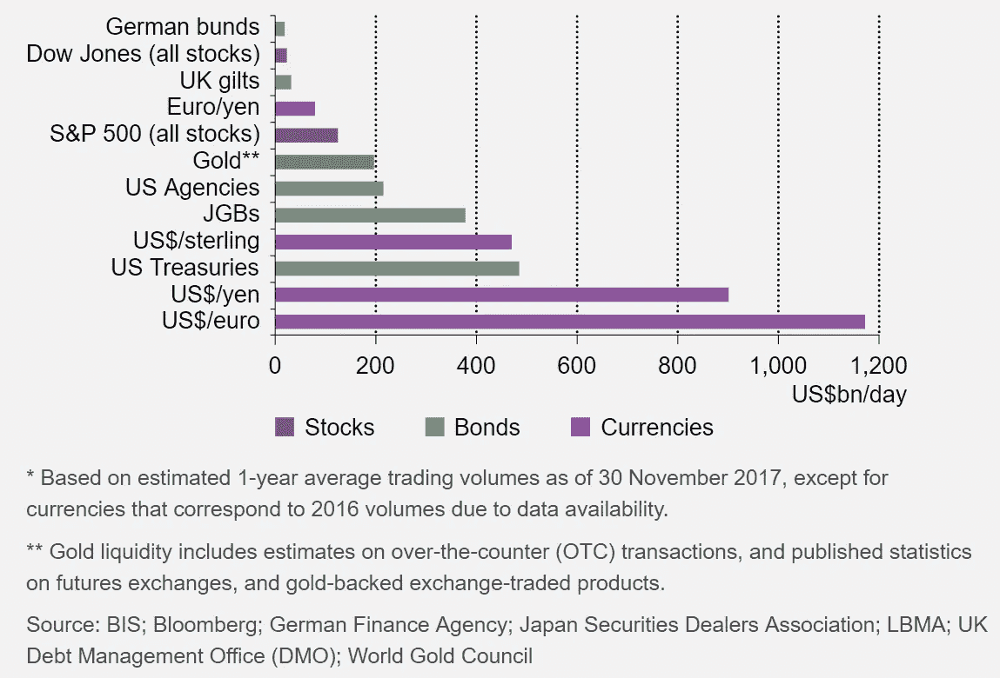
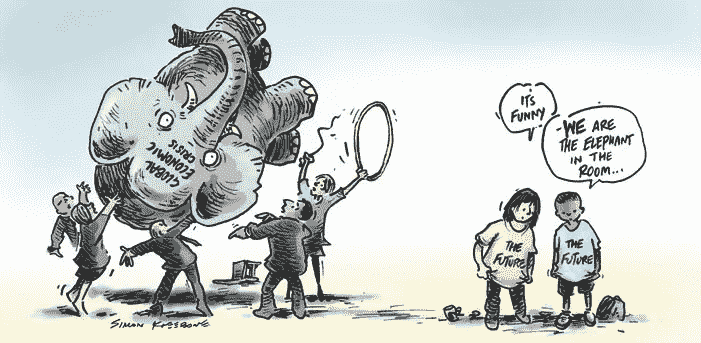
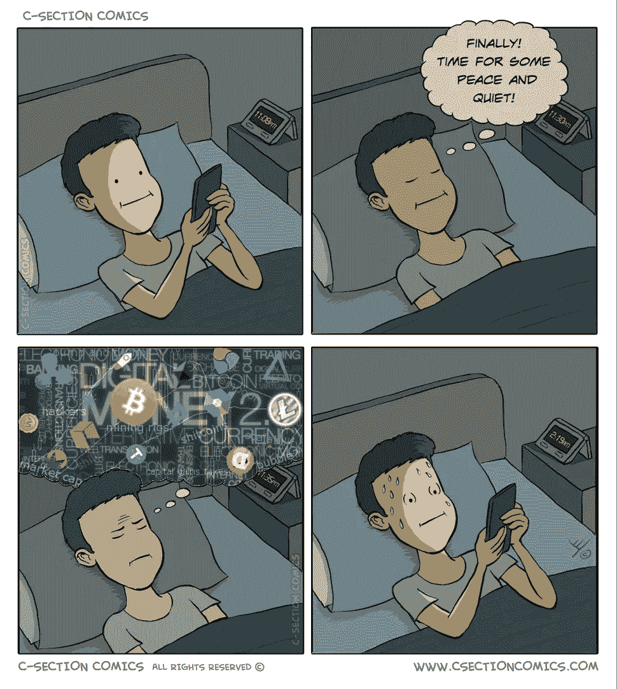
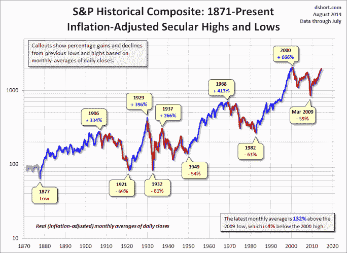
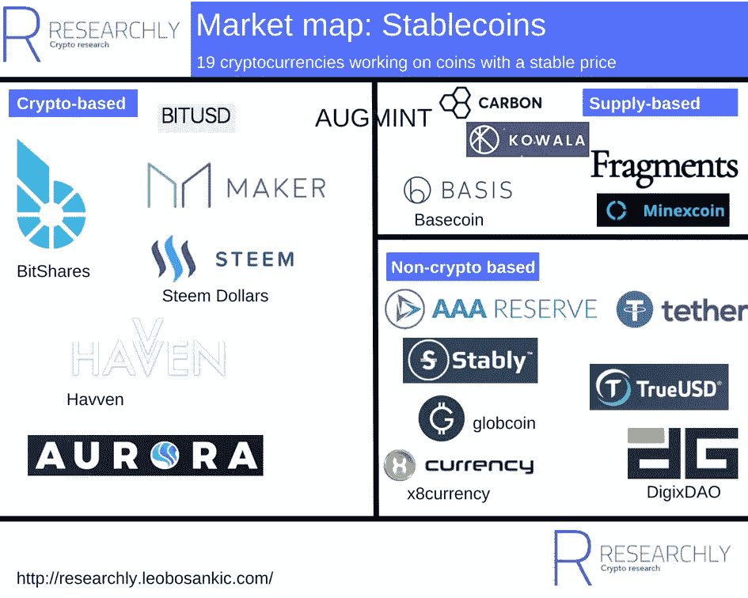

# 加密波动性:虚幻的鸡和蛋的问题

> 原文：<https://medium.com/coinmonks/crypto-volatility-the-phantom-chicken-and-egg-problem-81caf9089cd7?source=collection_archive---------4----------------------->

One year Bitcoin price chart courtesy of [coindesk](https://www.coindesk.com/price/)

价格波动是吸引加密货币注意力并使比特币成为主流名称的决定性特征。只有当技术从金钱的角度被重新定义时，人们才开始跳上火车，希望不会错过下一次淘金热。同样重要的是，这项技术及其相关应用成功绕过了传统的货币体系，让任何人都可以加入这列火车。与此同时，当局试图抓住如何分类和控制这列无人驾驶火车在蛮荒的西部呼啸而过。

纵观这一切，有趣的是没有机构资金正式进入这个加密货币领域。撇开对底层区块链技术的讨论不谈，其原因通常归结为 cryptos 对于日常使用来说太不稳定了。这是一个合理的担忧，因为所有这些机构仍然依赖于金融业是有原因的，我们对金融业又爱又恨:它们在稳定货币体系、促进贸易方面发挥了至关重要的作用。本质上，我们“热爱”金融行业的原因之一是因为它们提供了我们周围事物的价格不会从一天到另一天波动的确定性。

这是金融体系中一个经常被低估的方面，因为我们唯一比银行更讨厌的是不确定性。但是正如我在这里所说的，我们需要量化我们周围的世界，这违背了现实的混沌本性。因此，我们今天使用的货币体系只是我们周围世界的一个相对近似，在那里价值是被分配的，而不是由物品本身产生的。在最基本的层面上，加密货币目前的波动性是由于数量/数学问题，但在基本层面上，波动性也是人类主观性的结果。本质上，我们试图解决一个先有鸡还是先有蛋的困境，以追逐一个海市蜃楼。

## **哪个先来？**

密码市场的大量波动是一个基本数学问题的结果:

如果没有足够高的资本化，大宗交易会导致显著的价格波动。然而，只有当价格波动的不确定性降低时，更多的资金才会流入。

因此，我们陷入了鸡和蛋的两难境地，任何机构、货币或资产在试图扩张时都会面临这种困境。一家初创公司将其估值提高 100 万美元可能会使其股价翻倍，而同样的 100 万美元对跨国公司来说可能只是一个舍入误差。从更个人的角度来说，这和为什么我会对 20 美元的饭菜便宜 10 美元感到兴奋，但如果汽车经销商对 1 万美元的汽车给我 10 美元的折扣，我会感到厌恶是一个道理。

[Average daily trading volumes in USD*](https://www.gold.org/research/gold-investor/gold-investor-december-2017/key-gold-market-statistics)

就规模而言，cryptos 的每日美元交易量约为 120 亿美元(2018 年 9 月，我在起草时不得不几次修改这个数字)，而纳斯达克仅在 t 2 就有 1300 亿美元(T3)。此外，黄金市场的日交易量接近 2000 亿美元 T4，而仅美元/欧元就超过 1 万亿美元。无论密码如何分类(资产、收藏品或货币)，很明显它仍处于非常早期的阶段。

这是考虑到由于缺乏对 ico 的监管，一些密码的估值极不现实。例如，如果只有 20%的硬币在市场上发行，总额为 1000 万美元，该代币的市值将为 5000 万美元。尽管 20%的数字大体上是公司 IPO 的标准分布，但必须注意的是，仅仅是创造 ICO 的人几乎没有。此外，持有/锁定要求目前只能通过代码来执行，因此在大多数情况下，人们只能相信创造者只会在规定的期限后出售。像 Coinmarketcap 这样的网站确实通过在他们的指标中使用流通供应量而不是总供应量来解决这个问题，但对于他们的上市标准[没有那么严格。](https://coinmarketcap.com/faq/)

加密市场的一个有趣的特征是，ico 通过加密清算效应创造市场抛售，这是由于它在一个菲亚特主导的世界中运行。本质上，由于加密货币尚未被广泛接受，其货币价值实现的唯一方式是通过将其兑换成现金。此外，正如现在大多数 ICO 的情况一样，用户必须首先购买 crypto(通常是 ETH)才能加入 ICO。所有这一切，加上薄订单(由于大部分供应是在场外钱包，如[这个](https://www.reddit.com/r/Bitcoin/comments/9ceb5v/1b_bitcoins_on_the_move_owner_transfers_100m_to/)钱包，可容纳 111，114 BTC)，放大了加密市场的波动性。

最终，先行者承担了风险的主要部分，这就是承诺的回报如此诱人的原因。然而，日常业务使用 cryptos 所承担的风险仍然高得令人无法接受。对于替代令牌来说尤其如此。随着加密市场的增长，波动性将缓慢但肯定会下降，这可以从比特币的[下降](https://bitvol.info/)波动性中看出。正确看待这一点也很重要，因为黄金的波动可能比大多数人认为的更大，每年的波动都持续进入[两位数百分比](https://www.gold-eagle.com/article/gold-and-silver-volatility-1969-2012-0)。

一只大象走进房间…

[Simon Kneebone](https://simonkneebone.com/tag/gfc/)

当然，所有这些交易都没有解决房间里的大象，因为它实际上是一个零和游戏，没有产生实际价值。需要说明的是，这并不是加密公司的专利，因为纳斯达克等股票交易所的日交易量约为 1%(11 万亿美元市值中的 1300 亿美元)，尽管全球 GDP 年增长率往往徘徊在 3%左右(除非有任何冲击)。尽管如此，cryptos 的日交易量与总市值之比要高得多，约为 5%(2400 亿美元市值中的 130 亿美元)。所有这些都是说，交易的大部分利润实际上是以牺牲另一个参与者的利益为代价的。

当然，考虑到大多数人能够比解释 DLT 更好地定义兰博，加密市场中投机资金的比例不需要介绍。社区本身是由那些在波动中茁壮成长的人组成的，因此他们更有可能只为了短期利润而交易。此外，缺乏对市场操纵的监管也导致了对市场本身的剥削，正如这里所看到的。即使用户遵守规则，交易机器人在加密市场的突出地位也会放大市场波动，就像高频交易(HFT)如何导致 2010 年的闪电崩盘一样(HFT 此后一直通过监管交易时间而受到抑制，如果你感兴趣，我推荐《T2 闪电男孩》这本书)。

暂且把所有关于致富的话题放在一边，还必须注意到，许多密码的性质也使其自身具有更大的波动性:

*   几乎没有最低交易价值:交易成本成为主要障碍，即使如此，交易成本也只有几分之一(取决于供应链)
*   绝对交易成本:交易 1 枚硬币或 1，000 枚硬币的成本在任何时候都是一样的
*   更容易访问密码:只要用户有智能设备、互联网和钱，用户就可以获得密码，而不必验证他们的身份或访问银行。加密交易所的用户数量超过了传统经纪机构[的用户数量](https://futurism.com/coinbase-users-surpasses-charles-schwab-brokerage-accounts/)
*   可数字化交易:技术本身确保了数字化资产的所有权，无需审计甚至资产的物理移动
*   市场从不睡觉:交易所全天候开放，导致许多不眠之夜

因此，这种贸易摩擦的减少导致了更大的波动性以及许多焦虑症。尽管如此，在开始为社区做贡献的一小部分人群中，这些疾病的发病率被降至最低。

## **稳定币幻影**

在这群贡献者中，有一些人在追逐加密的圣杯:稳定币。据设想，随着稳定币(一种相对于目标价格保持稳定价值的资产)的产生，它将提供稳定性、可伸缩性和弹性。这将大大降低进入市场的风险，从而为大规模采用铺平道路。稳定币肯定是社区应该努力的目标，但我认为承认完美的稳定币也是海市蜃楼也很重要。

这是因为对资产价值的认知主要是基于社区对其采用的期望。换句话说，我们赋予我们周围的世界价值，而不是从物品本身获得价值。一个重要的含义是，我们在任何物品上看到的美元价值实际上是需求和供给的函数。实际上，这个价值是相对的，因为我们从每一个项目中获得不同的效用。从本质上说，我们量化世界的需求使贸易成为可能，但同时也违背了现实的混沌本质。因此，完全分散的 stablecoins 很可能只是一个幻想，因为它必须完全从现实世界中抽象出来，这样做就变得完全无用。

这种抽象性质的一个后果是，人们更难对无形资产以及比存储在分布式数字网络上运行的加密保护块中的信息更无形的东西进行估价。因此，对密码的看法更加不稳定，容易受到媒体的影响。更糟糕的是，正如我在这里所说的，密码是主流媒体的完美素材。因此，波动性被进一步放大，因为它是由大量谣言驱动的，而没有太多的技术分析。很多时候，一个有影响力的人物的观点可以决定市场的方向，因为所有的投机者都根据新闻进行买卖。

**分散=不稳定？(警告:如果你不喜欢技术类的东西就跳过)**

[S&P Volatility](http://directorblue.blogspot.com/2014/09/stock-market-crash-dead-ahead-or-not.html)

接下来需要提出的一个问题是，分散式网络是否天生就更不稳定。当前市场的许多稳定性是通过各种银行、货币当局和政府政策来维持的。我们可能会说，鉴于许多引人注目的崩溃，他们在历史上做得很差，但分散化的系统会好到哪里去呢？

国际货币基金组织是一个很好的参照点。国际货币基金组织是作为协调各国间汇率安排的多边机构而建立的。他们的当务之急是避免上世纪 30 年代的竞争性贬值，同时鼓励世界贸易体系的自由化。人们预计，将会有一个“固定但可调整”的全球汇率体系，只有在“基本失衡”时才会进行调整。因此，国际货币基金组织的运作基础是，汇率基本稳定，足以进行贸易，但在任何黑天鹅事件期间都需要干预，其触发因素通常是一个国家无法继续自愿偿还债务。

关于国际货币基金组织援助所需的“紧缩”措施是否过于严格，或者所采取的措施是否有效，有很多争论，但有一点是肯定的，即使在事后，人们似乎也无法就国际货币基金组织是否达到了稳定经济的目的达成一致([这是对国际货币基金组织有效性的一个很好的解读)。如果主题专家不能就事后结果达成一致，那么就未来汇率进行分散投票以稳定货币又如何呢？自由市场可能是一个解决方案，但必须指出的是，在全球范围内，有许多名人被选为领导人，只是因为他们的无能变得明显。](https://www.tandfonline.com/doi/full/10.1080/00220388.2017.1279734)

一如既往，答案是视情况而定。可以说，分散的系统本质上更不稳定，因为它更容易受到社会传染，但集中的解决方案也不能幸免。集中解决方案会改变或抑制自由市场机制，但缺乏透明度会导致大量不确定性和盲目的机构信任。围绕机构信任与网络信任的辩论是另一个完全不同的论点，但可以肯定的是，激励机制的构建方式和对系统的限制将严重影响系统的稳定性。

一般来说，各国倾向于通过让货币供应量与实际 GDP(名义)和通胀率的变化相匹配来稳定货币。这是通过可信机构(美联储、欧洲央行等)持有的混合储备实现的。)和复杂的金融机制(债券、债务抵押债券等)。).因此，货币既是交换媒介又是价值储存手段的双重性质必须在这一框架内得到平衡。

理论上，这应该能确保货币稳定，但一如既往，人类的不可预测性会毁掉任何完美的体系。本质上，一美元的价值将取决于人们对其未来价值的预期，这导致了正反馈循环。如果有足够多的人认为他们的美元在未来会贬值，他们就会开始消费/出售美元，从而导致自我实现的循环。

与此相反，这带来了一个有趣的思维实验:如果人们预期一种货币/资产的价值会上升，他们会继续向该资产注入资金，直到人们希望储存的所有价值都被注入该资产。实际上，人们在一项资产上投入了越多的钱，希望实现利润，这项资产就越能起到价值储存的作用，特别是如果这项资产像大多数密码一样供应固定的话。一个可能的结果是，如果一项资产在一个经济体中占据了足够大的规模和比例，它实际上可以起到稳定机制的作用，这与我们之前讨论的规模悖论是一样的。一些较小的国家确实利用了这一效应，将本国货币与美元挂钩。

[Source](http://researchly.leobosankic.com/2018/04/24/market-map-stablecoins-overview-of-19-projects-working-on-stablecoins/)

如果这种情况真的发生在 cryptos 身上，这又带来了一个问题:当大部分价值很可能被锁定在最有可能的候选者比特币上时，是否还需要一种稳定的硬币。诚然，日常使用仍需要一个交换媒介，但这可以通过其他硬币/代币来实现，甚至可以采用与以太坊中的气体相同的设计。比特币将有效地发挥去中心化全球储备的功能，但必须制定规则，以避免任何重大挤兑。看看这种情况如何发展会很有趣，尤其是考虑到当今许多 ico 采用的单一实用令牌模型。

对于那些对更多技术方面感兴趣的人，我强烈推荐这篇关于戴的文章。

**平衡滥用权力与社会传染**

自柏拉图的《理想国》以来，这就是人类文明的核心。当权力集中时，它会导致滥用，但如果没有权威，协调的社会就会瓦解。这也延伸到了我们的价值体系中，因为金钱是社会组织起来最直接的方式。因此，系统的基本共识机制将决定价值如何分配的预期。

尽管可以认为预期和社会传染导致了极端的波动性，但由于风险定价缺乏透明度，这种投机大多基于不确定性。这并不是说通过区块链增加透明度会减少不确定性，因为这肯定会导致大众信息超载(毕竟我们都在寻找[最懒的路线](/predict/edward-snowden-mark-zuckerberg-logan-paul-who-is-responsible-for-our-digital-future-d17d1ff8a585))。然而，分布式账本系统是朝着正确方向迈出的一步，因为更多的信任被分配给网络，而不是封闭的机构。此外，可编程货币将提高货币政策的分辨率。

最终，这一切都回到了人的因素上，人们仍然更喜欢长期稳定且相对安全的投资增长(除了交易员，他们完全是另一类人)。就目前的情况来看，对于主流的采用来说，加密市场仍然不够大，也不够稳定。此外，市场中投机资金的比例、缺乏监管以及许多密码的自然特征(交易摩擦减少、脱离物理世界以及难以理解基本面)加剧了波动性的影响。降低波动性肯定是 cryptos 必须克服的最重要的非技术障碍，但也必须认识到，真正的稳定性也是一个幻影。

在下一篇文章中，我将深入探讨为什么今天的许多“代币”如果真的成为主流，将会变得毫无价值(代币流通速度问题)。

*谢谢你坚持到最后。希望听到你的想法/评论，所以请留言。我在 twitter 上很活跃*[*@*AwKaiShin](https://twitter.com/awkaishin)*如果你想收到更多易消化的密码相关信息，或者访问我的* [*个人网站*](https://www.awkaishin.com/) *如果你想要我的服务:*