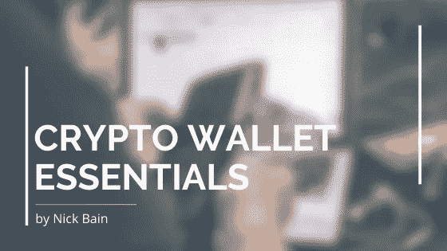

# 如何选择加密钱包？

> 原文：<https://medium.com/coinmonks/crypto-wallet-essentials-40358bfe9794?source=collection_archive---------3----------------------->

这是我们所有人在年轻时学到的一课，“那些不从历史中吸取教训的人注定会重复历史。”在当今这个充满经济不确定性、怀疑和斗争的时代，这句话听起来比以往任何时候都更真实。一个典型的例子是冠状病毒疫情，它在经济、社会和政治上影响了我们所有人。但不仅仅是经济在挣扎，一些专家还断言，我们距离另一场经济衰退不远了，以至于领先的经济学家正在著书并举行公开演讲，讨论如何应对如此接近再次发生的事件(见罗伯特·清崎)。

面对如此多的威胁，你现在能做些什么来减轻打击呢？分散投资——投资于安全、分散、有保值记录的资产，比如加密货币。

本文不会详细说明为什么这是一个聪明的举动，而是向您介绍多样化的第一步，一个为您(用户)工作的加密钱包。

# 那么，什么是加密钱包呢？

加密钱包或加密货币钱包是一种媒介，用户可以在其中存储他们的公钥和私钥(本质上是访问您的加密货币)。加密货币钱包也可以用于向其他用户发送加密货币和从其他用户接收加密货币。本质上，加密货币钱包就像是你拥有加密货币的入口。

这就是为什么它是如此重要，你的加密钱包为你工作，并能够适应你的需求和活动。

> 另请阅读:[最佳硬件钱包](/coinmonks/the-best-cryptocurrency-hardware-wallets-of-2020-e28b1c124069)

# 当我选择加密钱包时，我应该寻找什么功能？

目前，市场上有许多加密钱包，选择的多样性使初学者很难选择适合自己需求的加密钱包。下面是一些标准，你选择的钱包应该满足这些标准，才能真正让你这个用户受益。

**安全—** 由于加密货币是分散的、未经许可的，因此没有一个中央实体来验证你的交易，并在被盗时追回你的资产。您的私钥和公钥的安全性掌握在您的手中，由于加密钱包是存储您的密钥的介质，您希望它们尽可能安全。加密货币的首次用户首次被置于这样一个位置，即他们负责自己数字资产的安全。这就是为什么它是如此重要，你选择一个有信誉的加密钱包，有一个安全的良好记录。此外，在对潜在的加密钱包进行研究时，您希望看到他们已经投入了大量资源并强调了其产品的安全性。

**无 KYC(或尽可能少)——**了解你的客户，或简称为 KYC，是大多数金融服务将实施的准则/政策，以验证客户的身份和适合性。通常情况下，公司会实施 KYC 政策，因为政府机构有义务这样做。在加密货币的情况下，你想通过任何必要的手段保持你的匿名性。这是因为:

*   KYC 意味着单点故障，处理你的加密货币的[加密钱包](https://coincodecap.com/category/wallets)现在可以访问你的个人信息，让你更容易受到安全威胁和盗窃
*   KYC 将意味着第三方，如政府机构或其他实体可以限制你的自由，并通过迫使[加密钱包](https://coincodecap.com/category/wallets)服务遵守他们的规则来阻止你做你选择的加密货币
*   你的隐私和匿名现在是不存在的，因为你的[加密钱包](https://coincodecap.com/category/wallets)可以忽略你的密钥的安全性，现在可以将你的加密活动和交易与一个真实的人(你)联系起来
*   如果可能的话，用户应该避免为了使用[加密钱包](https://coincodecap.com/category/wallets)而放弃个人信息。

**分散的(或者至少是非侵入性的)——**分散的[加密钱包](https://coincodecap.com/category/wallets)服务将你的数据存储在一个分散的网络上，类似于区块链。这意味着只有你，也就是用户，才能访问公钥和私钥，进而访问你的加密货币。包括政府或加密钱包服务在内的任何人都无法访问你的数据，更不用说强迫或否认你的加密货币的某些行为或交易，这是理所应当的。只有你才能决定如何使用你的加密货币，而保证这一点最可靠的方法就是选择一个无法访问你的数据的钱包。理想情况下，通过去中心化或者至少，你的数据应该被完全加密，除了你之外，任何人都不能访问。

如上所述，对于希望加入加密社区并成为这项革命性技术用户的人来说，这是第一步，但也是非常重要的一步。用户应该在选择他们将坚持使用的[加密钱包](https://coincodecap.com/category/wallets)之前进行尽职调查和研究，因为这将对他们使用加密货币的安全性和功能性产生许多影响。

> [在您的收件箱中直接获得最佳软件交易](https://coincodecap.com/?utm_source=coinmonks)

