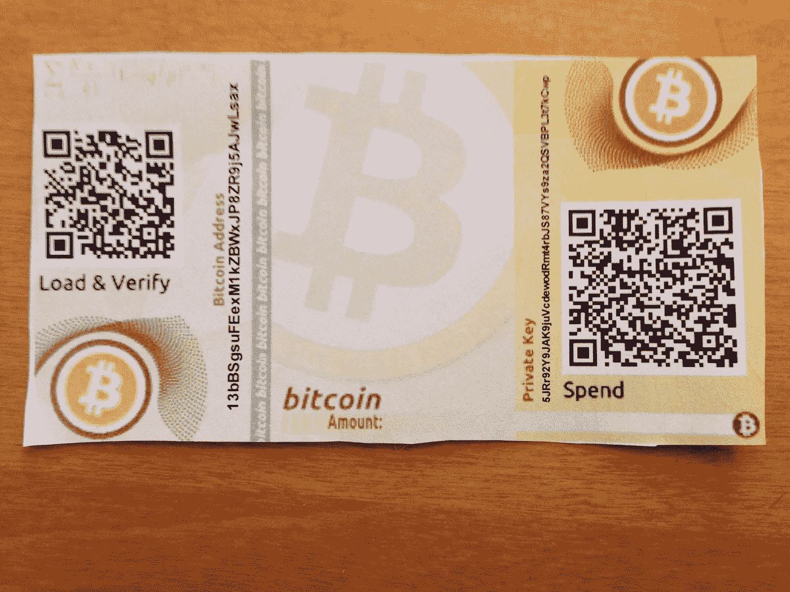

# 加密钱包

> 原文：<https://medium.com/coinmonks/crypto-wallets-fbf19810de08?source=collection_archive---------2----------------------->

## 你很兴奋，你已经买了你的第一个比特币，ripple 或任何时下热门的加密技术，现在呢？

在本帖中，我们将为您的密码浏览几个存储选项，并为您如何保护这些甜美可口的加密硬币提出建议！

## **在哪里存放你的加密货币**

加密货币存储的俗称是“**钱包**”(你期待更好的东西吗？).

钱包是一种存储加密货币的技术(可以是软件、硬件甚至纸张)。如果我们进一步研究“真实”的定义，钱包本身并不存储硬币，它只存储拥有一个地址的未使用交易所有权的私钥。你可以看看我关于比特币地址如何工作的帖子，了解更多信息。

> 私有密匙是你想要保持安全的最重要的东西，这些是你自己的“保险箱”的“钥匙”,保证你的密码安全。如果有人偷了你的私钥，他们将拥有你的密码。

**TL；DR:钱包通过以安全的方式存储您的私钥来存储您的加密货币。**

*钱包的分类方式有很多种，在线/离线可用性是最全面的:*

> 另读:[最佳比特币硬件钱包](/coinmonks/the-best-cryptocurrency-hardware-wallets-of-2020-e28b1c124069)

## **热门钱包**

这些类型的钱包几乎可以一直在你的电脑上或基于网络接入互联网。它们带有开放互联网连接的风险，因此不太安全。另一方面，它们对用户更友好，使用起来更快。

## **冷钱包**

这些钱包更安全，因为存储是离线的；除了身体上的抢劫之外，没有办法偷你的私人钥匙。

## 你应该知道的其他基本分类:

*   网络钱包
*   本地钱包(移动或桌面)
*   硬件钱包

## **网络钱包(热门钱包)**

网络钱包出现在比特币基地、币安等在线交易所。如果你在交易所进行交易，他们会将密码发送到这些网址。如果你想在交易所买卖，你必须使用这些钱包。

这种钱包是所有选项中最不安全的，因为它们将私人密钥存储在一个中央服务器上，使其成为黑客攻击的目标。过去曾有过交易所被黑客攻击和私钥被盗的新闻。强烈建议，如果你不打算继续每天交易，你应该把你的密码转移到一个更安全的钱包里。

## **软件钱包(移动或桌面——热钱包)**

软件钱包被下载并安装在你的电脑或手机上。它们通常被称为“轻型客户端”，是最常见的加密存储。

这些钱包可能比交易所更安全一点，注意我写的是:“可能”，因为这将取决于你安装钱包的设备的安全性和脆弱性。如果你的电脑感染了病毒、木马或恶意软件，它会从你的电脑中窃取你的私钥。

这种钱包很容易使用，用户体验也很好。Exodus 或 Electrum 是一些软件钱包的例子，你可以下载和玩。

This is the Exodus Wallet

## **硬件钱包(冷钱包)**

如今，硬件钱包是最安全的存储方式。安全性依赖于您的私钥的离线存储。

硬件钱包通常是一种类似于 usb 笔驱动器的设备，一侧有一个小屏幕和一根连接 PC 的电缆。这个设备产生并储存了私钥，没有办法取出来。

当您的硬件钱包与电脑断开连接时，您可以接收密码，但当您想要从硬件钱包发送资金时，您必须连接设备，以便用您的私钥签署交易。

关于硬件钱包的另一个很酷的事情是，它们有自己的小屏幕和按钮，供你通过屏幕“导航”和生成私钥。这一点很重要，因为如果你的电脑被入侵，例如键盘记录器，你在电脑上按下的每个按钮都会被记录下来，但硬件钱包不会，因为它是另一个设备，不会被感染。

要记住的一件事是，记住你的助记码单词是很重要的(下面会有更多的介绍)，如果你丢失了你的硬件钱包，你可以用这些单词来备份它。

最受欢迎的硬件钱包是 Nano Ledger 和 Trezor。

Here’s a Nano Ledger in action!

## **纸质钱包(冷钱包)**

纸质钱包也非常安全，因为它们离线存储你的私人钥匙，以一种更“复古”的方式…在纸上！这种纸张将包含您钱包的公钥和私钥的副本，通常以 QR 码的形式存在，因此您可以快速扫描它们，并将密钥添加到软件钱包中以发送一些资金。

一个缺点是纸张和墨水会降解，而且纸张相对易碎。

在 https://www.bitaddress.org 的[上，你可以生成一个纸质钱包，值得看看它是如何通过移动指针以获得足够的熵来生成的(见我关于比特币地址是如何创建的帖子)。](https://www.bitaddress.org)

This is a Bitcoin paper wallets

**TL；DR:** 网络钱包是最不安全的选择，因为它们将私人密钥存储在服务器上。软件钱包更安全一些，但这完全取决于你的设备的安全性。

硬件钱包是安全存储你的密码的最佳选择，它们离线存储私钥。纸质钱包和硬件钱包一样安全，但是把你的私人钥匙写在纸上会有一些退化和纸张破损的风险。

## **助记码字**

当你下载软件钱包或设置硬件钱包时，他们会给你一组随机的词，通常是 12 到 24 个词。这个单词序列代表一个随机数，它被用作生成所有私钥和公钥的“种子”。

保护好这组单词**非常重要**——万一有人偷了你放钱包的设备，或者如果你忘记了密码，你可以用这些单词找回整个钱包。其实这几个字备份保管最重要！

我们已经介绍了最常见的[加密钱包分类](https://blog.coincodecap.com/different-types-of-crypto-wallets/)，但还有更多要看的，在未来，我将介绍钱包的技术方面以及它如何“在引擎盖下”工作。

感谢您的阅读，并保持您的密码安全！

## 行动呼吁

[如果您想了解更多关于区块链的信息，请加入我们的每周简讯，了解加密领域的所有新闻。](https://mailchi.mp/fe27d17793e9/cryptolitics)

> [直接在您的收件箱中获得最佳软件交易](https://coincodecap.com/?utm_source=coinmonks)

