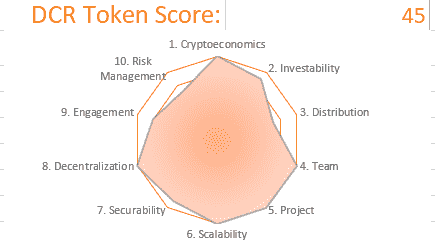

# 加密资产投资者寻求参与治理

> 原文：<https://medium.com/coinmonks/cryptoasset-investors-seeking-exposure-to-governance-3a3d7b198ae3?source=collection_archive---------4----------------------->

## 应该考虑颁布法令吗？

未完成的 cryptoasset 项目，对分发和风险管理稍有顾虑。独一无二地结合了工作证明和利益证明来保护其网络。同时通过最近实施的政策试验分权治理。

[获得审核](http://cryptojungle.io/wp-content/uploads/2019/11/Decred-Audit.pdf)

[PDF 格式的完整报告](http://cryptojungle.io/wp-content/uploads/2019/11/DCR-Report.pdf)

**概述**

法令采用了一种共识投票模式，即 Politeia，以分权的方式管理区块链。主持第一次链上用户投票，以决定如何为项目增强分配国库资金。

网络通过混合的工作证明/利益证明模型来保护。60%的奖励归矿工，30%归股东，剩下的 10%归项目金库。提供持续的资金来源来构建其功能集。

**密码经济学(满分 5 分)**

法令有一个良好的加密经济基础。令牌化是合理的，因为它使用工作证明和利益证明来保护其网络。利益相关者被激励以诚信的方式行事，因为利益相关者和矿工可以相互制衡潜在的恶意行为。

Decred 有 2100 万的固定供应量来维持稀缺性。该公司的治理流程已经为愿意押上 DCR 参与其中的持票人带来了交易费回报。随着 DCR 投资者的参与率继续攀升，这一票持有者的集会(Politeia)正在产生网络效应。

**可投资性(3.5 分，满分 5 分)**

而 Politeia 是一个奖励项目支持者的有趣的治理实验。这是一个未经测试的资本配置工具，带来了一些对 Decred 投资能力的担忧。随着交易量继续攀升，这似乎确实刺激了需求的增长。此外，作为一种机制，从奖励中获取价值。

Decred 的品牌认知度和防御性是由其知名度推动的，因为它是最引人注目的项目，在其网络上成功地结合了 POW 和 POS。

**分布(3.5/5)**

Decred 有 8%的预矿，其中 4%分配给创始人，4%空投给其他早期捐助者。创始人的股份会根据目标里程碑的后续成就进行锁定。最小的预雷为网络的使用奠定了基础。因为通过采矿或打桩获得代币的能力导致了 DCR 的广泛分布。

由于启动时的开采前和开采作业启动，没有进行正式销售。供应量固定在 2100 万。

**团队(5 个中的 5 个)**

最初的项目团队有历史成就的跟踪记录。在过去的 9 年里，主要是在[公司 0](https://www.companyzero.com/) 一起构建分布式计算系统。他们还拥有互补的技能。与大多数 cryptoasset 项目相比，在团队早期增加了设计和营销资源。在将治理权下放给 Politea 之前，团队在沟通和行动中表现得透明且符合道德规范。

**项目(5 项中的 5 项)**

该项目已上线，现有用户拥有 [~10，000 个活跃地址，日交易量超过 100 万美元](https://messari.io/asset/decred#metrics)。自项目开始以来，白皮书和相关文件的质量都很高。

从战略上来说，该团队了解加密领域，由于监管方面的明显缺陷，而不是典型的抢钱行为，他们分流了比特币。产生其独特的价值主张，Politea，是社区利益相关者聚集在一起，讨论如何颁布应如何管理和项目资金应如何支出。

该项目是开源的，并积极寻求核心项目团队之外的利益相关者的参与，该团队自启动以来一直在扩大。

**可扩展性(5 分之 5)**

项目负责人 Jake Yocom-Piatt 在过去的 9 年里一直是 0 公司的首席执行官。展示他的招聘和发展能力。该项目有一个清晰的路线图，概述了他们打算应对的市场以及他们打算如何应对。

人们对[为项目贡献](https://www.decred.org/contributors/)有着广泛的兴趣，并且有大量的资源来公平地补偿贡献者。按照目前的烧钱速度，该项目可以获得 10 年的资助，在北美、欧洲和东亚这三个主要的加密地理区域都有兴趣和使用。

**安全性(4.5 分，共 5 分)**

Decred 有一组健壮的 500 到 600 个节点[在任何给定时间运行。该项目定期利用 Politea 批准的资金运行 bug bounty 程序。当缺陷被识别时，它们的发现和解决被透明地传达。](https://dcred.eu/nodeStats)

矿工和赌注者分散在世界各地，广泛的[赌注由各种池和个人参与者。采矿在某种程度上是](https://dcrstats.com/)[集中的](https://dcrstats.com/pow)，两个池控制了超过 70%的哈希功率。

奖励是不定期的，面向技术和非技术用户的强大钱包解决方案有助于促进赌注和采矿。

**权力下放(5 选 5)**

外部开发商对项目的贡献[始终如一，项目负责人按照承诺将项目资金移交给 Politeia 进行管理。](https://github.com/decred)[DCR 的所有权](https://www.dcr.observer/)非常普遍，前十大钱包持有约 6%的未偿供应，前十大钱包持有约 20%

Politeia 成功地实施了治理，这表明它有能力在没有创造者的情况下发挥作用。网络的安全、发展和使用在全球范围内都很活跃。

**参与度(5 选 4)**

开发者对该协议的采用非常强劲，有 77 个贡献者扩展和延伸了 Decred 的技术能力。评论 [Reddit](https://www.reddit.com/r/decred/) 很活跃，专注于项目，没有过多的价格讨论。

Slack [频道](https://slack.decred.org/)上的对话频繁且持续不断，Twitter 情绪总体积极。谷歌趋势的活动很少。我怀疑这是因为从历史上看，他们并没有试图通过稀奇古怪的声明来赢得新闻发布游戏，以获得新闻媒体的关注。

**风险管理(2.5 分，共 5 分)**

Decred 没有经过正式的第三方代码审计。对代码的审查是在持续的基础上进行的，其结果是公开的。它展示了其独特的电源和 POS 组合的抗脆弱性，以确保网络安全。一些研究人员认为它比比特币更安全。

由于决定在 DCR 持有美国国债，它确实面临较高的融资风险。没有购买保险来抵消未来负面事件的潜在影响。

它似乎比大多数项目具有更低的监管风险，因为 Politeia 的实施降低了被认证为安全令牌的风险。

想开始进行你自己的审计吗？在此下载审计模板[！](http://cryptojungle.io/wp-content/uploads/2019/10/CryptoJungle-Audit-Template.xlsx)

# 感谢阅读

注册我的[简讯](http://mpower365.com/newsletter-sign-up/)，了解我最新的加密资产研究。

> [在您的收件箱中直接获得最佳软件交易](https://coincodecap.com/?utm_source=coinmonks)

