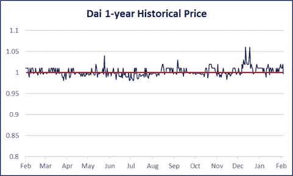

# 创客(MKR)投资论文

> 原文：<https://medium.com/coinmonks/cryptoasset-research-maker-mkr-a0e89fccb985?source=collection_archive---------0----------------------->

## 基本面分析和估值

## * 2019 年 2 月更新*

# 背景/概述

MakerDAO 由 Rune Christensen 于 2014 年创建，是该领域最古老的 stablecoin 项目之一。在 2017 年 12 月获得由 Andreesen Horowitz 和 Polychain Capital 牵头的 1200 万美元风险投资后，它在此后不久推出。MakerDAO 采用了一种双币模式:稳定的货币 Dai，与美元保持紧密挂钩，波动相对较小；Maker(MKR)，用于治理和支付利息。这种 MKR 代币在项目中充当伪股权，旨在随着戴生态系统的增长而升值，或者在风险管理不当的情况下贬值。 **MakerDAO 希望创建一个用于贷款和点对点交易的系统，该系统保持比特币的许多相同特征，如信任最小化和抵制审查，同时保持美元等法定货币的相对稳定性。这避免了对遗留金融系统及其固有问题的依赖。**

# **工作原理**

Dai 是通过一个利用抵押债务头寸(CDP)的动态系统创建的，用户可以向智能合约发送 ether，然后智能合约根据抵押比率返回一定数量的 Dai。然后，用户就可以随心所欲地花掉那一天。为了拿回他们的抵押品，需要归还以戴计价的全部债务，外加在 MKR 支付并随后烧掉的利息。如果抵押品价值低于某个阈值(清算比率)，那么它将被出售，以偿还债务和 13%的清算罚款。如果 Eth 的价格急剧下跌，无法偿还债务，那么 MKR 将被稀释和出售，以结束 CDP。如果有任何剩余的抵押品，则将其返回给用户。

MakerDAO 计划在未来过渡到多抵押品 Dai (MCD ),在这种情况下，除 Eth 之外的资产可以作为抵押品。虽然没有发布 MCD 的官方日期，但代码已于 9 月发布供审查。当 MCD 发布时，它将包含一个名为[戴储蓄率(DSR)](/makerdao/dai-reward-rate-earn-a-reward-from-holding-dai-10a07f52f3cf) 的功能，该功能

> “为戴创造了一个全新的平衡供需的激励机制。这种模式允许更有效地部署资本，同时仍然履行其为用户提供强大、分散的稳定性的核心角色。”

DSR 允许用户锁定一定数量的 Dai，以赚取存款利息。它由稳定费资助，为 MKR 持有者创造了另一个影响货币政策的杠杆。当 Dai 价格低于 1 美元时，DSR 可以增加，因此更多的用户将存款 Dai，这减少了供应，使市场价格更接近 1 美元的目标价格。MCD 的另一个变化是，清算费将像在 MKR 支付的稳定费一样，然后烧掉，为现有的 MKR 持有者提供价值。

*注意:如果任何人可以访问历史稳定币数据，请联系我，因为我对更严格的价格统计分析感兴趣。(CMC 在> $1.0 时只四舍五入到两位小数)*

由于 Dai 是根据市场动态自由交易的，因此价格容易波动。然而，在其历史上一直能够保持接近 1 美元的汇率，随着时间的推移变得更加稳定。这是由于一种有效的机制，即当价格低于其开立 CDP 时，CDP 未偿用户被激励购买 Dai，这有助于使价格回升。相反，当价格高于挂钩时，用户将希望创建更多的 CDP，以便以更高的价格接收 Dai。

如果发生威胁整个系统的事件，如黑客攻击或抵押品的极度贬值，就会有一个称为全球结算的流程，作为自动防故障装置，保证所有 Dai 持有人和 CDP 用户收到欠他们的资产净值。这一进程是由 MKR 教持有者指定的全球定居者发起的。一旦激活，CDP 创建将停止，价格馈送将锁定在当前值，以处理所有索赔。然后，用户可以在 Maker 平台上调用索赔功能，以获得与其 Dai 或 CDP 未偿金额相等的抵押品。

这些机制旨在灌输戴将保持稳定联系汇率的信念。那些相信马克尔道系统的人可以在戴打破钉住汇率制度时买入，认为它最终会回到票面价值，然后获得小额利润。这些套利者进一步帮助保持联系汇率，直到利差变得很小，不再有利可图，在这种情况下，戴成功地成为一种稳定的货币。

# 管理

> *“在这个不信任的系统中，信任的概念并没有消失。它只是多样化了。多元化到了前所未有的程度，创造了一个演员组合，我们可以将我们稀缺的信任资源的一小部分分配给他们，从而建立一种新的角色感。如果一个或一组参与者失败了，我们仍然可以依靠大多数参与者来保持我们的品格和信任”“* [*马克尔道治理框架*](/makerdao/makerdao-governance-risk-framework-38625f514101)

通过 MKR 令牌，信任在该系统中是多样化的，这在平台的演化中起着至关重要的作用。令牌持有人有权[对诸如](https://makerdao.com/whitepaper/)的变更进行投票:

*   CDP 的类型:这可以包括具有除 Eth 以外的抵押品的 CDP，或者一组新的风险参数。
*   风险参数:债务上限、清算比率、稳定费、清算罚款、DSR 利率
*   神谕集:这些是平台用于推导其担保品定价的节点集。MKR 持有者决定这些节点是谁以及存在多少。
*   价格反馈敏感度:价格反馈对系统内部价格值的最大影响。
*   全球定居者:这些是决定何时开始全球定居的行动者

制定者通过允许根访问来改变治理变量的主动提议来实现这些改变。一种类型的主动提议是单个动作，这意味着它们被执行一次，然后契约删除自己。还有一些委托建议合同继续使用根访问来实现更高级的逻辑。任何 MKR 持有者都可以对这些提案进行投票，获得最高批准票数的智能合同将得到实施。

需要注意的是，虽然上述功能被设计为由 MakerDAO 社区管理，但仍然有一个法律实体，即戴基金会，具有重要的决策权。当 a16z Crypto 宣布投资 1500 万美元购买 6%的 MKR 股票时，这一点变得很明显。[公告称](/makerdao/a16z-crypto-purchases-6-of-mkr-backing-stablecoin-vanguard-makerdao-ff410a692393)“MakerDAO 将通过下一个增长阶段获得运营资本，对 maker Dao 社区的 3 年支持，最重要的是，来自 80 多人的 Andreesen Horowitz a16z 团队的全面运营支持。”

虽然从顶级风险投资公司获得这种类型的投资和支持对 MakerDAO 来说无疑是积极的，但它确实引起了社区的一些治理问题。对该交易的主要批评是，该项目本应由 MKR 持有者管理，但他们没有参与决策过程。**对一些人来说，这种闭门交易违反了他们对 MakerDAO 这样的开源社区的期望。然而，以分散的方式进行这样的交易实际上也很困难。如果 a16z 必须获得大多数 MKR 持有者的一致同意，就交易的具体条款(如代币的确切折扣)进行谈判将会很困难。此外，戴基金会持有的将由他们自行决定用于开发目的，这笔交易似乎为项目的推进提供了顺风。**

# 风险

评估 MakerDAO 协议的一个困难是缺乏规范的文档。这部分是因为有些方面还没有决定下来。该团队提供了一份概述白皮书以及一份更具技术性的紫皮白皮书，但自编写以来，该团队已经改变了多个方面。例如，白皮书概述了一种被称为目标利率反馈机制的稳定工具，此后他们用储蓄率调整机制取代了这种工具。这使得分析更具挑战性，因为很难评估协议的当前状态，也很难确信它在未来不会发生巨大变化。

由于 Dai 的增长依赖于对 CDP 产品的需求，因此存在一个风险，即没有足够多的人愿意通过 MakerDAO 获得抵押债务。该平台的分散性质使得高抵押率成为保持系统稳定的必要条件，因此那些希望获得担保贷款的人可以通过使用 BlockFi 等集中提供商以更少的抵押品获得更多的流动性。虽然使用集中式提供者与加密精神相冲突，但现实是那些相信这些核心原则的人只占少数。[乔恩·崔辩解道](https://jonchoi.com/cryptoideamaze/):

> 与精神气质无关的客户(又名“大多数人”)将主要受新功能优于其下一个最佳替代产品的优势所驱动”

在这种情况下，“大多数人”将只关心提供的最佳利率，而不是系统的信任最小化性质

另一个可能阻碍增长的风险是缺乏可用于贷款的抵押品。目前，以太是唯一可用的加密资产，为了让 MakerDAO 扩大规模，要使用的潜在抵押品需要大几个数量级。MCD 是增加担保债务需求的一个主要因素，它首先允许使用更多的加密资产，并在未来可能允许贷款以数字形式由股票、债券和房地产担保。现实世界资产的令牌化取得了很大进展(见 1800 万美元[圣瑞吉斯度假村报价](https://venturebeat.com/2018/10/09/elevated-returns-gets-18-million-for-st-regis-aspen-resort-tokenized-real-estate/) g)，但是如果他们能够扩大到增加 CDP 发行所需的水平，这仍然是一个风险。

# 竞争

## 菲亚特支持的

*示例:Tether、TrueUSD、USD Coin、Paxos、Gemini Dollar*

优点:

*   可兑换美元的能力可能会导致更紧密的挂钩(Tether 不可兑换美元，其抵押一直是个问题)
*   突出的名字如 Circle 和 Gemini 提供了合法性
*   不太容易受到黑客攻击，因为抵押品不在区块链

缺点:

*   支持公司有能力审查任何交易
*   一点隐私

尽管存在任何真正的差异，但系绳是最古老和使用最广泛的产品([占全球总量的 95%](https://stablecoinindex.com/volume))。由于它缺乏监管稳定信用的不透明性和 Dai 的信任最小化，因此除了其现有的流动性之外，没有理由使用它。由于更多菲亚特支持的 stablecoins 已经推出，并逐渐获得牵引力，因此可以预计 tether 将继续失去市场份额(从其高峰时的数量和市场份额下降约 37%)。这意味着 stablecoins 有很大的机会获得大量使用。由于可赎回债券应该保持最接近的挂钩，因此最初可能由可赎回债券持有。然而，随着这些 fiatcoins 的缺点通过审查变得更加明显，与精神气质无关的用户将转向中央控制较少的稳定 coins，因为它们现在将提供比替代品更明显的好处。

## 未侧化

*例子:基础、碳、小块*

优点:

*   抵制审查
*   不需要抵押品

缺点:

*   易受“死亡螺旋”事件的影响
*   需要持续增长

这些无抵押的稳定货币就像算法上的央行一样，通过扩大和收缩供给来维持联系汇率。这种方法被称为铸币税份额法，通常是在需求较高时卖出债券以增加供应，在需求下降时再买回。[迈尔斯·施奈德](https://medium.com/u/8a10c389e987?source=post_page-----a0e89fccb985--------------------------------) [指出了一个他们称之为“死亡螺旋”的问题:](https://multicoin.capital/2018/01/17/an-overview-of-stablecoins/)

> 这造成的一个问题是，需求的快速下降可能导致债券价格的死亡螺旋。随着系统开始印刷新债券，以便从供应中取出稳定的债券，债券队列变得越来越大。这增加了支付的时间，降低了支付每笔债券的可能性。因此，新印刷的债券必须以更低的价格出售，以应对额外的风险。随着债券价格下跌，每卖出一张债券，退出流通的稳定债券数量也会下降。这导致系统必须印刷更多的债券，以充分减少供应。这就形成了一个递归的反馈回路，使得大规模的供应收缩几乎不可能

这些铸币税稳定的银行遭受着潜在的黑天鹅事件，担保是为了防止给他们一个有形的支持。

# 估价

MKR 的代币在支付稳定和清算费用后被烧毁，这可以被视为类似于股票回购，类似于代币持有者的现金流。这使得使用贴现现金流分析进行估值变得简单明了。为了估计被烧毁的数量，就必须估计戴创造的数量。然而，与菲亚特支持的 stablecoins 直接赎回不同，Dai 的供应与需求不成线性比例。正如密码研究员[哈苏解释的那样](/@hasufly/maker-dai-stable-but-not-scalable-3107ba730484):

> 如果 Dai 的价格超过 1 美元，这通常会激励人们接受略多的债务，尤其是那些已经持有 CDP 的人。但这不会激励任何人制作 CDP 来套利，除非他已经对接受债务无动于衷。由于锁定在 CDP 中的所有资金都必须来自对债务的自然需求，因此人们将接受的债务额也有一个自然上限。

因此，人们应该估计对抵押的低利率贷款的需求，以确定戴的未来供应。这种需求通常源于利用现有头寸、管理项目资金或在避免资本利得税的同时获得流动性的愿望。

直觉上，随着抵押品价格的上涨，更多的美元计价债务将被取出。例如，如果你的乙醚值 150 美元，你可以取出高达 100 美元的戴。然而，如果价格上涨，你的乙醚值 300 美元，你可以取出高达 200 美元的戴，你会倾向于利用。为了捕捉这种关系，Dai 的供应量被测量为 Dai 与抵押品市值的固定百分比乘以抵押品的总市值。

用于估计 Dai 供应上限的主要假设是，比特币和以太将被用作抵押品，它们都将达到历史高点附近的价格(分别为 1000 美元和 20，000 美元，总市值约为 4，500 亿美元)，债务占市值的百分比将为 1.25%(根据 Makerscan 的数据，目前为 0.68%)。由于很可能会有更多的资产被用作抵押品，你可以将比特币的市值视为所有非以太抵押品的统称。这些都是特别主观的假设，改变它们可以极大地改变戴的供应量。因此，查看敏感性分析来显示各种输入如何影响结果是有帮助的。

很明显，基于用于获取债务头寸的抵押品的价值和百分比，Dai 的供应存在大幅增加的潜力。在此分析中，根据相对保守的假设，我们得出 Dai 上限为 56.3 亿美元，这是使用 S 曲线公式模拟出来的，其中 Dai 的供应量在达到其长期上限之前先呈指数增长。

一旦制定了 Dai 供应计划，假定清算费不变，稳定费从 0.5%增加到 2.00%，以控制 CDP 需求，则预计 MKR 的燃烧量。使用 5%的长期增长率和 20%的折现率，MKR 的隐含价值为 333 美元。这个数字并不意味着是一个准确的价格预测，因为许多假设都是非常主观的。考虑到大多数风险股票的加权平均资本成本(WACC)在 10%-15%之间，并且加密网络会带来额外的风险，因此确定了 20%的贴现率。同样，敏感性分析也包括在内，以了解这些主观假设如何影响估值。

**投资论文**

这种模型及其当前的假设并没有提供一个令人信服的投资机会。虽然一些调整显示了相对低估的可能性，但反之亦然。**因此，投资 MKR 是对以下两种情况之一的押注:要么加密资产的前景远远超过之前的历史高点，比当前水平高出几个数量级，要么现实世界的资产被成功令牌化，并在 MakerDAO** 中用作抵押品(如果你正在阅读这篇文章，你可能会相信这两种情况中的一种)。这些很难准确预测，但它们的影响可以通过将可用抵押品增加到数万亿或更高来明确确定。

在第一种情况下，加密资产可能必须成为广泛使用的价值储存手段，以便从约 7 万亿美元的黄金市场以及潜在的法定货币和房地产市场中占据份额。在第二种情况下，将需要建立大量的基础设施，发行者愿意将其资产令牌化，以及投资者对令牌的需求。如何给上述事件分配概率和权重最终决定了 MKR 代币的价格上限。无论如何，MakerDAO 解决了加密行业的一个迫切需求，而它的治理标志 MKR 通过明确定义的价值捕捉机制，让投资者了解加密市场的整体成功。

> [直接在您的收件箱中获得最佳软件交易](https://coincodecap.com/?utm_source=coinmonks)

[**Click to read today’s top story**](http://bit.ly/2G71Sp7)