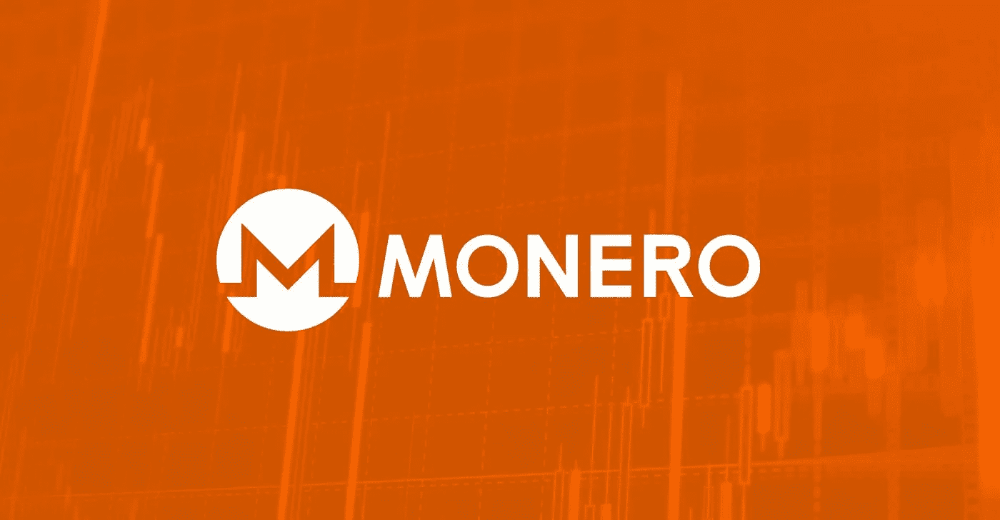
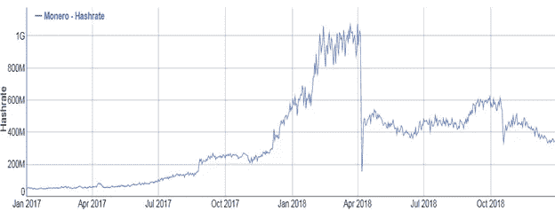
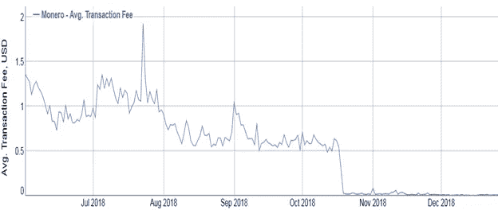
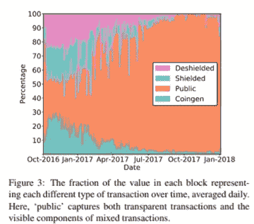

# 加密资产研究公司:Monero

> 原文：<https://medium.com/coinmonks/cryptoasset-research-monero-xmr-7a67709b4a14?source=collection_archive---------1----------------------->

**背景/概述**

Monero 的起源可以追溯到 2012 年由一位名为 Nicolas van Saberhagen 的假名作者发表的 CryptoNote 白皮书。该协议的第一个实现是 Bytecoin，但在围绕启动时间表以及预挖掘的争议之后，它被分支到 Bitmonero，不久之后又被分支到 monero。

与比特币类似，Monero 寻求成为一种分布式、抗审查的数字现金。然而，Monero 试图改善比特币的核心问题，主要是缺乏隐私和可替代性。虽然比特币交易是假名的意思，但理论上，你可以在任何人都不知道你身份的情况下进行交易，它允许世界上任何人看到你的账户余额以及所有进出交易。如果你使用法定货币购买比特币，那么你的身份就会与该地址联系在一起，现在你的金融隐私就会丢失。

即使你没有参与不法活动，也有明显的理由表明这是不可取的，就像你不希望向全世界展示你的银行账户对账单一样。此外，如果企业有一天使用加密货币进行交易，那么他们肯定需要更多的隐私，这样竞争对手就无法看到他们的财务运作。另一个问题，可替代性，当比特币被用于非法目的，然后进入诚实人的钱包时，就会成为一个问题。它很容易追踪，因此人们知道“受污染”的比特币来自哪里，现在人们可以拒绝接受它，迫使诚实的人可能以折扣价出售它。

## **区块创建**

虽然 Monero 具有与比特币相同的未用交易输出(UTXO)结构，但块是以不同的方式创建、打包和广播的，以增强隐私和可替代性。Monero 没有严格的块大小限制，而是选择了一个更加动态的系统，最大块大小是最后 100 个块的中值大小的两倍。为了确保矿工不会不断增加区块大小，开采大于 300mb 的区块会受到惩罚。

*Penalty = BaseReward*[(块大小/中值)-1]*

在短期内，如果边际收益(交易费)大于边际惩罚，那么矿商将包括超过中值规模的额外交易。在区块已满的高链容量情况下，有 0.013 XMR 的额外激励来激励矿工在每个区块添加更多事务，以缓解网络拥塞。Monero 的另一个关键特征是其供应曲线，该曲线提供了一个无限期的通胀时间表，以激励矿商确保网络永久化。一旦供应量达到 1813.2 万 XMR，每 2 分钟就会有一个固定的 0.6 XMR 发布，以继续激励矿工保护网络。

这与比特币 2100 万英镑的硬性上限相反，一旦上限被触及，诚实的矿工因交易费无法在竞争日益激烈的市场中提供足够的收入而被挤出市场，比特币可能会对网络构成生存威胁。虽然 2100 万英镑的上限要到 2140 年左右才能达到，但你可以看到，如果在 2035 年左右达到上限，Monero 将继续无限期奖励矿工。

## **工作算法证明**

Monero 有效地使用了与比特币相同的 Sybil 抵抗机制——工作证明(PoW)，以及用于确定共识的最长链规则。然而，Monero 使用了一种内存硬加密算法，这种算法故意使优化变得更加困难，以防止专用 ASICs 控制大部分哈希功能。这是通过用对应于存储器地址的随机数据填充高速缓存段，然后在读取和写入这些地址之后散列产生的块来实现的。将数据分布在多个缓存中，使得专用集成电路无法获得它们在比特币 SHA-256 中获得的那种优势。虽然 ASICs 提高了散列能力，从而提高了网络的安全性，但它通常会导致两种形式的集中化:

*   **制造业:**只有少数公司生产专用集成电路
*   **采矿业:**一些大型采矿场倾向于大规模使用 ASICs

这种集中化有可能允许攻击者或政府对网络施加影响，因为这些公司中存在单点故障。值得注意的是，虽然 CryptoNight 是抗 ASIC 的，但仍然有挖掘优化的证据。通过观察下图可以证明这一点，其中哈希率在 2017 年末和 2018 年初急剧上升。然而，一旦发现，社区主动采取措施稍微调整算法，以抵消 ASICs 对 GPU/CPU 矿工的优势。正如你所看到的，实现后散列率下降，表明过时的 ASICs 不再在 Monero 上挖掘。

[https://bitinfocharts.com/comparison/monero-hashrate.html](https://bitinfocharts.com/comparison/monero-hashrate.html)

## **隐私功能**

Monero 使用各种加密技术来混淆交易双方以及交易的任何其他信息。当您接收交易时，您共享的地址不会存储在区块链上，这要归功于隐形地址，它允许输出的一次性目的地，防止地址重复使用。每个钱包都包含一个公共查看密钥和一个公共消费密钥，它们是使用[椭圆曲线加密法](https://andrea.corbellini.name/2015/05/17/elliptic-curve-cryptography-a-gentle-introduction/)从您的种子中数学推导出来的。如果有一方想给你发送 XMR，他们使用公钥和一些随机数据来创建一个唯一的一次性密钥。这使得无法将同一地址的多项付款关联起来。

环签名是一种旨在保护发送者身份的功能，它通过混合一个组的公钥来给任何成员可信的否认，即他们是发送交易的人。组中的每一方都有同等概率成为可信的签名者，因此随着环大小的增加，任何一个成员成为真实签名者的概率降低。然而，这确实提出了一个问题，因为它变得不可能验证一个产出是否被花费了两次，这在透明区块链中是微不足道的。这个问题是通过使用密钥图像来解决的，密钥图像是通过每个签名创建的，并且是从花费的输出中导出的。仍然不可能辨别哪个输出创建了密钥图像，但是如果用户试图两次花费相同的输出，网络会将第二次识别为欺诈交易，因为它会生成相同的密钥图像。

虽然秘密地址隐藏了接收者的身份，而环签名保护了发送者的身份，但环保密交易(RingCT)掩盖了在交易中发送的 XMR 的数量。这是使用所谓的 Pederson 承诺来完成的，其中发送方使用共享密钥对值进行加密，这样接收方就可以使用相同的密钥以及他们的私有视图密钥进行解密。然后，矿工能够确认投入承诺与产出相匹配，而不必知道确切的数值。RingCT 的一个重要机制是范围证明，它创建一个大于零的范围，在这个范围内可以发送输出。这防止了有人从 1 XMR 开始并试图创建 2 XMR 和-1 XMR 的两个输出，从而有效地凭空创建 XMR。范围证明在大小上与输出的数量和范围中的位数成线性比例，使得它们构成事务大小的大部分。

[https://bitinfocharts.com/comparison/monero-transactionfees.html#3m](https://bitinfocharts.com/comparison/monero-transactionfees.html#3m)

2018 年 10 月发布的距离校样的一个改进是 Bulletproofs。[由 Bunz 等人开发](https://web.stanford.edu/~buenz/pubs/bulletproofs.pdf)bullet proof 是一种“非交互式零知识证明协议，具有非常短的证明，并且没有可信设置…bullet proof 特别适合于对承诺值的有效范围证明。”在 bullet proof 出现之前，典型的双输出事务大约为 13.2 kB，而单输出 bullet proof 大约为 2.5kb。较小的事务大小导致事务费降低了大约 95%。此外，验证防弹的时间更短，从而导致更快的区块链验证。

最后一个需要隐藏的隐私是发送者的物理位置，可以通过他们的 IP 地址追踪到。虽然他们的身份和交易数据是未知的，但如果有可能追踪到用户的位置，就无法获得真正的隐私。幸运的是，有一个名为 Kovri 的项目可以实现，使 Monero 与隐形互联网协议(I2P)兼容，该协议旨在使用复杂的路由技术来创建一个专用网络，从而隐藏传输源。该网络遍布互联网，因此发送的消息无法连接到其原始 IP 地址。I2P 节点在志愿者的基础上运作，在整个网络中传递加密数据，打破了消息来源和最终目的地之间的联系。

## **治理**

Monero 缺乏增长和发展的硬治理结构，而是选择主权级审查阻力，而不是快速创新的协议。这是由于分散的结构，缺乏任何层次的决策者创造了一个系统，由于内部冲突，进展缓慢。Monero 核心开发团队是负责监督治理的主要团队，根据[核心团队公告](https://getmonero.org/2018/03/01/core-team-announcement.html)，他们的目标是:

*   代表社区充当论坛资助系统的主要可信仲裁者，以确保所有项目的完成令社区满意
*   管理 Monero 项目的代码库，包括在 Github 上合并代码，保留备份，并确保代码的安全性，以及任何一方对代码的自由访问
*   管理一般捐赠基金，并在他们认为合适的任何事情上花费 Monero，以促进 Monero 项目
*   充当 Monero 硬币和其他相关技术的参考客户的可信签署人和分销商
*   为 Monero 项目设定方向和愿景

应该强调的是，核心团队不是一个集中的故障点，在他们不在时，网络将继续运行。当核心团队设定的方向和愿景发生冲突时，问题就会出现，这在最近 2018 年 4 月的硬分叉中得到了例证。如先前的散列率图所示，ASIC 使用的证据是明显的，这导致了密码夜散列函数的改变。核心团队率先做出了这一回应，因为他们一直直言不讳地表明了抵制 ASICs 的立场。对某些人来说，这表明了对集中化的担忧，因为一小部分开发人员能够对网络产生重大影响。然而，这并不令人惊讶，因为核心团队已经将平等主义采矿作为核心租户，并承诺积极反对 ASIC 的使用。

## **比赛**

Monero 目前正在与其他以隐私为中心的加密资产竞争，以占据该领域的一席之地。鉴于加密资产的网络效应，随着用户基础和流动性增加功能的增加，结果很可能是赢家通吃或接近它。由于这些是稀缺资产，这将导致资产价格上涨，因此矿工更有动力保护网络。随着社区的发展，更多的开发人员将涌向网络，创建一个不断自我强化的改进机制。

**Zcash**

目前，Monero 最大的竞争对手是 Zcash，它通过使用 zk-snarks 提供强大的隐私功能。虽然 Monero 使用加密方案来保护交易数据，但 Zcash 通过在交易本身中不包含任何敏感数据来避免这个问题。零知识证明允许发送者从数学上证明他们知道这些敏感数据，而实际上不必泄露这些数据。理论上，这是一个比 Monero 更强的隐私功能，然而，当私人交易在 Monero 时，它们在 Zcash 中不是默认的。

由于屏蔽交易成本更高，在网络中传播需要更长时间，大多数用户不会选择隐私。这减少了网络的总隐私，因为通过分析公共数据来了解关于私人交易的信息变得可能。[伦敦大学学院的一项研究](https://smeiklej.com/files/usenix18.pdf)分析了 Zcash 的隐私保证，并得出结论“大多数用户根本没有利用 Zcash 的主要隐私功能。此外，确实参与屏蔽池的参与者以可识别的方式参与，这具有通过缩小整体匿名集来显著侵蚀其他用户的匿名性的效果。”

这些协议不同的另一个方面是治理。如前所述，Monero 试图维持一个分布式结构，缺乏真正的领导，由于寻求社区共识，升级实施缓慢。另一方面，Zcash 展示了一个更加集中的结构，Zcash 公司做出了关于协议更新的大部分决定。虽然这允许更快速的创新，但这是以牺牲用户在网络中的影响力为代价的。此外，Zcash 向其矿工征收 10%的税，这些税归 Zcash 公司的股东所有。这可能会打击矿工保护网络的积极性，因为他们可以很容易地向不包括这种税的网络提供散列功率。

**Mimbewimble 实现**

2016 年，另一位匿名作者发布了一份关于一种名为 mimble 的协议的白皮书。目前有两种实现方式，Grin 和 Beam，它们都处于早期阶段，并寻求与比特币公平竞争。Mimblewimble 结合了机密事务和 CoinJoin，以便消除传统的公钥、私钥和地址，同时只保留输入和输出。通过获取本应包含在一个块中的所有交易并输出所有交易的组合交易，辨别发送的目的地和金额变得不可区分。真正新颖的设计是它允许新旧交易数据相互抵消。这就是所谓的修剪，可以显著减少新节点需要存储的数据量。这种新的设计确实有弱点，因为缺乏脚本阻止了可编程性，并且由于没有地址，钱包必须交互才能创建交易。虽然在早期阶段，Mimblewimble 协议似乎无法满足比特币的吞吐量，因为每个区块都需要额外的处理

与比特币类似，Grin 正在以假名开发，并通过捐款获得资金。然而，不是对数供应时间表，矿工将平均每秒开采一次，这将无限期持续下去。这意味着，作为现有供应的一个百分比，通胀开始时将非常高，但将逐渐趋近于零。Grin 预计将于 1 月 15 日推出。Beam 于 1 月 3 日推出，其运作方式更像 Zcash 模式，即一个盈利实体在前 5 年获得 20%的采矿奖励，但计划随着时间的推移过渡到非营利模式。这些早期协议自公布以来已经获得了很多关注，并有可能与 Monero 长期竞争。

## **投资论文**

Monero 的定位是获取重大价值，因为它寻求成为私人交易事实上的标准。这是一个巨大的市场，因为大多数加密资产的开放性质使得许多企业用例以及用户不想向整个世界开放的交易不合逻辑。Monero 与生俱来的草根性和开放性使其与整个加密资产领域的核心精神和价值主张紧密结合，这使得它有可能在长期内战胜更集中管理的竞争对手。

网络效应起着至关重要的作用，就其现状而言，Monero 是现存的最古老的项目之一，拥有庞大的用户群和随之而来的网络价值。这些资产的自反性质只会增加领先资产与次要竞争对手之间的距离，因为增加的网络价值强化了其作为价值储存手段的价值主张，从而进一步增加了网络价值，等等。虽然有许多因素在起作用，包括创新的速度、资本的部署和采用率，这些因素都会影响哪些网络具有价值，但就目前而言，Monero 作为隐私令牌最有可能取得成功。

> [在您的收件箱中直接获得最佳软件交易](https://coincodecap.com/?utm_source=coinmonks)

