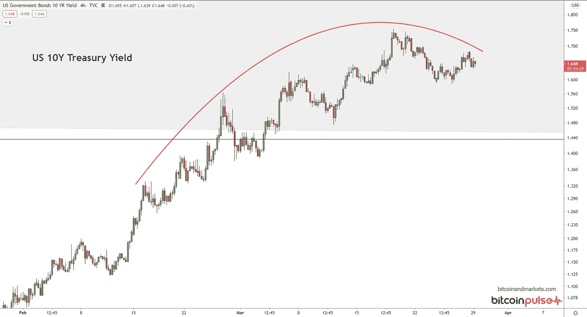

# 2021 年 3 月 29 日加密货币和全球宏观经济

> 原文：<https://medium.com/coinmonks/cryptocurrencies-and-global-macro-for-3-29-2021-dc0fffec52df?source=collection_archive---------7----------------------->

最近，我一直在为 discord 成员和 twitter 发布这组图表，但我认为在周一早上的系列中发布它们会更好。选择的图表是我每天观察的市场和价格。

我目前的论文有些不成熟，因为我个人正在等待全球金融体系的压力再次出现。此刻，它开始看起来像 2014 年或 2018 年，压力主要局限于欧洲和新兴市场的经济体。苏伊士运河危机也可能对上述地区产生一些重大影响，而在我看来，美国总体上与这一切无关，正在为增长做准备。

# 比特币价格

看起来很好，很有可能突破 56-58k 区间的阻力区域。57，000 美元的支持有可能在 60，000 美元之前受到测试，但所有迹象都表明比特币价格将上涨。

# 以太币价格

以太坊看起来很弱。许多 ETH 的推广者试图将以太与比特币的 4 年周期混为一谈，但除了它是一种依赖比特币生存的文化基因之外，ETH 没有理由跟随比特币。

ETH 正在努力保持在之前的周期高点之上，当与比特币相对时，它看起来相当疲软。先前的支持至少已经转变为暂时的阻力，所以我们将不得不看看这将如何发展。不要忘记，随着时间的推移，替代币往往会相对于比特币失去价值，因为它们是集中的迷因币，试图以与比特币相同的方式作为分散的颠覆者出现。他们会倾向于零加班。以太是一个特例，因为它是一个庞氏骗局，在此基础上建立其他庞氏骗局，所以需要一段时间才会消亡。

至少目前来看，以太坊相对比特币在慢慢出血。

# 金价

黄金没什么新鲜的。它已经被先前的支持所拒绝，现在在 1750 美元处变成了阻力。我仍然预计接下来的 3 个月黄金会很艰难，但之后会开始上涨。

黄金的困境不是因为操纵。每个市场都是被操纵的。事实上，货币商品的优越性在于抵制操纵。从长期来看，我预计未来几年黄金会升值，或许会达到 2500 美元/盎司，但也仅此而已。

我没有在这里绘制白银图表，但总体情况是一样的。我希望白银能在未来一两年达到 100 美元/盎司，但白银作为货币金属的角色将在未来十年结束。它将得到最后一次欢呼。

# 美元指数

如果你是这个博客的长期读者，那么你会知道我在这里的位置。在大约两个月的触底过程后，我一直在呼吁反弹，这正是我们所看到的。不管喜欢与否，人们需要美元。在美元自身被取代之前，将会有一个美元强势和弱势的循环。

一旦启动，美元的波动会非常快。我看不出任何技术或基本面的原因，它不应该在未来一两周内飙升至 94.5。如果它突破 95 小心，我们可能有一个主要的美元短期挤压在我们手中。这是值得关注的范围。

随着去全球化在明年加速，美元应该会继续走强，因为人们会逃离糟糕的经济和货币，转向流动性最强的资产和目前流动性最强的经济，即美国。对于任何做空美元或美元计价债券的人来说，这应该非常令人担忧。

# 美国 10 年期国债收益率

我不得不把美国 10 年的长期图表包括进来，以使情况更加清晰。如你所见，价格回到了低利率的 40 年趋势通道内。自 QE 开始以来，利率波动更大，并脱离了趋势底部。即使是利率的最后一次反弹也几乎没有将它带回趋势中，在盒子的水平阻力区内。

我预计这种情况很快会逆转，或许是因为美元继续飙升。我认为 10 年期通胀率超过 2.6%的可能性很小。

放大下面，我们可以看到一个圆形的顶部图案。

# 油价

我以前写过关于页岩油重新上线的能力，以及油价不会长期保持在 60 美元/桶以上。这似乎正在成为现实。目前的油价勉强维持在 60 美元。

现在，即使加上苏伊士运河危机，油价也没有飙升。全球 10 %- 20%的石油通过这条运河从中东运往欧洲，那么价格怎么可能不上涨呢？这是因为需求下降的速度与供给增加的速度相同。

实际上，这对于石油生产国来说是天赐之物，因为就在该行业恢复元气之际，随着供应恢复正常，价格将会像我预测的那样下降。我在寻找 40 美元左右的价格。由于苏伊士运河封锁，未来 6 个月左右，油价可能会维持在 50-60 美元的区间。

# 标准普尔 500·斯通克斯

每个人都说，“市场保持非理性的时间可以超过你保持偿付能力的时间”，但是，换句话说，这仅仅意味着你错了。

美国股市处于严重超买状态，但情况可能会变得更糟。随着美元危机冲击世界其他地区，资本将以前所未有的水平流入美国，在未来几年里像石头一样抽走各种资产。

我预计股市将从这里继续攀升。仅次于比特币。

*最初发表于 2021 年 3 月 29 日《比特币与市场研究》。*

> 加入 Coinmonks [电报集团](https://t.me/joinchat/EPmjKpNYwRMsBI4p)，了解加密交易和投资

## 另外，阅读

*   [什么是融资融券交易](https://blog.coincodecap.com/margin-trading)
*   最好的[密码交易机器人](/coinmonks/crypto-trading-bot-c2ffce8acb2a) | [网格交易](https://blog.coincodecap.com/grid-trading)
*   [3 商业评论](/coinmonks/3commas-review-an-excellent-crypto-trading-bot-2020-1313a58bec92) | [Pionex 评论](/coinmonks/pionex-review-exchange-with-crypto-trading-bot-1e459d0191ea) | [Coinrule 评论](/coinmonks/coinrule-review-2021-a-beginner-friendly-crypto-trading-bot-daf0504848ba)
*   [AAX 交易所评论](/coinmonks/aax-exchange-review-2021-67c5ea09330c) | [德里比特评论](/coinmonks/deribit-review-options-fees-apis-and-testnet-2ca16c4bbdb2) | [FTX 交易所评论](/coinmonks/ftx-crypto-exchange-review-53664ac1198f)
*   [n ave 零点回顾](/coinmonks/ngrave-zero-review-c465cf8307fc) | [Phemex 回顾](/coinmonks/phemex-review-4cfba0b49e28) | [PrimeXBT 回顾](/coinmonks/primexbt-review-88e0815be858)
*   [Bybit Exchange 审查](/coinmonks/bybit-exchange-review-dbd570019b71) | [Bityard 审查](/coinmonks/bityard-review-7d104239be35) | [CoinSpot 审查](https://blog.coincodecap.com/coinspot-review)
*   [3 commas vs crypto hopper](/coinmonks/3commas-vs-pionex-vs-cryptohopper-best-crypto-bot-6a98d2baa203)|[赚取加密利息](/coinmonks/earn-crypto-interest-b10b810fdda3)
*   最好的比特币[硬件钱包](/coinmonks/the-best-cryptocurrency-hardware-wallets-of-2020-e28b1c124069?source=friends_link&sk=324dd9ff8556ab578d71e7ad7658ad7c) | [BitBox02 回顾](/coinmonks/bitbox02-review-your-swiss-bitcoin-hardware-wallet-c36c88fff29)
*   [莱杰 vs n rave](/coinmonks/ledger-vs-ngrave-zero-7e40f0c1d694)|[莱杰 nano s vs x](/coinmonks/ledger-nano-s-vs-x-battery-hardware-price-storage-59a6663fe3b0)
*   [密码本交易平台](/coinmonks/top-10-crypto-copy-trading-platforms-for-beginners-d0c37c7d698c)
*   [CoinLoan 评论](/coinmonks/coinloan-review-18128b9badc4) | [YouHodler 评论](/coinmonks/youhodler-4-easy-ways-to-make-money-98969b9689f2) | [BlockFi 评论](/coinmonks/blockfi-review-53096053c097)
*   最好的[加密税务软件](/coinmonks/best-crypto-tax-tool-for-my-money-72d4b430816b) | [硬币追踪评论](/coinmonks/cointracking-review-a-reliable-cryptocurrency-tax-software-5114e3eb5737)
*   最佳[密码借贷平台](/coinmonks/top-5-crypto-lending-platforms-in-2020-that-you-need-to-know-a1b675cec3fa) | [杠杆令牌](/coinmonks/leveraged-token-3f5257808b22)
*   [block fi vs Celsius](/coinmonks/blockfi-vs-celsius-vs-hodlnaut-8a1cc8c26630)|[Hodlnaut Review](/coinmonks/hodlnaut-review-best-way-to-hodl-is-to-earn-interest-on-your-bitcoin-6658a8c19edf)
*   [Bitsgap 审查](/coinmonks/bitsgap-review-a-crypto-trading-bot-that-makes-easy-money-a5d88a336df2) | [Quadency 审查](/coinmonks/quadency-review-a-crypto-trading-automation-platform-3068eaa374e1) | [Bitbns 审查](/coinmonks/bitbns-review-38256a07e161)
*   [埃利帕尔泰坦评论](/coinmonks/ellipal-titan-review-85e9071dd029) | [赛克斯斯通评论](/coinmonks/secux-stone-hardware-wallet-review-15-discount-coupon-2020-7577032faa6e)
*   [本地比特币评论](/coinmonks/localbitcoins-review-6cc001c6ed56) | [加密货币储蓄账户](https://blog.coincodecap.com/cryptocurrency-savings-accounts)
*   最佳[区块链分析](https://bitquery.io/blog/best-blockchain-analysis-tools-and-software)工具| [赚比特币](/coinmonks/earn-bitcoin-6e8bd3c592d9)
*   [加密套利](/coinmonks/crypto-arbitrage-guide-how-to-make-money-as-a-beginner-62bfe5c868f6)指南| [如何做空比特币](/coinmonks/how-to-short-bitcoin-568a2d0b4ae5)
*   最佳[加密制图工具](/coinmonks/what-are-the-best-charting-platforms-for-cryptocurrency-trading-85aade584d80) | [最佳加密交易所](/coinmonks/crypto-exchange-dd2f9d6f3769)
*   [如何在印度购买比特币？](/coinmonks/buy-bitcoin-in-india-feb50ddfef94) | [WazirX 评论](/coinmonks/wazirx-review-5c811b074f5b)
*   [印度比特币交易所](/coinmonks/bitcoin-exchange-in-india-7f1fe79715c9) | [比特币储蓄账户](/coinmonks/bitcoin-savings-account-e65b13f92451)
*   [CoinDCX 评论](/coinmonks/coindcx-review-8444db3621a2) | [加密保证金交易交易所](https://blog.coincodecap.com/crypto-margin-trading-exchanges)

> [在您的收件箱中直接获得最佳软件交易](/coinmonks/newsletters/coinmonks)

