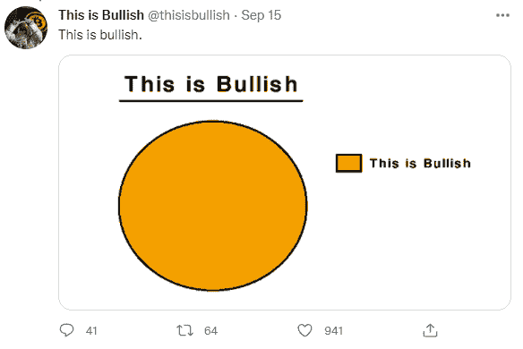
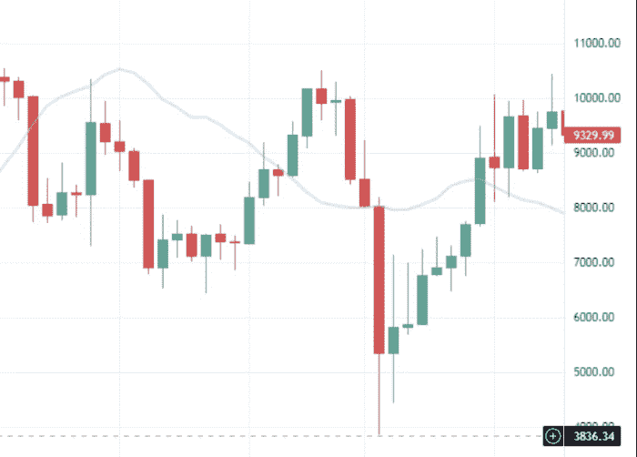

# 加密货币和迫在眉睫的金融清算

> 原文：<https://medium.com/coinmonks/cryptocurrencies-and-the-looming-financial-reckoning-e948be420c50?source=collection_archive---------6----------------------->

问题不在于迫在眉睫的经济灾难。

加密货币在经济不确定性和这种可能的宏观经济灾难期间的表现对这个市场的所有人都同样重要。

***Source:*** [***Twitter***](https://twitter.com/thisisbullish/status/1438166862081237002)

正如一些人可能在社交媒体上暗示的那样，加密货币并不都是乐观的。正在发生的很多事情都是乐观的，但是在不同的情况下，负面的情况同样是可能的。

2020 年 3 月，出现了一次大规模下跌。许多人知道这将会发生，并在一旁观望，等待。

就在 BTC 减半之前，这是一个极好的切入点，只持续了几天。

# 还记得 2020 年的崩盘吗

许多操纵市场多年的年轻“鲸鱼”在 2020 年 3 月消失了。他们卖了又卖。2020 年 3 月的震惊时刻遭遇了数月的灰度级加密购买增加。之后，是 Microstrategy，PayPal，Dorsey，最终，马斯克买下了 BTC 的顶部，由于是马斯克，价格在接下来的几个月里上涨了。

然而，在这些 covid 年，我们的经济开始崩溃。股票与真实经济脱钩，开始脱离基本面，如公司的盈利能力、生产率和未来潜力。如果没有美国政府注入的大量资金，一半在纽约证券交易所上市的公司将会破产。类似的情况也发生在欧盟。

一眨眼的功夫，经济就从资本主义过渡到了奇怪的社团社会主义模式。每个人都很高兴收到 1000 美元的薪水，但这笔钱在未来会被要求十倍返还。

这一切对 crypto 有什么影响，没人能确定。这是关于把事情放在正确的角度，并检查以前的例子和经验。

上一次金融灾难已经过去 13 年了，一切仍然岌岌可危，但它也可能持续数年以上。金融灾难是必然的，拖得越久，对我们的影响就越大。

问题再次是 crypto 将如何运行，以及它是否是存储我们的财富并将其用作数字现金而不是法定货币的正确地方。

# 这次不同吗？

这次牛市也不例外。

大多数网络不会突然经历流量和新用户的激增。以卡尔达诺为例。回到 2017 年，它对世界有多大用处，今天又有多大不同？

卡尔达诺还没有生产出任何东西，但也许在所有这些数十亿投入这个生态系统后，还有一些希望。但是，这仍然是查尔斯·霍金森在说话。

我们也读到了波尔卡多特是如何杀死以太坊的，然而波尔卡多特看起来只是在遵循卡尔达诺的炒作方式。

我们应该对毫无意义的炒作持保留态度。

这些项目甚至比 Tron 和 EOS 更糟糕，它们至少交付了一个快速以太坊的集中版本。EOS 有潜力，但在内部冲突和集权问题后，它没有持续下去。

区块链网络的效用再次成为市场情绪和价格见顶和反转的重要指标。

尽管没有人确切知道市场会在何时崩溃或崩溃的原因，但它肯定会崩溃。一如既往，购买蘸酱是一个很好的选择。

有多少次我们认为牛市已经结束了，这次有什么不同吗？

大概不会。

虽然昨天有一个信号导致价格走低，让 top bots 恐慌。

新的 Covid 担心来自莫桑比克和南非的另一种变异，以及恐惧在我们的社会和经济中无休止的蔓延。这是新的 FUD。不是说它不真实，这需要很少人能进行的分析。然而，这是一种传播恐惧-不确定性-怀疑的方法。

在这种情况下，我们所学的任何东西，以及我们经营企业的所有经验，都是过时的。当封锁可能在第二天就适用时，我们如何计划投资或创业？

那么加密潜力和我们的投资呢？他们会受到影响吗？

如前所述，这种“事件”(Covid)会造成恐慌，并使情绪转向负面。最大的担忧是西方经济体的衰退。

# 2020 年 3 月的下跌再次成为范例

*Source:* [*Pixabay*](https://cdn.pixabay.com/photo/2018/03/10/09/45/businessman-3213659_960_720.jpg)

比特币在 2020 年 3 月跌至 4000 美元，因为西方国家开始实施封锁，而对衰退的担忧摧毁了我们“赌场经济”的基础。

美联储的打印机是临时的解决方案，新印的钞票大部分被分发给公司。无限的 QE、政府援助和直升机空投现金将大多数市场推入了暂时的兴奋状态。

但是我们都知道会发生什么。欣快感是最后阶段。泡沫达到阈值后，就会出现真正的崩盘，就像 2020 年 3 月那样，随后就是衰退。

衰退是经济中的自然现象。如果美联储愿意，它可以继续玩负利率游戏，但经济问题只会进一步加剧。

衰退可能会以不同的方式出现，但股市泡沫的形成似乎会让它变得更具戏剧性。这将是一场会造成巨大破坏的衰退，就像 2008 年那样，甚至可能更糟。

虽然，由于这种 covid 恐慌和我们政府的无能，我们无法确定今天的指标和数字。通货膨胀正在掠夺我们的工资和固定收入，每个人的生活成本在一年内增加了大约 20-50%。

加密，即使作为一种投资，也提供了一种简单的出路，尽管没人能保证加密货币的价格不会在衰退期间跳水。

最有可能的结果是高度投机的资金将退出最不稳定的投资。但是，他们能搬到哪里去呢？黄金还是债券？随着经济风险的增加，债券也会变得危险。

# 各国央行向流动性已经很高的市场注入流动性

加密货币的大规模采用对于实现其长期可行性至关重要。

不过，衰退通常会带来低通胀水平。这并不是加密货币蓬勃发展的确切原因。

为了避免经济衰退，出于对 2008 年重演的担心，美联储通过向已经流动的市场注入流动性做出了反应。

但和 2008 年一样，流动性不是问题。2007 年 9 月，所有的讨论都是关于市场缺乏流动性。然而，经济正受到基本面问题的困扰。这从来都不是流动性的问题。严重的错误影响了两代人的进步，同时彻底摧毁了一些地区经济。

如果你学过金融，或者在银行业有过任何经验，你肯定理解电影《大空头》中解释的所有术语和概念。这部电影解释了导致本世纪最大衰退的情况。

2008 年后，这是另一个世界。伊拉克、世贸双塔、越南都无法与 2008 年经济衰退以来世界范围内的巨大变化相提并论。

# 最后

*Source:* [*Pixabay*](https://pixabay.com/tr/photos/kent-bina-mimari-kentsel-modern-2278497/)

经济衰退将暂时给加密市场造成混乱，其反应将与网络泡沫相匹配。

加密货币永远不会消失，至少那些基本面强、用例多、社区多、去中心化的不会消失。

那些在“数字上升”叙事之外发出声音信息的人是可持续的，具有巨大的潜力，任何衰退都无法破坏。

然而，集中式加密货币正处于极度危险之中。USDT 是中央集权过程的最好例子，但加密货币投资者大大低估了这一危险。

开发者维护一个令牌的成本为零。在经济低迷时期，他们可以减少开支，停止促销活动，等到情况好转时再回来。

依靠电力运行的区块链受到调节困难或类似功能的保护，从而允许网络无问题地运行。对于顶级 PoW 网络来说，51%并不是一个现实的危险，但较小的网络通常会集中采矿作业以减少这种威胁。

总之，如果发生类似于 2020 年 3 月的事件，或者如果我们的经济进入衰退，加密货币将受到巨大影响。

虽然，与之前的衰退一样，那些具有足够潜力、增长、专业社区和效用的加密货币将会复苏，即使是在衰退期间。

从长远来看，经济衰退不会阻碍真正的创新。

Writing at the following websites: ● [ReadCash](https://read.cash/@Pantera) ● [NoiseCash](https://noise.cash/u/Pantera99) ● [Medium](/@panterabch) ● [Hive](https://hive.blog/@pantera1) ● [Steemit](https://steemit.com/@pantera1) ●[Vocal](https://vocal.media/authors/pantera) ● [Minds](https://www.minds.com/pantera99/) ● [Twitter](https://twitter.com/Panterabch) ● [LinkedIn](https://www.linkedin.com/in/panterabch/) ● [email](https://read.cash/@Pantera/localcryptos-p2p-exchange-is-now-offering-bitcoin-cash-trading-06637230#bad-link)

**备注:**

> **免责声明**:本内容中发布的所有材料均用于娱乐和教育目的，并符合合理使用准则。无意侵犯版权。如果你是或代表本文所用材料的版权所有者，并且对所述材料的使用有问题，请发送[电子邮件](https://read.cash/@Pantera/cryptouknowns-battlegrounds-the-crypto-battle-royal-part-i-0ca762da#bad-link)。这篇文章或我发表的任何文章都不是金融建议，但包含与投资研究相关的信息。

***支持内容创作者。***

如果你喜欢这个故事，就订阅吧！

*原发布于*[*https://read . cash*](https://read.cash/@Pantera/cryptocurrencies-and-the-looming-financial-reckoning-61f683e2)*。*

> 加入 Coinmonks [电报频道](https://t.me/coincodecap)和 [Youtube 频道](https://www.youtube.com/c/coinmonks/videos)了解加密交易和投资

## 另外，阅读

*   [Bookmap 评论](https://blog.coincodecap.com/bookmap-review-2021-best-trading-software) | [美国 5 大最佳加密交易所](https://blog.coincodecap.com/crypto-exchange-usa)
*   [如何在 FTX 交易所交易期货](https://blog.coincodecap.com/ftx-futures-trading) | [OKEx vs 币安](https://blog.coincodecap.com/okex-vs-binance)
*   [CoinLoan 审核](https://blog.coincodecap.com/coinloan-review) | [YouHodler 审核](/coinmonks/youhodler-4-easy-ways-to-make-money-98969b9689f2) | [BlockFi 审核](https://blog.coincodecap.com/blockfi-review)
*   [CoinFLEX 评论](https://blog.coincodecap.com/coinflex-review) | [AEX 交易所评论](https://blog.coincodecap.com/aex-exchange-review) | [UPbit 评论](https://blog.coincodecap.com/upbit-review)
*   [AscendEx 保证金交易](https://blog.coincodecap.com/ascendex-margin-trading) | [Bitfinex 赌注](https://blog.coincodecap.com/bitfinex-staking)
*   [最好的卡达诺钱包](https://blog.coincodecap.com/best-cardano-wallets) | [Bingbon 副本交易](https://blog.coincodecap.com/bingbon-copy-trading)
*   [印度最佳 P2P 加密交易所](https://blog.coincodecap.com/p2p-crypto-exchanges-in-india) | [柴犬钱包](https://blog.coincodecap.com/baby-shiba-inu-wallets)
*   [八大加密附属计划](https://blog.coincodecap.com/crypto-affiliate-programs) | [eToro vs 比特币基地](https://blog.coincodecap.com/etoro-vs-coinbase)
*   [最佳以太坊钱包](https://blog.coincodecap.com/best-ethereum-wallets) | [电报上的加密货币机器人](https://blog.coincodecap.com/telegram-crypto-bots)
*   交易杠杆代币的最佳交易所
*   [AscendEx Staking](https://blog.coincodecap.com/ascendex-staking)|[Bot Ocean Review](https://blog.coincodecap.com/bot-ocean-review)|[最佳比特币钱包](https://blog.coincodecap.com/bitcoin-wallets-india)
*   [Bitget 回顾](https://blog.coincodecap.com/bitget-review)|[Gemini vs block fi](https://blog.coincodecap.com/gemini-vs-blockfi)|[OKEx 期货交易](https://blog.coincodecap.com/okex-futures-trading)
*   [美国最佳加密交易机器人](https://blog.coincodecap.com/crypto-trading-bots-in-the-us) | [经常性评论](https://blog.coincodecap.com/changelly-review)