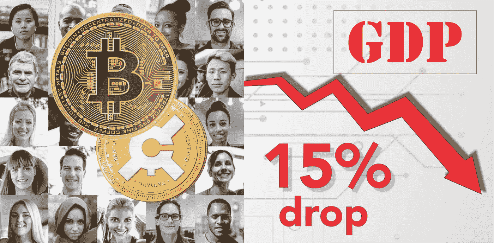
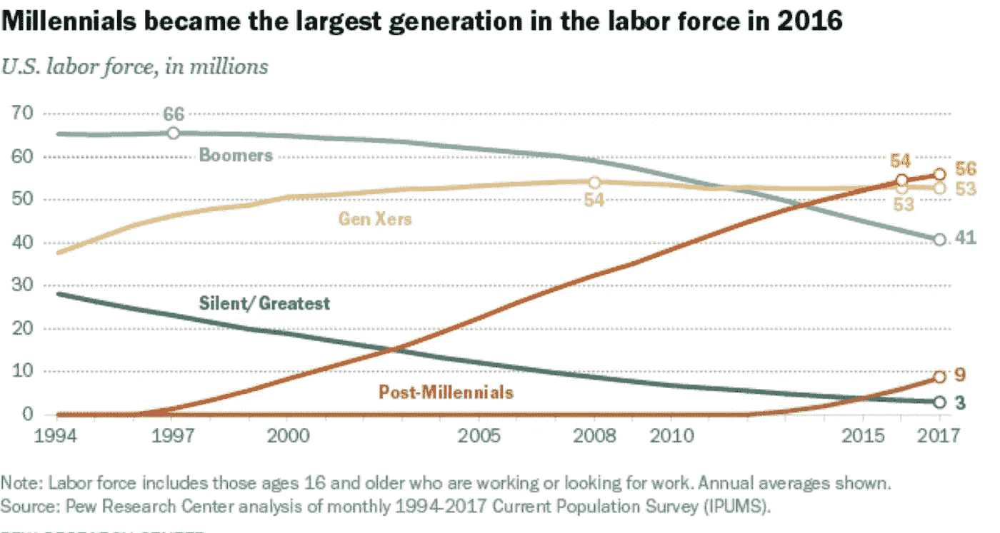
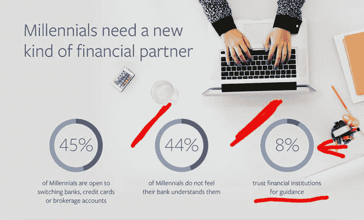
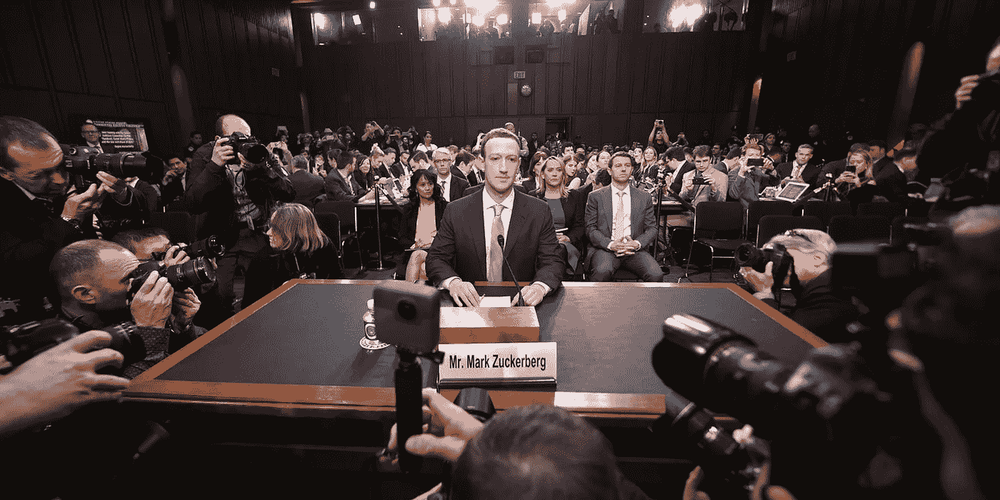

# 加密货币:政府准备好应对 GDP 下降 15%了吗？

> 原文：<https://medium.com/coinmonks/cryptocurrencies-are-governments-prepared-for-this-fd477ba8663b?source=collection_archive---------6----------------------->

# 年轻一代持有不同的观点

高盛最近发布的关于千禧一代行为的报告对这一代人有了新的认识:他们是最大的人口群体，随着他们进入工作和消费的黄金时期，他们将进一步扩大，随后的环境影响将是巨大的。

PEW Research Center

千禧一代是在技术变革、全球化和经济混乱的关键时期成长起来的。这个巨大的调整期为千禧一代提供了与他们的前辈截然不同的行为和经历。例如，他们更不愿意购买汽车、音乐和奢侈品。

相反，可以观察到千禧一代转向一系列新的服务，提供无所有权负担的产品访问，从而刺激了“共享经济”的崛起。千禧一代对技术的亲和力也在重塑零售空间:通过智能手机，他们可以轻松获得新水平的产品信息、用户评论和即时价格比较，千禧一代现在可以以最低的成本获得最大的便利。

Facebook 2016

那钱呢？2016 年[脸书的一项研究](https://www.facebook.com/iq/articles/millennials-money-the-unfiltered-journey)显示，92%的千禧一代不信任银行，45%的人愿意换银行。

**对 21%的千禧一代来说，比特币比房地产更好**

以下文章于 2018 年 6 月 28 日发表在 [NEWSBTC](https://www.newsbtc.com/2018/06/27/a-fifth-of-uk-millennials-would-rather-invest-in-bitcoin-than-in-real-estate/) 上:总部位于英国的建租开发商 *Get Living* 在 3000 名千禧一代中进行了一项调查，以更好地了解他们在房地产投资上的立场。调查发现，四分之三的人认为，与投资房地产相比，投资回报更高。

[研究](http://www.getlivinglondon.com/pdfs/get_living_millennial_living_in_2018_report_first_look.pdf)发现，57%的千禧一代认为房产是未来五年的“高风险”投资决策，其中 21%的人认为比特币是更好的投资。

# 不理解的老一代人

2018 年 4 月 11 日，脸书首席执行官马克·扎克伯格在[一场](https://www.fastcompany.com/40557799/zuckerberg-just-proved-once-again-that-congress-doesnt-understand-the-internet)臭名昭著的国会听证会上成为了关注的焦点。他在开场白中说，“你们当然会有一些很难回答的问题。”。

Photo: Jim Watson/AFP/Getty Images

事实证明，扎克伯格没什么可担心的。事实上，他可能准备过度了。观众可以清楚地看到，许多国会议员在他们(大概是更年轻的)工作人员的帮助下，在备受瞩目的听证会前挤得水泄不通。他们带着“抓到你了”的问题来到这里，这些问题来自脸书许多所谓的不端行为的新闻报道，其中许多都是未经证实的。

例如，一些国会议员引用了脸书通过智能手机配备的麦克风窃听谈话的虚假报道。在一场旨在指出扎克伯格公司在个人数据收集方面缺乏透明度的听证会上，扎克伯格成为了令人同情的角色。

这只是充斥着代际冲突的听证会的一个例子:“老”一代掌管着最大的公司或政府，却不理解驱动“新”一代的技术，扎克伯格就是这种理解的化身。

# 作为金融工具的加密货币

互联网已经以一种曾经不可思议的程度改变了世界，但加密货币(本文剩余部分称为比特币)的持续出现将是一场同样重要的革命。但是到底是什么让它们如此重要呢？

这不是货币的波动，也不是一个人能从中赚多少钱。

一枚比特币的价值是 1000 美元还是 100 万美元并不重要。它是技术和人们可以用它做什么。

比特币及其支持的区块链象征着点对点(P2P)技术的最新高度。

与传统交易不同，区块链交易不需要单一的受托人(人或机器)来验证。这种不变性意味着没有人能够改变存储的记录。这种对审查的抵制也意味着没有人能够影响(积极的或消极的)或关闭区块链。

事实上，没有哪个政府能够监管比特币，因为它不受地理边界的限制。与债券和股票不同，加密货币是全球性的，全天候交易。由于包容性和中立性，每个人都可以参与。这些差异背后的驱动因素是权力下放，许多人现在(正确地)认为这是一种新的治理形式。

# 脸书和其他社交网络

脸书有 30 亿用户，其中 50%是每日活跃用户。他们将创建一个脸书硬币，并在整个平台上使用它作为支付方式(例如，购买的广告将使用脸书硬币支付，而不是美元、欧元……)。这些钱不受任何中央银行的监管。它由脸书监管。这同样适用于 YouTube、Twitter……收入将如何计算？还有税？

# 经济影响

对许多政府来说，通货膨胀和税收是减少债务的两种方式，尽管通常是由民众来买单。这些政府只有通过某种形式的武力来控制人民才能实现这一目标。

另一方面，比特币提供了一套独特而强大的金融服务，不受传统政府所有权的束缚。它推动了经济包容性，使用户能够成为自己银行的主人，并首次选择退出本国的传统货币体系。

如今，只有一小部分全球人口将比特币作为可行的货币系统，这反过来意味着对更广泛的经济或中产阶级没有真正的影响。此外，大多数上/下匝道(交换)是集中的，因此不能免受不利的政府影响。然而，这种情况肯定会改变。

全球密码购买者的平均年龄目前为 34 岁，据预测，在不到 10 年的时间里，15%的人将选择数字货币而不是传统货币。

比特币的数字货币竞争是政府无法控制的。15%的人口转移意义重大，减少了任何国家政府的选择，并提供了适当的关注理由。

传统治理的选择和自由正在减少——现在必须做好准备。这种影响将会产生全球性的影响，迫使政府为了公民的利益而改变自己的行为。

这就是为什么产生最大影响的绝不是加密货币的价格。这是它们将被用于超越其作为金融工具的基本功能的方式，以及其基础区块链技术的许多人道主义应用。