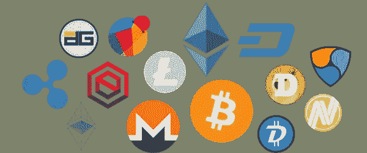
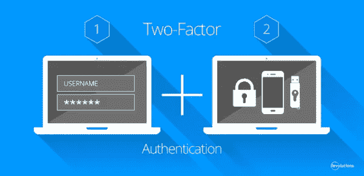
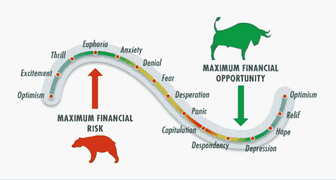

# 如何交易加密货币——初学者指南

> 原文：<https://medium.com/coinmonks/cryptocurrencies-beginner-guide-10a008040e8e?source=collection_archive---------4----------------------->

加密货币、比特币、区块链、疯狂的收益、潜在的泡沫、未来的商业以及今天更多的表达几乎在每一步都能听到。但是加密货币进入世界仍然非常困难，特别是对于那些没有受过很好技术教育的人来说。

Photo by [André François McKenzie](https://unsplash.com/@silverhousehd?utm_source=medium&utm_medium=referral) on [Unsplash](https://unsplash.com?utm_source=medium&utm_medium=referral)

在写这篇文章的时候，几乎每个人，从幼儿园的孩子到市场读者，都听说过加密货币和比特币。但事实上，只有一小部分人真正拥有加密货币。

**注意** —在进行任何资金转移之前，我建议您通读这篇文章，因为当您在交易所中有资金时，您需要在开始交易之前处理一些您不想做的事情。

# 1.什么是区块链？

你可以把区块链表现为一个公共账本，所有的交易都记录在里面。所有用户都可以访问区块链，这可以防止欺诈，并便于跟踪交易。

在区块链技术公司的案例中，所有这些信息都将被记录在“区块链数据”中，因此每个条目都将被标注日期，人们将知道是谁写的以及它指的是谁，并且我们只能访问那些被授权的人。

# 2.什么是加密货币？

加密货币简单说就是——数字货币，在没有中央系统(银行)的数字货币系统中运行。为了建立这样一个分散的系统，他们必须解决过去阻止所有此类尝试的主要问题—如何解决记录的对账(例如，同一用户不会用相同的钱支付两次并滥用它，等等。).

被称为比特币(目前最广为人知和传播最广的加密货币)发明者的中本聪，通过在没有中央系统的情况下在用户中达成共识，解决了这个问题。

在现实中，事情是这样的——爱丽丝决定给本发送 0.5 个比特币。Ben 告诉他自己的数字地址，Alice 通过输入他的私钥(简体:只有他知道的密码)开始转账的过程。那一刻，这个交易被触发，全网可见(当然不是用姓名，而是用代码)，然后一个关键时刻发生了——交易确认。

# 3.比特币是什么？

比特币是一个没有中央机构或经纪人的支付系统。简单来说，比特币可以给你一个互联网现金或者货币的例子。重要的是，没有人拥有比特币网络——它由全球所有用户控制和管理。如果你想了解更多关于 [**比特币的信息——点击这里。**](/@l.wiesflecker/what-is-bitcoin-bc9b9ffc5b3b)

> **亦读:** [**对比特币的坦诚解释**](https://blog.coincodecap.com/a-candid-explanation-of-bitcoin/)

# 4.除了比特币，其他加密货币代表什么？

市场上有越来越多类型的(替代)加密货币，称为替代硬币。它们代表了比特币的替代品，但它们尤其在目的、交易速度、分发方法、算法和其他特征上有所不同。

CoinMarketCap 提供了所有加密货币的列表。通过这个网站，你还可以检查加密货币的当前价值(比如与美元相比)，并决定是长期购买该货币(“HODL”)还是因为你相信它的想法(打开加密货币的官方网站并阅读问题，如果是这样，考虑这种分散化是否有助于这种情况)。

当然，你也可以决定短期(投机)购买该货币，你正在寻找该货币的下跌，以在短期内为你创造一个加号，因为你相信它会再次增长(加密货币经常发生这种情况)。在这种情况下，跟踪趋势和分析是明智的，也可以在网上找到。

2017 年 1 月所有加密货币的总“市值”达到 682 万亿美元，这是全球海洋中的一小部分，苹果的价值高于此。所以你可以想想这方面还有多大的进步空间。

好吧，我明白，我有些钱想投资加密货币，但一切都很复杂——我该怎么做？

让我们一步一步地看完**—你需要以下东西来购买(和储存)加密货币:**

**-你银行账户或信用卡上的钱，**

**-加密货币交易所的认证账户，您可以在这里加载资金并购买您的第一种加密货币，**

**-“钱包”，你将在其中存储你的加密货币(更多信息见下文)**

# **5.让我们开始:**

**在交易所开户:**

**要将钱存入您的“加密账户”，我们建议您使用接受美元或欧元的“交易所”，同时提供购买不同加密货币的选项。**

# **币安**

**币安是最著名的交易所之一，有大量的加密货币可供选择，但目前他们不接受欧元，所以你需要将欧元加载到以前的交易所，将其转换为加密货币，然后将加密货币转移到你的币安账户。**

**在你登录之前，一定要注意正确的链接，那里有一些骗子想要拿走你的钱。**

****如果您想在币安** **上创建一个** [**账户，欢迎您到**](https://www.binance.com/en/register?ref=TD824058) [**使用我的会员链接。我对此非常高兴，如果你有任何问题，你可以联系我！**](https://www.binance.com/en/register?ref=TD824058)**

# **比特熊猫**

**我更喜欢用 Bitpanda。这是一家总部设在维也纳的奥地利公司。我认识那里的一些人，他们做得很好。**

**[**当然，我也在这里为你留下了我的会员链接。非常感谢！**](https://www.bitpanda.com/?ref=9825799264764794407)**

**此外，在 Bitpanda 上验证后，您有机会制定储蓄计划。拯救比特币和其他加密货币的好主意。Bitpanda 的收费相对较低，在我看来是最好的在线钱包之一。**

**[**注册 Bitpanda，我们一起安全赚比特币**](https://www.bitpanda.com/?ref=9825799264764794407) **。****

# **6.确认**

**一旦你在交易所注册(你得到了“第一层”)，我建议你立即**提交一个“验证”请求**，也就是升级你的账户，因为这只会变成真正的流动资金，你可以把钱存回你的银行账户。**

**所有交流的验证程序都是相似的，大部分是输入你的所有信息，上传并记录你的个人文档。请注意，您将输入文档上可见的信息。**

****

**大部分的交流，伴随着一份个人文件，还需要另一份文件的复印件证明你永久居留的正确性，最简单的方法是寄一份银行对账单，信用卡对账单，有些还接受普通账户(电话，电费等。).**

**为了保护您的帐户，我强烈建议您考虑所有交易所提供的**“两步验证”**。这是关于下载一个移动应用程序，它还允许你在不同访问的个人密码之外添加额外的代码，这在每次进入时都是不同的。安装既快速又简单。**

**接下来，当您在交易所注册时，您将输入您的用户名和密码，然后系统会要求您输入额外的代码，您可以在手机上的应用程序中找到这些代码。通过这样做，可以阻止(或者至少使工作变得复杂、困难)那些想要侵入你账户的人，因为他们会在某个地方获得你的密码信息。**

# **添加货币和购买加密货币**

**当您收到验证成功的通知，并且可以上传您的首笔存款时，快乐的一天就到了。试着冷静下来，记住以下几点:**

**-只添加你可能错过的钱，以及你可能完全忘记的钱，以防任何事情不按计划进行。**不要贷款、子女上学基金或借款**。**

**至少检查三次输入的所有信息。你已经等待验证至少 3 周了，如果你现在花 3 分钟，中间不会出错，但你可以节省很多钱和额外的时间损失。**

**在大多数交易所，您将在 1-5 个工作日内看到您的资产。如果你要用 [**Bitpanda**](https://www.bitpanda.com/?ref=9825799264764794407) ，马上就有了。**

# **好，现在行动！**

**现在只剩下一些对密码世界术语的解释:**

*   **HOLD 实际上是持有的意思。当一种货币(或整个市场)开始突然下跌时，不要惊慌。你几乎肯定会因为匆忙兑换货币或者试图在银行账户上付款而变成负数。如果你要去“HODL”，你可能知道第二天醒来会看到绿色的数字。**
*   **BTFD——要么买入，要么“在底部买入”。注意——我们总是认为“需要在货币处于底部时买入，在它上涨时卖出。”但是你可能需要一些错误来了解这一点，因为你会被给予**“FOMO”(害怕错过)，你会购买上涨中的密码**，或者当一些货币开始变成红色数字时，你会经历另一边的“FUD”(恐惧、不确定和怀疑，或者恐惧、不确定和怀疑)，你会刚好看到一篇未知作者的文章，他将预测这种货币的断裂，**，这将导致你的恐慌性抛售。**很多时候是原币很快回升开始增长，而你已经“出逃”的货币开始下跌，这样就做了双负，同时还在支付佣金。**
*   **鲸鱼——我们的建议是避开那些众所周知是“鲸鱼”的主要持有人的货币。这些百万富翁购买更大份额的货币，然后有权力操纵价格——如果这样的人突然决定出售他们的股份，它可能非常有前途，在底部的一对秒钟内完全价值该货币，但只有在你手中不值钱的硬币。**

# **检查交易图表的心理**

****

**所以，盲从是不建议的，学习是绝对建议的。有几件事你可以考虑一下:**

# **将您的预算分为:**

**a)为“长期”预算(长期投资，稳定的货币，也许是分散你的角色的秘密交易。它的风险更低，收益也更低，但比你在其他地方使用的要大得多)**

**b)“短期”预算(短期投资，根据日常预测和机会。风险更大，收益更高)。**

# **钱包**

**钱包是一种数字钱包，你可以在其中存储加密货币，只有你才能访问它们。由于在浏览器中打开钱包是一件相当复杂的事情(同时也不完全安全)，我们建议您购买两种最安全和最知名的加密钱包之一:**

**[特雷佐](https://trezor.io/)**

**[莱杰纳米 S](https://www.ledger.com/)**

****小心**！你必须在这些官方产品页面上订购钱包，任何来自其他在线商店的订单，甚至更糟——从分类广告(等)订购二手钱包。)带来了高风险——因为你会通过分类广告订购万事达卡，而你不确定卖家是否还能获得它，并且你会升级你的资产。**

**订购电子钱包时，您还会收到使用说明，帮助您将购买的密码转移到您的电子钱包中并保护其安全。**

**在**交易所，只留下那些你打算每天交易的加密货币。其他东西尽快发到你的安全钱包里。****

****另请注意:**我提供的信息仅用于教育和信息目的，**没有任何形式的明示或暗示保证，包括任何特定目的的准确性和完整性保证。本人包含或提供的信息并非用于财务建议、投资建议、贸易建议或任何其他建议**。**该信息具有普遍性，并不针对您、用户或任何其他人**。**

**在未能进行尽职调查并咨询专业中介或财务建议的情况下，我们不应根据我们提供的任何信息做出任何决定、金融、投资、贸易或其他信息。您理解，您使用所有可用信息的风险由您自己承担。**用比特币或替代加密货币进行交易有潜在的好处，也有潜在的风险。**交易不一定适合所有人。任何想投资的人都应该寻求自己独立的财务或专业建议。**

> **[直接在您的收件箱中获得最佳软件交易](https://coincodecap.com/?utm_source=coinmonks)**

****

**我在每月一期的 [**简讯中分享了更多私密的想法，你可以在这里**](https://mailchi.mp/bf8f8e8ed697/keep-in-touch-with-lukas) 查看。请在评论中告诉我，并在各种社交媒体平台上加入我:**

**[**推特**](https://twitter.com/WiesfleckerL)●[**insta gram**](https://www.instagram.com/lukaswiesflecker/)●[**脸书**](https://www.facebook.com/lukaswiesfleckerr)●[**Snapchat**](https://www.snapchat.com/add/luggooo)**●[**LinkedIn**](https://www.linkedin.com/in/lukas-wiesflecker-1b11251a5/)****

****无论你做什么，都要带着爱和激情去做！****

********