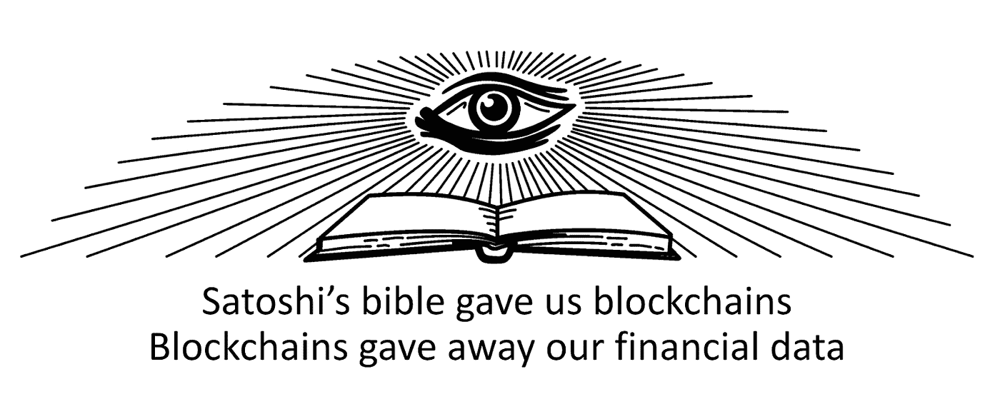
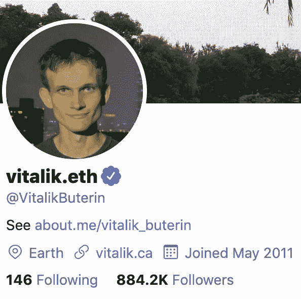

# 加密货币，社交媒体，但不是为了钱

> 原文：<https://medium.com/coinmonks/cryptocurrencies-social-media-but-for-money-5f5a2f1379ae?source=collection_archive---------3----------------------->

## 加密货币如何进一步侵蚀互联网隐私

这篇文章已经更新，澄清了围绕彼得·托德的记录和 Zcash 的仪式的情况。

现在是 2020 年 1 月 1 日，一个新十年的开始，互联网有了后遗症。脉动，但比以往任何时候都更有活力，我觉得我们有所有这些“股份”的黑色眼睛。随着社交网络的引入，世界城镇广场变得非常大。但是，在这个过程中，我们家和隐私周围的墙倒了。我们建立了[加密货币](https://medium.com/coinmonks/crypto/home)来收回一些控制权，为互联网积累资金。但是，随着公开[区块链](https://medium.com/coinmonks/blockchain/home)，我们只是放大了问题，它开始伤害。

我们没能理解隐私和自由一样，必须被获取而不是被给予。

## 我们共享的互联网

脸书于 2004 年启动，首先是为了连接大学生，然后是全世界。Twitter 和其他公司也纷纷效仿。社交图谱越来越大，我们了解到我们与世界上每个人的联系不是 6 个，而是比 3.46 个多一点。然后，2008 年给我们带来了一个以另一种形式的“共享”为前提的经济。分享你多余的卧室。分享你的旅程。然后，它像雪球一样越滚越大。分享你的感情状态和你现在的状态，“我是 ____”绽放。当你在的时候分享你的位置。分享 140，不那还不够，分享 280。分享您的照片。分享您的视频。分享你在哪里吃饭，分享你在哪里吃饭。我们甚至分享了朋友的照片和视频。他们不会在意的。我也会给它们贴标签。他们以后会感谢我的。

该死，感觉真好。喜欢源源不断，就像我们击中三个樱桃。哦，伙计。我应该再做一次。我们超越了分享，走向了训练有素的影响力。

离开 2000 年，进入青少年时期，我们中的一些人有一种潜在的感觉，也许我们分享得太多了。所以，我们探索时间。Snapchat 为有时限的“故事”增加了截止日期。策划好友名单和一些增加的隐私设置还给我们隐私毯。现在我们又能保护自己了。我们超越了永久的、开放的共享，走向了“临时的”、“封闭的”共享。仅向我们选择的朋友共享过期的图片和视频会让我们感到隐私。也许我会和我的 BAE 分享一些更淫秽的东西。“它不会泄露出去的，”我们推断道。正是在这一点上，我们超越了一天分享几次，而是分享了一整天。

为什么？为什么要分享自己？我们分享我们自己和我们的东西，因为这感觉很好。就像给我们的朋友、家人甚至陌生人的礼物一样，分享到互联网上就像是一种捐赠。我们把它送给我们的朋友，他们用互惠的股份、喜欢和甜蜜的心来支付。上帝，请给我更多的心。如果你真的很慷慨，我会转发并再次分享给你。超越你的朋友群体，超越你的社交圈子，它上升到了平流层。

“分享”这个词本身听起来甚至还不错。它开着。它不那么贪婪。来自古英语单词“scearu ”,其来源于“divided”。分享需要把你的一部分分给你的朋友、家人和网站提供商。

但是，我们现在知道，“共享经济”和“网络上的一切都是免费的”实际上更接近于“监控资本主义”和“如果它是免费的，你就是产品”。

正如爱德华·斯诺登在他的书《永久记录》中所说，

> “这是监控资本主义的开端，也是我所知道的互联网的终结。现在，随着无数漂亮的、困难的、个人主义的网站被关闭，创造性的网络崩溃了。便利的承诺让人们把他们的个人网站——需要持续和费力的维护——换成了脸书页面和 Gmail 账户。所有权的表象很容易被误认为是所有权的现实。当时我们中很少有人理解这一点，但我们将要分享的东西都不再属于我们了。那些因为找不到我们感兴趣的商品而失败的电子商务公司的继任者现在有了新的产品可以销售。那个新产品就是我们。”

# 加密货币和公共区块链

在所有这些“共享经济”的中间，我们有了比特币，一种加密货币。我的钱。我的钱只给我自己，不是你，也不是我的政府。都是我的。感觉也很私密。1MvYASo…地址读取。是啊，没人能追踪到。在我们几乎无法理解的模糊技术下，许多人认为一个*****的公共事务在某种程度上是私人的。UTXO 和衍生地址给了我们一些隐私。交易混合器也是如此。然后，我们有了智能合约、以太坊和基于账户的模型。那些，那些，呃…Spankchain 代币只用于投资目的。谢天谢地，我们也可以证明或反驳这一点。我们的[加密货币](https://medium.com/coinmonks/crypto/home)承诺控制。我们拥有我们的钱，但我们放弃了我们的财务生活。向 mempool 广播每一笔交易，永远确认~任何人都可以查看、跟踪、追踪，可能很快就会被列入黑名单。一些联邦理工学院的负责人甚至在区块链上印上了自己的名字，并在推特上发布了相关消息。*****

****

## **2019，我们真正吹隐私的一年**

**这一切在 2019 年达到了顶点，这是隐私硬币迄今为止最糟糕的一年，我甚至不会提到[价格](https://messari.io/asset/zcash)。Zcash 的私有地址膨胀错误在 hard fork 修复中遇到了十字转门。你需要展示你的硬币在你再次成为私人之前。如果你真的注意的话，你会注意到硬叉子是在佐科，Zcash 的国家元首，基本上告诉(咳:方便省略，撒谎，或任何你想叫它)他们失去的社区或放错了彼得·托德的[仪式](https://www.wnycstudios.org/podcasts/radiolab/articles/ceremony)的记录一年后出现的。虽然其他参与者的记录可以为 Zcash 用户提供类似的安慰，但这些记录可以说是非常重要的，可以证明 Zcash 的可信设置的仪式没有被破坏，因此，没有加密货币可以在 Zcash 的私人交易池中被欺诈性地创建。托德先生后来指责 Zcash 和仪式，因为 Zooko 和电子硬币公司一直在混淆和回避保护 Zcash 的记录的下落。但是代价是什么呢？当他们在 hard fork 中设计和实现修复时，他们可能保护了 Zcash 持有者免受该漏洞的影响，但他们在这个过程中失去了我们的信任。**

**Grin 是一种验证工作的加密货币，于 2019 年 1 月推出，作为比特币的一种更具可扩展性和私密性的替代方案，使用了[mimble、Dandelion 和 Bulletproofs](https://www.coindesk.com/upcoming-cryptocurrency-trialling-trio-bitcoin-tech-advances) 以及其他新功能，[并不像我们想象的那样私密](/dragonfly-research/breaking-mimblewimble-privacy-model-84bcd67bfe52)。虽然已确认的事务无法进行有意义的跟踪，但每周 60 美元的 AWS 服务器运行一个节点，监听并存储广播到网络的所有事务，是构建事务图的一种非常简单的方法。Grin 核心开发者和社区成员称这是一个“[知道限制](/grin-mimblewimble/factual-inaccuracies-of-breaking-mimblewimbles-privacy-model-8063371839b9)”但是，我们都知道 Grin 过去和现在都不是这样营销的。Monero [在 2019 年也没有好到哪里去](https://thenextweb.com/hardfork/2019/07/04/monero-cryptocurrency-security-flaw-bug-hackerone-disclosure-hack/)。更糟糕的是，由于金融行动特别工作组(FATF)的[指导](https://www.coindesk.com/uk-financial-watchdog-issues-full-guidance-on-crypto-assets)和[旅行规则](https://www.coindesk.com/fatf-crypto-travel-rule)等监管机构的原因，隐私币被[从南韩、日本和英国的交易所大规模退市](https://www.coindesk.com/another-crypto-exchange-is-dropping-privacy-coin-monero-over-compliance-risk)。**

**至于加密货币的隐私问题，情况越来越糟。比特币基地解雇了其[区块链](https://medium.com/coinmonks/blockchain/home)分析服务提供商(咳嗽:Chainalysis)，原因是其以保护比特币基地客户隐私为借口[出售](https://messari.io/article/coinbase-executive-says-customer-data-was-resold-by-analytics-vendors)客户数据。chain analysis 本身并没有真正“出售”数据，但为了所有 chain analysis 客户的利益，所有 chain analysis 客户都需要将用户数据许可给 chain analysis。每个客户都帮助构建其用户财务生活的交易图，一次一笔存款和取款。也许我们也应该分享下外链活动！**

**坦率地说，比特币基地终止与比特币基地连锁分析公司的关系对社区来说是件好事。他们在保护我们和我们的数据！或者说，我们是这么想的。比特币基地收购了区块链的一家分析公司——中微子公司，据报道，该公司仅供内部使用，以保护用户的数据。但是，小道消息称比特币基地正在讨论在未来几年向公众出售基于中微子的[区块链](https://medium.com/coinmonks/blockchain/home)分析服务。**

**不管怎样，我们已经建立了一个护城河，一个所有数据的护城河。我们在脸谱上有社交图，在积木链上有财务图。除了通过你自愿放弃你的身份来换取他们的 KYC 到 CYA 的交换之外，你敢以任何方式获得加密货币。[加密货币](https://medium.com/coinmonks/crypto/home)工资和本地比特币见鬼去吧。Welp，其实现在连 [LocalBitcoins 都有 KYC](https://bitcoinmagazine.com/articles/localbitcoins-new-kyc-rules-raise-privacy-concerns)。我们很快就会看到他们会如何看待像 Uniswap 和其他智能合约应用程序这样的 dex。**

**我们喜欢将此归咎于《公众》[《区块链》](https://medium.com/coinmonks/blockchain/home)和《银行保密法》( BSA ),因为它在我们无法改变的事情上给了我们安慰。但是，我们都知道科技可以让我们做得更好。**

## **2020 年及以后**

**那么，加密货币和互联网将何去何从呢？当互联网萌芽时，马克·安德森领导在网景公司的浏览器中实施了 SSL 加密，以确保我们自己和我们访问的网站之间的通信安全，永远遏制了窥探的互联网服务提供商和政府等。互联网浏览器的采用经历了一个“网景时刻”,与政府限制互联网隐私的企图进行了一场加密战。我们花了 2000 年(或者他们所谓的“任何东西”)和青少年基本上使这种加密变得无关紧要。当我们在社交网络上公开并自豪地向世界广播我们的私人数据时，谁会在乎加密的网站连接？与此同时，澳大利亚和其他有远见的政府(*感受我的讽刺*)正在[要求接入](https://www.wired.com/story/australia-encryption-law-global-impact/)我们的端到端加密通讯应用。**

**但是，[加密货币](https://medium.com/coinmonks/crypto/home)和那些[区块链](https://medium.com/coinmonks/blockchain/home)呢？什么时候是适可而止？将与[区块链](https://medium.com/coinmonks/blockchain/home)分析公司对抗，或者更好地利用技术让它们变得无关紧要的领导者在哪里？我们甚至应该有一个将隐私推向加密货币的领导者吗？当[加密货币](https://medium.com/coinmonks/crypto/home)为分散网络的无领导革命而自豪时，很难看到一个人成为这场斗争的代言人。聪走了。我不确定露齿一笑和《哈利·波特》已经足够了。Zooko 在隐私方面很好(或者只是早期),但在信任和整个去中心化方面不太好。可以说，Vitalik 是加密货币社区中最有权力的人，也是解决问题的最佳人选。Zooko 和 Vitalik 甚至相当友好，但是，Vitalik 手上有 ETH 2.0，而 Zooko 正在争取开发奖励，所以这一切都是一团糟。如果[加密货币](https://medium.com/coinmonks/crypto/home)是公司或国家，我们会走上街头，在公共广场抗议，并在他们的总部外游行。也许我应该在[加密货币](https://medium.com/coinmonks/crypto/home)中发关于这个隐私问题的推文。就是这样！加密推特(或他们称之为 CT)来拯救…**

***劳森是 TokenSoft 的运营总监兼法律总顾问，token soft 是区块链发行证券和其他金融产品的领先平台。在担任这些职务之前，Lawson 的职业生涯专注于金融的发展，首先是作为一名律师和投资银行家，发起了近 7.5 亿美元的固定收益融资，最近是作为第一家银行 API 公司 SynapseFI 的创始团队的一部分(由 a16z 领导的 3300 万 B 系列 2019)。劳森曾在各种非营利董事会任职，包括最近担任 Manos Unidas International 的主席(2014 年至 2018 年)，这是一家惠及秘鲁特殊需要学校的非营利组织。***

***这些意见是我自己的，不代表 TokenSoft 或我们的客户。这不是法律或最终建议。我也不是你的律师或财务顾问。***

> **[直接在您的收件箱中获得最佳软件交易](https://coincodecap.com/?utm_source=coinmonks)**

********