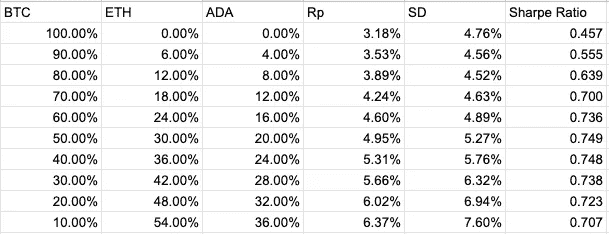

# 加密货币&夏普比率

> 原文：<https://medium.com/coinmonks/cryptocurrencies-the-sharpe-ratio-8b662aa42af9?source=collection_archive---------0----------------------->

## 理解动荡市场中的风险

在顶部(害怕错过), FUD(害怕不确定怀疑)导致在底部弱手卖出，这些都是由我们的情绪驱动的决策。夏普比率看数据，告诉我们什么是我们的情绪所不能的。


Photo by [Nick Chong](https://unsplash.com/@nick604?utm_source=unsplash&utm_medium=referral&utm_content=creditCopyText) on [Unsplash](https://unsplash.com/s/photos/stock-market?utm_source=unsplash&utm_medium=referral&utm_content=creditCopyText)

风险和回报，这两个特征在每个市场都有。

回报是一个我们都很熟悉的概念，我以 100 美元买入比特币，一年后以 130 美元卖出，这意味着年回报率为 30%。

但是风险呢，我们如何定义风险，

> 财务风险是一个结果或投资的实际收益与预期结果或回报不同的可能性

这句话现在可能没有意义，但在文章的结尾会有意义。

我们通常只从回报的角度来看待金融世界，我们让自己的情绪左右我们对风险的看法。


Photo by [Lubo Minar](https://unsplash.com/@bubo?utm_source=unsplash&utm_medium=referral&utm_content=creditCopyText) on [Unsplash](https://unsplash.com/s/photos/risk?utm_source=unsplash&utm_medium=referral&utm_content=creditCopyText)

我们需要量化风险，不仅要看回报，还要看风险调整后的回报。风险调整回报着眼于你的风险和预期回报，并为你提供每单位风险的回报。

夏普比率是行业领先的风险调整回报率工具之一，这也是我们将在本文的其余部分讨论的内容。

首先，我们需要从构建其他一切的基础开始，即数据。

## **数据**

量化风险和回报从数据开始。我们将使用历史价格数据。请注意，我们将使用非常小的样本量，当真正这样做时，重要的是要有大型数据集，以便对我们的计算结果有信心。


Photo by [Luke Chesser](https://unsplash.com/@lukechesser?utm_source=unsplash&utm_medium=referral&utm_content=creditCopyText) on [Unsplash](https://unsplash.com/s/photos/analytics?utm_source=unsplash&utm_medium=referral&utm_content=creditCopyText)

在我们的例子中，我们将使用从 2021 年 1 月 1 日到 2021 年 10 月 1 日的比特币(BTC)、以太坊(ETH)和卡达诺(ADA)的真实每日价格数据。我们将从[辣椒粉](https://coinpaprika.com/) API 中获取这些数据。

试着把下面的一些链接粘贴到你的浏览器中，它们会把价格数据集返回给你。

```
# BTC [https://api.coinpaprika.com/v1/coins/btc-bitcoin/ohlcv/historical?start=2021-01-01&end=2021-01-10](https://api.coinpaprika.com/v1/coins/btc-bitcoin/ohlcv/historical?start=2021-01-01&end=2021-01-10)# ETH
[https://api.coinpaprika.com/v1/coins/eth-ethereum/ohlcv/historical?start=2021-01-01&end=2021-01-10](https://api.coinpaprika.com/v1/coins/eth-ethereum/ohlcv/historical?start=2021-01-01&end=2021-01-10)# ADA
[https://api.coinpaprika.com/v1/coins/ada-cardano/ohlcv/historical?start=2021-01-01&end=2021-01-10](https://api.coinpaprika.com/v1/coins/ada-cardano/ohlcv/historical?start=2021-01-01&end=2021-01-10)
```

这些数据以这样的形式出现，

```
# BTC Price Data 2021-01-01{
    "time_open": "2021-01-01T00:00:00Z",
    "time_close": "2021-01-01T23:59:59Z",
    "open": 28966.95587637,
    "high": 29568.27873174,
    "low": 28812.98178846,
    "close": 29344.67383113,
    "volume": 29395282202,
    "market_cap": 538407186724
 }
```

这里有许多字段，有些是不言自明的，因为开盘价、最高价、最低价、收盘价都与图表烛台有关。我肯定你在比特币基地或币安见过这些。下图显示了这些术语与烛台的关系。


Chart candlesticks and the terms used to describe them

我们将只关注某一天的收盘价，而忽略所有其他价格信息来驱动我们对风险和回报的计算。现在我们有了数据，我们可以看看驱动我们计算的公式。

下面所有的计算都已经在这个 google sheet 上完成，[https://docs . Google . com/spreadsheets/d/1 bzgxvhy 50 dmgkjdwslnh 2 qhgk _ Ga6 _ ge 0 kbs _ SJ ldxo/edit？usp =分享](https://docs.google.com/spreadsheets/d/1BzGxVHy50DMgkjDwSlnH2QhGK_Ga6_gE0kbs_sJLdXo/edit?usp=sharing)。

## 预期回报公式

首先，让我们孤立地看一下 BTC 的数据，看看我们如何量化预期收益和风险。


Our BTC data and the calculated daily return

上面我们已经将从辣椒粉 API 中获取的数据加载到 google sheets 中。我们有日期、价格和返回 BTC 的百分比。

百分比回报 BTC 是一个每日回报，

```
(Todays_Price / Yesterdays_Price) - 1 
```

用上面的一些数字试一试，注意你必须将结果乘以 100 才能得到百分比形式的结果。

我们可以看到，当价格上涨时，我们有正回报，当价格下跌时，我们有负回报。

为了得到我们的**预期收益**,我们得到所有每日预期收益的平均值。当我们计算时，结果是 3.18%。在我们的例子中，这表明根据我们之前的数据，我们可以预计比特币每天增加 3.18%。


Photo by [Jievani Weerasinghe](https://unsplash.com/@jievani?utm_source=unsplash&utm_medium=referral&utm_content=creditCopyText) on [Unsplash](https://unsplash.com/s/photos/bitcoin-market?utm_source=unsplash&utm_medium=referral&utm_content=creditCopyText)

## 风险

风险是用我们每日回报数据的标准差计算的。让我们从标准差的定义开始。

> 标准差是衡量数据集相对于其平均值的离差的统计数据。

这实际上意味着标准差告诉我们资产的波动性，我会给你一个例子，希望有助于澄清。

假设我们有两项资产资产 A 和资产 B，我们有关于这些资产的以下信息，

*   资产 A 的预期日收益率为 7%
*   资产 B 的预期日收益率为 4%
*   资产 A 的标准差(波动性)为 10%
*   资产 B 的标准差(波动性)为 1%

如果我们看一下资产 A，10%的标准差意味着在给定的一天，该资产可能会在平均值(预期日收益率 7%)的基础上上下浮动 10%,这样我们得到的范围是-3%到 17%。

另一方面，资产 B 的标准差为 1%，预期日收益率为 4%，因此我们的收益区间为 3%-5%。


Photo by [Etienne Martin](https://unsplash.com/@etiennemartin?utm_source=unsplash&utm_medium=referral&utm_content=creditCopyText) on [Unsplash](https://unsplash.com/s/photos/bank-of-england?utm_source=unsplash&utm_medium=referral&utm_content=creditCopyText)

基金经理会考虑这两个范围，并承认虽然资产 A 提供了更大的预期回报，但它也代表了更大的风险。

资产 A 的范围下限是-3%，而资产 B 的范围下限是 3%。在这种情况下，资产 B 的表现会比资产 a 好。

*实际上，上面讨论的范围有 68%的机会出现，这代表 1 个标准偏差。深入探讨这一点超出了本文的范围，但是请看一下* [*这里的*](https://en.wikipedia.org/wiki/68%E2%80%9395%E2%80%9399.7_rule) *以了解更多信息。*

那么我们如何计算标准差呢？

## 风险公式又名标准差

标准偏差查看值及其与样本集平均值的偏差。这有助于我们了解结果是否紧密聚集在一起，这将代表低波动性和低标准差，或者分散开来，导致高波动性和高标准差。

这种波动性代表资产风险，因为它意味着资产价格可能会大幅波动。

人口标准偏差的方程式如下:


Standard Deviation Equation

在哪里，

σ =标准差
*xi* =数据点值
μ =数据点平均值
N =数据点数

对于比特币来说，这相当于 4.76%，结果见单元格 B18。单元格 B18 使用内置函数 STDEV。p，我已经在 B19 单元格完成了长手版本。如果你想了解更多关于标准差公式的信息，请点击[这里](https://www.khanacademy.org/math/statistics-probability/summarizing-quantitative-data/variance-standard-deviation-sample/a/population-and-sample-standard-deviation-review#:~:text=Standard%20deviation%20measures%20the%20spread,data%20point%20and%20the%20mean.&text=If%20the%20data%20is%20being,number%20of%20data%20points%2C%20N.)。

Balancing Risk and Return

## 夏普比率

现在我们有了计算夏普比率所需的组件。夏普比率衡量投资组合/资产的风险回报。它通过查看投资组合的超额回报，并除以投资组合的波动率来实现这一点。

```
 (excess return of the portfolio)
Sharpe Ratio = ----------------------------------
                  (volatility of the portfolio)
```

对此的注释如下:


Sharpe Ratio Equation

在哪里，

S =夏普比率
Rp =预期收益
Rf =无风险收益
σp =标准差

我们已经研究了预期回报和标准差，但是我们还没有定义“无风险回报”。无风险回报是指如果我们把钱投资到零风险的资产上，我们可以得到的回报。

在现实中，没有什么是零风险的，但在金融领域，政府债券被认为是无风险的，因此，通常被用作衡量当前无风险利率的标准。


Government bond from 1976 at 8% interest

政府债券实际上是对政府的一种贷款，在贷款期间，政府债券会支付一定的利率，并在贷款结束时偿还本金。

为了计算“投资组合的超额回报”，我们必须从预期回报中减去无风险回报，因为这是我们在不承担任何风险的情况下可以获得的回报率。

在我们的例子中，我们将假设 1%的无风险回报率，参见[这里](https://www.bloomberg.com/markets/rates-bonds/government-bonds/us)一些美国国债收益率的真实例子。

## 比特币的夏普比率

使用上面计算出的数字，

```
Sharpe Ratio = (Rp - Rf) / σpSharpe Ratio = (3.18 - 1) / 4.76 = 0.458
```

夏普比率越高，你承担的每单位风险的回报就越高。计算出比特币的夏普比率后，我们可以继续计算其他加密资产，看看它们如何比较。

我在同一时期为以太坊和卡尔达诺做过这个。预期收益和标准偏差见单元格 C16，D16，C18，D18。

**以太坊**

预期收益= 6.58%
标准差= 8.06%
夏普比率= 0.692

**卡尔达诺**

预期收益= 6.95%
标准差=11.07%
夏普比率= 0.537

这意味着以太坊在那个时期提供了最大的单位风险回报，因为它的夏普比率为 0.692，高于卡尔达诺的 0.537 和比特币的 0.458。


Ethereum — Photo by [Zoltan Tasi](https://unsplash.com/@zoltantasi?utm_source=unsplash&utm_medium=referral&utm_content=creditCopyText) on [Unsplash](https://unsplash.com/s/photos/ethereum?utm_source=unsplash&utm_medium=referral&utm_content=creditCopyText)

*请注意，本例的样本量为 10 天，因此这些结果没有实际价值，您需要使用完整的历史价格数据集才能对结果有信心*

## 文件夹

我们计算了每单位风险中哪种资产能给我们带来最好的回报。现在的问题是，当我们混合搭配这些资产时会发生什么。我们能得到更高的夏普比率吗？

简单的回答是肯定的。


Optimising our portfolio can increase our risk-adjusted returns

为了能够计算出包含多种资产的投资组合的夏普比率，我们还需要做一些额外的步骤。

## 资产之间的相关性

首先，我们需要计算出我们投资组合中资产之间的相关性。实际上，这是在问当 BTC/ETH/ADA 的价格上升/下降时，其他资产会做什么。

相关性在-1 和 1 之间变化，其中 1 表示强正相关，即。如果 BTC 价格上涨，以太网价格也会上涨。

-1 表示强负相关，即。如果 BTC 价格上涨，那么它的价格就会下跌。

0 表示无相关性，即如果 BTC 价格上涨，对 ETH 价格没有影响。


Example of correlation in graph format

计算 2 项资产之间的相关性，以涵盖我们需要计算的 3 项资产的所有组合，

BTC/联邦理工学院
BTC/阿达
联邦理工学院/阿达

实现这一点的相关方程如下:


Pearson Correlation Equation

在哪里，

*x̄=资产 a 在第一天的收益* 伊=资产 a 在该时间段内的平均收益
*伊=资产 b 在第一天的收益* ȳ =资产 b 在该时间段内的平均收益

这导致了，

BTC/ETH 相关性= 0.176
BTC/ADA 相关性= 0.277
ETH/ADA 相关性= 0.605

计算我们的投资组合风险需要这些相关性。参见使用内置函数 CORREL 的单元格 B24、C24、D24 和使用长手公式的单元格 B25、C25、D25。

## 投资组合风险

投资组合风险仍然由使用标准差的投资组合的波动性来表示，但是该等式略有变化，以考虑各种资产及其相关性。

投资组合标准差的计算方法如下:


在哪里，

*w =* 资产在投资组合中的权重σ =资产的标准差
c =两项资产之间的相关性

下标表示哪个资产与哪个符号相关联。有关此计算的示例，请参见单元格 B28。


Photo by [Tamara Gak](https://unsplash.com/@tamara_photography?utm_source=unsplash&utm_medium=referral&utm_content=creditCopyText) on [Unsplash](https://unsplash.com/s/photos/risk?utm_source=unsplash&utm_medium=referral&utm_content=creditCopyText)

## 投资组合回报

投资组合的回报很容易计算，用一项资产的预期回报乘以它在投资组合中的权重。

例如，我们持有 50%的 BTC、30%的瑞士联邦理工学院和 20%的爱达。根据以上数据，这些资产的预期回报率分别为 3.18%、6.58%和 6.95%。因此，

预期投资组合收益=(0.5 * 3.18)+(0.3 * 6.58)+(0.2 * 6.95)
预期投资组合收益= 4.95%

有关此计算的示例，请参见单元格 B27。

## 资产加权

资产的权重会影响风险和回报。通过改变权重，我们可以探索风险和回报是如何变化的。然后我们可以算出哪个投资组合能给我们带来最好的风险调整回报。

下面是一个测试各种权重的小模拟，实际上计算机会运行这些计算并测试每一个可能的投资组合。



Calculations of the Sharpe Ratio as we vary portfolio weighting

Rp =投资组合预期收益
SD =投资组合标准差(风险)

我们可以看到，我们从 100% BTC 的投资组合开始。然后，我们逐步改变投资组合，将 BTC 减少 10%，将 ETH 和 ADA 分别增加 6%和 4%。

随着我们将更多的 ETH 和 ADA 纳入我们的投资组合，我们的回报会上升(Rp ),但我们的风险也会上升(SD)。这些数字使我们能够计算每个投资组合的夏普比率。

50% BTC、30% ETH 和 20% ADA 的分配给我们最高的夏普比率 0.749。这意味着这个投资组合给了我们最大的单位风险回报。

如果我们将其与上面计算出的个人夏普比率进行比较，我们也可以击败所有这些比率。ETH Sharpe 比率最高，为 0.692，表明多样化可以增加风险调整后的回报。

实际上，有多个投资组合的夏普比率高于 0.749。一个例子是 45% BTC、45% ETH、10% ADA，其夏普比率为 0.774。在现实世界中，我们会检查所有的可能性，以确保我们有最好的可能权重。

## 结论

你现在有工具来看待资产和投资组合，并通过风险和回报的角度来看待它们。数据驱动我们的决定，而不是我们的情绪。

上面的计算给了我们基于历史价格数据的洞察力。数据集越大，我们对我们的结果越有信心，这意味着在相对较新的硬币上运行这些模拟可能是不明智的。拥有多年价格数据的加密货币最适合这些方法。

夏普比率是许多用来观察风险的工具之一，它现在就在你的工具箱里，但要小心，不要把它当成一个充满钉子的世界里的锤子。

> 以上都不是财务建议，其目的纯粹是教育

## 也阅读

[](/coinmonks/crypto-trading-bot-c2ffce8acb2a) [## 最佳免费加密交易机器人——前 16 名比特币交易机器人[2021]

### 2021 年币安、比特币基地、库币和其他密码交易所的最佳密码交易机器人。四进制，位间隙…

medium.com](/coinmonks/crypto-trading-bot-c2ffce8acb2a) [](/coinmonks/best-crypto-signals-telegram-5785cdbc4b2b) [## 最佳 6 个加密交易信号电报通道

### 这是乏味的找到正确的加密交易信号提供商。因此，在本文中，我们将讨论最好的…

medium.com](/coinmonks/best-crypto-signals-telegram-5785cdbc4b2b)