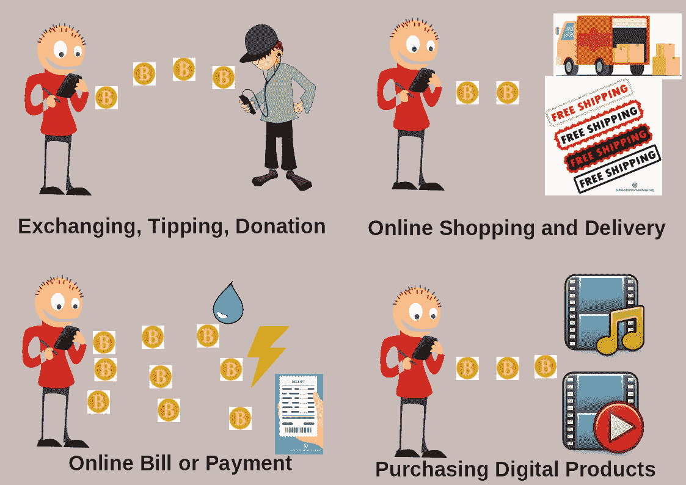

# 面向用户的加密货币 101:第 1 章金融和财富的自由

> 原文：<https://medium.com/coinmonks/cryptocurrency-101-for-users-chapter-1-the-freedom-of-finance-and-wealth-5978cb49f123?source=collection_archive---------6----------------------->

# 数字货币

由于信息和通信技术的发展，货币可以数字化和在线化。数字化意味着货币可以在计算机上实现，过程可以自动化和快速化。在线意味着货币可以在允许交易和其他用途的互联网上使用…