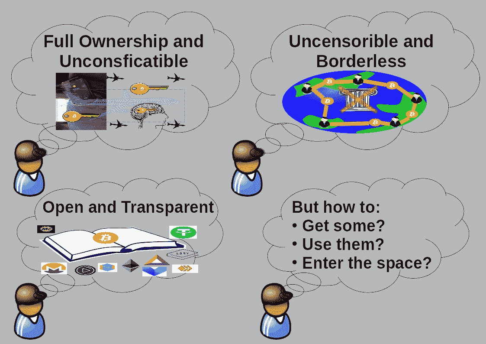

# 面向用户的加密货币 101:第 2 章进入空间

> 原文：<https://medium.com/coinmonks/cryptocurrency-101-for-users-chapter-2-entering-the-space-7419c5651d67?source=collection_archive---------2----------------------->

## 带着钱包进去

你可能一直在关注新闻，也可能一直在关注价格。一个有趣的故事来自科技学院的[伊万的学生，该学生学习了如何编写智能合同和其他加密货币相关技术，但不知道如何购买硬币、接收硬币、发送硬币和使用硬币。这个…](https://academy.ivanontech.com/)