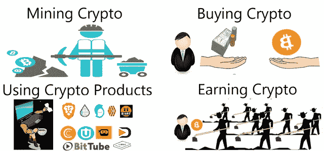

# 面向用户的加密货币 101:第 4 章无法购买时如何获得

> 原文：<https://medium.com/coinmonks/cryptocurrency-101-for-users-chapter-4-how-to-obtain-if-you-cannot-buy-c93375c8d1a4?source=collection_archive---------0----------------------->

获得加密货币的两种默认方式是采矿和从矿工那里购买。看完三章，买加密货币币应该不陌生了。然而，你可能会因为各种原因而选择不购买，例如害怕损失，仍然不习惯加密货币，或者你根本没有一分钱。本章介绍其他…