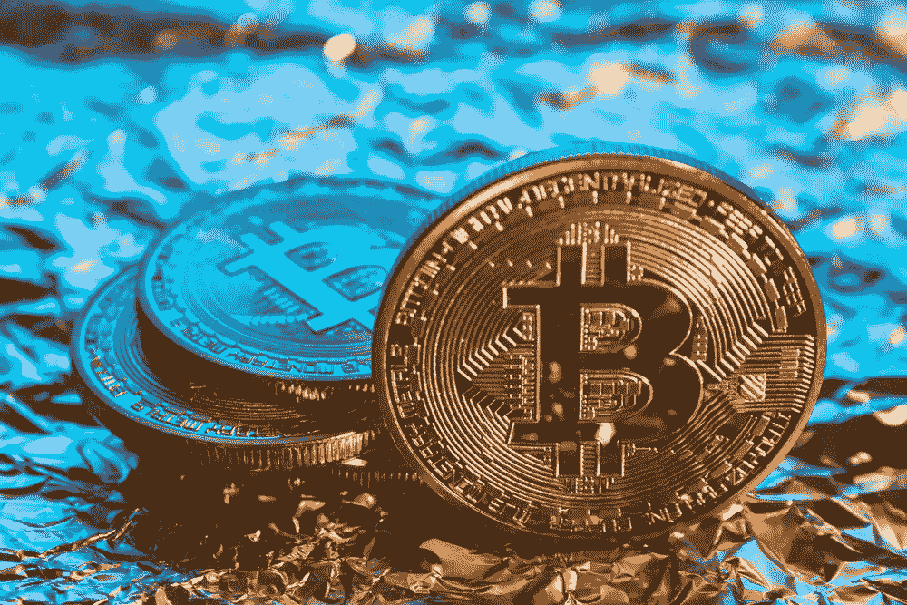
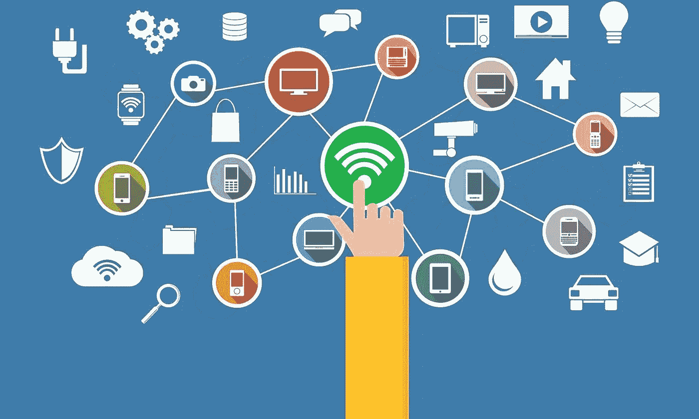
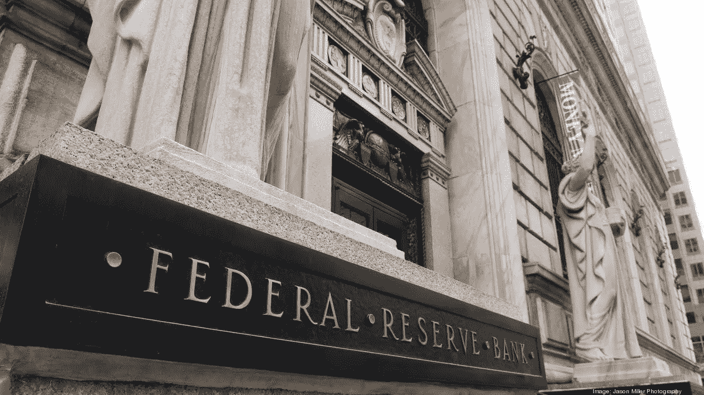
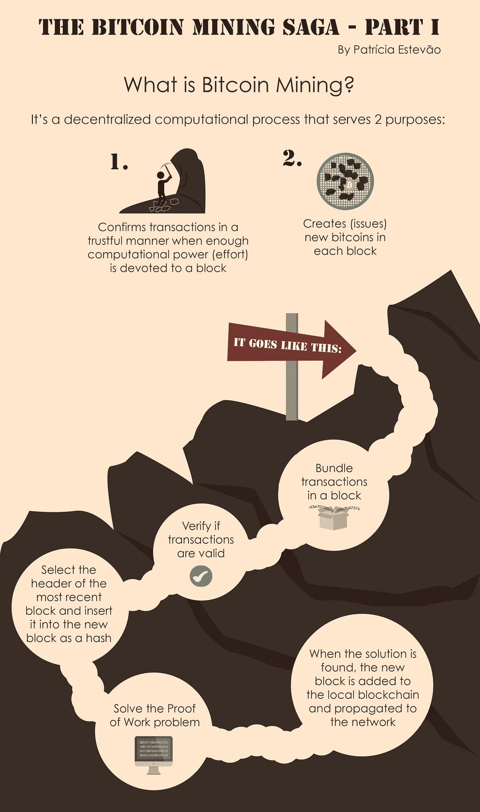
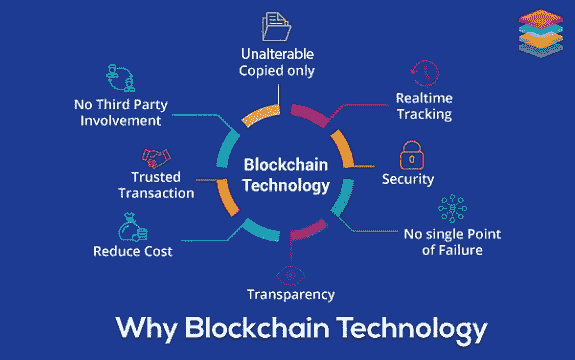

# 加密货币:新经济

> 原文：<https://medium.com/coinmonks/cryptocurrency-a-new-economy-78fa2f3cefc0?source=collection_archive---------2----------------------->

A New Economy

我们目前生活在人类已知的最迷人的时代之一。我们正处于数字前沿的时代，互联网是一个不断发展的纽带。

凭借互联网的巨大创造力，每个人都可以通过智能手机设备在指尖接触到一个广阔的新世界。我们被赋予了如此多的未知发现的机会，以及未知的危险。互联网是一种强大的工具，它永远改变了人类文明。

The Digital-verse

输入加密货币。数字货币将彻底改变我们对货币价值、交换、权力和效用的理解。然而，大多数人只知道它是比特币。

比特币是在 2008 年毁灭性的经济房市崩溃后出现的(我知道很多人的生活都受到了影响，包括我自己和我的家人)。比特币的创造者旨在实现至少一个巨大的目标:通过消除这种金融动荡的根本原因:第三方、中央集权的金融机构，如银行和政府，来补救和防止这种经济崩溃永远不再发生。

看这里比特币白皮书:[https://bitcoin.org/bitcoin.pdf](https://bitcoin.org/bitcoin.pdf)

中央金融当局制造了一大堆问题，如通货膨胀、债务、经济不稳定、费用、利息等。因此，每个人都依赖或信任这些金融机构来处理、保护和控制每个人的钱。

A Central Bank

比特币为我们引入了一个技术系统，使我们有可能避免对中央金融机构的信任和依赖，简而言之，创建了一个所谓的点对点网络和一个工作证明系统，不再需要第三方(如银行)来管理货币交易。

截至 2017 年，加密货币已经成为主流文化，受到了每个人的关注，这是理所当然的。数字货币背后的潜在技术比以往任何时候都更加现实。

比特币被设计用来防止通货膨胀的发生。它的市场资本为 21，000，000 枚硬币，这意味着只有该数量的硬币才能有有限的供应。反过来，这意味着比特币在达到那个数量后不能继续被复制，使其无法内在地膨胀价值。

比特币复制的一个主要关键因素是创造比特币的方法。加密货币是做出来被开采的，这是外行人对实际过程的说法。在最基本的理解中，它只是一个为计算机系统设计的算法问题，任何人都可以自由地为大规模采矿作业做出贡献。见下图:

What is Bitcoin mining?

所有这些都促成了经济体系中一个不可思议的转变:去中心化。去中心化是将权力归还给拥有比特币的所有个人的集体。这有点像经济民主，恢复所有人的权力。如果比特币有任何想要的变化，如更新和升级，必须得到整个网络大多数人的同意。

考虑到所有人，比特币可以在全球范围内被所有国家的所有人接受，为通过数字技术编织在一起的全球经济带来活力，而不受法定货币的限制。因此，在接受数字货币及其未来发展(尚未实现)后，所有类型的交易都将变得快速、简单、便宜。)

> [在您的收件箱中直接获得最佳软件交易](https://coincodecap.com/?utm_source=coinmonks)

这将最终引领我们进入另一个完全基于服务和效用的数字硬币阶段。

It Speaks For Itself

已经有无数用区块链技术创造的数字货币提供了除了加密的实用价值之外的其他功能。有些硬币还提供各种各样的服务和用途，不仅仅作为货币使用。参见:[底层](https://substratum.net/tag/blockchain/)， [Siacoin](https://sia.tech/) ， [PowerLedger](https://powerledger.io/) ，[假人](https://golem.network/)

这些新型的数字硬币最终可能会满足我们大部分的实用需求。比如互联网、计算机硬件、数字云存储、广告、社交网络，甚至我们生活中的基本元素，比如电力、食物和燃料。我强烈建议每个人了解加密货币如何成为我们日常生活的一部分。

在未来几十年里，我们可能正处于重大经济转变的边缘。因此，至少值得考虑一下世界未来的潜在可能性。

**我不是财务顾问，这也不是投资的财务建议*