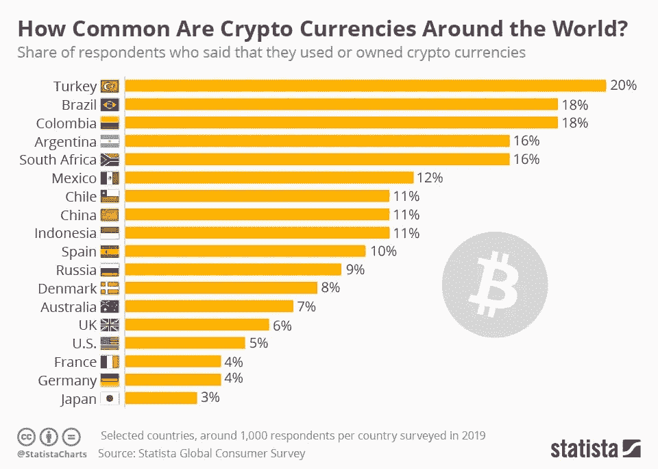

# 各国采用加密货币的情况

> 原文：<https://medium.com/coinmonks/cryptocurrency-adoption-by-country-d15e9fea0d94?source=collection_archive---------0----------------------->

Factors Driving Adoption Worldwide

> ***本帖将探讨加密货币的使用/拥有率最高和最低的地方以及原因。***

# 采用率最高的国家

## 火鸡