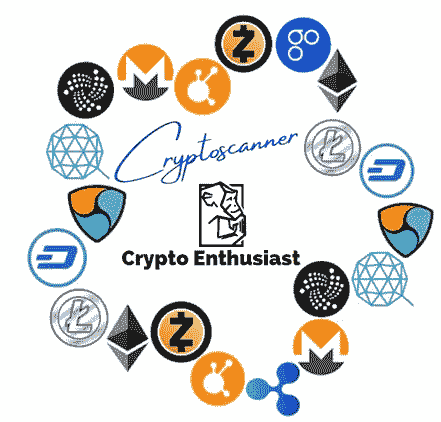
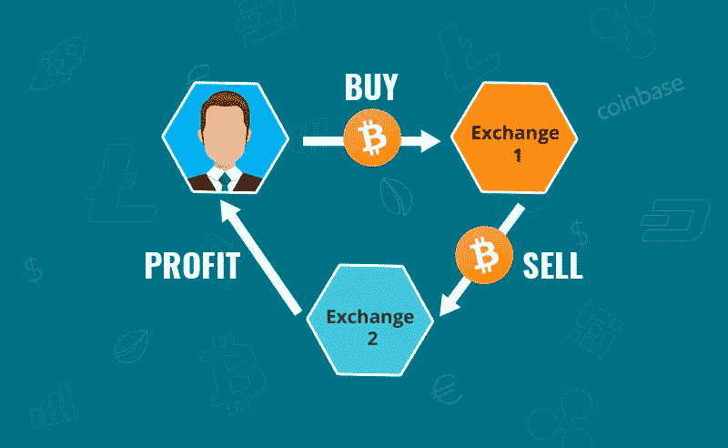
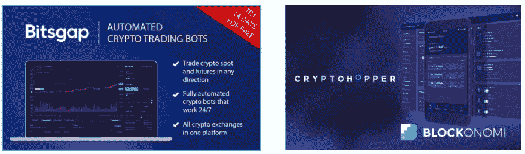
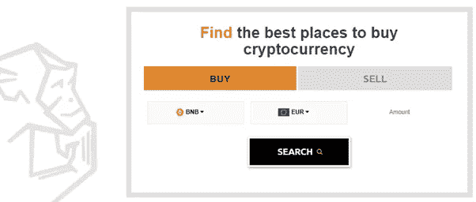
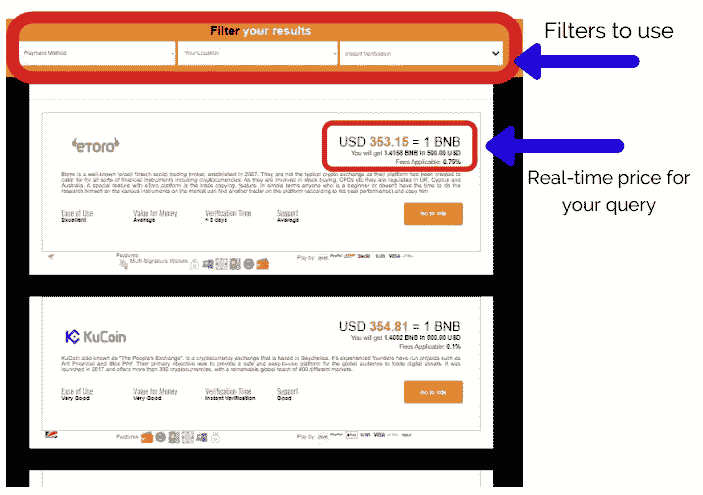
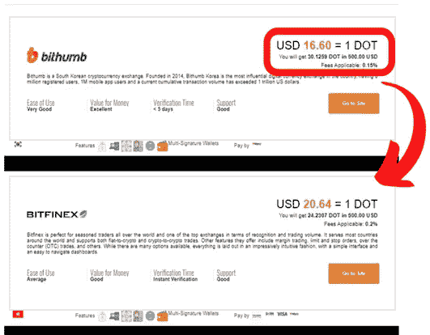

# 简单几步加密货币套利！

> 原文：<https://medium.com/coinmonks/cryptocurrency-arbitrage-in-a-few-simple-steps-da467ad3ae9c?source=collection_archive---------5----------------------->

我们都想赚点外快，给自己或我们爱的人买些别致的东西。

加密货币带来了许多机会，包括长期投资、短期投资、赌注、联营等等。加密世界中的机会是无限的，每天都有更多的机会诞生。

加密货币从来不是也永远不会是一个沉闷的话题。每天都有新硬币、新技术推出，这使得密码爱好者渴望抓住这些机会。

今天我们将谈论一个较少讨论的话题和我们身边存在的机会— **加密货币套利**。

不要让套利这个词吓到你，因为这个概念非常简单。套利是指从一个市场以一个价格购买一项资产，然后立即在另一个市场卖出，从差价中获利的行为。

市场上存在不同资产类别的套利机会，包括**股票、大宗商品、货币、债券以及最后但同样重要的加密货币。**

套利机会的出现是由于金融市场的缺陷，如价格更新的延迟，导致套利者的最佳机会。这同样适用于加密货币套利，由于加密货币交易所的不足，机会出现了。

不同交易所之间的加密货币价格差异更经常出现，因为加密货币是分散的，因此在任何给定的时期都没有标准或全球的加密货币价格。

加密货币(除了系绳)不与美元或任何其他法定货币挂钩，也不与特定国家或交易所挂钩。

不同交易所的供应和需求因时间和市场而异，导致加密货币的价格在交易所之间一直波动，尤其是在市场波动较大的时候。

为了给出一个更清晰的画面，每个交易所都为特定的加密货币提供自己的汇率。在大多数情况下，所有交易所的价格都是一样的，但有时会有大约 5-10%的偏差，最大偏差为 20%。

# 加密货币套利能赚钱吗？

如前所述，加密货币是套利的最佳资产之一，它是最不稳定的，这使其成为套利者赚钱的有吸引力的资产。

和所有事情一样，这需要一些时间和技巧，但是有了正确的技巧和工具，就有可能赚大钱。任何事情都有风险，所以如果处理不当，你可能会赔钱而不是赚钱。

加密货币套利的主要风险是由于这些机会在短时间内存在，主要是在市场上有大量买卖时。

这给套利者留下了很短的时间来采取行动并抓住机会。速度是一个必要的属性，事实上，执行套利的最佳方式是让编程的机器人识别市场上的这些机会，代表你买卖资产。

在执行套利之前，要考虑的另一个重要因素是准确了解使用不同交易所时你将产生的费用，因为这些费用将从产生的任何利润中扣除。

# 如何才能找到加密货币套利机会？

如果你使用的是交易机器人，它们会代表你自动执行交易。令人头痛的是设置它们并给它们编程。除非你是一名开发人员，或者具备 Python 等编程语言的高级知识，否则开发一种算法来识别这些暂时的不对称性，需要时间和专注，因为你必须学会如何编写自己的交易策略。

对于那些想要使用交易机器人但没有必要的编码技能的人来说，一个更简单的选择是使用平台，如 [Bitsgap](https://bitsgap.com/?ref=7c420c38) 和 [Cryptohopper](https://www.cryptohopper.com/?atid=23708) ，这些平台提供已经设计好的交易机器人，每月收费。

虽然不需要编码技能，但设置起来还是有点技术性，因为你必须通过一个 API[**与交易所集成。**](https://www.mulesoft.com/resources/api/what-is-an-api)

执行套利而不产生额外费用的最简单方法是手工操作。由于加密货币市场的差异巨大，这通常为套利者提供了足够的时间来获利。

首先，手动套利应该只在最具流动性的加密货币上尝试，如**比特币、以太坊和 XRP** 以及交易量大的交易所——最具流动性的加密货币和交易所可以在[**coin market cap**](https://coinmarketcap.com/)**上找到，分别列出了过去 24 小时的交易量。**

**这样你就能保证在几秒钟内买卖你的资产，因为会有流动性，你不能浪费时间等待你的订单被执行。**

# **有什么简单的工具可以让我手动加密套利吗？**

**是的，有，而且它们使用起来非常简单。**

**[**Cryptoscanner**](https://www.cryptoenthusiast.net/cryptoscanner)是一个搜索引擎，集成了最顶端的 15 个流动性交易所，它将帮助你通过四个简单的步骤找到这些交易所之间的任何价格差异。**

1.  **选择“买入”或“卖出”。**
2.  **选择您想要使用的加密货币—标记为使用最具流动性。**
3.  **选择你将使用的法定货币。**
4.  **设置金额。如果你购买加密货币，你必须填写你想使用的法定货币的数量，否则(出售)你要填写你出售的加密货币的数量。**

****

**一旦你点击**搜索**，加密扫描仪将返回所有加密货币交易所的实时价格，为你愿意花的钱提供最大回报的交易所排在列表的最前面。交易所的费用也被取回。**

**您有以下过滤器可供选择:**

*   **您首选的**付款方式。****
*   ****您的位置** —加密货币交易所支持不同国家。**
*   ****即时验证** —取决于加密货币交易所需要多长时间来验证您的账户。**

****

**作为套利者，你的工作是以尽可能低的价格购买加密货币——位于列表顶部的加密货币交易所，然后在给你最高价格的交易所转售——位于列表最后的加密货币交易所。**

**你也可以选择使用搜索引擎的“出售”功能，在出售的时候找到哪个交易所会给你最多的东西。**

# **密码扫描仪上的套利机会**

**套利机会的一个很好的例子是 Polkadot。在 Bithumb Global 上，DOT**卖 16.60 美元，而在 Bitfinex 上卖 20.64 美元。****

**用同样数量的法定货币(500 美元)，当时你可以在 Bithumb Global 上得到 30 个硬币，在其他交易所得到 24 个硬币。这意味着当你从 Bithumb 购买 Polkadot 时，你将得到超过 20%的折扣。**

**套利者会从 Bithumb Global 买入，然后迅速在其他交易所转售，迅速获得可观的资本回报。**

****

**虽然现在大多数加密货币交易所都提供即时验证流程，并允许你在提供所有细节后立即购买加密货币，但最好提前开户。这会让你的过程更顺利——别忘了手动套利的关键是速度。**

**我们建议您熟悉[**Cryptoscanner**](https://www.cryptoenthusiast.net/cryptoscanner)，查看搜索引擎支持的交易所，并已经设置好您的账户。**

**不要忘记考虑适用的费用。**

****在市场高度波动的时候，回到 Cryptoscanner，做一个快速搜索。如果在同一枚硬币上发现明显的价格差异，这意味着存在套利机会。****

# **套利机会的结论**

**加密货币中的 Artbitrage 机会非常普遍。你打算如何做取决于你的技能和你可支配的时间。**

**机器人无疑是最有效的方法，然而这是一种更复杂的方法，尤其是对门外汉来说。**

**执行加密货币套利的另一个选择是使用加密货币搜索引擎，如 [Cryptoscanner](http://www.cryptoenthusiast.net/cryptoscanner) 。**

**只需几个步骤，搜索引擎就会精确定位哪家交易所和加密货币有折扣。**

****你要试一试吗？****

****

****披露:附属链接包括在内****

## **也阅读**

** [## 加密套利指南:初学者如何赚钱

### 加密货币套利是一种利用价格差异获利的交易类型。这些价格…

blog.coincodecap.com](https://blog.coincodecap.com/crypto-arbitrage-guide-how-to-make-money-as-a-beginner)  [## Coygo 评论:加密套利和交易

### 在本文中，我们将回顾 Coygo，这是一个用于加密货币套利、交易和投资组合跟踪的强大工具…

blog.coincodecap.com](https://blog.coincodecap.com/coygo-review-crypto-trading-and-arbitrage)  [## Bitsgap 评论 2021 |加密期货交易机器人和套利

### 在本文中，我们将回顾 Bitsgap，这是一个满足您所有交易需求的一站式加密交易平台。它…

blog.coincodecap.com](https://blog.coincodecap.com/bitsgap-review)  [## Pionex 套利机器人|通过现货期货加密套利获利

### Pionex 是最受欢迎的交易机器人提供商之一，它最近推出了加密套利机器人。在这个…

blog.coincodecap.com](https://blog.coincodecap.com/pionex-arbitrage-bot)**