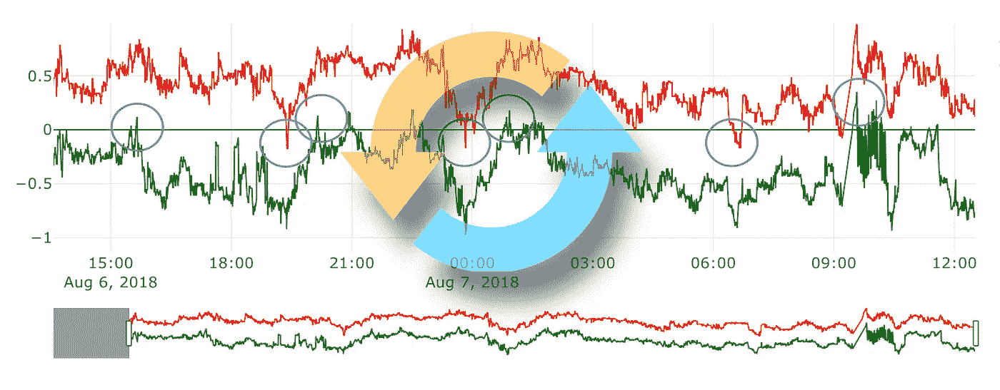
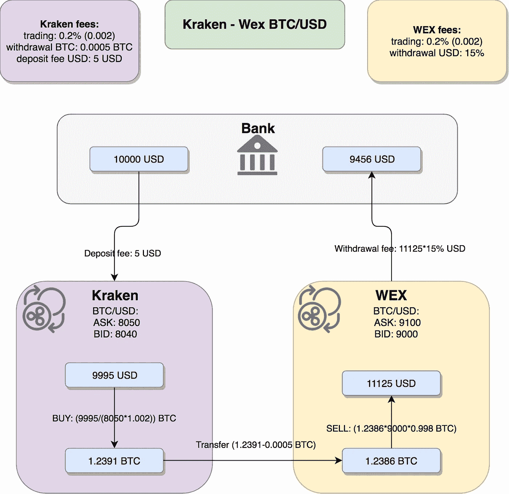
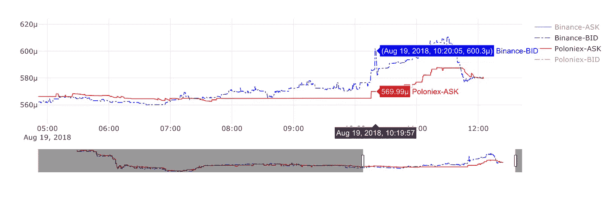
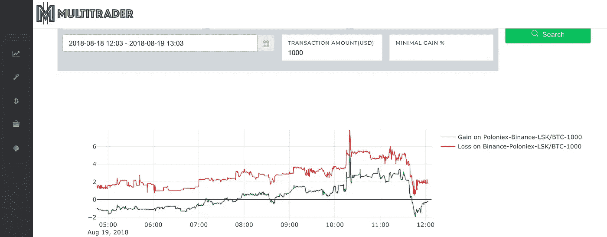
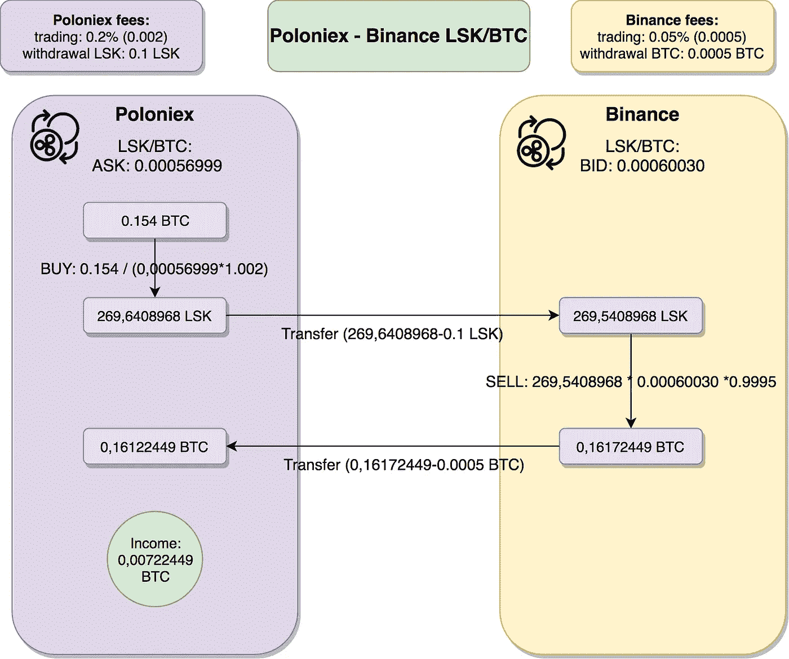
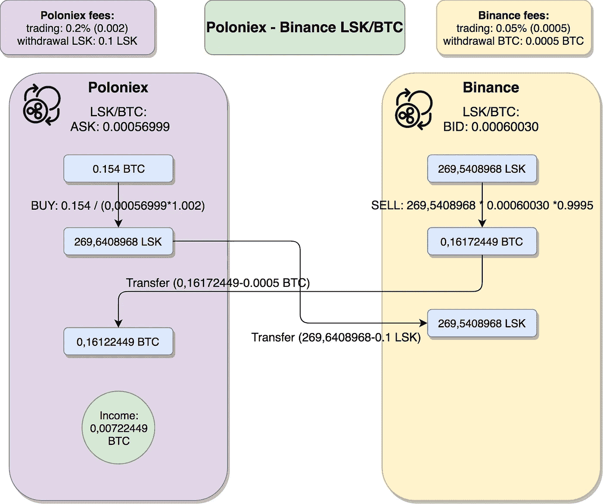
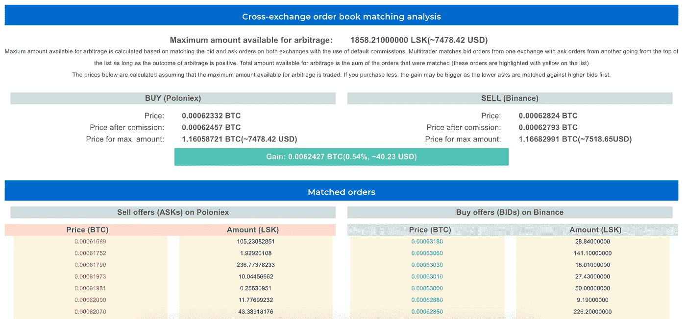

# 加密货币套利策略——第一部分

> 原文：<https://medium.com/coinmonks/cryptocurrency-arbitrage-strategies-part-i-20e9dd327919?source=collection_archive---------1----------------------->

## 本文介绍了加密货币套利及其收益的基本知识，并给出了几个例子。它还详细描述了我称之为“循环”的套利策略。

# 介绍

这个想法是在交易所 A 买便宜的，转移到交易所 B，在那里你可以卖更多，然后卖出。最后，要完成整个循环，请将您从交易所 B 收到的交易信息发送到交易所 a。重复…

本文是该系列的第一篇。我想分享我在开发加密货币套利平台(我称之为 MultiTrader)时积累的知识和经验。您可以在[https://www . multitrader . io](https://www.multitrader.io)上了解更多信息。在接下来的部分，我还想介绍另外两个策略:振荡器和红凤凰。

# 艰难的开端

当我第一次注意到在 Poloniex 上可以比在币安上买到更便宜的比特币时，对我来说简直是一场爆炸。我以为什么东西坏了。这两个交易所的用户界面都不能足够快地显示价格，或者类似的情况。我根本不相信这是可能的。怎么会这样我确信比特币只有一个价格。不一定知道是谁设置的，但我确定只有一个。我花了一些时间才明白，比特币是在许多交易所交易的。并且每个交易所都有独立于其他交易所的自己的价格。并且交换不同步！有时你会看到一个交易所提供的硬币比其他的多得多。这就是套利的机会！

我一明白这是可能的，就想:“我会在 Poloniex 上低价买入比特币，然后把它送到币安，以更高的价格卖出”。在这样做了十亿次之后，我终于可以买我的兰博了…要是这么容易就好了。对于每一笔买卖交易，我们都需要支付佣金。此外，当转移资金时，我们要支付取款费。这意味着，在做了数学计算之后，为了使这种类型的套利有利可图，价格差异需要相当大。撤退需要时间。有时候，从你从一个交易所提取资金到你可以在第二个交易所用这些资金进行交易之间需要几个小时。在此期间，套利机会可能已经消失了…但让我们更深入地探讨这个问题，首先让我们定义基本概念。

# 什么是加密货币套利

[投资后套利的定义](https://www.investopedia.com/ask/answers/04/041504.asp):

> 套利基本上是在一个市场买入一种证券，同时在另一个市场以更高的价格卖出，从暂时的差价中获利。这被认为是投资者/交易者的无风险利润。

# 从套利中获利

让我们试着定义从套利交易机会中获利的真正含义。为此，我希望您分析下图:

Illusionary profit from the cryptocurrency arbitrage

*   我们刚刚发现了绝佳的套利交易机会——我们可以在北海巨妖以 8050 美元买入 BTC，在 Wex 以 9000 美元卖出。我们要发财了！。
*   我们把 10000 美元存到北海巨妖，在支付了存款费用后，我们还有 9995 美元。
*   然后用我们所有的美元买入北海巨妖的 BTC，得到 1.2391 BTC。
*   从北海巨妖到 WEX 撤回 BTC 后，我们有 1.2386 BTC，因为我们必须支付北海巨妖撤回费。
*   我们正在 Wex 上以美元出售我们的 BTC。我们发财了！我们有 11125 美元。比我们开始时多了 1125 美元。这是生意！我们开始考虑重复几次来买我们的兰博。
*   但是他们的钱仍然在 WEX 身上。我们正在检查取款费用，然后砰！啊，马安…这太疯狂了。
*   那些人要求 15%的美元提款。我们没有变得更富，而是变得更穷。取款后，我们有 9456 美元。我们刚刚损失了 544 美元。

这个生动的例子说明，不要看你套利操作的一些中间步骤。在中途我们可能比开始时拥有更多的(绝对数字)。当我们的基础资本回到起点时，当它完成整个循环并产生一些利润时，我们应该计算套利交易的利润。

 [## 最佳免费加密交易机器人——前 16 名比特币交易机器人[2021]

### 2021 年币安、比特币基地、库币和其他密码交易所的最佳密码交易机器人。四进制，位间隙…

medium.com](/coinmonks/crypto-trading-bot-c2ffce8acb2a) 

# 基本“循环”套利

我认为理解这一点的最好方法是通过一些真实的案例。让我们看一下图表:

LSK/BTC price comparison — Poloniex — ASK price, Binance — BID price

它代表 2018 年 8 月 19 日早上 5 点到晚上 12 点在两个交易所(波兰和币安)以 BTC (LSK/BTC 对)表示的 LSK 价格。红线代表波洛涅克斯的要价——这意味着我们需要为波洛涅克斯的 LSK 支付多少钱。蓝线是币安的出价——这是我们的 LSK 在币安能得到的价格。这些价格不包含交易所的交易费用。

凌晨 5 点左右，一切正常，波洛涅克斯的要价高于币安的出价。然后从早上 8 点左右开始，币安的价格开始上涨，直到 11 点 30 分左右，价格还高于波兰交易所。在差价最大的时刻——大约 10:10，波洛涅克斯的要价是 0.00056999 BTC，而币安的出价是 0.00060030。相差超过 5%!

请记住，这些只是股票价格，你需要支付的实际价格取决于你的订单大小。你还需要记住交易佣金。这就是多交易者套利分析发挥作用的地方——它根据你提供的交易规模进行全面的[交叉交易订单匹配](https://www.multitrader.io/cross-exchange-order-book-matching/):

MultiTrader arbitrage analysis for Poloniex — Binance LSK/BTC on 19th August 2018

在上面的截图中，您可以看到 1000 美元交易规模的套利分析。y 轴代表套利的百分比收益。绿线代表当你在波洛涅克斯买入，在币安卖出时的收益%。红线代表相反方向的损失值——如果你在币安买进，在波洛涅克斯卖出，你会损失的百分比。如果增益的值为负，损失的值为正，这就是为什么红线高于 0。在设计多交易者图表时，我选择了相反方向的亏损，而不是盈利，因为这对我将在另一篇文章中描述的红凤凰套利更有用。无论如何，正如你所看到的，我们的套利收益在上午 10:10 最高，达到 5%！这个价值已经包括了交易佣金，但是不包括提现费。

# 详细分析

正如你在套利分析屏幕上看到的，我假设单笔交易的规模是 1000 美元，大约是 0.154 BTC。

Loop arbitrage

为了进行计算，我们需要考虑佣金——当我们在 Poloniex 上购买时，我们需要支付 0.2%的交易费(这将增加我们需要支付的金额——因此我们需要将要价乘以 1.002)，当我们想在币安上出售时，我们将支付 0.05%的交易费(这将减少我们获得的金额——因此我们需要将出售时的价格乘以 0.9995)。让我们一步一步地完成这个流程:

*   我们从波洛涅克斯的 0.154 BTC 开始
*   我们把所有的 0.154 BTC 都花在了波洛涅克斯上，尽可能多地购买 LSK。我们得到 269，6408968 LSK
*   现在，我们正把我们的 LSK 从波兰撤到币安。大多数交易所的取款费是不变的，不取决于我们取款的金额。在这种情况下，它是 0.1 LSK。取款费的金额由我们取款的交易所决定。这是我们在这种套利中需要考虑的一个非常重要的因素——我们需要投入多少资金才能获利取决于取款费。我们一会儿会回到这个话题。
*   一些交易所也提到押金费用，但是我认为这是一些过去的歌曲，因为现在它总是 0%。
*   将我们的 LSK 从波兰转移到币安后，我们有了 269，540，8968 个 LSK
*   我们为 BTC 出售所有这些。由于我们正在出售，我们需要寻找投标价格，即 0.00060030 LSK/BTC。
*   我们还需要在出售时支付 0.05%的交易费——我们在出售时将获得 0.05%的折扣——这意味着我们将获得 0.16172449 BTC
*   现在做一个完整的循环，我们需要把 BTC 从币安送回波兰。我们需要为 BTC 支付币安提款费，即 0.0005 BTC。
*   将我们的 BTC 转移到波洛涅克斯之后，我们有了 0，16122449 个 BTC，比以前多了 0，00722449 个 BTC！这是 4.6%的增长。如果我们用美元表示这些金额，我们从 1000 开始，现在我们有 1046！

这里最重要的问题是转移需要时间。就 BTC 而言，可能需要 20 分钟或更长时间才能在 Poloniex 上看到我们的资金。就 LSK 而言，速度要快得多，但一些交易所仍然需要时间，直到他们在区块链安排实际的跨钱包转账，只是为了“处理你的取款请求”。在此期间，一切都可能改变。首先，两个交易所的价格差异可能会消失。在我们的情况下，结果可能是币安价格将下降到与我们在波洛涅克斯买入的价格相同的水平。我们最终将什么也赚不到，但会损失交易资金和撤资费用。可能会更糟。在 30 分钟内，一切都可能发生，我们正在套利的资产的价格可能会下跌 20%或更多——我们在密码领域看到过这种事情，对吗？这并不一定符合套利的定义——我们希望在没有风险的情况下获利。事实上，转移所需的时间方面并不使这种方法成为套利的有效方法。这个问题有解决方法，请看下一节。

# 平行“循环”套利

如果我们在两个交易所同时买入和卖出会怎么样？让我们来看看这张图表:

Paralel loop arbitrage

假设我们准备好了资金——BTC 在波洛涅克斯，LSK 在币安，我们同时在波洛涅克斯买入 LSK，在币安卖出 LSK。我们保持了 BTC 和 LSK 的总体平衡。事实上，它比我们在套利中获得的金额更大。这里没有转移时间风险。我们在最后转移。在“重新加载”阶段。花多少时间并不重要。我们的套利已经完成，我们已经赚了！这是更稳定的方法——我们不依赖于转移资金所需的时间。不利的一面是，我们需要在两个交易所都准备好资金。如何预测套利机会将发生在特定的两个交易所和给定的货币对？这是另一篇文章的主题。

 [## 最佳 6 个加密交易信号电报通道

### 这是乏味的找到正确的加密交易信号提供商。因此，在本文中，我们将讨论最好的…

medium.com](/coinmonks/best-crypto-signals-telegram-5785cdbc4b2b) 

# 重复

现在让我们试着从大的角度来思考我们刚刚分析的例子。46 美元多吗？嗯，是也不是。几乎不费吹灰之力就能在几分钟内赚到 46 美元，这已经很多了。另一方面，那也不够买我们的兰博。如果你再看一下这张图表:

MultiTrader arbitrage analysis — Poloniex — Binance LSK/BTC on 19th August 2018

从大约 8:40 开始，直到大约 11:40，我们在套利上的收益百分比为正值(请记住，该值考虑了账户交易费用，但不包括取款费用，原因是其他套利分析是通用工具，不针对单一套利方法，其他套利方法不需要取款)。现在，如果我们假设我们只想参与可能给我们带来至少 1%的机会，我们的窗口大约在 10:20 开始，大约在 11:40 结束。上述单次套利操作的时间大约需要 30 分钟。如果我们从 10:20 开始，我们在 10:50 进行第二轮。还需要 30 分钟。11 点 20 分结束。我们已经赚了很多，机会似乎会继续，我们做第三轮！11:50 第三轮过后，机会就没了…

真的会是那样吗？

嗯，不一定。这里的驱动因素是套利机会的大小。如果你的 1000 美元交易将耗尽套利机会，你将不得不满意只有一轮。套利机会的大小是由 Poloniex 上价格低于币安上买价的卖价订单数量决定的。这是你可以真正计算的东西！MultiTrader 为您提供了进行详细套利分析的工具。下面的屏幕截图展示了 8 月 21 日发生的另一个套利机会的这一功能，即我们上面描述的套利机会的三天后:

MultiTrader arbitrage opportunity analysis

MultiTrader 将 Poloniex 的买入订单与币安的买入订单进行匹配，以得出套利机会的大小。在这种情况下，可用于套利的金额(即套利机会大小)为 1858 LSK，约为 7478 美元。

你可以在 MultiTrader 演示中看到套利机会的例子及其详细分析，如下:[https://Demo . MultiTrader . io](http://demo.multitrader.io/)。平台的其他功能在这里介绍:【https://www.multitrader.io/features/】T2。

在下一部分，我将深入探讨我称之为振荡器的下一个策略。

 [## 加密税务软件——五大最佳比特币税务计算器[2021]

### 不管你是刚接触加密还是已经在这个领域呆了一段时间，你都需要交税。

medium.com](/coinmonks/best-crypto-tax-tool-for-my-money-72d4b430816b) 

*请点击此处查看本系列的第二篇文章:*[*https://medium . com/@ marcin . rabiej/arbitrage-strategies-part-ii-oscillator-f48e 6 ebec 507*](/@marcin.rabiej/arbitrage-strategies-part-ii-oscillator-f48e6ebec507)