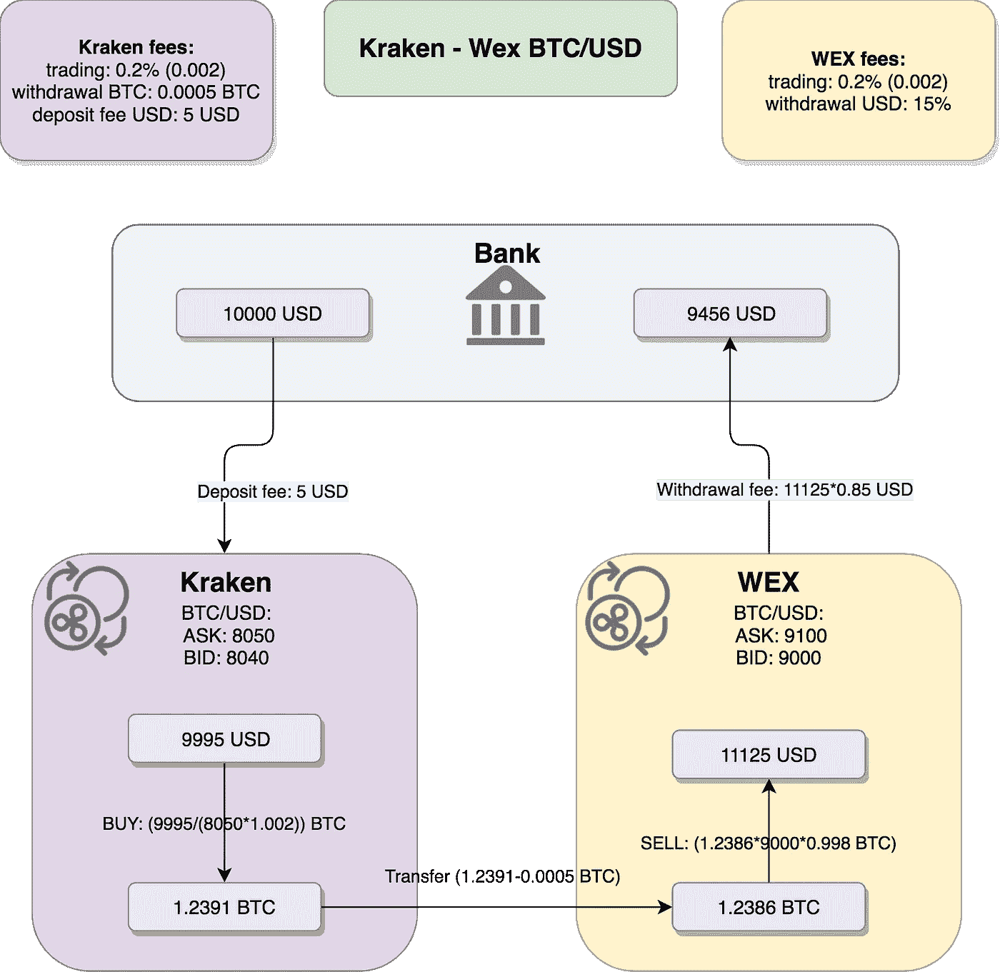
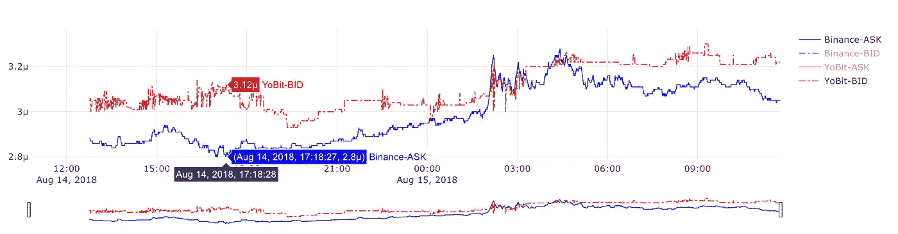
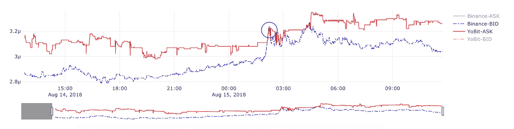
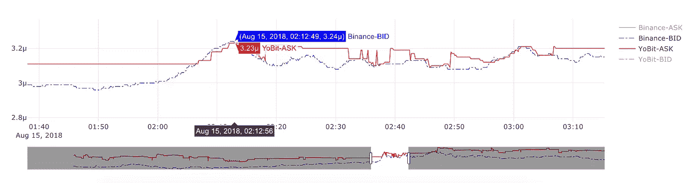
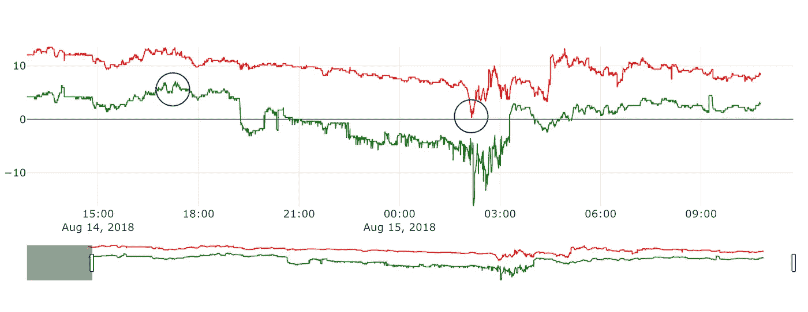
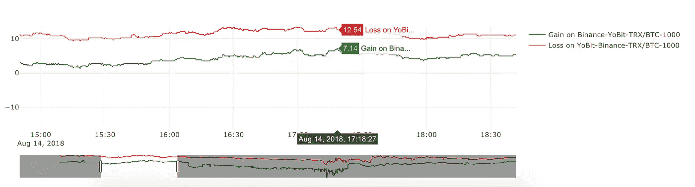
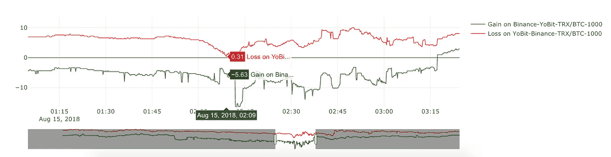
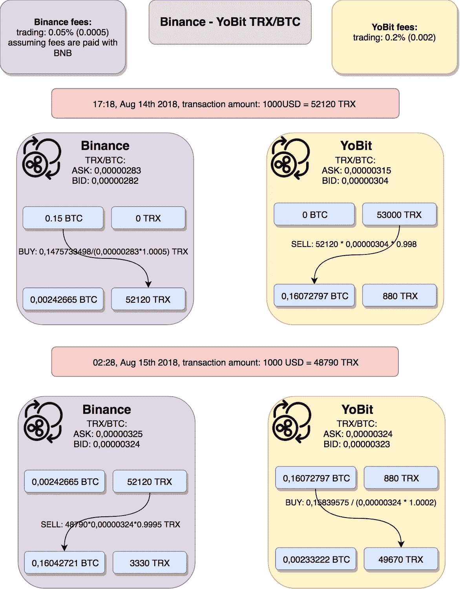
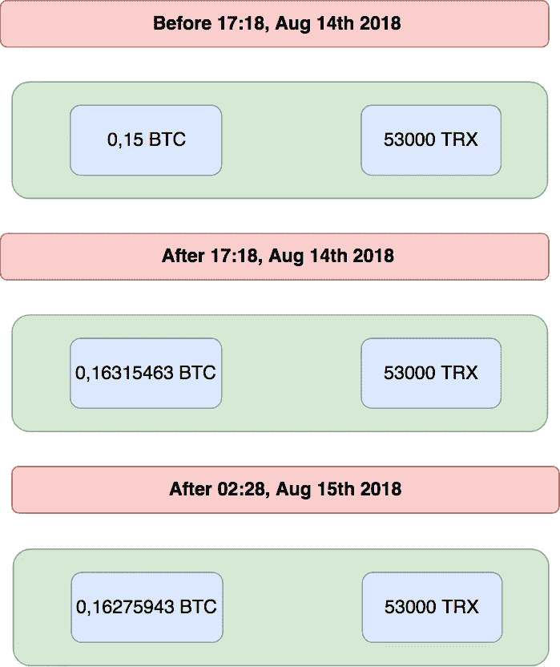

# 加密货币套利策略——差价交易——第三部分

> 原文：<https://medium.com/coinmonks/cryptocurrency-arbitrage-strategies-spread-trading-part-iii-db36fd9f5415?source=collection_archive---------2----------------------->

# 介绍

差价交易——红凤凰套利策略有两个阶段。在第一阶段，当两个加密交易所的价格相差很远时，我们从套利中获利。在第二阶段，当交易所的价格接近时，我们会亏损，但比第一阶段赚的少。换句话说，我们在价差高的时候做空，在价差低的时候买入。

红凤凰策略非常适合那些持续高于其他市场的市场。一些本地交易所的 BTC/美元价格总是高于一些较大的美国交易所。通常从中获利并不容易。我在[套利策略—第一部分—循环](/coinmonks/cryptocurrency-arbitrage-strategies-part-i-20e9dd327919)中提到的场景呈现了这样的情况:

illusionary arbitrage profits

这张图显示了套利的理论利润是如何由于非常高的取款费而变成损失的。红凤凰套利策略就是为了从这种情况中获益而建立的。第一步我们会赚很多，第二步我们会输。规则很简单——我们需要赚的比我们失去的多。

# 第一步——赚钱

从 2018 年 8 月 5 日开始，YoBit TRX/BTC 的价格开始持续高于币安 TRX/BTC 的价格。由于 YoBit 上 TRX 的提现费用非常高，循环套利变得相当困难。这就是红凤凰战略帮助我们的地方。让我们来看看这张图表:

Arbitrage Yobit-Binance TRX/BTC

这张图表显示了 TRX/BTC 在两个交易所的价格。红线是 YoBit 上 TRX/BTC 的出价——这意味着你可以在 YoBit 上为 TRX 买到多少 BTC。蓝线代表 TRX/BTC 在币安的要价——这是你买 TRX 需要支付的 BTC 价格。8 月 14 日 17:18 左右，您可以看到这些价格差异最大的时刻:

*   我们在 YoBit 上出售 TRX 的价格是 0.00000312 BTC
*   我们在币安买 TRX 的价格是 0.00000280 BTC

这意味着从理论上讲，你在币安购买的每一个 TRX 可以获得 0.00000032 BTC。那太多了。但是请记住——我们需要经历一个完整的循环，我们需要把我们的基础基金放在他们开始的地方。这就是为什么我们需要做反向贸易。

# 第二步——“失败”

假设我们在币安上买了一些 TRX，在 Yobit 上卖了一些 TRX，现在我们需要做反向交易。我们需要等待价格最接近的时刻。让我们来看看这张图表:

Yobit-Binance TRX/BTC, a bit later

仔细看看圈里的瞬间:

Yobit-Binance TRX/BTC, a bit later, zoom in

这些图表代表 TRX/BTC 的价格，但这次，红线代表你可以在 YoBit 上出售的价格，而蓝线代表你可以在币安上出售的价格，不包括交易费。让我们在 8 月 15 日 02:12 关注这一点:

*   你能在币安上卖出的价格是 0.00000324 BTC
*   你在 YoBit 上能买到的价格是 0.00000323 BTC

这里需要注意的是，上面的图表代表的是股票价格，其中不包括交易费用，也没有考虑我们的交易规模。为了理解你将不得不支付或接收的真实价格，你需要应用交易所交易费，并且你需要考虑股票价格下可获得的订单量。关于[跨交换订单簿匹配](https://www.multitrader.io/cross-exchange-order-book-matching/)的文章中有详细说明。

回到我们的例子，看起来你可以再次获利，但是在收取交易费和检查交易量后，你会损失一些。在第一步，我们赚了很多，在第二步，我们失去了一些。那太好了！让我们仔细看看这些数字。

# **套利分析**

MultiTrader 平台可以进行详细的套利分析。它使用两个交易所的订单执行[交叉交易所订单匹配](https://www.multitrader.io/cross-exchange-order-book-matching/)。对 1000 美元的交易金额进行了以下分析

Yobit-Binance TRX/BTC -whole scene

你在上面看到的图表代表了在币安买入，在 Yobit 卖出的套利交易的收益，以百分比表示(绿线)。红线代表在 YoBit 上买入，在币安上卖出的损失。亏损百分比为正意味着收益百分比为负。

图表上的圆圈代表我们上面讨论过的两个时刻:

*   8 月 14 日 17:18 左右，如果我们决定在币安上买入，在 YoBit 上卖出，我们将获得交易额的 7%(约 70 美元):

Profit analysis — buy Binance, sell on Yobit

*   8 月 15 日 02:12 左右，如果我们决定在币安上卖出，在 YoBit 上买入，我们将损失交易金额的 0.3%(约 3 美元)

Profit analysis — buy on Yobit, sell on Binance

这意味着在这两笔交易之后，我们将会多赚将近 67 美元！我们的资金又回到了起点——我们可以重复整个操作。

# 详细分析

在下图中，我们将详细分析这种情况。

Detailed profit analysis

我们希望交易金额达到 1000 美元。第一步，我们交易 52120 TRX，第二步，随着 TRX/美元价格的上涨，我们将交易金额减少到 48790 TRX。让我们看看每一步之后的总数是多少。

Balance summary

正如你在第一步后看到的，我们的 BTC 总量增加了 0，01315463 BTC，TRX 的总量保持在同一水平。这意味着我们已经赚了大约 7.1%，也就是大约 71 美元。在第二步中，我们损失了 0.00039519 BTC，约为 3 美元(-0.3%)。我们总共赚了 68 美元。

最后有一些警告——在第二组交易之后，我们并没有完全回到开始的地方。我们在 YoBit 上有 53000 个 TRX，现在我们有 49760 个。原因是我们的交易规模是由 TRX/美元“指数化”的。在每一步，我们都在进行价值为 1000 美元的交易，但是 TRX/美元的价格会随时间变化，因此我们用于交易的 TRX 数量也会变化。在第一次交易中，TRX/美元是 0.01918，在第二次交易中，它已经增长到 0.02049。这导致了不同的交易规模，我们原来的 TRX 池没有重建。我们可以说，这不成问题，因为我们在 YoBit 上的 TRX 金额相当于 1000 美元，所以我们已经为下一轮套利做好了准备。此外，由于价格在两个方向波动，在下一轮套利之后，我们可能会回到原来的位置。无论哪种方式，我们都可以决定保持我们的基础货币数量稳定，并以完全相同的数量在相反的方向进行交易，计算会略有不同，但我们的利润仍然是正的。

第二个警告是关于币安的交易费。是 0.05%，但只是以防万一，我们的账户上有 BNB 硬币。BNB 是一种币安硬币——如果你的账户上有 BNBs，币安通过将原始交易费从 0.1%降至 0.75%来推广使用这种硬币。0.05%的交易费对套利来说更方便，因此为了在上面的图表中有完整的图片，我还应该画一个 BNB 钱包。然而，为了简单一点，我们上面所有的计算都是在 BTC 支付 0.05%时进行的。在完整的细节场景中，我们必须在账户上有一些 bnb，我们不会在 BTC 支付费用，但在 bnb。这意味着，我们 BTC 钱包里的 BTC 会多一点，而 BNB 钱包里的 bnb 会相应减少。我做这种简化是为了降低这个例子的复杂性。

重要的是，在合计了我们在两个交易所/钱包的资金后，第一组交易使我们向前移动—我们赚了 71 美元，第二步使我们有点向后移动—我们损失了 3 美元，但在这两个步骤后，我们比开始时更进一步，两个硬币的总量都增加了。我们用价值 2000 美元的硬币赚取了价值 68 美元的硬币，即 3.4%，没有暴露风险。

> 加入 Coinmonks [Telegram group](https://t.me/joinchat/EPmjKpNYwRMsBI4p) 并了解加密交易和投资

## 另外，阅读

*   什么是[闪贷](https://blog.coincodecap.com/what-are-flash-loans-on-ethereum)？
*   最好的[密码交易机器人](/coinmonks/crypto-trading-bot-c2ffce8acb2a) | [网格交易](https://blog.coincodecap.com/grid-trading)
*   [3 商业评论](/coinmonks/3commas-review-an-excellent-crypto-trading-bot-2020-1313a58bec92) | [Pionex 评论](/coinmonks/pionex-review-exchange-with-crypto-trading-bot-1e459d0191ea) | [Coinrule 评论](https://blog.coincodecap.com/coinrule-review-a-perfect-trading-bot)
*   [AAX 交易所评论](/coinmonks/aax-exchange-review-2021-67c5ea09330c) | [德里比特评论](/coinmonks/deribit-review-options-fees-apis-and-testnet-2ca16c4bbdb2) | [FTX 交易所评论](/coinmonks/ftx-crypto-exchange-review-53664ac1198f)
*   [n 平均零点评审](/coinmonks/ngrave-zero-review-c465cf8307fc) | [Phemex 评审](/coinmonks/phemex-review-4cfba0b49e28) | [PrimeXBT 评审](/coinmonks/primexbt-review-88e0815be858)
*   [by bit Exchange Review](/coinmonks/bybit-exchange-review-dbd570019b71)|[bit yard Review](https://blog.coincodecap.com/bityard-reivew)|[coin spot Review](https://blog.coincodecap.com/coinspot-review)
*   [3 commas vs crypto hopper](/coinmonks/3commas-vs-pionex-vs-cryptohopper-best-crypto-bot-6a98d2baa203)|[赚取秘密利息](/coinmonks/earn-crypto-interest-b10b810fdda3)
*   最好的比特币[硬件钱包](/coinmonks/the-best-cryptocurrency-hardware-wallets-of-2020-e28b1c124069?source=friends_link&sk=324dd9ff8556ab578d71e7ad7658ad7c) | [BitBox02 回顾](/coinmonks/bitbox02-review-your-swiss-bitcoin-hardware-wallet-c36c88fff29)
*   [莱杰 vs n rave](https://blog.coincodecap.com/ngrave-vs-ledger)|[莱杰 nano s vs x](https://blog.coincodecap.com/ledger-nano-s-vs-x)
*   [密码拷贝交易平台](/coinmonks/top-10-crypto-copy-trading-platforms-for-beginners-d0c37c7d698c) | [比特码拷贝交易](https://blog.coincodecap.com/bityard-copy-trading)
*   [Vauld Review](https://blog.coincodecap.com/vauld-review)|[you hodler Review](/coinmonks/youhodler-4-easy-ways-to-make-money-98969b9689f2)|[BlockFi Review](/coinmonks/blockfi-review-53096053c097)
*   最好的[加密税务软件](/coinmonks/best-crypto-tax-tool-for-my-money-72d4b430816b) | [硬币追踪评论](/coinmonks/cointracking-review-a-reliable-cryptocurrency-tax-software-5114e3eb5737)
*   最佳[密码借贷平台](/coinmonks/top-5-crypto-lending-platforms-in-2020-that-you-need-to-know-a1b675cec3fa) | [杠杆令牌](/coinmonks/leveraged-token-3f5257808b22)
*   [莱杰 Nano S vs 特雷佐 one vs 特雷佐 T vs 莱杰 Nano X](https://blog.coincodecap.com/ledger-nano-s-vs-trezor-one-ledger-nano-x-trezor-t)
*   [block fi vs Celsius](/coinmonks/blockfi-vs-celsius-vs-hodlnaut-8a1cc8c26630)|[Hodlnaut 审查](https://blog.coincodecap.com/hodlnaut-review)
*   [Bitsgap 审查](https://blog.coincodecap.com/bitsgap-review) | [Quadency 审查](/coinmonks/quadency-review-a-crypto-trading-automation-platform-3068eaa374e1) | [Bitbns 审查](https://blog.coincodecap.com/bitbns-review)
*   [埃利帕尔泰坦评论](/coinmonks/ellipal-titan-review-85e9071dd029) | [赛克斯斯通评论](https://blog.coincodecap.com/secux-stone-hardware-wallet-review)
*   [DEX Explorer](https://explorer.bitquery.io/ethereum/dex)|[w](https://explorer.bitquery.io/graphql)|[local bitcoins 评论](https://blog.coincodecap.com/localbitcoins-review)
*   最佳[区块链分析](https://bitquery.io/blog/best-blockchain-analysis-tools-and-software)工具| [赚比特币](https://blog.coincodecap.com/earn-bitcoin)
*   [加密套利](/coinmonks/crypto-arbitrage-guide-how-to-make-money-as-a-beginner-62bfe5c868f6)指南:新手如何赚钱
*   最佳[加密制图工具](/coinmonks/what-are-the-best-charting-platforms-for-cryptocurrency-trading-85aade584d80) | [最佳加密交易所](/coinmonks/crypto-exchange-dd2f9d6f3769)
*   [如何在印度购买比特币](https://blog.coincodecap.com/buy-bitcoin-app-india)？
*   [印度比特币交易所](/coinmonks/bitcoin-exchange-in-india-7f1fe79715c9) | [比特币储蓄账户](https://blog.coincodecap.com/bitcoin-savings-account)
*   了解比特币的[最佳书籍有哪些？](/coinmonks/what-are-the-best-books-to-learn-bitcoin-409aeb9aff4b)

> [直接在您的收件箱中获得最佳软件交易](/coinmonks/newsletters/coinmonks)

