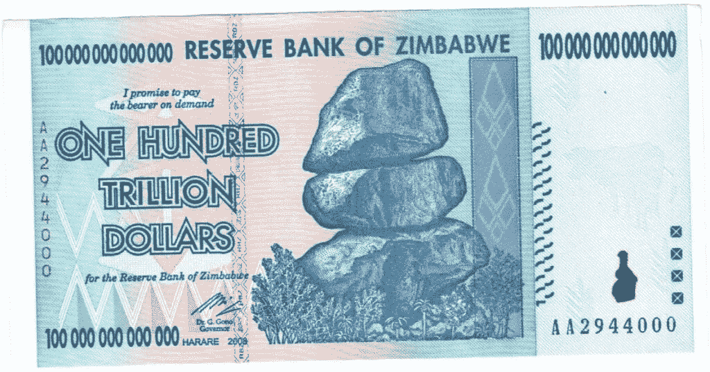
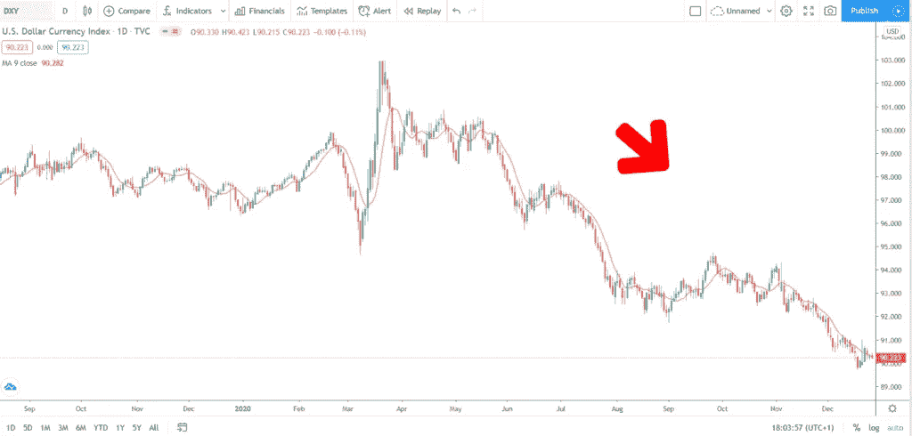
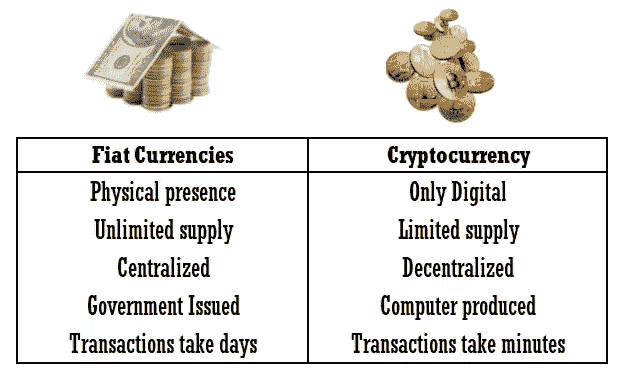

# 为什么加密货币比你想象的要多！

> 原文：<https://medium.com/coinmonks/cryptocurrency-as-a-hedge-against-inflation-a008758fa41d?source=collection_archive---------6----------------------->

Hidden monster eating your money

几年前，当我们听到货币这个词时，我们会马上联想到口袋里的纸币或者银行账户里的钱。传统的货币被称为法定货币。

**法定货币**是一个源自拉丁语的术语，意思是由权威决定的**。顾名思义，在大多数情况下，法定货币的价值是由政府授权的。**

这种形式的货币由中央政府通过**中央银行随意发行和印刷，并且不以任何方式与任何其他资产(如黄金)挂钩。**

**由于印刷更多的法定货币是由政府决定的，因此政府控制着货币的供给和需求。**

# **为什么法定货币是世界上最常用的货币？**

**法定货币在全世界被广泛接受，几乎可以购买任何商品或服务。法定货币可以以纸币、硬币、信用、贷款或债券的形式出现。**

**如果你申请了信用卡或个人贷款，并且得到了银行的批准，那么你得到的信用或金额就是一种法定货币，因为你实际上是根据你的信用等级和偿还贷款的协议来使用货币的——通常是带利息的。**

**当你去度假或在世界其他地方汇款时，法定货币也可以用来兑换货币。**

**国际货币转账服务允许世界各地的人们以一种法定货币的形式，并以另一种法定货币的形式发送，只收取少量费用。**

**如今有更大范围的货币。早在 2009 年 [**加密货币**](https://cryptoenthusiast.net/best-cryptocurrency-to-invest-in/) 的推出，增加了货币的多样性。**

# **为什么有些货币，如美元，繁荣发展，而其他货币挣扎和失败？**

**一种货币的价值基于它的效用。如果一种货币在世界上任何一个地方都被欣然接受，这将增加它的效用，从而提高它的价格。另一方面，如果对货币失去信任，它的价值就会下降。**

**这是基于经济学的基本原理 [**供求**](https://www.investopedia.com/articles/economics/11/five-economic-concepts-need-to-know.asp#:~:text=At%20the%20most%20basic%20level,many%20decisions%20that%20humans%20make.) 。**

**控制供给和需求的中央政府保持适当的平衡是至关重要的。如果其中一个超过另一个，结果可能是灾难性的，恶性通货膨胀可能会发生。**

**恶性通货膨胀的简单定义:**

> ***中的* [***经济学中的***](https://en.wikipedia.org/wiki/Economics)****恶性通货膨胀*** *非常高并且典型地加速* [***通货膨胀***](https://en.wikipedia.org/wiki/Inflation) *。它迅速侵蚀了* [***的实际价值***](https://en.wikipedia.org/wiki/Real_versus_nominal_value_(economics)) *的本地* [***的货币***](https://en.wikipedia.org/wiki/Currency) *，随着所有商品价格的提高。这导致人们尽量减少其持有的美元，因为他们通常会转向更稳定的外币，在最近的历史中，美元价格通常会相对于其他相对稳定的货币保持稳定。****

***恶性通货膨胀是在两种不同的情况下引起的。***

***或者***

***恶性通货膨胀不是每天都会发生，但在历史上确实发生过几次。***

***举个例子，2007 年，津巴布韦政府开始印刷越来越多的钞票来支付刚果战争。***

***通货膨胀率每天为 98%，这意味着价格每 24 小时翻一番。津巴布韦元贬值如此之大，以至于 100 万亿美元的纸币只值 40 美分。***

******

*****The Zimbabwe’s 100 Trillion-Dollar note.*****

***恶性通货膨胀对社会及其生活水平产生了恶劣的后果。随着现金变得不值钱，人们开始囤积耐用品，如汽车、电子产品，如果通货膨胀持续，还会囤积面包和鸡蛋等易腐商品。***

*****这将导致日常用品的匮乏。*****

***恶性通货膨胀导致货币相对于其他外币的价值直线下降。随着进口成本飙升，导致失业率上升，进口商将陷入困境或倒闭。***

***政府税收**下降，难以提供基本服务。政府印更多的钱来支付账单，加剧了恶性通货膨胀。*****

*****后果是相互关联的，一个问题会产生另一个问题。在前面解释的例子中，津巴布韦**的恶性通货膨胀导致津巴布韦元**无法将其主要货币兑换成美元。*****

# *****法定货币是最安全的货币吗？*****

*****法定货币是最受欢迎的货币。它得到了全球多个支付网络和货币交易所的支持。*****

*****法定货币也有助于稳定一个国家的经济，原因有二。政府控制着货币供应，它并不是基于不稳定的商品。*****

*****另一方面，正如我们已经解释过的，如果政府**不能**恰当地控制供给和需求，就会发生恶性通货膨胀——严重降低其价值。*****

*****除了恶性通货膨胀的情况，法定货币被不断印刷以满足需求和流通。这是每年发生的正常通货膨胀，在正常情况下大约为 2%。*****

*****任何情况下的通货膨胀都会扼杀法定货币的购买力。*****

# *****我怎样才能避免通货膨胀？*****

*****毫无疑问，法定货币是世界上大多数国家的主要货币。这使得法定货币成为一种必需品，任何人都需要它来过舒适的生活。*****

*****自 1914 年以来，美元一直是世界储备货币。世界储备货币是由 [**中央银行**](https://www.investopedia.com/terms/c/centralbank.asp) 和其他主要金融机构维持的货币，为投资、交易和国际债务义务做准备。*****

*****美元是最强的世界法定货币。*****

*****由于美元是最强势的货币，在危机或衰退时，它会吸引世界各地的投资者，从而提高美元的价格。*****

*****尽管我们目前由于 COVID 而陷入经济衰退，而且人们预计美元价格会上涨。*****

*****然而，恰恰相反的事情正在发生。*****

*****如果你看一下下面的图表，它显示美元是一种垂死的资产，并且在 2020 年的大部分时间里一直在贬值。*****

**********

*****美元价格持续下跌的原因很简单。如前所述，当政府不断印钞时，市场上的法定货币供应量增加，导致货币价值下降。*****

*****为什么美元会出现这种情况？*****

*****这正是 [**美联储**](https://en.wikipedia.org/wiki/Federal_Reserve) 目前在做的事情，凭空印出越来越多的美元。*****

*****以下是福布斯文章[对 2020 年货币供应量的估计:](https://www.forbes.com/sites/williammeehan/2020/10/21/can-the-federal-reserve-print-money-forever-or-how-continuing-to-print-money-to-support-deficit-spending-may-end-badly-with-chinas-help/?sh=4c67275358d4)*****

*****我们非常肯定，美联储甚至还没有接近停止供应美元，这将对美元价值产生进一步的不利影响。*****

******2020 年，联邦政府支出 6.55 万亿美元，而税收和其他收入为 3.42 万亿美元。大部分支出来自国会在三月份通过的 2.2 万亿美元的经济救助方案******

*****尽管我们都需要法定货币，但任何将大部分储蓄放在法定货币中的人，随着时间的推移，都会损失很大一部分价值。1 美元的 [**购买力**](https://www.investopedia.com/terms/p/purchasingpower.asp) 几个月后会少很多。*****

# *****我应该把我的钱投资在哪里？*****

*****投资最根本的法则；**不要把所有的鸡蛋放在一个篮子里，**同样适用于法定货币。*****

*****你可以争辩说，有几种投资你可以把你的钱。比如和。*****

*****所有这些资产都带有很大的风险，主要是因为中央银行可以通过改变货币政策来操纵它们的价格方向，所以它们仍然与法定货币挂钩。*****

*****比如**。**公司股票近来价格创下新高，这使得它们对普通投资者很有吸引力。*****

*****然而，转念一想。现实是，股票正处于超级泡沫中，这个泡沫的产生原因和我们之前讨论的完全一样——中央银行注入资金，购买所有类型的资产。*****

*****将大部分财富投入公司股票的投资者正面临重大风险，因为这个泡沫将在某个时间点破裂，使公司股票价格回到其合理价值。*****

*******国债更有保障**，但支付的利息却高得离谱。没必要再讨论这个了。*****

# *****有没有更好的另类投资？*****

*****长期投资的更好选择是 [**比特币和其他**](https://cryptoenthusiast.net/best-cryptocurrency-to-invest-in/) 有很多争论，加密货币是有风险的，它们不受监管，投资加密货币你可能会失去所有的钱。*****

*******虽然投资没有安全的避风港，风险总是存在。大多数人没有意识到的是，持有法定货币也包含一定程度的风险。*******

*****在目前的情况下，我们敢推测，持有法定货币然后持有加密货币的风险更高。*****

*****我们已经看到，在美元价值下跌的同时，加密货币的价格却在飙升。*****

*****随着政府凭空注入更多的资金，这种负相关性将继续呈抛物线增长。*****

*******随着越来越多的人意识到法定货币的风险，加密货币的价格与美元价格成反比。*******

*****在当前的市场条件下，任何人所能做出的最明智的投资决定将是将你储蓄的 [**%投资于**](https://cryptoenthusiast.net/best-cryptocurrency-to-invest-in/) [**加密货币。**](https://cryptoenthusiast.net/best-cryptocurrency-to-invest-in/)*****

# *****结论*****

*****风险无处不在。*****

*****把钱存在银行账户或投资于任何资产类别都有一定程度的风险。*****

*****每个人的风险偏好是不同的，如何在不同的资产类别之间分配你的资金将取决于你自己。*****

*****所有投资都与央行或政府的决定相关联。*****

*****加密货币是你可以持有的唯一独立且不受央行影响的资产。*****

*****是的，所有的——除了加密货币。*****

*****一些人购买加密货币来投机价格波动，但**加密货币比**大得多。*****

*****[**投资比特币和加密货币**](https://cryptoenthusiast.net/where-to-buy-cryptocurrency/) 不仅仅是猜测其价格。这是一种通过对冲通货膨胀和政府实施的短期措施来保障你和你家人未来的方法。*****

*****确保你的财富安全可靠，不受他人愚蠢决定的影响！*****

*****[***如果您有兴趣在加密货币***](https://cryptoenthusiast.net/where-to-buy-cryptocurrency/) ***y.*** 方面保持领先，请访问我们的网站并订阅我们的时事通讯*****

# *****法定货币和加密货币的主要区别*****

**********

******原载于 2020 年 11 月 18 日 https://cryptoenthusiast.net***。*******

> ******加入 coin monks[Telegram group](https://t.me/joinchat/EPmjKpNYwRMsBI4p)学习加密交易和投资******

## ******另外，阅读******

*   ******什么是[闪贷](https://blog.coincodecap.com/what-are-flash-loans-on-ethereum)？******
*   ******最好的[密码交易机器人](/coinmonks/crypto-trading-bot-c2ffce8acb2a) | [网格交易](https://blog.coincodecap.com/grid-trading)******
*   ******[3 商业评论](/coinmonks/3commas-review-an-excellent-crypto-trading-bot-2020-1313a58bec92) | [Pionex 评论](/coinmonks/pionex-review-exchange-with-crypto-trading-bot-1e459d0191ea) | [Coinrule 评论](https://blog.coincodecap.com/coinrule-review-a-perfect-trading-bot)******
*   ******[AAX 交易所评论](/coinmonks/aax-exchange-review-2021-67c5ea09330c) | [德里比特评论](/coinmonks/deribit-review-options-fees-apis-and-testnet-2ca16c4bbdb2) | [FTX 交易所评论](/coinmonks/ftx-crypto-exchange-review-53664ac1198f)******
*   ******[n 零审核](/coinmonks/ngrave-zero-review-c465cf8307fc) | [Phemex 审核](/coinmonks/phemex-review-4cfba0b49e28) | [PrimeXBT 审核](/coinmonks/primexbt-review-88e0815be858)******
*   ******[Bybit Exchange 审查](/coinmonks/bybit-exchange-review-dbd570019b71) | [Bityard 审查](https://blog.coincodecap.com/bityard-reivew) | [CoinSpot 审查](https://blog.coincodecap.com/coinspot-review)******
*   ******[3 commas vs crypto hopper](/coinmonks/3commas-vs-pionex-vs-cryptohopper-best-crypto-bot-6a98d2baa203)|[赚取加密利息](/coinmonks/earn-crypto-interest-b10b810fdda3)******
*   ******最好的比特币[硬件钱包](/coinmonks/the-best-cryptocurrency-hardware-wallets-of-2020-e28b1c124069?source=friends_link&sk=324dd9ff8556ab578d71e7ad7658ad7c) | [BitBox02 回顾](/coinmonks/bitbox02-review-your-swiss-bitcoin-hardware-wallet-c36c88fff29)******
*   ******[莱杰 vs n rave](https://blog.coincodecap.com/ngrave-vs-ledger)|[莱杰 nano s vs x](https://blog.coincodecap.com/ledger-nano-s-vs-x)******
*   ******[加密拷贝交易平台](/coinmonks/top-10-crypto-copy-trading-platforms-for-beginners-d0c37c7d698c) | [比特码拷贝交易](https://blog.coincodecap.com/bityard-copy-trading)******
*   ******[Vauld Review](https://blog.coincodecap.com/vauld-review)|[you hodler Review](/coinmonks/youhodler-4-easy-ways-to-make-money-98969b9689f2)|[BlockFi Review](/coinmonks/blockfi-review-53096053c097)******
*   ******最好的[加密税务软件](/coinmonks/best-crypto-tax-tool-for-my-money-72d4b430816b) | [硬币追踪评论](/coinmonks/cointracking-review-a-reliable-cryptocurrency-tax-software-5114e3eb5737)******
*   ******最佳[加密借贷平台](/coinmonks/top-5-crypto-lending-platforms-in-2020-that-you-need-to-know-a1b675cec3fa) | [杠杆代币](/coinmonks/leveraged-token-3f5257808b22)******
*   ******[莱杰纳米 S vs 特雷佐 one vs 特雷佐 T vs 莱杰纳米 X](https://blog.coincodecap.com/ledger-nano-s-vs-trezor-one-ledger-nano-x-trezor-t)******
*   ******[block fi vs Celsius](/coinmonks/blockfi-vs-celsius-vs-hodlnaut-8a1cc8c26630)|[Hodlnaut Review](https://blog.coincodecap.com/hodlnaut-review)******
*   ******[Bitsgap 审查](https://blog.coincodecap.com/bitsgap-review) | [Quadency 审查](/coinmonks/quadency-review-a-crypto-trading-automation-platform-3068eaa374e1) | [Bitbns 审查](https://blog.coincodecap.com/bitbns-review)******
*   ******[埃利帕尔泰坦评论](/coinmonks/ellipal-titan-review-85e9071dd029) | [赛克斯斯通评论](https://blog.coincodecap.com/secux-stone-hardware-wallet-review)******
*   ******[DEX 探索者](https://explorer.bitquery.io/ethereum/dex) | [w](https://explorer.bitquery.io/graphql) | [本地比特币评论](https://blog.coincodecap.com/localbitcoins-review)******
*   ******最佳[区块链分析](https://bitquery.io/blog/best-blockchain-analysis-tools-and-software)工具| [赚比特币](https://blog.coincodecap.com/earn-bitcoin)******
*   ******[加密套利](/coinmonks/crypto-arbitrage-guide-how-to-make-money-as-a-beginner-62bfe5c868f6)指南:新手如何赚钱******
*   ******最佳[加密制图工具](/coinmonks/what-are-the-best-charting-platforms-for-cryptocurrency-trading-85aade584d80) | [最佳加密交易所](/coinmonks/crypto-exchange-dd2f9d6f3769)******
*   ******[如何在印度购买比特币](https://blog.coincodecap.com/buy-bitcoin-app-india)？******
*   ******[印度比特币交易所](/coinmonks/bitcoin-exchange-in-india-7f1fe79715c9) | [比特币储蓄账户](https://blog.coincodecap.com/bitcoin-savings-account)******
*   ******了解比特币的[最佳书籍有哪些？](/coinmonks/what-are-the-best-books-to-learn-bitcoin-409aeb9aff4b)******

> ******[直接在您的收件箱中获得最佳软件交易](/coinmonks/newsletters/coinmonks)******

************