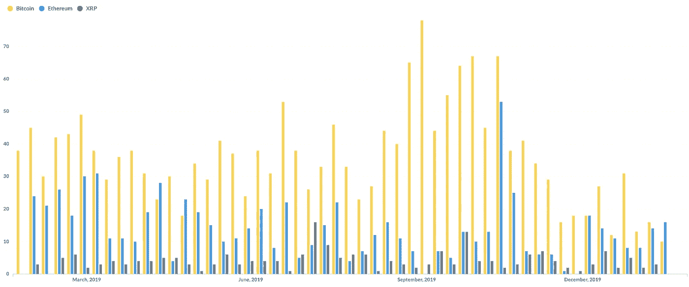
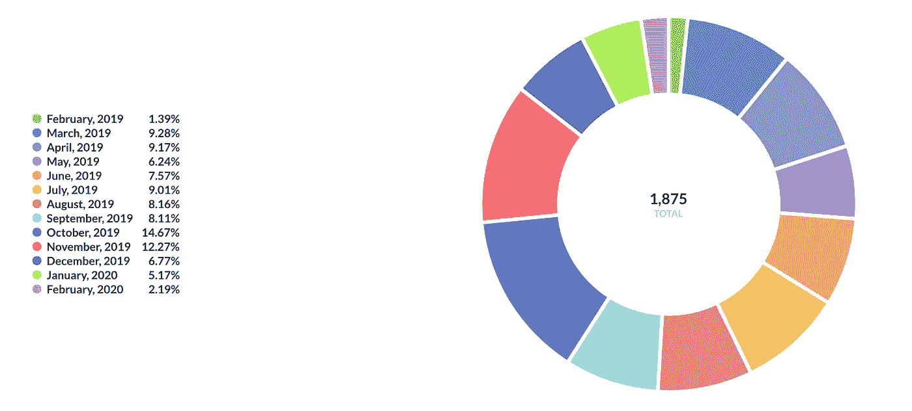
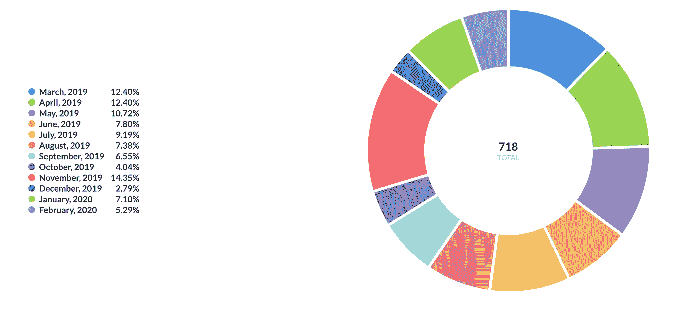
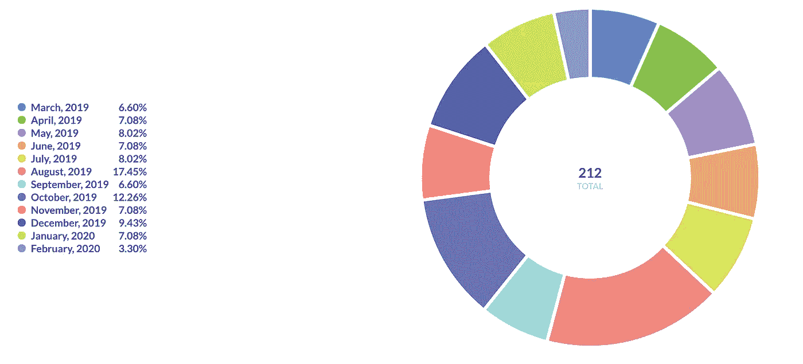
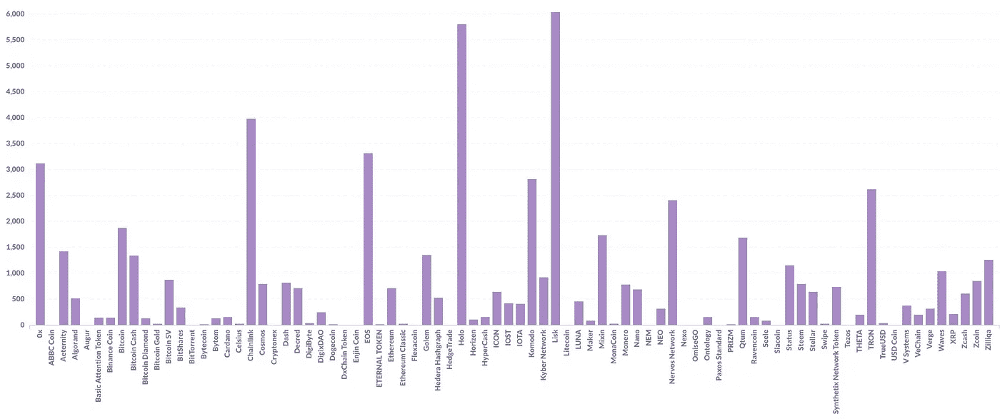

# 加密货币发展分析(2019/2020)

> 原文：<https://medium.com/coinmonks/cryptocurrency-development-analytics-2019-2020-28d3edc25299?source=collection_archive---------4----------------------->

加密是一个颠覆性的空间，这意味着许多开发工作都围绕着这个行业，但是，有时新的硬币会出现在市场上，预示着最先进的技术。没有适当的研究，你可能会买一个骗局硬币。怎么知道哪些币在重点发展？加密货币的伟大之处在于，它们几乎都是开源的(要么是它们的 SDK、node，要么是它们的钱包)。我综合了市场上前 100 枚硬币所有数据。让我们看看数据！

# 介绍

最上面的硬币是使用 [Coinpaprika](https://coinpaprika.com) API 收集的(感谢您提供免费 API)。对于每个硬币，都有一个 Github 链接到它们的源代码 SDK、Node、Wallet 等等..

没有 Github 的硬币(如 tether)从列表中删除，同样，如果一些硬币有多个回购，我只提取该硬币的顶部回购(要么是他们的 SDK，节点或钱包)。

一旦我们有了 Github 回购协议，我们就可以开始查看他们在一年内的代码变更活动。注意:我只是在看 master branch。我没有收集其他分支上的提交，因为我只对推送到主代码回购的内容感兴趣。

# 大人物

比特币、以太坊和 Ripple 是市值上的市场领导者。让我们仔细看看他们的发展。

Weekly commits to master branch on Github

惊讶吗？:)如果我们比较以太坊或者 XRP，比特币的发展是全速的。比特币周提交量最高的是 2019 年 10 月。几乎每周 80 次提交！以太坊正在遵循这条路线——到 2019 年 5 月底，他们的提交量超过了比特币。

## 比特币

Monthly Commit Distribution — Bitcoin

对于比特币来说，2019 年 10 月和 11 月是高提交月份。有意思，2019 年 2 月和 2020 年 2 月低。

## 以太坊

Monthly Commit Distribution — Ethereum

与比特币类似，以太坊高量提交是在 2019 年 11 月。如果我们更仔细地观察提交的分布，2019 年 3 月、4 月和 5 月是大多数提交的来源。

## 涟漪

Monthly Commit Distribution — Ripple

虽然比特币和以太坊的大多数提交来自 10 月/11 月，但 Ripple 不同。大多数提交是在 2019 年 8 月收到的。但是，下一个最大的提交分布是在 10 月。

我们可以在这里看到一个模式:2019 年 10 月和 2019 年 11 月绝对是提交到 master branch 的数量的赢家。

# 所有硬币

Amount of commits per year for top 100 coins

赫萝和利斯克硬币是这里的领导者。从 1 年的时间来看，大约有 6000 个提交给了主分支机构。这大约是每天 16 次提交。这是一个很大的数字，很高兴看到这些硬币得到了大力发展。

你没在列表上看到你的硬币？这意味着要么他们没有 Github，要么他们的回购在 1 年内没有任何进展。这对我来说是一个危险信号。

# 投资建议？

我个人不给出投资哪枚硬币的投资建议。从我个人的角度来看，当我看到一些硬币被推到前 100 名，我总是检查他们的开发工作。如果发展不是这枚硬币的驱动力，我就不会碰它。这么说吧:如果脸书停止开发新功能和漏洞修复，你会投资他们吗？或者，如果他们的应用程序因为手机定位错误而停止工作，你会投资优步吗？记住**软件永远不会完成——它只会被抛弃。**

# 最后的话

虽然我们可以查看大量数据，但这并不代表真实的世界体验。例如，每次提交都代表着某种东西——它是一个特性还是一个错误修复？此外，许多开发发生在其他分支中(不仅仅是主分支)。也许，这是我们下一次可以看到的东西，比较哪些硬币有最多的错误修复和/或哪些硬币比其他硬币发行得更快。想法？

> [在您的收件箱中直接获得最佳软件交易](https://coincodecap.com/?utm_source=coinmonks)

