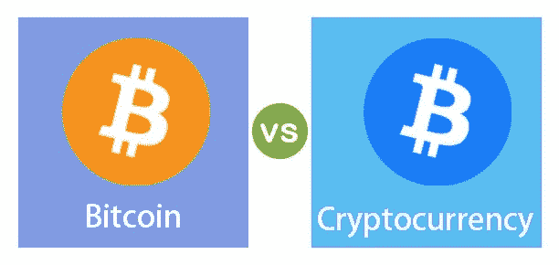

# 加密货币开发解决方案:完整指南

> 原文：<https://medium.com/coinmonks/cryptocurrency-development-solution-a-complete-guide-360c6e5c14e9?source=collection_archive---------3----------------------->

现在是 2021 年，几乎我们每个人都听说过著名的**加密货币。**补充一些知识，**比特币**是中本聪在 2009 年向公众发行的第一种加密货币。

如果你，作为一名企业家，正计划投资强大和颠覆性的区块链技术，那么致力于一个**加密货币开发解决方案**可能是今年最让你着迷的事情。

在这篇文章中，我将带领你经历什么是加密货币的奇妙旅程，以及你如何投资一款加密货币应用程序来引领一项成功的业务。

***重点突出:***

*   *什么是加密货币，它是如何工作的？*
*   *加密货币和比特币的区别。*
*   *创建加密货币应用有什么好处？*
*   *加密货币应用有哪些必备功能？*
*   *加密货币应用可能的收入模式是什么？*
*   *加密货币的未来如何？*

# 什么是加密货币，它是如何工作的？

为了深入研究技术细节，首先，我们需要弄清楚加密货币意味着什么。

“加密货币是一种私有的数字货币，它依靠加密技术通过虚拟交易产生资金。”

数字游牧者更喜欢将加密货币作为一种单一的货币系统，这种货币系统创造了一种非中央集权的、以区块链为基础的货币系统。加密货币最有吸引力和最有利的好处之一是它的安全性。它是用积木建造的，或者我们可以说是强大的区块链技术。

这是一个不依赖于任何中央机构(如央行)的数字交易链或区块，因此黑客很难封锁系统，甚至政府也无权这样做。安全和安全的交易是加密货币大受欢迎的原因。但技术并不在控制之中，因为它有 1000 多种加密货币。

最受欢迎的加密货币类型是比特币、莱特币、Etherium、Zcash、Ripple 和 Dash。

这个话题上发现的问题是:*“任何人都可以制作自己的加密货币吗？”*

在第一个问题上，答案是**是的**，任何人都可以创造自己的加密货币，但这并不像听起来那么容易。在现实中，创建自己的加密货币的过程更加复杂，并且不能保证投资回报率。许多受欢迎的品牌，如 Unicef France 和 Wix，正准备为您的交易创建自己的加密货币系统。听起来很有趣…对吗？如果你需要同样的帮助，你可以[在印度](https://www.codersdaddy.com/hire-developer-engineer-programmer/blockchain)雇佣区块链开发者。

# 比特币和加密货币的区别

如上所述，*加密货币无非是基于区块链技术的虚拟或数字货币*。交易依靠加密来产生资金，这显然是一种虚拟交易。

加密货币是基于一个分散的系统，这意味着没有中央机构，如银行，有权控制它。这项技术提供了创造自己货币的可能性，因此市场上有数千种加密货币。比特币就是其中之一。

比特币是一种加密货币，但它们有一些不同之处。大多数数字货币都遵循了央行的指导方针，这就是为什么大多数加密货币都是合法的。

比特币一词最早由中本聪在 2009 年创造，是一种不受监管的私人货币。推出比特币的目的是创造一种主权数字货币的替代品。它在许多国家是非法的，因为它没有真正的价值基础。

# 创建加密货币 App 有什么好处？

*   使用加密货币和区块链技术的最大好处是金融系统的去中心化。应用程序所有者和用户可以管理数据库。
*   由于没有集中控制，黑客入侵系统的机会就少了。应用程序所有者也可以通过这个获得安全补丁。
*   所有加密货币投资者都有一个以移动为中心的方法， ***因此创建一个加密货币应用程序总是一个很好的商业想法。***
*   由于区块链技术是新的，可靠的资源很少， ***用户正在寻找一个 app*** 形式的全面解决方案。
*   加密货币应用的另一个好处是货币兑换功能，允许用户在漫游时兑换货币。
*   从最新趋势和领先竞争的角度来看，加密货币的未来也是一个巨大的优势。

总而言之，要想赶上潮流，顺应趋势，创建一个加密货币兑换应用程序的想法非常棒。如果你需要任何帮助，你可以[在印度](https://www.codersdaddy.com/hire-developer-engineer-programmer/ethereum)雇佣以太坊开发者。

# 加密货币手机 App 中有哪些必备功能？

构建移动应用程序是小菜一碟，但是当您准备任何类型的金融应用程序时，许多事情都很重要。你必须去印度 的顶级[加密货币开发公司，他们在开发加密货币应用程序方面有丰富的知识。](https://www.pixelcrayons.com/cryptocurrency-development)

以下是其中的一些特点。对于创建加密货币应用程序至关重要。

*   提供了一种登录社交媒体和注册 Google 的简单方法
*   让用户实时看到市场趋势
*   给出过滤和缩短硬币的详细信息
*   允许用户看到加密货币在国际市场上的价值
*   通过吸引人的图表(环、饼、线、行和棒)实时显示市场情况
*   添加加密货币交换，以了解加密货币的真实价值
*   跟踪不同货币的加密货币的有效价值。
*   启用搜索选项以选择至少 1000 多种加密货币

领先于时代并投资于未来技术总是好的，但加密货币已经被金融市场的大玩家所触及。因此，你需要付出额外的努力，确保你的应用支持下一代功能。

以下是加密货币开发解决方案提供商必须如何进行应用程序开发:

*   实时更新的推送通知。
*   可靠因素的快速和安全应用。
*   允许用户快速方便地兑换货币。
*   要构建自定义和用户友好的应用程序，请允许多语言支持。
*   向上滑动(拉至更新手势)的实时更新功能。
*   面向移动设备和平板电脑的有吸引力且响应迅速的应用程序设计。
*   吸引人的用户界面和干净的代码没有错误。
*   通过博客或 CoinTelegraph 等其他受欢迎的来源实时发布关于加密货币的新闻。
*   加密货币市场监控功能，以教育用户进行正确的投资。
*   坚持让你的用户评价你的应用并分享它，这有助于增加受欢迎程度。

# 加密货币应用的可能收入模式是什么？

致力于一个伟大的想法几乎就像建造一座空中楼阁。你所要做的就是最终确定加密货币应用开发的收入模式。

以下是一些其他的收入映射方法。

*   针对移动插播广告和横幅广告的 Google AdMob 集成
*   定制尺寸的赞助广告
*   吸引游客的参考方法
*   创建一个带有一些附加功能的专业版应用程序
*   启用文本、轮播和视频广告

# 加密货币的未来如何？

加密货币的未来不可预测，因为它不是一个中央集权的机构。没有人能直接控制这个金融系统，甚至政府也很难跟踪数字货币系统的信息。

也许在未来，大多数国家的政府都会对加密货币制定严格的规则和指导方针。大多数投资者发现投资比特币非常安全，因此或许我们见证了加密货币的安全未来。

大多数受欢迎的公司计划创建自己的加密货币，因为他们有一个关于加密货币前景如何的适当数据库。像 WIX 和 Unicef France 这样的品牌拥有自己的交易和捐赠数字货币。如果你需要在区块链有专业知识的人的帮助，你可以从印度顶级网站开发机构那里得到帮助。

脸书也紧跟潮流，推出了自己的类似加密货币的编程语言 Libra。 ***脸书的勇敢举动清楚地表明，加密技术大有可为。***

# 接下来去哪里？

2021 年刚刚开始，它被视为颠覆性技术统治世界的十年。既然你已经知道如何开发加密货币应用程序，你必须想出下一步。

嗯，理想情况下，你的下一步应该是找到最好的加密货币开发公司，并提出你对加密货币兑换移动应用的想法。他们的 [**专家开发者**](https://www.pixelcrayons.com/hire-developer-programmer-india) 会像专业人士一样帮你在这片大海中航行。

如果您有任何其他疑问或建议，欢迎在下面评论。

在那之前，这就是所有的人！

> 加入 coin monks[Telegram group](https://t.me/joinchat/EPmjKpNYwRMsBI4p)学习加密交易和投资

## 另外，阅读

*   [学习以太坊和 Web3 开发](http://blog.coincodecap.com/go/learn)
*   最好的[密码交易机器人](/coinmonks/crypto-trading-bot-c2ffce8acb2a)
*   [3 商业评论](/coinmonks/3commas-review-an-excellent-crypto-trading-bot-2020-1313a58bec92)
*   [Pionex 审查](/coinmonks/pionex-review-exchange-with-crypto-trading-bot-1e459d0191ea)
*   [AAX 交易所评论](/coinmonks/aax-exchange-review-2021-67c5ea09330c) |推荐代码、交易费用、利弊
*   [Deribit 审查](/coinmonks/deribit-review-options-fees-apis-and-testnet-2ca16c4bbdb2) |选项、费用、API 和 Testnet
*   [FTX 密码交易所评论](/coinmonks/ftx-crypto-exchange-review-53664ac1198f)
*   [n 零审核](/coinmonks/ngrave-zero-review-c465cf8307fc)
*   [Bybit 交换审查](/coinmonks/bybit-exchange-review-dbd570019b71)
*   [3Commas vs Cryptohopper](/coinmonks/3commas-vs-pionex-vs-cryptohopper-best-crypto-bot-6a98d2baa203)
*   最好的比特币[硬件钱包](/coinmonks/the-best-cryptocurrency-hardware-wallets-of-2020-e28b1c124069?source=friends_link&sk=324dd9ff8556ab578d71e7ad7658ad7c)
*   [密码本交易平台](/coinmonks/top-10-crypto-copy-trading-platforms-for-beginners-d0c37c7d698c)
*   [莱杰 nano s vs x](https://blog.coincodecap.com/ledger-nano-s-vs-x)
*   [Vauld Review](https://blog.coincodecap.com/vauld-review)
*   最好的[加密税务软件](/coinmonks/best-crypto-tax-tool-for-my-money-72d4b430816b)
*   最佳加密贷款平台
*   [莱杰纳米 S vs 特雷佐 one vs 特雷佐 T vs 莱杰纳米 X](https://blog.coincodecap.com/ledger-nano-s-vs-trezor-one-ledger-nano-x-trezor-t)
*   [block fi vs Celsius](/coinmonks/blockfi-vs-celsius-vs-hodlnaut-8a1cc8c26630)vs Hodlnaut
*   Bitsgap 评论——一个轻松赚钱的加密交易机器人
*   为专业人士设计的加密交易机器人
*   [共同追踪审查](/coinmonks/cointracking-review-a-reliable-cryptocurrency-tax-software-5114e3eb5737)
*   [优霍德勒评论](/coinmonks/youhodler-4-easy-ways-to-make-money-98969b9689f2)
*   [埃利帕尔泰坦评论](/coinmonks/ellipal-titan-review-85e9071dd029)
*   [赛克斯·斯通评论](https://blog.coincodecap.com/secux-stone-hardware-wallet-review)
*   [BlockFi 评论](/coinmonks/blockfi-review-53096053c097) |从您的密码中赚取高达 8.6%的利息
*   [Coinrule 审查](https://blog.coincodecap.com/coinrule-review-a-perfect-trading-bot)
*   [DEX Explorer](https://explorer.bitquery.io/ethereum/dex) 和[区块链 API](https://explorer.bitquery.io/graphql)
*   [加密套利](/coinmonks/crypto-arbitrage-guide-how-to-make-money-as-a-beginner-62bfe5c868f6)指南:新手如何赚钱
*   最佳[加密制图工具](/coinmonks/what-are-the-best-charting-platforms-for-cryptocurrency-trading-85aade584d80)
*   了解比特币最好的[书籍有哪些？](/coinmonks/what-are-the-best-books-to-learn-bitcoin-409aeb9aff4b)

> [直接在您的收件箱中获得最佳软件交易](/coinmonks/newsletters/coinmonks)

