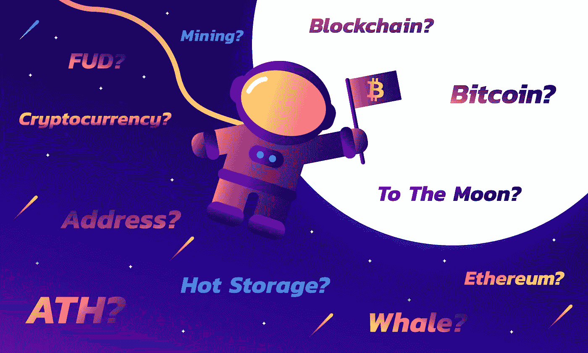

# 初学者加密货币词典。

> 原文：<https://medium.com/coinmonks/cryptocurrency-dictionary-for-beginners-e1ff03c8aacf?source=collection_archive---------2----------------------->

# FUD？采矿？比特币？地址？加密货币？这些人在区块链上瞎扯些什么？！

如果你在过去的几年里一直保持敏锐的目光，你可能已经看到这些术语四处散布。尤其是在过去的一年里，比特币和大多数替代币都经历了历史性的牛市。如今，似乎到处都在讨论加密货币。新闻、广播、互联网、你的格雷格叔叔、播客和几乎任何其他现代形式的媒体集合。

说实话，在可预见的未来，你只会听到和看到这个新兴领域更多的东西！是时候弄清楚这一切了。对许多人来说，加密货币可能看起来很难理解，但我已经列出了这些必须知道的术语，不包括计算机语言的术语。简阿姨和伊迪丝奶奶终于能理解为什么格雷格叔叔一直告诉大家他在感恩节晚餐时会哭了！🦃

# 地址

地址是一个独特的字母和数字字符串，用于接收来自另一个人的加密货币。

# 阿尔特科恩

替代币(Altcoins)是除比特币之外的任何加密货币。目前有超过 1500 枚替代硬币存在。大多数替代硬币都有自己独立的区块链。

# 厌氧阈

ATH 是历史新高的缩写。这是指加密货币达到的最高价格里程碑。你可以通过历史(日期范围:所有)价格图上的最大峰值来识别加密货币 ATH。

# 比特币

比特币(大写 B)指的是比特币 P2P 协议&比特币支付网络的整体概念。比特币是中本聪发明的第一种开源去中心化的加密货币。比特币白皮书发布于 2008 年，比特币发布于 2009 年。

# 街区

积木是区块链技术的主要组成部分。块包含在给定时间段内通过特定加密货币网络进行的已验证交易的摘要。除了经过验证的事务摘要，数据块还包含一个数据块头，其中包含将数据块“链接”在一起所需的元数据。一旦一个区块被附加到区块链上，就不可能改变。

# 区块链

作为大多数加密货币背后的关键技术，区块链在网络上充当加密安全的分布式记录分类账。加密货币中的区块链由防篡改块组成，这些块记录了一段时间内的所有加密货币交易。通过称为挖掘的过程，块以指定的间隔被附加到区块链。

# 冷藏

冷藏指的是*不*可接入互联网的加密货币钱包。冷藏的一些例子包括硬件钱包(也称为硬钱包)和纸质钱包。冷存储是一种更安全的存储加密货币的方法，因为它们不会受到潜在漏洞或黑客的影响。

# 确认

确认意味着加密货币交易已经被验证(通过挖掘过程)并被添加到包含许多其他交易的块中。确认书(复数)是更多的块，包含更多已添加到区块链中的交易。

# 加密货币

加密货币(也称为硬币)是存在于其自身区块链上的数字货币。加密货币的一个常见误称是，它是一个可以发送的存储价值的实际“计算机文件”。事实并非如此。拥有加密货币意味着你有一个特殊的“密码”(称为私钥)，允许你访问在分布式账本区块链上分配给它的特定数量的硬币。

# 醚

以太(ETH)是以太坊的主要加密货币。它被称为以太坊网络的“加密燃料”，因为除了作为加密货币的以太，它还被用于执行智能合同。

# 以太坊

Ethereum 由 Vitalik Buterin 创建，是一个开源的分散平台，专注于智能合同和执行分散应用程序(DApps)的代码。以太坊运行在它自己的叫做以太的货币上。

# 交换

交易所是一个网站或移动应用程序，个人可以在这里使用法定货币、比特币或替代货币买卖加密货币。

# 叉

分叉是将一个区块链拆分成另一个版本。分叉可能源于社区成员/开发人员/矿工之间对加密货币项目应采取的方向的分歧。这种分歧可能会产生一套新的管理规则(即协议)，从而形成硬分叉或软分叉。

# FUD

FUD 是引发恐惧、不确定性和怀疑的任何形式的分布式信息。在加密货币世界中，FUD 最常见的传播方式是个人故意试图操纵特定硬币的价格。错误解读加密货币新闻文章和/或媒体报道也可能会无意中引发 FUD。

# FUDster

FUDster 是指故意传播 FUD 教的人。

# 硬件钱包

硬件钱包(也称为硬钱包)是加密货币冷藏的一种形式。类似于 USB 拇指驱动器的外观，硬件钱包离线存储您的私钥，防止潜在的漏洞或黑客。*注意——并非所有加密货币都受硬件钱包支持！*

# HODL

在加密货币的世界里，HODL 仅仅意味着持有。HODLing 加密货币是长期持有你的加密货币的过程，不管市场波动如何。HODL 起源于 2013 年一个流行的比特币留言板，一名用户在留言板上写道，他正在拿着他的 BTC。随后，它迅速成为加密货币中最受欢迎的迷因。

# 热存储

热存储指的是连接到互联网的加密货币钱包。热存储的一些示例包括在线钱包、软件钱包，以及将您的加密货币存储在在线交易所账户中。热储的反义词是冷储。

# 市值

市值(市值的简称)是目前投入加密货币的法定货币总量；用来说明硬币的优势。市值的计算方法是将硬币的价格乘以流通供应量。

# 采矿

挖掘是花费计算能力来处理和验证加密货币交易的过程。挖掘过程有效地将块(这些块包含最新的事务)添加到区块链中。矿工受到采矿奖励和 TX 费用的激励。

# 发呆

Mooning 是一种特定加密货币的快速价格上涨。可与短语“去月球”互换🚀🌖✨

# 纸质钱包

纸质钱包指的是你的公钥和私钥的打印件。这种形式的冷藏通常被视为昂贵的珠宝，折叠存放在多个(作为备用预防措施)防水防火保险箱中。存储在纸质钱包上的资金可以通过扫一扫或导入来访问。

# 私人密钥

私钥是钱包密钥对的私有部分。它是一长串随机字符，证明你可以访问你钱包中的加密货币。私钥允许你从钱包里消费加密货币，因此它们绝不能被透露给任何人。对于纸钱包来说尤其如此，你的私人钥匙印在一张纸上(有人会偷偷拍下这张纸，企图偷走你的硬币。📸💸)

# 公开密钥

钱包密钥对的公钥用于创建接收加密货币的地址。公钥是从密钥对中的私钥创建的。

# 中本聪

中本聪被认为是发明比特币的程序员的笔名。

# 软件钱包

软件钱包(通常称为软钱包)是基于软件的加密货币钱包。软钱包有三种形式:桌面钱包、移动钱包和网络钱包。软钱包是热存储的一种形式。

# 标志

符号(也称为股票代号)是特定加密货币的唯一标识符。符号的例子包括:XRP——波纹的符号，XBT/BTC——比特币的可互换符号，XLM——恒星的符号，TRON 创的符号，以及 LTC——莱特币的符号。

# 代币

代币是建立在以太坊、Omni、Nxt & NEO 等现有平台之上的价值单位。令牌的例子包括 EOS、TRON & OmiseGO(每个都建立在以太坊之上)和 Red Pulse(建立在 NEO 之上)。代币通常分发给 ICO 的支持者，作为资助该计划的奖励。

# 商人

交易者(在这篇中型博客文章的上下文中:加密货币交易者)是买卖加密货币的人。

# 谢谢

TX 代表交易。交易是加密货币的转移。通过确认过程，交易被分块收集并永久记录在区块链上。

# 魏

卫是乙醚的最低命名。它类似于比特币的 satoshi。

# 鲸

鲸鱼是持有大量加密货币的个人或群体。虽然是投机性的，但众所周知，whale 持有超过 10，000 个比特币。

# 白皮书

白皮书(在加密货币领域)是 ICO 的主要组成部分。这是一家公司或创业公司发布的关于他们新产品的信息。白皮书通过技术细节、概念验证、发展里程碑路线图、令牌分发细节、关于创业团队/顾问的信息、他们产品的主要目标(问题和解决方案)以及其他细节来通知和鼓励潜在投资者。

Click or tap the image above to download Crypto Galaxy for iOS!

> 如果你喜欢阅读这些加密货币的定义，并且你的内心渴望更多😍，然后拍拍你中等的手，在 iOS 应用商店上查看 [Crypto Galaxy！在一个时髦的用户界面中有 115 种以上的加密货币定义，这将使格雷格叔叔感到惊讶。去月球！！🚀](https://itunes.apple.com/us/app/crypto-galaxy/id1351016558)

加密星系&这篇文章仅用于一般的信息目的。加密银河&本文不是金融、法律或投资建议。如果你正在考虑投资，你应该寻求专业的金融、法律和投资建议。