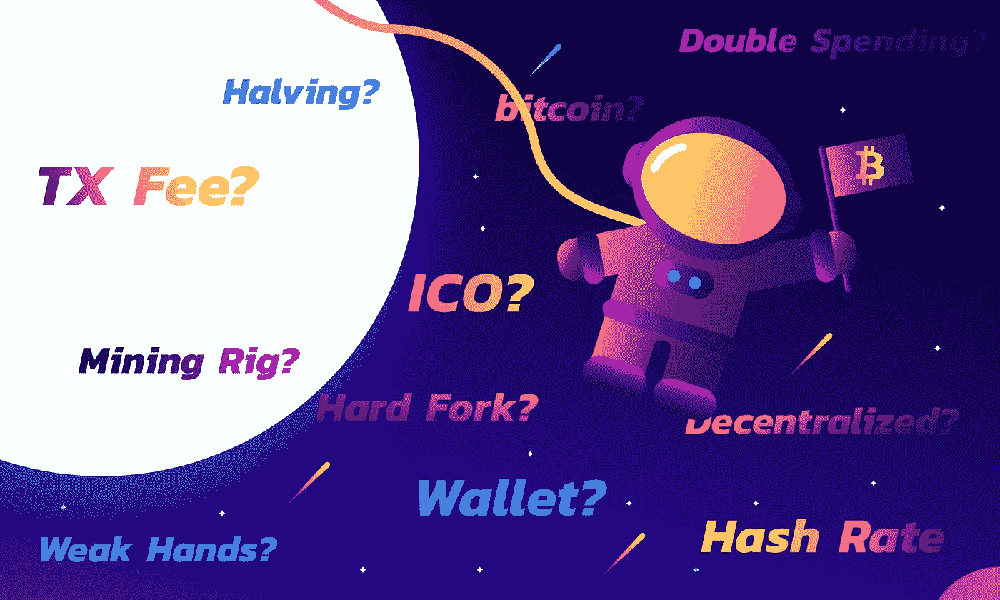
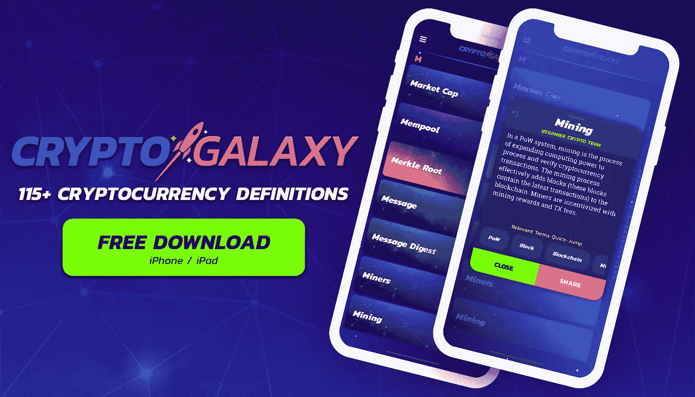

# 初学者加密货币词典。第二部分

> 原文：<https://medium.com/coinmonks/cryptocurrency-dictionary-for-beginners-part-ii-c177b77d158d?source=collection_archive---------2----------------------->

# 让我猜猜…如果我吃了一个比特币披萨，我 30 分钟都不能泡在内存池里…对吗？🍕 🏊‍♂️

不…不完全是。而且你肯定不会用硬叉子吃比特币披萨！欢迎来到“初学者加密货币词典”的第二部分。其中“初学者”应该采取一点点的盐。了解更多的术语和定义，你会看到你进入加密星系的轨道。

附注:我们知道格雷格叔叔…你还在霍德林！

# 比特币

比特币(小写的 b)指的是比特币的数量。例如:0.07 比特币。比特币还有一个 Unicode 字符:₿，也指一定数量的比特币。例如:0.07 ₿

# 比特币披萨

2010 年 5 月 22 日，有史以来第一笔实物比特币交易发生了。这笔交易是用两个比萨饼换 10，000 ₿.在那一天，10，000 ₿的价值约为 30 美元。🍕💸

# 区块高度

块高度是自创世块(块链中的第一块)以来区块链中的块数。由于新的区块会定期添加到区块链中，因此区块高度可以用作时间的度量，表示区块链的大致“年龄”。

# 分散的

分散意味着不受任何单一实体或机构的控制。区块链是去中心化的一个例子；网络中的所有完整节点都拥有区块链的一个副本，而不是一个单独的实体(这将使其集中化。)在分散式系统中，如果一个节点发生故障，网络的其余部分将继续运行，不会出现任何问题！

# 倾斜

下跌是指加密货币价格下跌。价格下跌在价格图表上被直观地识别为“谷”。

# 双重支出

重复消费是指在不止一次交易中消费同一种加密货币的不太可能的行为。区块链的基本原则是，在交易被认为是安全的之前，要求多次确认，以防止重复支出。在 51%的攻击中，理论上可能会发生双重支出。

# 对分

减半是指一种加密货币的采矿奖励减半。如果矿工因验证一个区块而获得 50 个硬币，减半会将采矿奖励减少到 25 个硬币。减半不会只发生一次；它发生在开采了一定数量的区块之后。在比特币的例子中，每挖掘 210，000 个块就会减半(大约每 10 分钟挖掘 1 个比特币块。)在加密货币源代码中规定了减半间隔，它们的出现是为了控制供应。

# 硬叉子

当新分叉(和新协议)与遗留协议不兼容时，就会发生硬分叉。硬分叉的结果是在单独的区块链上创建新的加密货币。比特币现金(BCH)和比特币黄金(BTG)是比特币硬分叉的两个例子。以太坊经典(ETC)和以太零(ETZ)是以太坊硬分叉的两个例子。

# 哈希速率

PoW(工作证明)系统中的哈希速率(也称为哈希能力)是特定加密货币生态系统中计算能力的集合度量。比特币和大多数 PoW altcoins 都有自己的散列率。哈希速率以 h/s(每秒哈希数)为单位来衡量。)h/s 命名的示例包括 Gigahash/s(十亿次 h/s)、Terahash/s(万亿次 h/s)、Petahash/s(千万亿次 h/s)和 Exahash/s(千万亿次 h/s)。

# 图标

ico(首次公开发行硬币)是指初创公司为新的加密货币项目筹集资金。这些资金的筹集方式类似于众筹项目。ICO 的支持者可以用 ICO 的代币换取以太币、比特币、代用币或法定货币。ICO 的主要组成部分是白皮书。

# 极微小

IOTA 由 Tangle 提供动力，是一种为物联网设计的加密货币。IOTA 没有矿工；相反，它依赖于每个交易必须批准网络上的前两个交易。因为依靠交易来帮助保护网络，所以没有交易费用。交易费用的缺乏使 IOTA 网络能够通过物联网“物”之间的纳米支付进行扩展。IOTA 于 2016 年 6 月发布。

# 进口

导入是从纸质钱包中转移资金的一种方法。该方法将纸质钱包私钥(分配有加密货币资金)导入到您的软钱包私钥集合中。这意味着，虽然资金现在在软钱包中，但它们仍然可以从纸钱包的私钥中支出。转移现金是从纸质钱包中转移资金最常用的方法。

# 内存池

mempool(内存池的缩写)包含所有未确认的事务(事务),这些事务还没有被 miner 拾取以添加到块中。如果未确认的 TX 在内存池中停留的时间较长，则有可能 TX 费用设置得太低。

# 采矿奖励

在电力系统中，采矿奖励是少量新的加密货币，奖励给为区块链增加新区块的矿工。采矿奖励是保持区块链和增加网络散列能力的激励。除了采矿奖励，采矿者还可以从已开采区块的交易中获得交易费。

# 采矿钻机

在电力系统中，采矿钻机是用于(通常是专门设计的)开采加密货币的计算机。采矿钻机的硬件和软件要求将根据您要开采的加密货币的不同而有很大差异。

# 纠纷

IOTA 运行的分布式分类帐。Tangle 利用基于有向无环图(DAG)的交易结算来保护网络。所有交易都必须通过少量的计算工作来批准前两个交易。Tangle 允许事务的高可伸缩性，因为并行发生的事务越多，它们被确认的速度就越快。

# 小费

小费是纠纷中未经批准的交易。这意味着该交易还没有得到新交易的批准。

# TX 费用

TX 费用(也称为矿工费用)是来自加密货币交易的费用，该费用分配给矿工，用于将交易添加到区块中。大多数钱包和交易所自动设置 TX 费用，但有些允许您指定。如果交易费用定得太低，交易可能不会被矿商接受。交易费用较高的外发交易往往会被矿商更快地处理。TX 费用与 PoW 和 PoS 系统都相关。

# 钱包

钱包是私人密钥的集合，它允许你使用分配给它的加密货币。加密货币钱包有几种形式，都属于两类:热存储和冷存储。

# 虚弱的手

弱势手是在加密货币市场下跌时恐慌性抛售的个人。弱手的反义词是强手。

# 白名单 ICO

白名单 ICO 是您必须预先注册才能加入的 ICO。利用白名单的 ICO 通常只能提供有限数量的令牌。

Click or tap the image above to download Crypto Galaxy for iOS!

> 如果你喜欢阅读这些加密货币的定义，并且你的内心渴望更多😍，然后拍拍你中等的手，在 iOS 应用商店上查看 [Crypto Galaxy！在一个时髦的用户界面中有 115 种以上的加密货币定义，这将使格雷格叔叔感到惊讶。去月球！！🚀](https://itunes.apple.com/us/app/crypto-galaxy/id1351016558)

加密星系&这篇文章仅用于一般的信息目的。加密银河&本文不是金融、法律或投资建议。如果你正在考虑投资，你应该寻求专业的金融、法律和投资建议。

> [在您的收件箱中直接获得最佳软件交易](https://coincodecap.com/?utm_source=coinmonks)

[**Click to read today’s top story**](http://bit.ly/2G71Sp7)