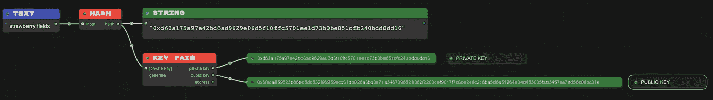
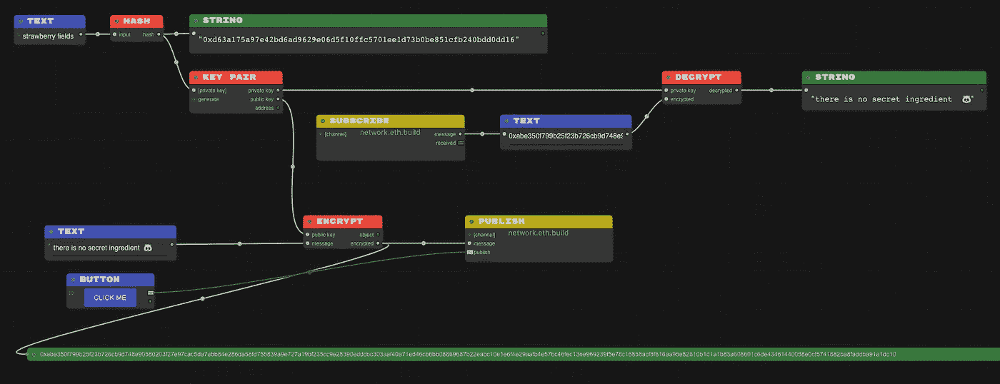

# 加密货币基础:非对称加密

> 原文：<https://medium.com/coinmonks/cryptocurrency-fundamentals-asymmetric-cryptography-e9ea3c75429d?source=collection_archive---------6----------------------->

非对称或公钥加密使用一对密钥—私钥和公钥。顾名思义，私钥不与任何人共享，公钥在网络上共享。这不是一个公平的比较，但想想公开你的电子邮件地址，并对自己保密它的登录密码。

我决定开始使用公钥加密技术来安全地与网络上的人进行通信。我使用了其中一种算法(即 RSA，ECDSA)通过提供“草莓字段”作为密钥对生成算法的输入关键字来生成我的公钥和私钥，或者我也可以使用随机生成的字符串。我把这个关键字和私钥藏在一个保险箱里，不让任何人得到它。并通过网络向每个人广播我的公钥。

公钥有什么用？如果有人决定安全地给我发送一条消息，并且他们想确保没有人在网络上得到该消息的内容。他们将使用接收方的公钥(在本例中是我的公钥)对消息进行算法加密，并将消息广播到网络。

就像宝平大师决定给我发一条信息，但他决定用我的公钥加密，这样就没人能得到真正的信息。即使有人得到了消息，他们也需要我的私钥来解密加密的消息，以揭示其实际内容。

Master Po Ping wants to tell me that “there is no secret ingredient”, so he encrypts it using my Public Key to generate a random looking message “0xabe350f799…” and publishes the encrypted message to the network.

现在，我连接到网络，检查是否有人有话要说。于是我订阅了网络，一个“network.eth.build”的仿制品，等待任何消息。我有一条信息，它说“0xabe350f7…”🤔等等！让我用我的私钥来解密它所说的内容。谢谢阿宝大师！🐼

点击了解数字签名交易[。](https://kngoyal.medium.com/cryptocurrency-fundamentals-digitally-signed-transactions-d78c0d7811c0)

> 加入 [Coinmonks 电报频道](https://t.me/coincodecap)，了解加密交易和投资