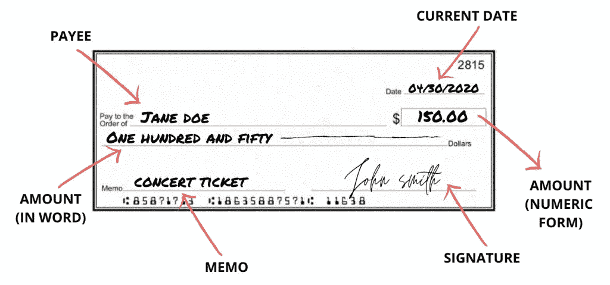
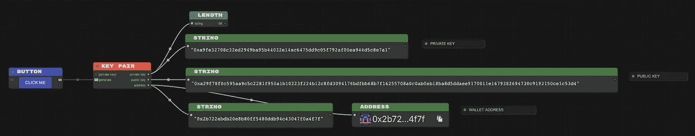
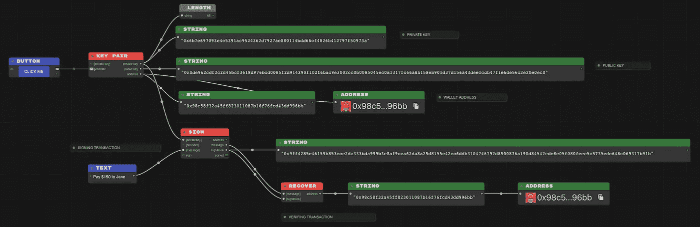

# 加密货币基础:数字签名交易

> 原文：<https://medium.com/coinmonks/cryptocurrency-fundamentals-digitally-signed-transactions-d78c0d7811c0?source=collection_archive---------7----------------------->

让我们通过一个从付款人向收款人签发支票的例子，来看看加密技术如何实现类似于银行账户的数字钱包，以及如何执行和验证交易。

约翰·史密斯的妻子简需要去听音乐会，但是她几乎身无分文。她向她亲爱的丈夫借钱(可能)和她的朋友去看音乐会。约翰·史密斯给她开了一张 150 美元的支票。为了确保信用最终进入 Jane 的账户，她可以在以后提取，他需要正确地填写一些细节金额 150 美元(用数字和文字填写，以确保 Jane 不会在数字形式的末尾添加额外的零)、发行数据、金额的收款人或接收人(在本例中为 Jane ),并用墨水以其独特的笔迹签名。

现在，让我们进入密码世界，看看事情是如何运作的。约翰甚至还没有银行账户，他就去找一位银行高管做 KYC。他被要求证明他的身份并提交某些文件，这导致该主管为他创建了一个银行账户。在密码世界中，银行高管是一段代码。

An oracle creates a Key Pair for John Smith with a Public Key and Private Key

Oracle 生成一个私钥，公钥和钱包地址通过算法使用一系列散列函数从中导出。正如我们在上一篇文章中看到的，很难从结果散列返回到输入。因此，即使每个人都知道 John 的钱包地址和公钥，也几乎不可能得到他的私钥。私钥是约翰不能与任何人分享的东西，如果有人得到它，他们就可以从他的帐户中提取资金，有点类似于在线银行帐户的登录密码。

钱包地址是 John 加密存储的唯一标识符，其他用户可以用它来向 John 汇款，也可以用它来验证 John 发送给其他收款人的交易的有效性。

## **在 Crypto World 中，银行支票等同于什么？**

加密交易的一个非常简化的版本是一条包含要转账的金额、接收人和备忘录的消息。然后 John 用他的私钥对其签名以创建数字签名的交易。

为了让 Jane 兑现由 John 签发的 150 美元支票，她将去银行存入该支票，并且如果 John 有足够的余额，银行主管将验证该支票的真实性，并且将 John 的墨迹签名与银行记录中的墨迹签名进行人工比较。

在去中心化的世界中，没有一个中央权威机构来执行这样的验证。任何参与者都可以获得这个签名的交易和馈入交易的消息，并通过检查从交易中通过算法检索的钱包地址是否是 John 的来验证它确实是由 John 签名的。

John digitally signed a transaction to generate a digital signature and some other party validated if it was indeed signed by John by recovering the Wallet Address.

> 加入 [Coinmonks 电报频道](https://t.me/coincodecap)，了解加密交易和投资