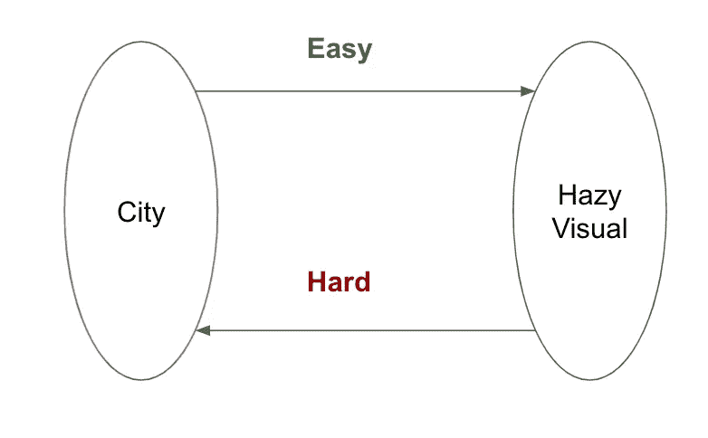
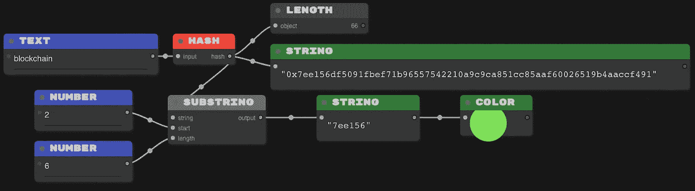
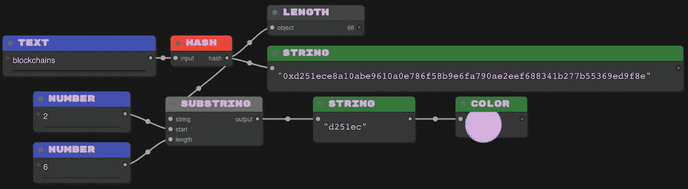
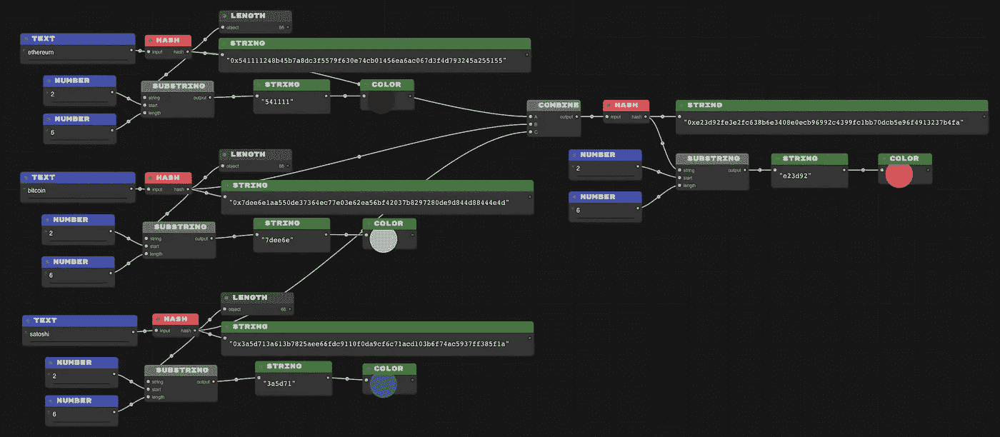

# 加密货币基础:哈希函数

> 原文：<https://medium.com/coinmonks/cryptocurrency-fundamentals-hash-function-a46a1a6eba66?source=collection_archive---------5----------------------->

这是加密货币和区块链基本面系列的第一篇文章。我将尽我所能，用通俗易懂的语言展示典型的形象化的例子。

> 简单是最复杂的。

# 哈希函数到底是什么？

想一想你去过的几个城市，当你想到它们的时候，一些不同地点的模糊画面就会出现在你的脑海中。这是我们大脑为这个城市储存的地图。

想象一个孩子识别不同水果的颜色——红色代表苹果，橙色代表橙子，黄色代表香蕉。那是孩子在大脑中创建的 ***颜色水果*** 图。

**散列函数**是一个数学函数，它将一组输入元素映射到一组输出元素。问题是输出空间是相当任意的，给定一个输出，很难猜测对应的输入是什么。

我认为你能够从城市名称中得到你头脑中模糊的视觉效果，但是如果有人偷偷摸摸地得到了这些模糊的视觉效果，他们将无法说出这是哪个城市。

这就像一扇**活板门**，你可以轻易进去，却很难出来。

**SHA-512** 是一个散列函数，它将任何输入字符串映射成十六进制的 64 个字符长的字符串。

## **什么是十六进制基数？**

我们采用十进制，十进制以 10 为基数，十六进制以 16 为基数，更多的[在这里](https://simple.wikipedia.org/wiki/Hexadecimal)。

让我们以两个输入字符串“区块链”和“区块链”为例，看看它们的输出是如何不相关的。我们将采用 **SHA-512** 散列输出的前 6 个字符来描述 RGB 方案中的十六进制颜色代码。

For input string “**blockchain**” first six characters of the hash are “**7ee156**” that is fluorescent green.

For input string “**blockchains**” first six characters of the hash are “**d251ec**” that is a shade of magenta.

注意:输出中的前两个字符是 **0x** ，这是一个符号，表示后面的字符串是十六进制的。

你几乎可以散列任何东西，包括文本、文件内容或图像。它们在存储系统和数据库中大量用于跟踪数据文件和对象的版本。

输出可以被组合并按顺序散列多次，使得检索起始值几乎不可能。

Hash of Hashes

点击阅读不对称加密[。](https://kngoyal.medium.com/cryptocurrency-fundamentals-asymmetric-cryptography-e9ea3c75429d)

> 加入 coin monks 电报频道，了解加密交易和投资