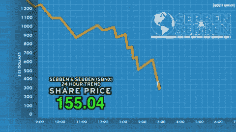
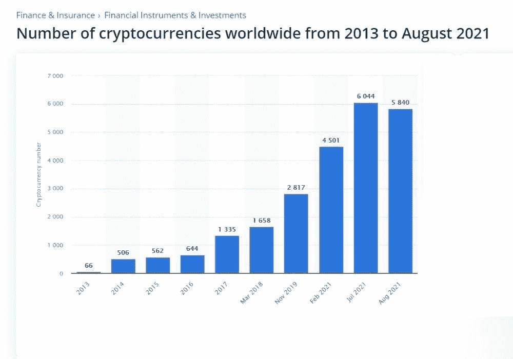

# 市场崩溃时的加密货币

> 原文：<https://medium.com/coinmonks/cryptocurrency-in-the-event-of-a-market-meltdown-1f026c546458?source=collection_archive---------3----------------------->

近年来，加密货币的受欢迎程度激增，这是有充分理由的。它的分散性使得它成为法定货币的一个有吸引力的替代品；它的国际影响力意味着企业可以与世界各地的人们接触；当然，还有巨大利润的潜力。

据 TechJury 报道，2021 年 2 月，比特币的市值达到了**10722.1 亿美元**。此外，到 2026 年，加密货币的市场规模将达到**10.877 亿美元。**

然而，加密货币的价格波动是出了名的，所以如果它面临全球市场动荡，会发生什么？如果全球市场崩溃，加密货币会作何反应？

# **以下是加密货币可能面临市场崩溃的一些方式:**

> **1。法定货币影响**

要理解加密货币对全球市场崩溃的反应，你必须先理解法定货币。法定货币受到政府法规或法律的支持，这使得它不同于商品货币，如金币或银币。因此，如果所有国家立刻决定法定货币不再是法定货币，会发生什么？

简而言之，如果这种情况发生，加密货币可能会出现巨大的波动。不过，这可能不会导致它们完全失败。全球经济形势有多糟糕，将决定世界各地的人们能否集体转向加密货币，因为许多人仍然非常依赖第三方银行系统。

如果危机发生，加密货币可能需要数年时间才能被大规模采用，到那时，可能已经太晚了。各国在经济上也存在巨大差异，一个国家比另一个国家受到的影响更大，这取决于推动其经济发展的规模和行业。

经济危机在各个地区并不一致，其影响也不一样。金融崩溃不会立即让每个国家的经济螺旋式下降，走向崩溃——尽管在没有其他民族国家足够的帮助来拯救那些遭受可怕后果的人的情况下，事情变得绝望是可以想象的。

> **2。股市影响**

加密货币基于区块链，使用**分散系统来验证交易。**因此，加密货币受到公众信心的影响；如果消费者对某项资产没有信心，或者认为它们会贬值，对它的需求就会下降，价格也会随之下降。

在检查加密货币时，我们需要寻找流动性之类的因素(在任何给定时间你能卖出多少？)和成交量(有多少人在买？);这两个因素影响价格，因为供给和需求不断相互调整。

加密货币市场现在非常不稳定，这意味着**价格可能在任何时候上涨或下跌**——你对此无能为力。

> **3。资产影响**

加密货币以价格波动大而闻名。自从加入交易所以来，一些加密货币已经贬值了 90%以上。著名的例子包括 bitConnect，它很快获得了巨大的人气，但在推出三个月后就悲惨地失败了。

许多公司没能在市场中生存下来，遭遇了类似的命运。全球知名的加密货币比特币在 2018 年曾面临高达 68%的**下跌。这些波动可能会让潜在投资者感到不安，因此了解每种资产如何影响市场状况至关重要。**

在投资任何一项资产之前，一定要考虑所有关于其风险因素的信息。例如，几种不同的工具可以帮助您按加密货币或资产类型监控价格波动。了解这些影响者将有助于你管理风险，更好地定位你的投资组合，以获得未来的利润。

许多交易所提供多种资产类别当前定价信息的**实时更新**，让投资者在选择将资金配置到交易所平台上的硬币或代币时做出明智的决定。

当接近数字货币投资策略时，许多新手投资者寻求激进的投资策略，希望实现利润最大化；然而，研究表明，随着时间的推移，寻找低波动性的方法可能会更有利可图。

低波动性策略的特点通常是**加密货币**类型的广泛多样化，这意味着多头头寸通常与空头头寸相平衡，以最大限度地减少价格下跌期间的风险敞口。

许多情况可能会影响加密货币的价格下降；因此，如果市场趋势发生意外变化，拥有平衡的投资会让你迅速做出反应。

低波动性投资组合包括**至少十种顶级加密货币的等额投资。**低波动性投资组合在整个市场周期中提供一致性，同时在牛市中提供比传统股票更高的预期回报，而不会显著增加相关风险。

> **4。技术影响**

加密货币是通过高级加密技术编码的数字货币。这些技术使得加密货币具有潜在的匿名性、分散性和安全性。加密货币网络上的所有用户都必须批准每笔交易，才能被验证为合法交易。

自 2009 年创建以来，加密货币的交易量一直很大，随着时间的推移，数百种不同的硬币被创造出来。然而，目前在全球各种交易所有大约 5840 种不同的加密货币。许多加密硬币具有独特的功能，吸引着寻找特定功能的用户。

Source: [**Coders Daddy**](https://www.codersdaddy.com/)

人们认为，这些替代硬币现在代表着全球超过 10000 亿美元的整个市值，许多人预计未来的增长将呈指数级增长，因为越来越多的人开始用美元或欧元等法定货币进行交易。每一次技术进步都伴随着机遇和挑战。

虽然全球股市继续以创纪录的速度增长，但许多人开始担心如果发生经济危机会发生什么，这对加密货币的价格会产生什么影响？

与之前相比，全球股市在 2011 年确实**大幅下跌。尽管如此，对于加密货币来说，它们一直在稳步增长，然后在当年晚些时候再次稳定在大约每枚**3 美元。****

这就引出了一个问题，如果另一场全球金融危机爆发，当加密货币价格继续飙升时，其他传统市场将如何反应？你如何利用加密硬币赚钱？答案并不简单，因为虽然有些在今天仍有价值，但其他的看起来一点也不看好。

> **5。相关性的影响**

如果加密货币保持与其他市场的相关性，甚至变得更加相关，它就能生存下来。这是因为虽然加密货币不附属于任何央行或政府，但它确实会根据需求而上涨或下跌——所以它和法定货币之间仍然存在某种联系。

假设它遭遇了像我们在 2008 年看到的那种全球崩溃。在这种情况下，投资者可能会从股票 T18 转向加密货币作为替代，至少在他们看到自己的加密投资也在下降等下滑之前是如此。

但无论如何，在大多数危机中，减少对传统金融机构的依赖可能有利于加密货币。世界可能不需要另一个雷曼兄弟事件。

根据 Sifr 的分析团队开发的 90 天相关性矩阵，比特币与美国股票标准普尔 500 指数的相关性为负 0.14。这是一个统计上的中性位置，因为 1 是一个**完美正相关**的符号。另一方面， **-1 是一个完全否定的关系。**

顶级加密货币(包括以太币、莱特币和 ripple)与股票之间的相关性略强，在大部分时间里保持在-0.20，但可以看到明显的波动。

**注:** Sifr 为金融机构提供全球现金证券集中清算和结算的风险监控服务。

# **收尾**

任何固定的中央机构都不监管加密货币。这既是他们**最大的长处，也是最大的弱点**。没有中央管理机构控制加密货币的价格或为交易所制定有约束力的政策，这意味着价格可能会大幅波动。

加密货币非常适合那些希望成为他们银行的人，因为你不必回答任何第三方关于你的钱的问题。另一方面，如果没有监管，就有可能出现市场操纵。

由于没有监管或中央权力机构设定价格，**加密货币市场难以置信地不稳定，并且很容易被肆无忌惮的行为**操纵。

Mt Gox 丑闻仍然是 crypto 作为一个行业最大的失败之一，因为数百万美元的损失是由于交易所所有者和员工的黑客行为和欺诈行为造成的。

联系印度的一家[加密货币开发公司](https://www.pixelcrayons.com/cryptocurrency-development) 进行加密货币的平价开发。

> 加入 [Coinmonks 电报频道](https://t.me/coincodecap)，了解加密交易和投资

**检查我们的服务:**

## [Web 应用程序开发服务](https://www.codersdaddy.com/website-app-development-company-agency)、[移动应用程序开发服务](https://www.codersdaddy.com/mobile-app-development)、[印度 UI UX 设计服务](https://www.codersdaddy.com/ui-ux-design-service-company)、[印度 IT 员工扩充服务](https://www.codersdaddy.com/it-staff-resource-augmentation)、[网站维护&支持服务](https://www.codersdaddy.com/website-app-maintenance-support)、[雇佣专门的软件程序员](https://www.codersdaddy.com/hire-developer-engineer-programmer/)、[雇佣印度 Android 应用程序开发人员](https://www.codersdaddy.com/hire-developer-engineer-programmer/android-app)、[雇佣印度 iPhone 应用程序开发人员](https://www.codersdaddy.com/hire-developer-engineer-programmer/ios-iphone-app)、[雇佣印度 PHP 开发人员](https://www.codersdaddy.com/hire-developer-engineer-programmer/php-web)、  [雇佣印度. Net 开发者](https://www.codersdaddy.com/hire-developer-engineer-programmer/dot-net)，[雇佣印度 Laravel 开发者](https://www.codersdaddy.com/hire-developer-engineer-programmer/laravel)，[数字营销服务](https://www.codersdaddy.com/digital-marketing-agency-company-firm)，[印度 SEO 服务](https://www.codersdaddy.com/seo-service-company-agency-firm)，[印度 ORM 服务](https://www.codersdaddy.com/online-reputation-management-service-company)，[印度 SEO 内容写作服务](https://www.codersdaddy.com/content-writing)，[雇佣印度 WordPress 开发者](https://www.codersdaddy.com/hire-developer-engineer-programmer/wordpress-web)，[雇佣印度 Drupal 开发者](https://www.codersdaddy.com/hire-developer-engineer-programmer/drupal)，[雇佣印度 Angular 开发者](https://www.codersdaddy.com/hire-developer-engineer-programmer/angular-js)，

## 另外，阅读

 [## 最佳加密交易所| 2021 年十大加密货币交易所

### 加密货币交易所的加密交易需要了解市场，这可以帮助你获得利润…

blog.coincodecap.com](https://blog.coincodecap.com/crypto-exchange)  [## 2021 年 9 大最佳加密借贷平台

### 当谈到加密货币贷款时，大量因素等同于良好的收入状况。此外，借款的一部分…

blog.coincodecap.com](https://blog.coincodecap.com/crypto-lending)  [## 2021 年最佳加密交易机器人(免费和付费)

### 2021 年币安、比特币基地、库币和其他密码交易所的最佳密码交易机器人。四进制，位间隙…

medium.com](/coinmonks/crypto-trading-bot-c2ffce8acb2a)  [## 最佳 4 个加密交易信号电报通道

### 这是乏味的找到正确的加密交易信号提供商。因此，在本文中，我们将讨论最好的…

medium.com](/coinmonks/best-crypto-signals-telegram-5785cdbc4b2b)  [## BlockFi 评论 2021:利弊和利率

### 今天，我们提出了一个全面的 BlockFi 评论，这是一个成立于 2017 年的加密贷款平台，拥有其…

blog.coincodecap.com](https://blog.coincodecap.com/blockfi-review)  [## 如何在印度购买比特币？2021 年购买比特币的 7 款最佳应用[手机版]

### 如何使用移动应用程序购买比特币印度

medium.com](/coinmonks/buy-bitcoin-in-india-feb50ddfef94)  [## 加密税务软件——五大最佳比特币税务计算器[2021]

### 不管你是刚接触加密还是已经在这个领域呆了一段时间，你都需要交税。

medium.com](/coinmonks/best-crypto-tax-tool-for-my-money-72d4b430816b)  [## Pionex 评论-被动交易者的简单交易机器人

### 在本文中，我们将回顾 Pionex，它提供了加密交易机器人自动化工具，集成了一个…

blog.coincodecap.com](https://blog.coincodecap.com/pionex-review-exchange-with-crypto-trading-bot)  [## 存储比特币的最佳加密硬件钱包[2021]

### 保管您的数字资产很容易，但找到正确的存储方式却是一项繁琐的任务。在线钱包有一个风险…

blog.coincodecap.com](https://blog.coincodecap.com/best-hardware-wallet-bitcoin)