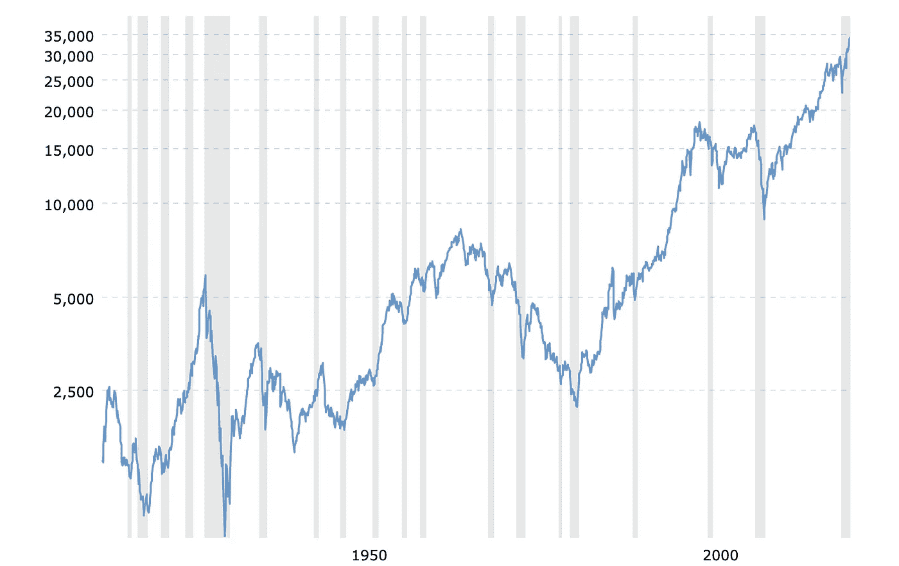
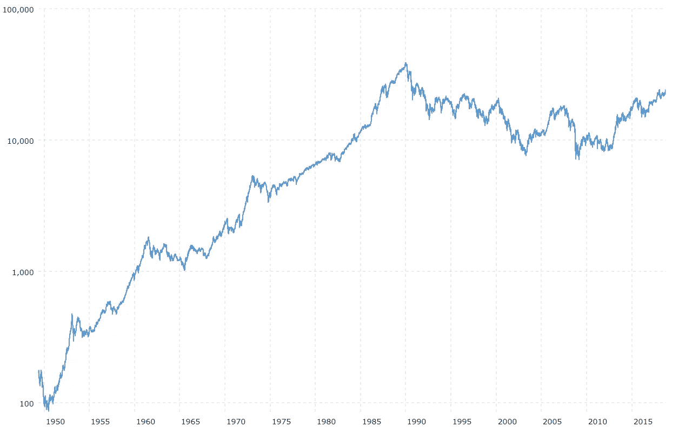
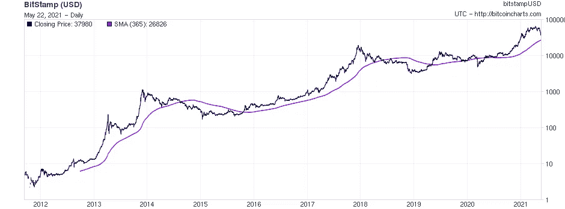
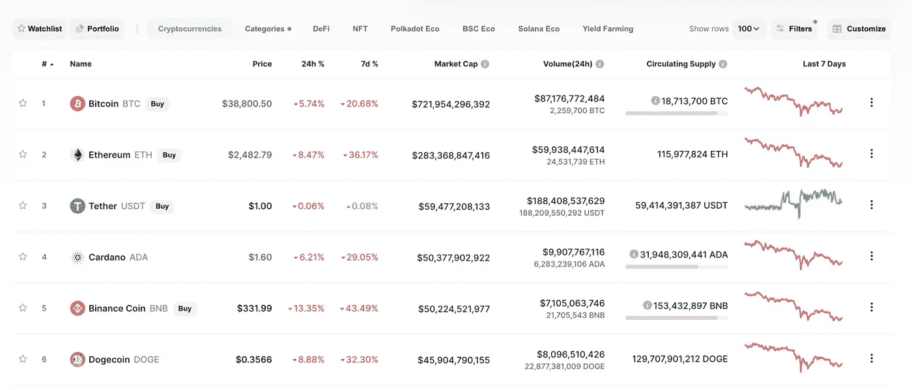

# 40.1 万人的加密货币投资

> 原文：<https://medium.com/coinmonks/cryptocurrency-investment-for-401k-guys-1e22556c8433?source=collection_archive---------4----------------------->

在新冠肺炎封锁期间，我成了一个疯狂的加密员。由于无事可做或无所购买，又有大量的刺激计划，一年后我的加密投资增加了 x4(几天前是 x6)。作为一个慷慨的人，我想把关于 crypto 的好消息传播给我的朋友们，这样他们就可以分享收益(也许会让我赚更多的钱)。不幸的是，他们中的大多数人热衷于购买指数基金，并谴责 crypto 是投机垃圾。我觉得这有点冒犯，因为股票市场在某种程度上也是投机垃圾。

# 每个人都忘了石头也会沉下去

Dow Jones Industrial Average over time (but millenials only remember the 1980s onward)

Japan’s stock index, the Nikkei 225\. It just recently recovered to its peak[https://www.macrotrends.net/2593/nikkei-225-index-historical-chart-data](https://www.macrotrends.net/2593/nikkei-225-index-historical-chart-data)

在某种程度上，美国股市因央行政策和不断涌入标准普尔 500 指数的新资金(相对于退休基金)而变得平稳，但最终人们会退休。如果在某个时候美国政府不能阻止经济下滑，看起来你会想持有股票以外的东西。

# 多样化:为什么连正常人都应该拥有密码

我仍然持有大量股票(这是美国的方式)，但我对 2020 年 3 月感到紧张。很难看到你的投资组合亏损 30%!通常的答案是保持分层投资结构(应急基金、中期投资和退休账户)，并在股票、债券、房地产和一点黄金之间分散投资组合。不幸的是，现在债券的收益率非常低，疫情的房地产市场出现分化，独栋房屋升值，写字楼贬值。所以我们需要别的东西来分散投资组合。此外，尽管加密货币的高波动性众所周知，但我们可以通过分散投资来降低我们的整体投资组合风险(请不要太多！)因为它与我们的其他资产并不完全相关。在我们继续之前，让我们来谈谈大多数人购买加密货币的两个最大原因

# 为什么为什么要加密呢？

## 比特币作为对冲法定通货膨胀的工具

比特币正获得“数字黄金”的美誉。供应量是有限的(2100 万)，它作为一种越来越被接受的价值储存手段有 12 年的历史，而且它比实物黄金更容易传输和储存。如果对比特币的需求和对黄金的需求一样多，那么以 2021 年的价格计算，比特币应该会达到每枚 20 万 UD。此外，由于疫情之后的财政和货币刺激，人们普遍担心通货膨胀，因此持有一些黄金和/或比特币作为对冲通胀的手段可能是有意义的。

## 作为技术手段的加密

加密将会像软件吃掉世界一样吃掉世界。我们看到金融交易所、云计算、数字现金、衍生品、收藏品、游戏和神谕都在进入加密领域。有很多炒作和愚蠢的项目，所以人们喜欢贬低它，但最终中央银行，商业银行，大型技术，以及几乎所有其他东西都将实现加密。不能保证当前的任何一组项目都能捕捉到这个领域正在产生的价值(脸书和中国也想主宰这个领域)，但我们将来都会使用区块链的技术。

# 所以我的推荐是什么？

## 将你投资组合的 3-5%进行加密。

我是通过阅读一堆主流金融文章得到这个数字的([https://finance . Yahoo . com/news/much-crypto-investment-portfolio-110000893 . html](https://finance.yahoo.com/news/much-crypto-investment-portfolio-110000893.html)[https://time . com/next advisor/investing/crypto currency/how-much-your-portfolio-should-be-crypto/](https://time.com/nextadvisor/investing/cryptocurrency/how-much-your-portfolio-should-be-crypto/))数字各不相同，但我认为如果你有一个中产阶级的投资组合，那么就不值得花时间去管理少于 3%的资产，因为另一方面，如果你考虑到你的投资有合理的机会变成 0，5%也开始有点高了。(加密被禁止，交易所被黑，你的硬币被竞争对手取代)。

但是即使 3%听起来太多了，也要投入 100 美元。一旦你习惯了管理你的硬币，并开始看到它们随着时间的推移而升值，你实际上可以增加你的配置到更重要的水平。

## 但是不要一次全买

现在，密码市场正在变得疯狂。BTC 在 2020 年 12 月达到 10000 米，在 2021 年 5 月达到 65000 米和 30000 米。当你读到这篇文章的时候，BTC 可能已经回到 1 万或 10 万公里了。解决这种极端波动问题的一个简单方法是平均成本。DCA 是指你在一段较长的时间内慢慢买入，直至达到你的目标配置。假设你的投资组合中有 95k，想要达到 5%的加密分配。如果你每天购买价值 14 美元的密码，那么大约一年后，你将达到 14 * 365 = 5000 美元+费用，5%的分配。如果你因为试图每日买入而受到高额费用的打击，那就换成每周或每月的 DCA。

In cases you’re interested, here’s the 1 year moving average for Bitcoin. There’s always pain when investing in Bitcoin, but at least this strategy minimizes some of it.

## 买什么

买大盘币。较小的项目往往会增长然后崩溃，所以长期持有它们是有风险的。历史上，比特币在加密生态系统中约占总价值的 45 %- 55 %,因此持有比特币可能就足够了。令人难以置信的是，比特币实际上是你能买到的最稳定的价值储存手段和最值得信赖的加密货币！

以太坊是 crypto 其他部分生长的基础。大多数区块链(Web 3)应用程序都运行在以太坊上，包括各种其他加密货币和金融服务，因此对以太坊的投资就像是对这个领域的投资。他们还将很快推出一系列新功能，使持有 ETH 更具吸引力，因此你的投资应该在其价格升值的基础上积极增长。

只是为了好玩，以下是 2021 年 5 月 22 日 coinmarketcap.com 最有价值的硬币。除了比特币或以太币，其他任何东西的市值基本上都与 Dogecoin 相当，所以如果你想避免纯粹炒作的机会，就不要买除了 BTC 和以太币以外的任何东西。

Only BTC, ETH, and USDT are consistently on this chart, and USDT is not an investment asset.

## 去哪里买

在比特币基地上购买。他们收费最高，但也最可靠。我不认为在这一点上自我监管是有意义的，除非你真的认为政府会为你的比特币而来。我意识到在许多国家这是一个合理的担忧，所以当你最终拥有一大堆硬币时，你可能会想投资一个硬件钱包。

# 所以去买你的硬币吧，趁它们还便宜！

在某个时候，你将使用央行数字货币，你的目标日期基金将包含各种混合加密资产。尽管目前我们生活在一个加密尚未完全融入我们金融系统的世界。因此，虽然加密是我们一生中见过的最大的投资机会，而且它足够安全，机构正在购买它。我认为，如果一个养老基金认为它可以安全地分散到加密领域，那么你也该这么做了。

> 加入 [Coinmonks 电报频道](https://t.me/coincodecap)，了解加密交易和投资

## 另外，阅读

 [## 最佳免费加密交易机器人——前 16 名比特币交易机器人[2021]

### 2021 年币安、比特币基地、库币和其他密码交易所的最佳密码交易机器人。四进制，位间隙…

medium.com](/coinmonks/crypto-trading-bot-c2ffce8acb2a)  [## 最佳 6 个加密交易信号电报通道

### 这是乏味的找到正确的加密交易信号提供商。因此，在本文中，我们将讨论最好的…

medium.com](/coinmonks/best-crypto-signals-telegram-5785cdbc4b2b) 

*   [尤霍德勒 vs 科恩洛安 vs 霍德诺特](/coinmonks/youhodler-vs-coinloan-vs-hodlnaut-b1050acde55a) | [隐蝠 vs 哈斯博特](https://blog.coincodecap.com/cryptohopper-vs-haasbot)
*   [币安 vs 北海巨妖](https://blog.coincodecap.com/binance-vs-kraken) | [美元成本平均交易机器人](https://blog.coincodecap.com/pionex-dca-bot)
*   [如何在印度购买比特币？](/coinmonks/buy-bitcoin-in-india-feb50ddfef94) | [WazirX 评论](/coinmonks/wazirx-review-5c811b074f5b) | [BitMEX 评论](https://blog.coincodecap.com/bitmex-review)
*   [比特币主根](https://blog.coincodecap.com/bitcoin-taproot) | [Bitso 回顾](https://blog.coincodecap.com/bitso-review) | [排名前 6 的比特币信用卡](/coinmonks/bitcoin-credit-card-bc8ab6f377c6)
*   [双子座 vs 比特币基地](https://blog.coincodecap.com/gemini-vs-coinbase) | [比特币基地 vs 北海巨妖](https://blog.coincodecap.com/kraken-vs-coinbase)|[coin jar vs coin spot](https://blog.coincodecap.com/coinspot-vs-coinjar)
*   [印度加密交易所](/coinmonks/bitcoin-exchange-in-india-7f1fe79715c9) | [比特币储蓄账户](/coinmonks/bitcoin-savings-account-e65b13f92451) | [Paxful 审核](/coinmonks/paxful-review-4daf2354ab70)
*   [杠杆令牌](/coinmonks/leveraged-token-3f5257808b22) | [最佳密码交易所](/coinmonks/crypto-exchange-dd2f9d6f3769)
*   [Godex.io 审核](/coinmonks/godex-io-review-7366086519fb) | [邀请审核](/coinmonks/invity-review-70f3030c0502) | [BitForex 审核](/coinmonks/bitforex-review-c4bb28d9e271) | [HitBTC 审核](/coinmonks/hitbtc-review-c5143c5d53c2)
*   [Crypto.com 费用](/coinmonks/binance-fees-8588ec17965) | [僵尸加密审查](/coinmonks/botcrypto-review-2021-build-your-own-trading-bot-coincodecap-6b8332d736c7) | [替代品](https://blog.coincodecap.com/crypto-com-alternatives)
*   [MXC 交易所评论](/coinmonks/mxc-exchange-review-3af0ec1cba8c) | [Pionex vs 币安](https://blog.coincodecap.com/pionex-vs-binance) | [Pionex 套利机器人](https://blog.coincodecap.com/pionex-arbitrage-bot)
*   [我的加密副本交易经历](/coinmonks/my-experience-with-crypto-copy-trading-d6feb2ce3ac5) | [比特币基地评论](/coinmonks/coinbase-review-6ef4e0f56064)
*   [加密货币储蓄账户](/coinmonks/cryptocurrency-savings-accounts-be3bc0feffbf) | [赌注加密](https://blog.coincodecap.com/staking-crypto) | [StealthEX 评论](/coinmonks/stealthex-review-396c67309988)
*   [BigONE 交易所评论](/coinmonks/bigone-exchange-review-64705d85a1d4) | [CEX。IO 审查](https://blog.coincodecap.com/cex-io-review) | [交换区审查](/coinmonks/swapzone-review-crypto-exchange-data-aggregator-e0ad78e55ed7)
*   [最佳比特币保证金交易](/coinmonks/bitcoin-margin-trading-exchange-bcbfcbf7b8e3) | [比特币保证金交易](https://blog.coincodecap.com/bityard-margin-trading) | [Prokey 点评](/coinmonks/prokey-review-26611173c13c)
*   [加密保证金交易交易所](/coinmonks/crypto-margin-trading-exchanges-428b1f7ad108) | [赚取比特币](/coinmonks/earn-bitcoin-6e8bd3c592d9) | [Mudrex 投资](https://blog.coincodecap.com/mudrex-invest-review-the-best-way-to-invest-in-crypto)
*   [WazirX vs CoinDCX vs bit bns](/coinmonks/wazirx-vs-coindcx-vs-bitbns-149f4f19a2f1)|[block fi vs coin loan vs Nexo](/coinmonks/blockfi-vs-coinloan-vs-nexo-cb624635230d)
*   [BlockFi 信用卡](https://blog.coincodecap.com/blockfi-credit-card) | [如何在币安购买比特币](https://blog.coincodecap.com/buy-bitcoin-binance)
*   [加密副本交易平台](/coinmonks/top-10-crypto-copy-trading-platforms-for-beginners-d0c37c7d698c) | [五大 BlockFi 替代方案](https://blog.coincodecap.com/blockfi-alternatives)
*   [CoinLoan 评论](/coinmonks/coinloan-review-18128b9badc4)|【Crypto.com 评论】||[火币保证金交易](/coinmonks/huobi-margin-trading-b3b06cdc1519)
*   [顶级付费加密货币和区块链课程](https://blog.coincodecap.com/blockchain-courses) | [币安评论](/coinmonks/binance-review-ee10d3bf3b6e)
*   [在美国如何使用 BitMEX？](https://blog.coincodecap.com/use-bitmex-in-usa) | [BitMEX 回顾](https://blog.coincodecap.com/bitmex-review) | [币安 vs Bittrex](https://blog.coincodecap.com/binance-vs-bittrex)
*   [最佳免费加密信号](https://blog.coincodecap.com/free-crypto-signals) | [YoBit 评论](/coinmonks/yobit-review-175464162c62) | [Bitbns 评论](/coinmonks/bitbns-review-38256a07e161)
*   [OKEx 评论](/coinmonks/okex-review-6b369304110f) | [Kucoin 交易机器人](/coinmonks/kucoin-trading-bot-automate-your-trades-8cf0ca2138e0) | [期货交易机器人](/coinmonks/futures-trading-bots-5a282ccee3f5)
*   [比特币基地跑马圈地](https://blog.coincodecap.com/coinbase-staking) | [Hotbit 评论](/coinmonks/hotbit-review-cd5bec41dafb) | [KuCoin 评论](https://blog.coincodecap.com/kucoin-review)
*   [最佳加密交易信号电报](/coinmonks/best-crypto-signals-telegram-5785cdbc4b2b) | [MoonXBT 评论](/coinmonks/moonxbt-review-6e4ab26d037)
*   [Coinswitch 俱吠罗评论](/coinmonks/coinswitch-kuber-review-1a8dc5c7a739) | [电网交易机器人](https://blog.coincodecap.com/grid-trading) | [比特币基地收费](/coinmonks/coinbase-fees-831e77d4f2c5)