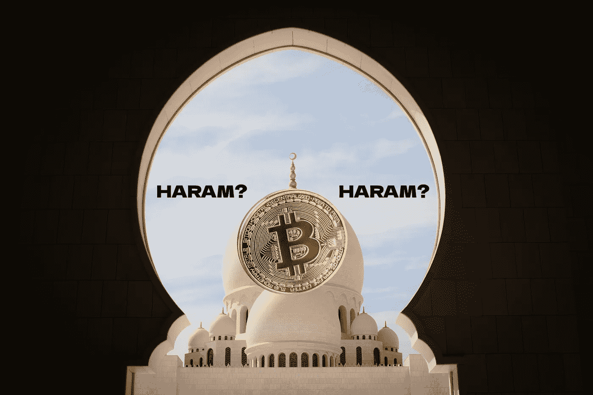

# 加密货币被认为是圣地

> 原文：<https://medium.com/coinmonks/cryptocurrency-is-considered-haram-51792eb26651?source=collection_archive---------10----------------------->

## 受中央银行影响的决定。内部解决方法…

由于加密货币交易包含某些风险因素，印度尼西亚伊斯兰教法合规权威机构 MUI 打出了“哈拉姆”牌。

Photo by [SHAHBAZ AKRAM](https://www.pexels.com/@samrana3003?utm_content=attributionCopyText&utm_medium=referral&utm_source=pexels) from [Pexels](https://www.pexels.com/photo/photo-of-sheikh-zayed-grand-mosque-center-during-daytime-1883409/?utm_content=attributionCopyText&utm_medium=referral&utm_source=pexels) | Edit: Cryptic Liberation

> “根据伊斯兰教法，加密货币作为一种支付手段是被禁止的，因为它们带有……