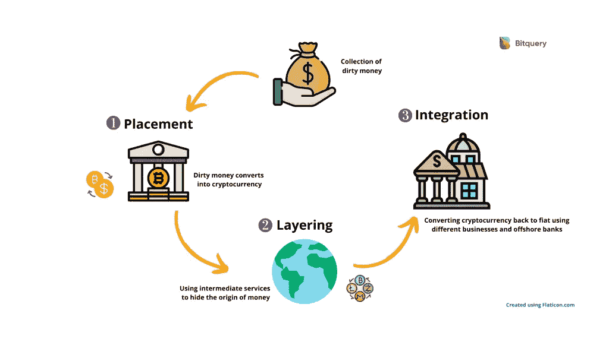
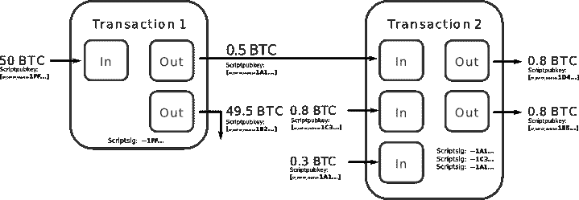
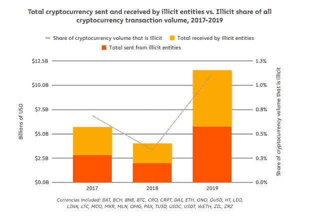

# 加密货币洗钱解释

> 原文：<https://medium.com/coinmonks/cryptocurrency-money-laundering-explained-bitquery-blog-938d27bd30f4?source=collection_archive---------0----------------------->

20 世纪 20 年代，美国黑帮老大艾尔·卡朋通过勒索、卖淫、赌博和私酒赚取了数百万美元。不过，他需要证明自己收入的合法来源。因此，他买下了多家洗衣店，将自己的非法收入与合法收入混在一起。歹徒选择自助洗衣店是因为他们是现金交易。许多人认为这是“洗钱”一词的起源

尽管如此，艾尔·卡朋还是在 1931 年 10 月因逃税被起诉并定罪，因为在美国，洗钱直到 1986 年才在 T2 成为犯罪。

# 什么是洗钱？

洗钱是将从非法活动中获得的金钱合法化的非法过程。洗钱一词已被用于商业和金融犯罪。总的来说，洗钱是对涉及加密货币、证券、银行、信用卡和传统货币的金融系统的滥用，包括绕过国际制裁和恐怖主义融资。

在数字货币领域，洗钱给全球监管机构带来了更大的挑战。

# 加密货币洗钱的工作原理

洗钱过程包括创建一个复杂的资金路径，以消除资金来源的直接关联，然后通过将其融入主流经济来重新获得资金。

一般来说，洗钱流程包括三个步骤。我们将讨论这个过程如何在加密货币的背景下工作。

## 安置

可以在交易所和其他加密服务中使用法定货币或其他加密货币来获得加密货币。犯罪分子使用非法资金购买加密货币，从而将新货币引入系统。这是犯罪分子最容易受到攻击的地方，通过实施严格的 KYC(了解你的客户)解决方案，可以确定资金的所有权。

如今，加密服务对金融交易法规的遵从程度各不相同。许多交易所都遵循监管要求，并实施了 KYC/反洗钱解决方案来识别资金来源。然而，许多加密服务落后于合规要求，容易受到加密货币和比特币洗钱的攻击。

## 分层

分层是下一个阶段，犯罪分子使用不同类型的加密服务来创建复杂的交易线索，以消除与资金来源的直接关联。

这些交易在区块链上都是可见的。然而，像翻滚器/混合器、加密赌博、交换、DeFi(分散金融)等服务..会使追踪这些资金变得困难，在某些情况下甚至是不可能的。

我们的 [Coinpath](https://bitquery.io/products/coinpath) 技术帮助您以高效的方式[追踪区块链](https://blog.bitquery.io/coinpath-blockchain-money-flow-apis)上的资金流动。

## 综合

一旦资金来源无法追踪，加密货币洗钱的最后阶段就是使资金合法化。为此，犯罪分子通过各种加密服务处理资金，提供固定网关。

然而，洗钱者必须解释他们是如何赚到这笔钱的。有许多方法可以做到这一点；有时，犯罪分子会创建新的业务，提供服务并接受加密支付。然后通过离岸银行服务将密码转换成菲亚特。

另一个例子是，犯罪分子利用赌博和游戏网站 ico 来显示投资收益。

# 加密洗钱者滥用的常见服务

总的来说，我们发现以下服务是加密货币洗钱中使用最多的。

加密滚桶或混合服务增强了个人和业务相关交易的隐私。庄家将不同来源的资金混在一起，使资金来源无法识别。

例如，混合器将事务分成多个更小的事务，然后再将它们组合起来。他们重复这个过程无数次，每次，很难确定哪些资金属于哪个来源。

洗钱者在不同的步骤中多次使用 mixer，使得资金无法识别。通常，犯罪分子在使用任何不倒翁之前和之后通过多次跳跃转移资金。

Cryptocurrency Mixer spiting and mixing Bitcoins

分散式交易所(DEX)大多不受监管，不提供菲亚特网关。然而，DEX 可用于将一种加密货币转换成另一种加密货币。例如，黑客可以使用去中心化的交易所将窃取的以太坊转化为比特币，从而难以追踪。此外，世界各地有许多不受监管的交易所，提供菲亚特网关也给监管机构带来了挑战。

P2P 交易所也是倾倒从加密黑客那里获得的非法资金的主要渠道之一。罪犯可以以对等的方式与菲亚特交换密码，这是很难追踪的。然而，最大的 P2P 交易所 [LocalBitcoins 最近实施了反洗钱](https://localbitcoins.com/blog/aml-features-update/)解决方案来控制洗钱活动。

Zcash、Monero、Verge 等加密货币都是注重隐私的加密货币。如果资金被转换成这些硬币，跟踪他们几乎是不可能的。例如，在撰写本文时，Monero 还没有交易监控系统。然而，我们的[coin path API](https://bitquery.io/products/coinpath)支持在 Zcash 区块链上追踪资金。

全世界有超过 [8900 台比特币自动取款机](https://www.statista.com/statistics/343127/number-bitcoin-atms/)。其中许多 ATM 支持多种加密货币。缺乏监管使得这些自动取款机容易被比特币洗钱。CipherTrace 的一份[报告显示，自 2017 年以来，从美国比特币 ATM 机发送到高风险交易所的资金比例每年都在翻倍。该报告还预测，“比特币自动取款机很可能是下一个主要的监管目标。”](https://ciphertrace.com/spring-2020-cryptocurrency-anti-money-laundering-report/)

以太坊开创了分散金融(DeFi)的新时代。大多数 DeFi 应用程序不需要任何法律支持来启用不同的金融工具。在未来几年，追踪复杂的 DeFi 交易以阻止以太坊洗钱将是监管机构面临的一个巨大挑战。

赌博网站是最具吸引力的洗钱渠道之一。许多赌博网站接受加密货币。因此，容易受到比特币洗钱的攻击。换句话说，犯罪分子利用这些游戏和赌博网站来合法化他们的非法资金，并显示他们在赚钱。

# 加密货币洗钱面临的挑战

[私人银行创造了超过 90%的数字货币](https://blog.coincodecap.com/all-the-money-in-the-world)。所有这些银行都受到监管，并遵循监管准则来制止洗钱。然而，联合国毒品和犯罪办公室在 2011 年[估计，犯罪分子在那一年洗钱 8000 亿美元——2 万亿美元，占全球经济的 2%—5%。](https://www.unodc.org/documents/data-and-analysis/Studies/Illicit_financial_flows_2011_web.pdf)

在一个中央银行和政府控制货币来源的世界里，洗钱大规模存在。因此，解决加密货币中的洗钱问题将是监管机构面临的更大挑战。因为在加密中:

*   任何中央权力机构都不能控制货币的来源。
*   不，KYC 需要开始交易。
*   追踪问题，因为任何人都可以创建一个复杂的资金轨迹
*   新的金融基础设施和纯互联网业务(分散的自治组织)不需要合法注册。

[chain analysis 2020 加密犯罪报告](https://go.chainalysis.com/rs/503-FAP-074/images/2020-Crypto-Crime-Report.pdf)显示，2019 年非法活动产生的加密货币交易量超过 100 亿美元。

Cryptocurrency volume from illicit activities ([source](https://go.chainalysis.com/rs/503-FAP-074/images/2020-Crypto-Crime-Report.pdf))

区块链领域的资金演变和创新速度给全球监管机构带来了严峻挑战。执法机构需要下一代监控工具来抑制加密货币洗钱。与此同时，监管机构需要制定不损害创新和用户隐私的法规。

# 美国和全球的加密法规

在美国，金融犯罪执法网络(FinCEN)不认为加密货币是合法货币。

然而，FinCEN 在 2013 年发布的指导方针表明，[比特币交易和采矿业务将被视为“资金转移者”](https://www.fincen.gov/resources/statutes-regulations/guidance/application-fincens-regulations-persons-administering)(根据管辖范围)。因此，这些企业与其他金融机构一样，受 KYC(了解您的客户)和反洗钱(反洗钱)措施的制约。

2018 年 3 月，[证券交易委员会](https://www.sec.gov/news/public-statement/statement-clayton-2017-12-11) (SEC)表示，它正在寻求对加密货币钱包和交易所适用证券法，将加密资产视为证券。

另一方面，[商品期货交易委员会](https://www.cftc.gov/Bitcoin/index.htm) (CFTC)将比特币描述为一种商品，并允许加密货币衍生品公开交易。

2019 年 6 月，全球洗钱和恐怖分子融资监管机构金融行动特别工作组(FATF)发布了其[指南](http://www.fatf-gafi.org/publications/fatfrecommendations/documents/regulation-virtual-assets-interpretive-note.html)，指出加密交易所需要遵守“旅行规则”，并共享发送方和接收方信息。各国应确保加密企业汇款时:

*“…获取并保存所需的准确的汇款人[汇款人]信息和所需的收款人[收款人]信息，并将信息提交给收款机构……如果有的话。此外，各国应确保受益机构……获取并保存所需的(不一定准确的)发起方信息以及所需的准确的受益方信息……”*

## 第五项反洗钱指令(5AMLD)

[5AMLD](https://eur-lex.europa.eu/legal-content/EN/TXT/?uri=celex:32018L0843) ，欧洲反洗钱立法，2020 年 1 月 10 日生效。这些立法也指导了数字货币的处理。

它从总体上为加密货币提供了一个新的法律定义:

“价值的数字表示，可以进行数字转移、存储或交易，并被接受为……交易媒介。”

4AMLD 中提到的 CFT/反洗钱法规现在适用于 5AMLD 下的所有加密货币业务。现在，加密货币企业需要进行客户尽职调查(CDD)并提交可疑活动报告(SAR)。

此外，加密交易所和其他企业有义务向金融情报机构提供客户的个人信息。

此外，所有加密交易所和钱包都需要在各自的国内机构注册，如德国的 [BaFin、](https://www.bafin.de/EN/Homepage/homepage_node.html)或英国的[金融行为监管局](https://www.fca.org.uk/)。

[第五号反洗钱指令](http://europa.eu/rapid/press-release_STATEMENT-18-3429_en.htm)标志着加密货币监管的决定性进展。它为加密货币企业的反洗钱和反恐融资(CTF)义务提供了透明度。

世界各国政府开始监管加密货币交易所。这些交易所对于加密货币来说是平坦的开关斜坡。因此，交易所必须实施严格的 KYC 解决方案，并限制未经 KYC 验证的交易金额。

# 法规对密码行业的影响

明确的监管指导是采用加密和该领域合法性的必要条件。然而，实施系统集中化、反洗钱流程和程序、合规性可能会损害业务，因为许多加密用户会避开这些规则和法规。

例如，英国钱包提供商 Bottle Pay 去年年底宣布关闭其服务。根据一篇[公司博客文章](https://bottlepay.helpscoutdocs.com/article/40-official-announcement-on-the-shutdown-of-bottle-pay):

*“由于我们是一家总部位于英国的保管比特币钱包提供商，我们必须遵守将于 2020 年 1 月 10 日生效的 5AMLD 欧盟法规。我们需要从用户那里收集的额外个人信息的数量和类型会从根本上改变当前的用户体验，而且会产生负面影响，因此我们不愿意将这种情况强加给我们的社区。”*

在任何情况下，监管都是使行业合法化、消除采纳摩擦、引导企业家推出新产品的关键。

# 如何打击秘密洗钱

监管机构、企业和密码社区需要合作打击加密货币和比特币洗钱。多家公司正在向监管机构和执法机构提供技术，以识别区块链上的比特币黑客等犯罪活动。然而，监管者也需要了解加密货币的基本价值，如匿名性，并且不要迫使企业侵犯用户的隐私。

致力于长期为用户提供最佳服务的企业应该更加密切地关注加密合规性。并与当局合作实施适当的 KYC 和反洗钱解决方案。

实施这些解决方案还可以吓跑那些希望通过您的服务洗钱的罪犯。

由于隐藏和混淆交易是比特币洗钱的主要方法，适当的交易监控以及教育用户在使用加密货币时使用适当渠道的重要性将有助于阻止洗钱活动。

# 如何成为加密反洗钱合规业务？

部署反洗钱解决方案并与合规专家合作，可以帮助您的企业实现并保持反洗钱合规。然而，雇佣内部合规团队对许多小企业来说可能不可行。因此，你可以找到专家，并与他们签订合同。此外，您需要部署一套正确的合规工具，帮助您监控加密货币交易，并自动检测和通知可疑活动。

您还需要实施适当的 KYC 流程和身份系统，以便在保护用户隐私的同时与其他供应商和机构(根据需要)共享信息。

我们的 [Coinpath](https://bitquery.io/products/coinpath) 技术可以让你追踪区块链上的资金流向。目前，我们支持超过 24 个区块链。了解更多有关 Coinpath APIs 如何帮助您[构建加密货币合规解决方案](https://blog.bitquery.io/coinpath-blockchain-money-flow-apis)、比特币取证工具和区块链交易监控系统的信息。

[coin path](http://bitquery.io/products/coinpath?utm_source=about)API 为超过 24 个区块链提供[区块链资金流分析](https://blog.bitquery.io/coinpath-blockchain-money-flow-apis)。使用 Coinpath 的 API，您可以监控区块链交易，调查比特币洗钱等加密犯罪，并创建加密取证工具。阅读[开始使用 Coinpath](https://blog.bitquery.io/coinpath-api-get-start) 。

如果您对 [Coinpath](http://bitquery.io/products/coinpath?utm_source=blog) 有任何疑问，请通过我们的[电报频道](https://t.me/Bloxy_info)提问，或发邮件至 [hello@bitquery.io](mailto:hello@bitquery.io) 联系我们。此外，请订阅我们下面的时事通讯，我们将为您提供加密货币世界的最新动态。

Coinpath 是一个 Bitquery 产品。 [**Bitquery**](https://bitquery.io?source=blog&utm_medium=about_coinpath) 是一套软件工具，以统一的方式解析、索引、访问、搜索和使用区块链网络上的信息。

[**Bitquery**](https://bitquery.io/?source=blog&utm_medium=about_coinpath) 是一套软件工具，以统一的方式解析、索引、访问、搜索和使用区块链网络上的信息。我们的产品是:

如果您对我们的产品有任何疑问，请通过我们的[电报频道](https://t.me/Bloxy_info)提问，或发邮件至 [hello@bitquery.io](mailto:hello@bitquery.io) 联系我们。此外，请订阅我们下面的时事通讯，我们将为您提供加密货币世界的最新动态。

*原载于 2020 年 8 月 6 日*[*https://blog . bit query . io*](https://blog.bitquery.io/cryptocurrency-money-laundering)*。*