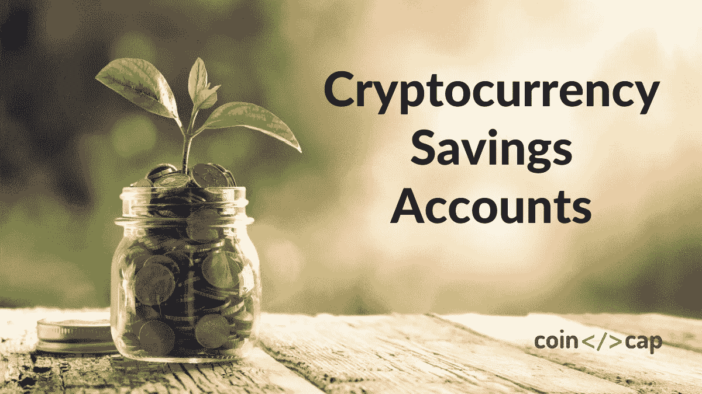
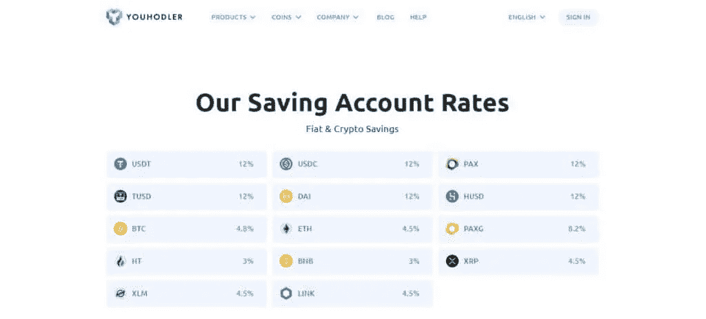
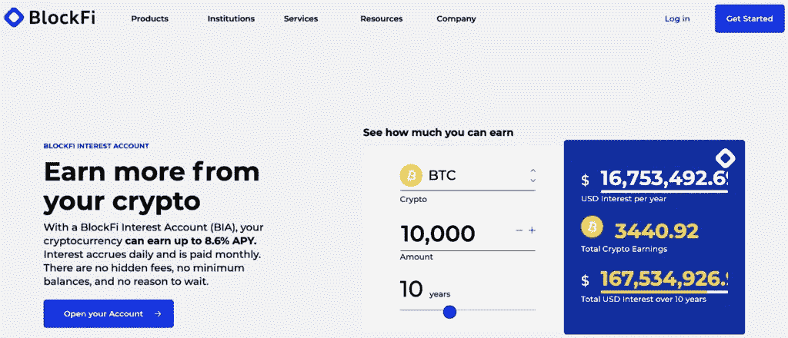
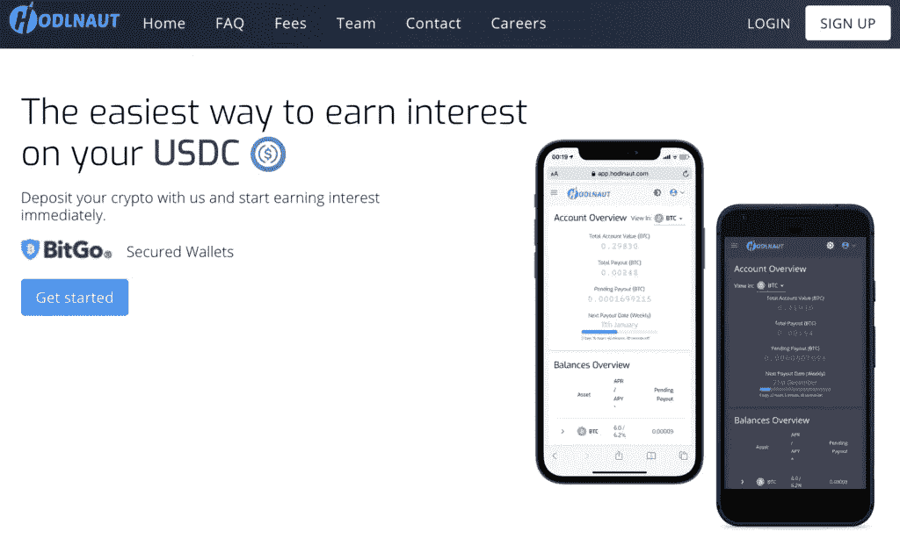
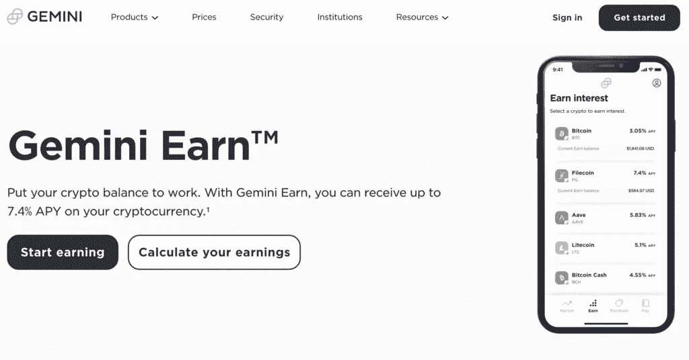
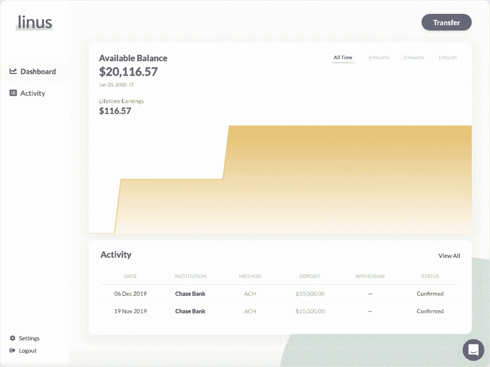
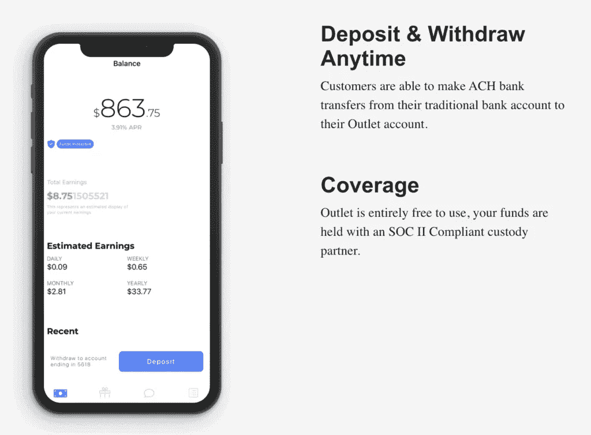
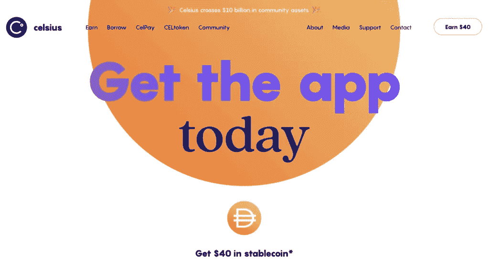

# 7 大加密货币储蓄账户|赚取加密利息[2021 年更新]

> 原文：<https://medium.com/coinmonks/cryptocurrency-savings-accounts-be3bc0feffbf?source=collection_archive---------1----------------------->

Crypto Savings Accounts

几乎每天都有最低限度的监管和价格波动，许多人认为加密货币投资是一个巨大的风险。然而，如果你明智地出牌，你可以为你投资于不断扩大的密码市场的钱赚取大量的利息。加密行业中发展最快的领域之一是通过计息储蓄账户的加密利息账户。

如今，加密储蓄账户并不缺乏，但它也会让事情变得有些混乱。对于相对来说对密码世界比较陌生的人来说尤其如此。

# 加密货币储蓄账户的特征

通常，最好的加密货币储蓄账户具有以下特征:

*   高利率
*   无存款费用
*   不锁定资金
*   无需投资平台令牌即可获得更高的利率
*   复利利率
*   良好的安全性
*   赚取利息的一大堆货币

现在我们知道了在一个好的储蓄账户中应该寻找什么，让我们向你介绍一些基本的东西，然后比较几个来帮助你在投资上做出最好的决定。

# 什么是加密货币储蓄账户？

加密存储帐户为用户提供了对加密市场的完全访问，允许他们获得利息，类似于普通银行储蓄帐户的工作方式。如果你计划在加密货币领域进行长期投资，像这样的账户是累积利息并同时保护你的硬币的理想选择。

如前所述，目前有大量的加密投资选择。然而，每个加密储蓄账户都是不同的，有自己的一套功能，选项等。如果你是加密货币储蓄账户的新手，不知道哪一个最适合你，请继续阅读这篇文章，因为它列出了一些最好的。

下表简要比较了以下公司最感兴趣的选项。请进一步阅读每家公司的详细信息。

类别 [**尤霍德勒**](https://blog.coincodecap.com/go/youhodler) [**莱纳斯**](https://blog.coincodecap.com/go/linus) [**双子座**](https://blog.coincodecap.com/go/gemini-earn) [**奥特莱斯金融**](https://blog.coincodecap.com/go/outlet) [**摄氏网**](https://blog.coincodecap.com/go/celsiusnetwork) **分金额**100 美元起 500 美元起无最低金额无最低金额最低金额**期限限制**未限定未限定未限定未限定未限定**稳定积分最大值。4 月%**12% 4% 8.6% 6% 11.55%**stable coin options**USDT、、、、PAX、戴、EURSUSDCDAINoUSDT、、、、TCAD、THKD、PAX、戴等。**手机 app** iOS、AndroidNoiOS、AndroidiOS、AndroidiOS、Android **创立** 20182019201520172017 **安全**总账 vault no data dicfireblocks fireblocks 和 PrimeTrust

# 1. [**尤霍德勒**](https://www.youhodler.com/)

让我们从最好的加密储蓄账户开始吧。这种加密货币储蓄账户为用户提供了无与伦比的多样性。无论你想投资比特币还是任何其他类型的加密货币，你都可以松一口气，因为你知道你可以使用 YouHodler 来满足你的加密保存需求。

Cryptocurrency Savings Accounts: YouHodler

让 [**YouHodler**](https://www.youhodler.com/) 从众多加密应用中脱颖而出的是，它能让你在各种加密货币和稳定硬币上赚取大约 12%的年利率以及复利。有了这个加密储蓄账户，用户可以通过投资各种加密货币，如 XRP、BCH、LTC、LINK、ETH、[比特币](https://blog.coincodecap.com/a-candid-explanation-of-bitcoin)等，轻松获得利息。

在这个平台上你会发现主要的 [stablecoins](https://blog.coincodecap.com/stablecoins-a-simple-overview) 是 EURS、戴、、、PAX、PAXG、、、和。每个加密储蓄帐户必须提供高水平的保险和安全，这一个可以说是最好的。虽然大量的[比特币储蓄账户](https://blog.coincodecap.com/bitcoin-savings-account)在加密货币方面非常有限(其中大多数只提供比特币)，但 [**YouHodler**](https://www.youhodler.com/) 采取了额外的措施，还提供了一些其他功能。

这个平台有一个方便的转换工具，允许客户以优异的转换率购买比特币和其他几种加密货币。所有这些最令人印象深刻的是，YouHodler 用户不必担心任何限制。如果你碰巧是一个有经验的交易者，这个密码保存应用程序有先进的工具，被称为**多 HODL** 和**涡轮增压**。

使用这些工具，客户可以贷款来做空或做多加密货币市场。这种方法对于用少量的资本来增加利润的机会是巨大的。在 [**优行**](https://www.youhodler.com/) 的加密储蓄账户不收取任何存取款费用。也就是说，你可能需要为一些加密货币和稳定硬币支付一小笔提现费。

要了解更多信息，请阅读我们的综合 [YouHodler 评论](https://blog.coincodecap.com/youhodler-earn-crypto-interest)。

# 2.[T21 区块链](https://blog.coincodecap.com/go/blockfi)

如果你是加密生态系统的活跃成员，你可能听说过 BlockFi。这家加密贷款巨头最近宣布了他们 3 . 5 亿美元的 D 轮投资，3B 估值为 25 亿美元。

Cryptocurrency Savings Accounts: BlockFi

一个成熟的加密贷款平台， [**BlockFi**](https://blog.coincodecap.com/go/blockfi) 对于那些想要将他们的加密资产提升到一个新水平的人来说是一个很好的平台。无论你是经验丰富的投资者还是最近才发现 crypto，BlockFi 都有适合每个人的东西。

目前， [**BlockFi**](https://blog.coincodecap.com/go/blockfi) 提供利息账户、交易账户、[加密贷款](https://blog.coincodecap.com/top-5-crypto-lending-platforms)。生息账户支持 8 种数字资产，用户可以赚取高达 8.6%的 APY，利息每日累计，每月提取。值得注意的是，BlockFi 为 BTC 和瑞士联邦理工学院提供的利率比列表中的其他银行低，但是，它确实为稳定的存款提供了更高的利率。

BlockFi 的另一个令人兴奋的功能是带有比特币奖励计划的信用卡。现在，BlockFi 的早期采用者有一个等待名单。然而，该卡目前只计划在美国发行，在几个州限量发行。

要了解更多信息，请阅读我们全面的 [BlockFi 评论](https://blog.coincodecap.com/blockfi-review)。

# 3. [**Hodlnaut**](https://blog.coincodecap.com/go/hodlnaut)

[**霍德瑙特**](https://blog.coincodecap.com/go/hodlnaut) 是新加坡领先的加密借贷平台之一，其使命是为加密货币用户提供金融服务。该平台目前管理着超过 1 亿美元的数字资产，并以平均每月 20%的速度增长。

Cryptocurrency Savings Accounts: Hodlnaut

[**Hodlnaut**](https://blog.coincodecap.com/go/hodlnaut) 的主要特点是储蓄账户。Hodlnaut 利息账户支持五种不同的资产类别:比特币(BTC)、以太坊(ETH)、戴(Dai)、美元币(USDC)和系绳(USDT)。通过 Hodlnaut 利息账户，用户可以提高闲置资产的生产率，有效年收益率高达 8.3%。

[**Hodlnaut**](https://blog.coincodecap.com/go/hodlnaut) 会在每周一把应计利息打入用户账户。除了利息账户，Hodlnaut 还提供企业贷款。通过加密贷款，客户可以使用他们的加密资产作为抵押获得信贷额度。Hodlnaut 的贷款起价为 50，000 美元，贷款价值比灵活，为 25%-100%，可以根据客户的业务需求量身定制贷款。

Hodlnaut 是新加坡金融科技协会(Singapore Fintech Association)认证的金融科技公司，该认证得到新加坡金融管理局(MAS)的认可。Hodlnaut 目前还在根据 2019 年 PS 法案(由新加坡金融管理局)申请许可证，并有望成为新加坡加密借贷领域的第一家受监管实体。

要了解更多，请阅读我们的[霍德瑙特评论](https://blog.coincodecap.com/hodlnaut-review)。

# 4. [**双子座**](https://blog.coincodecap.com/go/gemini-earn)

[**双子座**](https://blog.coincodecap.com/go/gemini-earn) 是你会发现的最安全的加密货币储蓄和兑换账户之一。总部位于美国的 Gemini 受到联邦存款保险公司的保护，迄今为止还没有受到黑客攻击。该平台相对简单，用户友好性使其成为任何希望投资加密技术的人的绝佳选择。

Cryptocurrency Savings Accounts: Gemini Earn

你需要用银行账户为你的双子座账户提供资金。Gemini 的最高资金限额(每天)为每月 500 美元和 1500 美元，每日提款限额为 100，000 美元。这种加密储蓄帐户还可以让您通过 Gemini Earn 功能获得丰厚的存款利息。

# 5.[T21 莱纳斯](https://blog.coincodecap.com/go/linus)

[**莱纳斯**](https://blog.coincodecap.com/go/linus) ，也被一些人称为[莱纳斯](https://blog.coincodecap.com/go/linus)金融有限责任公司，是一个著名的加密储蓄账户，提供令人难以置信的高收益。Matt Nemer，Linus 的首席执行官和创始人，曾经是 BTC 公司的财务主管。可以将这家公司视为一个加密货币和总部位于区块链的储蓄账户。然而，由于它没有得到 [FDIC](https://www.fdic.gov/) 的保险，它更倾向于投资方。

Cryptocurrency Savings Accounts: Linus

Linus 为零售消费者提供了一个绝佳的机会，在开放金融协议的帮助下利用高收益储蓄。更重要的是，你只需要为这个加密货币储蓄账户存入五百美元的初始存款，而不用担心维护它。莱纳斯实现了 4%的惊人 APY，这对一个储蓄账户来说是不可思议的。这主要是因为这家公司与传统的储蓄账户有很大的不同。

莱纳斯的客户更像投资者，而不是储户。这个储蓄账户实质上是将美元兑换成 USDC，这不仅仅是一种简单的加密货币。对于那些好奇的人来说，它被称为稳定币。当这个储蓄账户将美元兑换成 USDC 时，它们就可以在数字资本市场上使用了。

这个储蓄账户最令人印象深刻的是，你可以用借记卡向你在莱纳斯的账户转账，这是很少有人能提供的便利。有了这个加密储蓄账户，你可以随心所欲地用莱纳斯转账。然而，请记住，你可能无法马上获得你的钱。

# 6. [**网点财务**](https://blog.coincodecap.com/go/outlet)

如果您正在寻找一个提供极具竞争力的利率的加密货币储蓄账户，很少有选择会像[**Outlet finance**](https://blog.coincodecap.com/go/outlet)那样好。在区块链著名的解决方案公司 Consensys 的支持下，Outlet Finance 在全球加密储蓄者中享有很高的知名度。这家公司为那些寻找非传统加密储蓄账户的人提供了很多价值。

Cryptocurrency Savings Accounts: Outlet Finance

[Outlet](https://blog.coincodecap.com/go/outlet) 利用[区块链科技](/coinmonks/what-is-blockchain-6c253a51e372)借出数字美元并产生高达百分之六的利息。它专门利用以太坊智能合约结合[摄氏度网](https://blog.coincodecap.com/go/celsiusnetwork)，这是一个[著名的借贷平台](https://blog.coincodecap.com/top-5-crypto-lending-platforms)。

经销店利用稳定的硬币来完成交易。稳定的硬币不像许多货币那样经历波动，而是像法定货币一样，始终保持稳定。因此，一旦你开始使用 [**网点**](https://blog.coincodecap.com/go/outlet) 存入资金，借款人就可以使用这些资金了。这就是这个储蓄账户提供高利息的原因。

# 7. [**摄氏度**](https://blog.coincodecap.com/go/celsiusnetwork) 网络

这是另一个基于区块链的借贷平台。 [**摄氏**](https://blog.coincodecap.com/go/celsiusnetwork) 形成于 2017 年，并于 2018 年发行了第一枚硬币。这个加密储蓄账户公司总部设在英国，它的目标是在美国的账户还没有能够利用，这是获得利息和信贷收入。

公平地说，摄氏 20 度 T21 的核心是一个充分利用区块链技术的贷款解决方案。让这种加密储蓄账户脱颖而出的是，它允许人们借用甚至留下他们的加密货币进行借贷，以赚取利息。Celsius 允许您借用其本机令牌、CEL 或 cash。如果你想花钱，最好是借现金。

当涉及到用户想拿出多少密码作为抵押品时，他们可以有很多选择。记住，你应该总是考虑提供比贷款价值更高的抵押品。就 CEL 而言，它肯定会经历一些波动，这就是为什么在做出最终决定之前最好权衡利弊。

Celsius network 还提供便利的贷款配置，利率低得令人难以置信(大约 1%)。有了这个加密储蓄账户，你可以使用三十多个硬币作为抵押。另外，值得注意的是，Celsius 可以将你提供的抵押品借给各种机构投资者。Celsius 提供即时贷款审批，无需担心信用检查的担忧。

这个平台上的储户和投资者可以赚取额外的奖励或加密货币，只需用 Celsius 保存他们的密码。你不需要担心最低费用或余额赚取加密存款的利息。这笔交易最大的好处是这个加密储蓄账户提供每周支付。

**对收益使用术语“奖励”。奖励可能会有所不同，这取决于各种因素，如加密货币类型、您的位置等。如果您不是美国居民，您仍有资格享受 Celsius 忠诚度等级优惠。这些层级根据加密组合在 Celsius 令牌中的百分比提供奖励奖金。**

# **如何选择加密储蓄账户？**

**选择加密储蓄账户时，有几件事需要考虑。首先是你的资金安全。要确定你的资产在存放时是否安全，就要调查这家公司。谁在管理这家公司？这一点很重要，因为加密储蓄账户的核心被视为中央金融(CeFi)机构。这意味着你把你的资产委托给平台背后的个人或公司。**

**在选择合适的投资平台时，证书和执照可以派上用场。虽然加密货币不是法定货币，也没有任何政府的支持，但拥有监管机构的一些认可可以让你放心，因为你可以将你的资产委托给所述平台。**

**储蓄账户上的技术栈也发挥着重要作用。他们如何储存资金？是在热钱包里还是冷钱包里？他们有多重签名认证功能吗？如果出现违约，他们将如何把资金返还给你？这些是一些重要的问题和特点，你需要注意选择正确的储蓄账户。**

# **加密储蓄账户的优势**

**将您的资产存入加密储蓄账户有一些好处。最主要的一点是提高闲置资产的生产率。**

**与银行为其储蓄账户提供的利率相比，这些加密储蓄账户为您的比特币、以太坊和其他加密资产提供高利率。**

**与开设银行账户相比，这个过程要简单得多，你只需点击几下鼠标就能创建一个账户。下一步是通过他们的 KYC 程序，通常包括提交身份证件，如护照或驾驶执照。**

**一旦获得批准，您就可以开始存放您的数字资产，立即赚取利息。另一个好处是加密储蓄账户的条款是灵活的。**

**通常没有锁定期，没有最低存款额，可以随时提取资产。有了这样的灵活性，用户可以专注于增加他们的资产，以较小的风险获得最大的收益。**

# **加密货币储蓄账户:结论**

**近年来，随着加密货币在金融市场上获得更多动力，加密货币储蓄账户正在迅速发展。与任何财务决策一样，关注细节和阅读你打算存放资产的公司的细则非常重要。**

**一些平台为 BTC 和 ETH 等受欢迎的密码提供了更好的价格，但在 stablecoins 上没有这么多，一些平台有许可证，而其他平台正在申请中，但得到了快乐用户的认可和评论。**

**最终，这并不在于选择最好的加密储蓄账户，而在于哪一个能给你你想要的。**

*   **[2021 年 6 个最佳比特币储蓄账户](https://blog.coincodecap.com/bitcoin-savings-account)**
*   **[比特币一个健全的货币:储蓄和收益](https://blog.coincodecap.com/bitcoin-a-sound-money-save-and-gain)**
*   **[BlockFi vs Celsius vs Hodlnaut |利率、费用、安全和风险](https://blog.coincodecap.com/blockfi-vs-celsius-vs-hodlnaut)**
*   **[最佳加密交易所| 2021 年十大加密货币交易所](https://blog.coincodecap.com/crypto-exchange)**
*   **[2021 年前 6 大密码借贷平台【已验证】](https://blog.coincodecap.com/top-5-crypto-lending-platforms)**