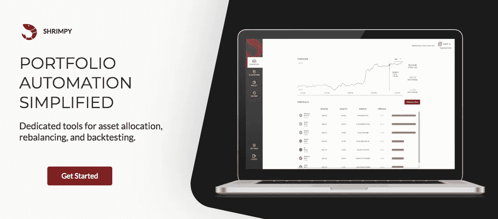
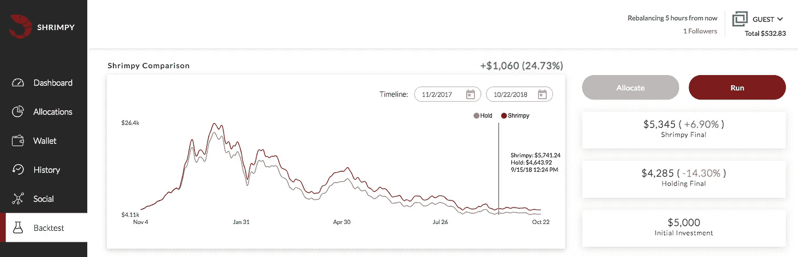

# 加密货币交易 101:交易所

> 原文：<https://medium.com/coinmonks/cryptocurrency-trading-101-exchanges-4513a7a609b1?source=collection_archive---------3----------------------->

最近你可能听说过[比特币](https://bitcoin.org/)、[以太坊](https://www.ethereum.org/)、&其他加密货币。你已经花了一些时间阅读和学习区块链技术和加密货币，并有兴趣购买一些来“尝试”加密。

这篇博客文章是关于如何开始和获得你的第一种加密货币的快速指南。

# 加入接受法定存款/银行存款的交易所

所以你听说过比特币和加密货币，现在你有兴趣购买一些。获得加密货币的最快方式是从交易所购买。如果你刚刚开始，你会想注册并加入一个允许法定存款的加密货币交易所，这基本上允许银行提款/存款到你的交易所账户。

下面的列表涵盖了一些受欢迎的接受法定存款/银行存款的加密货币交易所。

*   [比特币基地](https://www.coinbase.com/)
*   [双子座](https://gemini.com/)
*   [北海巨妖](https://www.kraken.com/)

支持法定货币的加密货币交易所的主要缺点是，佣金和交易费用通常高于仅支持加密货币的交易所。这通常是由于与处理和管理法定货币相关的额外成本

> [发现并回顾最佳交易自动化软件](https://coincodecap.com/category/trading-automation)

# 仅加密货币交易所

既然我们已经谈到了支持法定货币的加密货币交易所，那么让我们来看看只接受加密货币的交易所。一般来说，获得监管许可和执照来处理政府发行的货币是一个昂贵和耗时的过程。为了让个人立即进入加密领域，许多交易所决定通过只接受加密货币存款和取款来绕过法律限制。虽然将加密货币转换为现金可能会变得更加麻烦，但在纯加密交易所交易的好处包括:降低交易和佣金费用，增加流动性和交易量，以及增加交易对选项。

一些流行的加密货币专用交易所包括:

*   [币安](https://www.binance.com/)
*   [Bittrex](https://bittrex.com/)
*   [波洛涅克斯](https://poloniex.com/)
*   [库币](https://www.kucoin.com/)

注册多个 exchange 帐户后，您将能够探索更广泛的 exchange 功能和产品。您还可以研究和探索全球各地的其他加密货币交易所。一些很好的交易所研究和评论资源包括 [CoinMarketCap](https://coinmarketcap.com/) 、 [CoinLib](https://coinlib.io/) 、 [CoinCodex](https://coincodex.com/) 和 [WorldCoinIndex](https://www.worldcoinindex.com/) 。

作为一种相对较新的资产类别，加密货币正面临政府和监管机构的大量审查，仍被认为具有风险。我们建议您在购买和转移加密货币时进行自己的研究和尽职调查。这里有一些关于[福布斯](https://www.forbes.com/sites/dantedisparte/2018/07/21/beware-of-crypto-risks-10-risks-to-watch/)和 [Investopedia](https://www.investopedia.com/advisor-network/articles/investing-cryptocurrency-risks/) 的有见地的文章，它们更详细地解释了加密货币的风险。

# Shrimpy:面向初学者的加密货币

现在，您已经注册了一些交易所并购买了一些加密货币，下一步是什么？很可能是加密货币的吸引力首先吸引了你的眼球，所以让我们帮助你开始吧！由于你可能不是金融专业人士或日内交易者，你可能正在寻找一种简单易行的方法来管理你的加密货币投资组合。

[**Shrimpy**](https://shrimpy.io/referral?r=I6VFZ7d2E) 是加密货币投资组合管理的一体化解决方案。借助 Shrimpy，您可以在一个统一的仪表盘中查看您的整个加密货币投资组合！让我们与众不同的是我们独特的再平衡工具。

根据 [Investopedia](https://www.investopedia.com/terms/r/rebalancing.asp) 、*“再平衡是重新调整资产组合权重的过程。再平衡包括定期购买或出售投资组合中的资产，以维持最初期望的资产配置水平。*

点击阅读更多关于投资组合再平衡的信息。

有了 [Shrimpy](https://shrimpy.io/referral?r=I6VFZ7d2E) ，你所要做的就是选择想要的时间间隔来重新平衡你的投资组合，你就万事俱备了。通过设定一个再平衡期，你指示 Shrimpy 代表你自动进行交易，以遵循你想要的投资组合策略。Shrimpy 目前为**所有**我们的用户免费提供每小时、每天、每周和每月的重新平衡功能。

[**在这里注册你的免费虾账户。**](https://shrimpy.io/referral?r=I6VFZ7d2E)

如果您对 Shrimpy 有任何疑问，请随时通过[脸书](https://www.facebook.com/ShrimpyApp/)、[电报](https://t.me/ShrimpyGroup)或网站聊天支持联系我们。

你也可以在 [Medium](/@ShrimpyApp) 、 [Reddit](https://www.reddit.com/r/ShrimpyApp/) 和[我们的官方博客](https://blog.shrimpy.io/)上查看我们。

免责声明:Shrimpy 博客上分享的信息仅供参考。它无意成为投资建议。建议咨询持牌专业人士进行投资建议。

*原载于*[*blog . shrimpy . io*](https://blog.shrimpy.io/blog/cryptocurrency-trading-101/exchanges)*。*

> [直接在您的收件箱中获得最佳软件交易](https://coincodecap.com/?utm_source=coinmonks)

