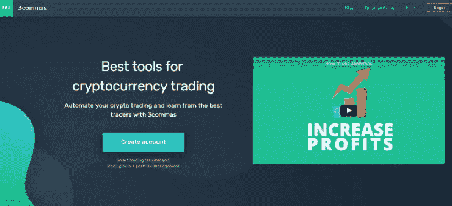
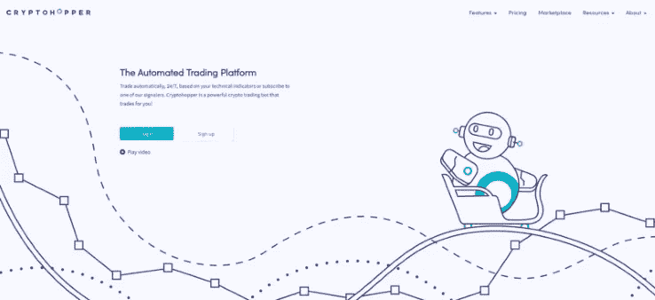
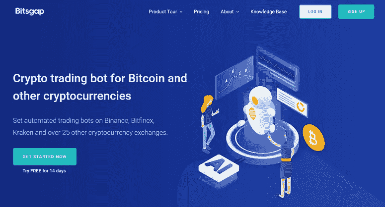
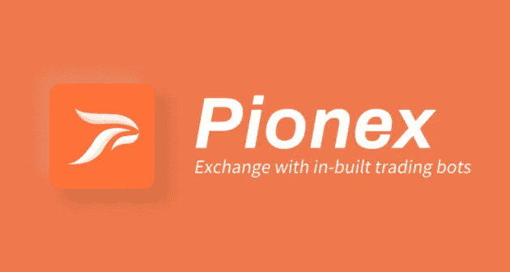
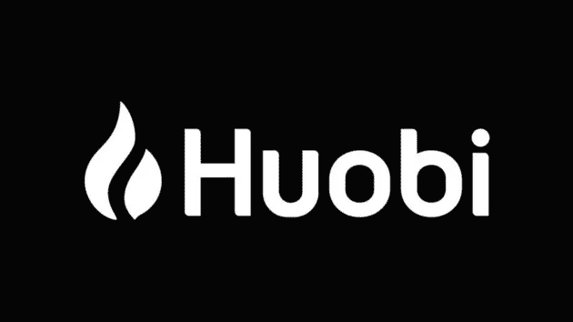

# 加密货币交易机器人:广泛的指南

> 原文：<https://medium.com/coinmonks/cryptocurrency-trading-bots-an-extensive-guide-130a6830394b?source=collection_archive---------1----------------------->

Photo by [Lenin Estrada](https://unsplash.com/@lenin33?utm_source=medium&utm_medium=referral) on [Unsplash](https://unsplash.com?utm_source=medium&utm_medium=referral)

全球数百万交易者对加密交易机器人感兴趣。他们试图找出如何简化他们的计划并超越竞争对手。在涉足这个行业后，你可能会碰到交易机器人的参考资料。以下详细指南将作为您进入加密货币交易机器人之旅的指南。

在本指南结束时，你可能不仅会更清楚地了解为什么交易机器人是有用的，还会知道目前哪些交易机器人引领市场，以及在选择交易机器人时需要搜索哪些显著特征。

> 免责声明:在这篇文章中，我使用了推荐链接。如果你使用推荐链接，大多数这些服务会给你额外的折扣。

# **什么是加密交易机器人？**

加密货币交易机器人是一种在交易所自动交易的软件应用程序。

交易机器人将从用户的交易所账户中访问数据，并自动进行交易，而不是手动将每笔交易插入交易所。

操作由机器控制，机器的速度和精确度是人类无法比拟的。

> **购买比特币&其他加密货币**
> 
> 在 [**报名币安**](https://bit.ly/3hlbBJb) ， [**Cex.io**](https://bit.ly/3vWdVKI) ，[**FTX**](https://bit.ly/3eYG3Y6)&[**比特币基地**](https://bit.ly/3fdPEcv) 购买比特币&其他加密货币。

# 为什么你应该使用交易机器人？

Photo by [NeONBRAND](https://unsplash.com/@neonbrand?utm_source=medium&utm_medium=referral) on [Unsplash](https://unsplash.com?utm_source=medium&utm_medium=referral)

无数是自动交易机器人提供的所有好处的恰当定义。这包括:

**无感情交易**

加密交易机器人做出的任何决定都取决于感知。它不像人类，不怕失去，也不渴望得到。

有经验的交易者或许可以通过抑制自己的情绪来做出理性的决定，但并不是所有人都是这样，尤其是新手。另一方面，一个加密交易机器人仍然不考虑情绪。

**回测**

回溯测试通过将交易原则应用于历史市场记录来评估一个想法的可行性。

当构建一个自动交易系统时，所有的规则必须是严格的，没有模糊的空间。机器不能做出有根据的猜测，必须被精确地告知该做什么。

交易者可能会使用这些精确的指导原则集合，在将他们的资产置于实时交易的风险之前，根据历史数据对它们进行测试。回溯测试仔细地帮助交易者分析和微调交易概念，以及评估系统的预期——即交易者对每单位风险的平均预期收益(或损失)。

**速度&精度**

由于交易机器人会对市场状况的变化做出即时反应，一旦达到交易要求，自动化系统就会产生订单。

早几秒进场或出场会对交易结果产生重大影响。所有其他指令，包括保护性止损和利润目标，在持仓达到后立即创建。

市场可能会快速波动，看到交易在下单前就达到利润上限或突破止损阈值可能会令人沮丧。使用算法交易机器人可以避免这种情况。

# **加密交易机器人的类型**

*   **套利:**这涉及同时从一个交易所向另一个交易所买卖硬币。这使得更快和更安全的利润。
*   做市:它帮助你防止市场价格大幅波动。它还可以在当前市场价格附近设置买入和卖出限价单。
*   **动量交易:**对于希望利用资产乘正动量波，并在动量反转时卖出的交易者来说，这是理想的选择。这个想法是，资产的成本高于平均水平，然后随着它开始失去动力而下降。
*   **均值回归:**在这种情况下，加密交易机器人使用建立在假设硬币价格随平均值变化的情况下的策略，它可以恢复到平均值。
*   [**复制交易**](/coinmonks/my-experience-with-crypto-copy-trading-d6feb2ce3ac5) **:** 这是一种趋势，使人能够自动复制其他有经验的交易者的交易策略。通过排行榜和交易者的社交社区，元素被游戏化。
*   [**电网交易**](/coinmonks/what-is-a-grid-trading-bot-3b58f3ec059b) **:** 这有助于你执行电网交易策略。它帮助你在价格范围内下一系列的买卖订单。每当一个卖出订单被完全执行时，机器人将在较低的网格级别上立即发出另一个买入订单，反之亦然。

# 如何搭建一个交易机器人？

> **购买比特币&其他加密货币**
> 
> 在 [**报名币安**](https://bit.ly/3hlbBJb) ， [**Cex.io**](https://bit.ly/3vWdVKI) ，[**FTX**](https://bit.ly/3eYG3Y6)&[**比特币基地**](https://bit.ly/3fdPEcv) 购买比特币&其他加密货币。

# 如何挑选交易机器人？

在你信任一个机器人来管理你的交易组合之前，确保它是为你的最佳利益而设计的。在选择加密交易机器人之前，请记住以下注意事项:

1.  **可靠性:**任何企业，包括加密货币交易，都是依靠信任才能成功。创建交易机器人的实体必须是有信誉的。你不想要一个离线或有错误的机器人。如果你使用一个一周七天、一天 24 小时交易的机器人，你就不会失去机会。

这就是为什么我列出了拥有先进交易机器人的实体，这些机器人已经过彻底检查，并被证明是可靠的。这些业务已经运营了很长时间，拥有一长串忠实客户。

**2。安全保障:**大部分加密货币都是相对安全的。然而，这并不排除恶意实体试图闯入账户并窃取信息。

因此，寻找一个具有可靠安全记录的机器人是至关重要的。该机器人的创造者必须是一家声誉良好的公司，拥有蓬勃发展的用户群。

**3。谨慎:**作为一名秘密投资者，你不会想被骗去浪费你的血汗钱。在从任何企业选择交易机器人之前，请确保该公司拥有关于其运营的详细信息。

使用一个提供免费试用的组织会让你放心，你会得到很好的照顾。

**4。可用性:使用机器人的目的是让你的交易更方便。加密交易不仅仅是程序员和 IT 专家的事情。如果你不是这些用户中的一员，你会想要选择一个简单易用的机器人。该机器人必须有一个易于使用的图形用户界面，适合你的技能水平。**

此外，客户服务基础设施至关重要。如果您检查修补程序是如何分发的以及漏洞是如何解决的，这将是非常有益的。机器人也应该与您的交易技术兼容，并可定制。

**5。盈利能力:对一个组织来说，透明和可信是不够的。加密货币投资的首要目标是赚钱。因此，给你最高回报的企业会让你的投资物有所值。**

交易机器人实现利润的一致性被用来确定其功效。

# 2021 年最好的**加密交易机器人**

# 1.3commas —加密货币交易工具

[**3Commas**](https://bit.ly/3w6LV7z) 是一个先进的交易机器人，拥有许多复杂的交易选项。这些机器人可以通过它们的网络界面来自动化你的交易策略。3Commas 瞄准了与 Haasbot 相同的利基市场，在更有经验的交易者中很受欢迎。它们还提供了通过开发人员 API 管理机器人的能力，为开发人员提供了额外的选择。

# 特征

*   交易终端
*   获利/亏损的跟踪期权
*   通过交易视图定制信号
*   QFL 机器人
*   多对复合机器人

# 费用

初级许可的定价计划从[**$ 14.5/月**](https://bit.ly/3w6LV7z) 开始，专业许可的定价计划从[**$ 49.5/月**](https://bit.ly/3w6LV7z) 开始。从这里开始你的免费试用**。**

# **支持的交换**

**Bitmex、Bittrex、BitFinex、币安、Bitstamp、KuCoin、Poloniex、HitBTC、Cex、比特币基地 Pro、OKEX、Huobi 和 YOBIT。**

# **2.Cryptohopper —自动化交易平台**

****

**[**Cryptohopper**](https://bit.ly/2RLiEQL) 是一个基于技术指标执行策略的交易机器人平台。这些策略可以定制设计，以实现您选择的高级策略。与 3Commas 和 Haasbot 在许多方面相似，Cryptohopper 是高级加密货币交易者的一个很好的选择，他们愿意深入了解他们希望实施的每个交易策略的细节。**

# **特征**

*   **设计策略**
*   **通过票据交易尝试策略**
*   **跟踪止损**
*   **卖空资产**
*   **自动化加密交易策略**
*   **数据驱动的分析— 130 多个指标和模式**
*   **绩效报告**

# **费用**

**初级许可的定价计划从**19 美元/月开始，专业许可的定价计划从[**【99 美元/月**](https://bit.ly/2RLiEQL) 开始。在这里开始你的免费试用**。******

# ******支持的交换******

******波洛涅克斯、北海巨妖、Bittrex、比特币基地专业版、币安、KuCoin、Bitfinex 和 Huobi。******

# ******3.Bitsgap —自动加密交易******

************

******[**Bitsgap**](https://bit.ly/2SNjTiX) 以其独特的自动化交易机器人而闻名。成千上万拥有不同经验和技能的交易者每天都在使用 Bitsgap，通过自动化交易来实现回报最大化。由 [Bitsgap](https://bit.ly/2SNjTiX) 实现的算法是基于一种简单有效的技术，叫做网格。它在交易者预先定义的交易范围内按比例分配投资。******

# ****特征****

*   ****交易终端****
*   ****加密交易信号****
*   ****演示模式****
*   ****智能战略设计****
*   ****投资组合跟踪和管理****
*   ****套利工具****

# ****费用****

****初级许可的定价计划从**19 美元/月开始，专业许可的定价计划从**110 美元/月开始。从这里开始你的免费试用**。**********

# ******4.[库币](https://bit.ly/3uJeZ4r)******

************

******[**Kucoin**](https://bit.ly/3uJeZ4r) 是一家成立于 2017 年 8 月的中国加密货币交易所。它提供了一个很好的贸易配对列表。在过去的 24 小时内，它在 432 个市场进行交易，交易总额为 2500 万美元。它还提供了一个复杂的 API，使用户能够创建一个安全和自动化的交易策略。******

******费用:**做市商和收单商 0.1%的交易费用。****

******价格:**交易机器人不需要订阅费。****

# ****4. [Pionex](https://www.pionex.com/en-US/sign/ref/vhNZnG2c)****

********

****[**Pionex**](https://www.pionex.com/en-US/sign/ref/vhNZnG2c) 是全球首家交易所，提供 12 款免费交易机器人。用户可以一周七天、一天 24 小时自动交易，而不必查看市场。它是币安最大的经纪商之一，从币安和火币环球汇集流动性。****

******费用:**做市商和收单商 0.05%的交易费用。****

******价格:**交易机器人不需要订阅费。****

# ****5.[火币全局](https://www.huobi.com/en-us/topic/invited/?invite_code=cph82223)****

********

****[**火币**](https://www.huobi.com/en-us/topic/invited/?invite_code=cph82223) 是位于亚洲并为亚洲客户服务的主要加密货币交易所之一，自 2013 年开始营业。Huobi Worldwide 是其全球加密交易所，为加密货币交易提供了一个有吸引力的平台——广泛支持众多替代币和大量稳定币，以及自己的创新——美元支持的稳定币 HUSD——刚刚经历了一些品牌变化。****

******费用:**接受者和制造者各 0.20%。****

******价格:**交易机器人不需要订阅费。****