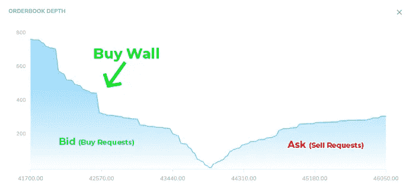

# 加密货币交易技巧:买卖墙和鲸鱼市场操纵

> 原文：<https://medium.com/coinmonks/cryptocurrency-trading-tips-buy-sell-walls-and-whale-market-manipulation-9b617e4fd4e7?source=collection_archive---------3----------------------->

无论你是刚开始交易密码的人，还是经历过多次熊市/牛市的资深交易者，你都可能听说过买卖墙。但是它们到底是什么，鲸鱼如何利用这一点来操纵市场呢？

让我们深入了解它们是什么，这样你就可以发现买卖墙，做出更好的交易决定。

# **总结**

*   当买入订单多于卖出订单时，就会出现买入墙。这表明想买的人比想卖的人多。
*   当卖出订单多于买入订单时，就会出现卖出墙。这表明想卖的人比想买的人多。
*   买墙和卖墙都可以由[鲸](/coinmonks/what-is-whale-watching-and-how-to-track-bitcoin-whales-in-2021-199b5ddc8c4)操纵——这些交易者拥有大部分可用的加密货币。

# **Crypto 中的墙是什么？**

> **加密墙可以被识别为价格点，其中分别设置了大量的买入订单或卖出订单。从视觉上看，订单量与价格点形成了一堵“墙”。**

买墙和卖墙可以极大地影响加密货币市场的价格波动。在交易比特币和以太币等加密货币时，了解它们可能是有利的，因为它让你可以更好地预测价格变化，并相应地设置限价单。

然而，理解买入墙和卖出墙背后的原因至关重要，因为它们有时可能是一种市场操纵形式，而不是反映真实的市场情绪。

# **什么是买墙？**

(Example of a buy wall. Source: [CoinLobster](http://www.coinlobster.com))

**当买入订单多于卖出订单时，就会出现买入墙。**上面的买入墙是为 CoinLobster 上的币安·BTC/USDT 设计的。这可能是由同一价格的多个订单或由鲸鱼(持有大量硬币的个人或团体)操纵价格造成的。

原则上，如果订单被执行，这些购买订单的规模足以推动资产价格上涨。事实上，买入墙的存在往往会推高价格，甚至在买入墙订单完成之前，因为在价格触及买入墙之后，资产的供应将显著减少。买入墙也反映了市场对价格水平将明显高于当前价格的信心。

# **什么是销售墙？**

**卖出墙**与买入墙相反，当卖出订单多于买入订单时出现。这表明想卖的人比想买的人多。

卖出墙会导致加密货币的价格下跌。这是因为卖出墙暗示，在该价格下，加密货币的供应可能会激增。这将压倒需求，压低价格。

# **识别买墙和卖墙**

为了理解如何现货买卖墙，我们首先需要回顾两个主题:订单和市场深度。

## **什么是订单簿？**

订单簿是电子订单的列表，交易所使用它来记录特定加密货币的购买和出售兴趣。代币通常按订单大小和价格水平列在订单簿中。

在下图中，你可以看到一个关于 [CoinLobster](http://www.coinlobster.com) 的实时综合订单簿。数据包括交易所，如 Bitmex，Bybit，北海巨妖期货，币安，FTX，比特币基地，Bitstamp，Bitfinex。

Example of an order book. Source: CoinLobster

*   **买家和购买请求被称为“出价”,用绿色表示。**
*   **销售者或销售请求被称为“请求”,用红色表示。**

订单簿可以清楚地表明是多头还是空头在控制市场。例如，如果与购买订单相比，有大量的卖出订单，这可能被视为市场在抛售压力下下跌的迹象。

## **什么是市场深度图？**

为了帮助您形象化订单簿中的订单，您可以查看市场深度图。它可以清楚地反映市场情绪。查看下面的市场深度图，绿色区域显示的是希望以某一价格买入的订单(出价)，红色区域显示的是希望以某一价格卖出的订单(要价)。

如果绿色一边比红色一边高，这意味着买的兴趣大于卖的兴趣。

Another example of a market depth chart on [Bitfinex](https://trading.bitfinex.com/t?type=exchange)

通常，每个交易所都有自己的市场深度图，交易者必须将鼠标悬停在其上才能查看每个价位的买入或卖出订单数量。

Example for reading depth charts. Source: [Bitfinex](https://trading.bitfinex.com/t?type=exchange)

[CoinLobster 的深度图](http://www.coinlobster.com)可以让你看到超过 10 家交易所的综合市场深度图。颜色表示不同的交换，可以在网站顶部过滤。

Combined depth chart of 10+ exchanges. Source: [CoinLobster](http://www.coinlobster.com)

# **买卖墙的危险:欺骗**

鲸鱼有足够的资源通过设置大量的买入或卖出订单，单枪匹马地创建买入和卖出墙。一些鲸鱼为了自己的利益故意这样做来影响市场情绪和操纵价格。这就是所谓的欺骗。

作为鲸鱼交易策略的一部分，很难判断买卖墙是真实的还是人为创造的。加密货币市场尤其如此，该市场的波动性很高，市场在很大程度上基于市场情绪，而不是金融指标或行业趋势。

# **买卖墙是真的吗？**

这里有一些真实或人造墙的例子。

## **真实墙壁:**

1.  **一个订单已经在订单簿上有一段时间了**

辨别一面墙是否真实的一个好方法是看一个订单是否已经在订单簿上有一段时间了。如果是这种情况，那么很有可能买方或卖方真的在等待他们的订单以这个价格执行，他们并没有试图操纵市场。

**2。资产与硬币的性能相关。**

当硬币或代表硬币的潜在群体表现不佳时，就会出现真正的卖出墙。这可能是关于公司的负面消息或情绪的结果，或者是公司未能达到预期目标的结果。它们也可能是黑客攻击、诈骗或熊市恐慌性抛售的结果。

3.**高市场深度**

当买卖双方都有大量未决订单时，市场深度被认为是高的。这意味着，在任何特定价格下，价格都不太容易受到大市场订单的操纵，因为这些订单被大量的总订单所吸收。因此，买卖墙不太可能对价格产生巨大影响，在这种情况下，交易者不必太在意它们。

## **假墙:**

**1。** **一个大的买入或卖出墙迅速出现**

如果一堵墙显著而迅速地出现，这表明没有相同价格的订单积累，而是一个大订单。有时候，当巨鲸达到操纵价格的目的时，墙会很快出现，然后消失。这是人造墙的一个例子。

2.**市场深度低**

与高市场深度相反，低市场深度意味着价格更容易被任何特定价格的大市场订单操纵，因为市场中没有足够的交易量。因此，鲸鱼买卖墙更容易对价格产生巨大影响。

**及时了解加密货币的最新消息**是评估它是人造墙还是真墙的另一种方式。在社交媒体和新闻中的公众情绪几乎没有变化的背景下，似乎出现了重大的买入墙或卖出墙，这可能是市场操纵的一个实例。

# **结论**

加密货币市场的特点是高风险和高回报。有利可图的交易可以给你带来巨大的回报，轻松取代股票市场。然而，加密货币交易的不可预测性和高度投机性导致了市场操纵。当市场深度较低时，情况尤其如此，一只鲸鱼或一群鲸鱼可能导致重大的价格变动。

在一天结束的时候，没有固定的指导方针来决定买墙还是卖墙是真实的，大部分取决于你自己的洞察力。了解更多关于技术分析的信息，了解加密货币市场的最新发展，可以帮助您在波动中辨别正确的机会和交易策略。

Whale Watching on [CoinLobster](http://www.coinlobster.com)

你也可以在这里阅读更多关于识别隐鲸的信息，只需在[观察鲸鱼仪表盘](https://coinlobster.com/whale-watch)上过滤大型鲸鱼交易。它可以让你看到在主要现货交易所进行的大宗交易的实时数据。默认情况下，这个过滤器是平均交易规模的一个很大的倍数，这样你就可以随时知道鲸鱼什么时候买卖了。

## **什么是 CoinLobster？**

CoinLobster 是一个实时的组合订单簿、交易和清算馈送，显示比特币、以太坊和 DOGE 的交易量，涵盖 10 个最受欢迎的现货和永久期货交易所。

你可以在[www.CoinLobster.com](http://www.coinlobster.com/)拜访我们

> 加入 Coinmonks [电报频道](https://t.me/coincodecap)和 [Youtube 频道](https://www.youtube.com/channel/UCbyDhTbOiKh2iUMKBi4-4Zg)了解加密交易和投资

## 也阅读

 [## 最佳加密交易所| 2021 年十大加密货币交易所

### ICON _ PLACEHOLDEREstimated 预计阅读时间:28 分钟加密货币交易所的加密交易需要知识…

blog.coincodecap.com](https://blog.coincodecap.com/crypto-exchange)  [## 2021 年 10 大最佳加密贷款平台| CoinCodeCap

### 当谈到加密货币贷款时，大量因素等同于良好的收入状况。此外，借款的一部分…

blog.coincodecap.com](https://blog.coincodecap.com/crypto-lending)  [## 2021 年最佳免费加密交易机器人

### 2021 年币安、比特币基地、库币和其他密码交易所的最佳密码交易机器人。四进制，位间隙…

medium.com](/coinmonks/crypto-trading-bot-c2ffce8acb2a)  [## 最佳 4 个加密交易信号电报通道

### 这是乏味的找到正确的加密交易信号提供商。因此，在本文中，我们将讨论最好的…

medium.com](/coinmonks/best-crypto-signals-telegram-5785cdbc4b2b)  [## BlockFi 评论 2021:利弊和利率| CoinCodeCap

### 今天，我们提出了一个全面的 BlockFi 评论，这是一个成立于 2017 年的加密贷款平台，拥有其…

blog.coincodecap.com](https://blog.coincodecap.com/blockfi-review)  [## 如何在印度购买比特币？2021 年购买比特币的 7 款最佳应用[手机版]

### 如何使用移动应用程序购买比特币印度

medium.com](/coinmonks/buy-bitcoin-in-india-feb50ddfef94)  [## 加密税务软件——五大最佳比特币税务计算器[2021]

### 不管你是刚接触加密还是已经在这个领域呆了一段时间，你都需要交税。

medium.com](/coinmonks/best-crypto-tax-tool-for-my-money-72d4b430816b)  [## 存储比特币的最佳加密硬件钱包[2021] | CoinCodeCap

### 保管您的数字资产很容易，但找到正确的存储方式却是一项繁琐的任务。在线钱包有一个风险…

blog.coincodecap.com](https://blog.coincodecap.com/best-hardware-wallet-bitcoin)