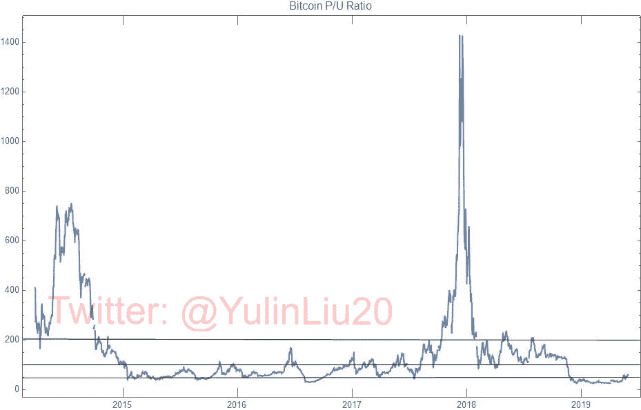
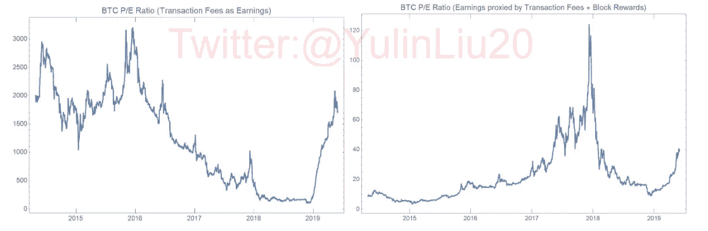
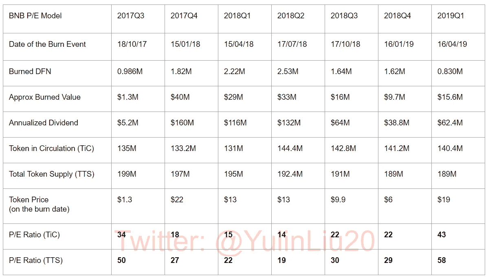
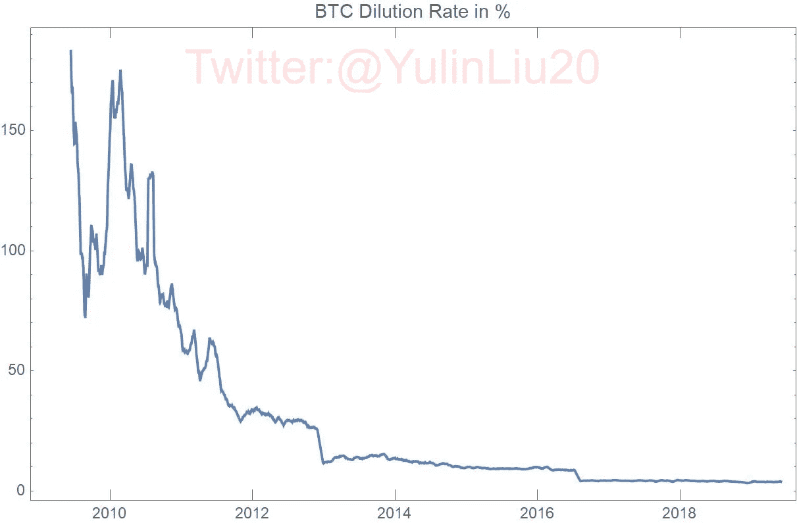
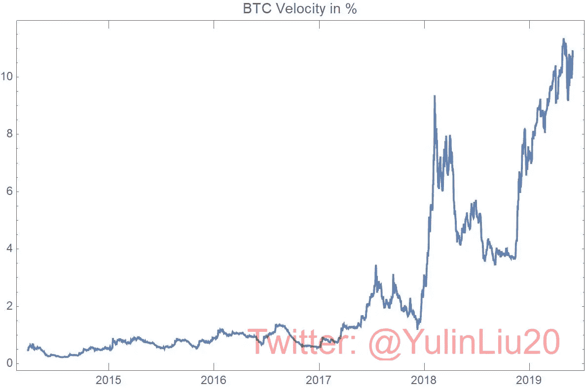
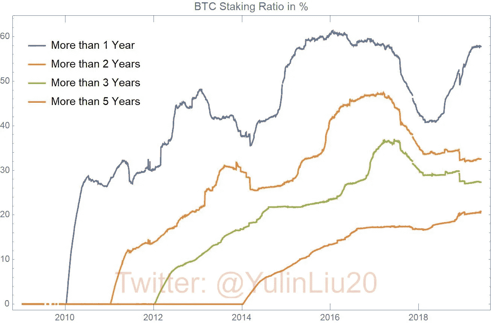
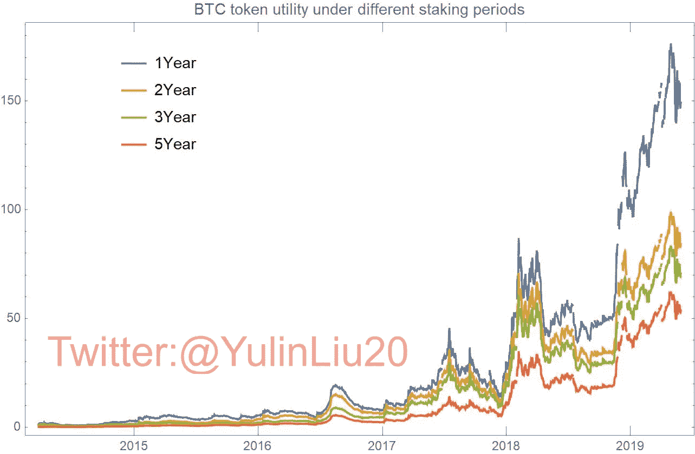
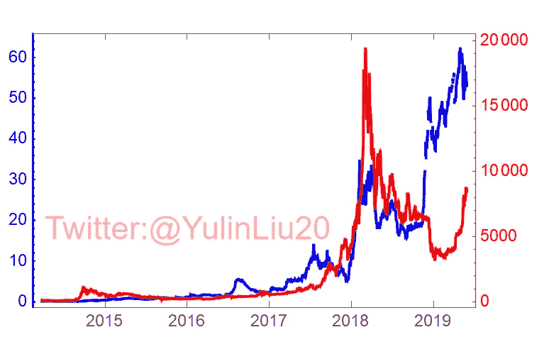
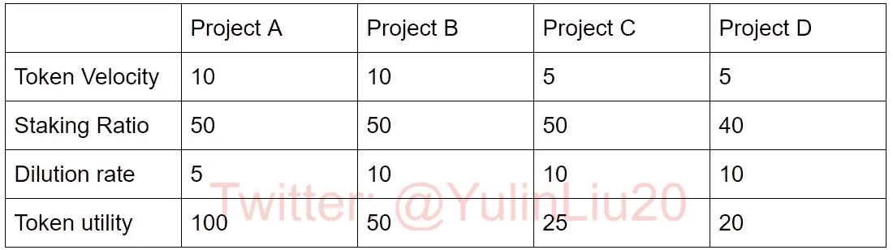
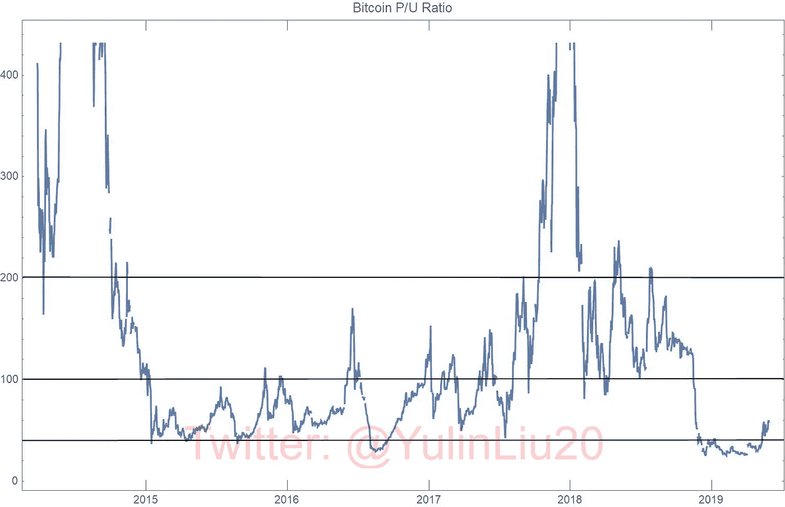

# 加密货币估值

> 原文：<https://medium.com/coinmonks/cryptocurrency-valuation-d9979074404?source=collection_archive---------0----------------------->

*免责声明:本文不应被视为买卖任何证券或加密货币的投资建议。*

投资者和金融分析师一直在寻找一个简单而信息丰富的指标来评估股票和商品价格。近年来，加密货币或代币(这两个术语在本文中可以互换)成为这一搜索的最新焦点。最佳指标应反映资产的市场估值相对于其基本面的位置。是高估还是低估？什么时候是买卖的好时机？

本文回顾了市盈率(股票市场中广泛使用的指标)和网络价值交易比(最近为加密市场开发的指标)。我在加密货币市场的背景下评估了这两个比率，讨论了它们的局限性，并最终提出了一个替代指标:价格-效用(P/U)比率。后者，依我拙见，更适合加密货币的估值。

下图是比特币的市盈率。市盈率清楚地表明了 2013 年底和 2017 年底的**两大比特币泡沫时期，当时**的市盈率远远超出了 50 至 200** 的正常范围。**

# 代币估价指标:概述

与资产的市场估值(可以通过市值精确衡量)不同，资产的基本面可能很难确定。

市盈率采用公司的年度收益(或等价地，分配给股东的股息)作为公司股票的基本面。这是一个简单但有效的代理。

然而，加密市场上的大多数代币都没有红利。因此，提出了一种新的方法，通过区块链过去 24 小时的交易量来衡量代币的基本面。这种方法被称为网络价值交易比。在这里，代币的基本价值来源于它用于交易的频繁程度，即来源于它作为交换媒介的功能。

这样的比率忽略了代币作为价值储存手段的功能。价值储存是主要主权货币的三大功能之一(另外两个是交换媒介和记账单位)。

在本文中，“储值”是指代币在一段时间内保持或增加其购买力的功能。需要注意的是，由于代币价格的高波动性，除了稳定的硬币之外，大多数加密货币都不作为记账单位。

总之，**对加密货币基本面的全面评估应该包括其作为交换媒介和价值存储的功能**。两者都被价格效用比(P/U)所捕获。

市盈率的详细描述如下所示。对于那些熟悉市盈率和网络价值交易比的人来说，请跳过接下来的两个部分，直接看价格效用比部分。

# 价格收益比

市盈率，以下简称 P/E 比率，是将股票价格与其每股收益进行比较。其计算方法是将当前股价除以其每年每股收益(EPS)。例如，亚马逊 2018 年 1 2 月 31 日的股价约为 1500 美元，当年的每股收益约为 20 美元，市盈率为 75。

市盈率表明投资者今天愿意支付多少美元来换取未来一美元的年每股收益。在亚马逊的例子中，投资者愿意为 1 美元的年度每股收益支付 75 美元。

> 市盈率=股价/每股收益
> 
> =股票价格/(年度收益/已发行股票)
> 
> =市值/年收入

市盈率衡量公司相对于其年度收益的市值，并揭示公司股票的估值。一般来说，分析师比较各种股票的市盈率，并建议在市盈率低时买入，在市盈率高时卖出。

虽然市盈率是一个长期以来为投资者提供金融市场洞察力的既定工具，但它也有局限性。

每股收益是用公司过去 12 个月的收益计算的。然而，历史收入并不能反映未来。也就是说，这一指标不考虑公司的增长。高市盈率(即相对于其收益的高股价)并不一定意味着股票被高估。这也可能是由于市场对该公司即将到来的快速增长的预期。

某些分析师依赖于报告的收入预测(即预期每股收益)，但这种方法涉及不确定性，容易受到报告操纵。

尽管如此，市盈率为快速评估股票价格提供了一个简单而实用的方法。

总的来说，市盈率模型在加密货币领域不起作用。与公司不同，大多数区块链项目没有收益。虽然应该注意到，空投(例如 ICO 热潮中的以太代币持有者)和分叉代币(例如 hard fork 歇斯底里中的比特币持有者的比特币现金、比特币黄金和比特币钻石等)可以被视为代币持有者的红利。但这种收入既不可预测，也不可持续。

研究人员建议用交易费来代替收入。使用交易费作为替代品具有误导性，因为这些费用是由矿工/区块商赚取的，而不是由代币持有者赚取的。

此外，使用交易费可能会导致可笑的结果。举例来说:较高的交易费导致较低的市盈率，从而导致代币被低估。换句话说，当交易费用飙升时，比特币变得被低估(市盈率下降)。众所周知，高昂的交易费用阻碍了比特币更普遍的应用。

下图左侧展示了过去五年比特币的市盈率，使用交易费作为比特币收益的代理。如果考虑到新铸造的比特币(区块奖励)，市盈率在 5-125 之间(见下图右侧)。同样，重要的是要记住,**市盈率对比特币买家和卖家来说毫无意义，因为交易费和大宗奖励不会分配给他们。**

区块链项目不像上市公司那样将净利润分配给利益相关者。因此，传统的市盈率并不适用于象征性估值。

也有一些例外。其中，币安硬币(即 BNB)是一个显著的例子。币安是一个加密货币交易平台。它用季度利润的 20%回购其原生代币并烧掉。回购和焚烧计划相当于向 BNB 代币持有者分配红利。

下表显示了 BNB 令牌在燃烧事件发生之日的市盈率。

2017 年夏天该项目启动时，BNB 总供应量(Total Token Supply 或 TTS)为 2 亿，发行了 1.36 亿(Token in Circulation 或 TiC)。在接下来的四年里，将释放 6400 万名被关押的 BNB 人(每年释放 1600 万名 BNB 人)。

请注意，在 2019 年第一季度计算这两个指标(使用 TiC 和 TTS)时，市盈率都有显著上升。这种攀升表明，与历史记录相比，BNB 币被高估了。然而，如上所述，市盈率并没有将增长预期考虑在内。事实上，市盈率的上升可以归因于币安平台上初始交易所发行(IEO)和 Launchpad 的重燃，以及 2019 年上半年币安区块链和去中心化交易所(DEX)的推出。

市盈率可能对股票市场很有用，但在加密市场的情况下，由于上市公司和区块链项目之间的根本差异，它要么不能完全适用，要么导致错误的影响。

# 梅特卡夫定律和网络价值交易比

许多研究人员利用梅特卡夫定律来研究比特币的基本价值。梅特卡夫定律规定，一个网络的价值与其用户(或在这种情况下，令牌持有者)数量的平方成正比。比特币用户的数量可以用比特币唯一地址的数量来表示。梅特卡夫定律通过测量用户数量来获取令牌的长期价值。然而，研究表明，在短期内，梅特卡夫定律对加密货币的有效性值得怀疑。

为了改进，我建议也考虑每个唯一地址的交易量。这样的修改将使 Metcalfe 的基于法律的模型更适合于令牌估值分析。这可以通过以下事实来解释:用户数量反映了令牌的长期价值，而每个唯一地址的交易量反映了令牌的日常使用情况。因此，每个唯一地址的交易量应考虑在内，以说明短期价格变化。欢迎经验主义经济学家进一步研究这个问题。

由 Willy Woo 引入的网络价值交易比(NVT)可以作为密码市场的市盈率的模拟。NVT 比率定义为网络价值(即代币的市值)与过去 24 小时内以美元计的交易量之间的比率。高 NVT 比率表明代币的市值超过了其区块链的交易价值，表明存在投机行为。由不断增加的交易量引起的低 NVT 比率表明代币的高使用率，这反过来充当购买被低估的代币的信号。请注意，随着扩展解决方案的发展(如比特币的闪电网络和以太坊的雷电网络)，还应考虑链外交易。

> NVT 比率=网络价值/$交易量
> 
> =代币价格*代币供应/代币价格*交易代币
> 
> =令牌提供者/交易令牌
> 
> = 1/令牌速度

NVT 比率的局限性在于假设加密货币的基本价值仅来源于其作为交易媒介的功能，该功能由令牌速度表示。**模型**中完全忽略了加密货币作为价值储存手段的用途。

为了说明这一点:由于交易量的减少而导致的 NVT 比率的增加并不一定意味着令牌的高估。也可能是越来越多的长期霍德勒囤积更多代币，从而导致交易量下降的结果。换句话说，NVT 比率提供了一个概貌，但对于**和**的购买和销售决策并没有特别的信息。

Willy Woo 自己也承认，NVT 比率并不是一个事先发现价格泡沫的有效工具。相反，它更适合追溯性地辨别价格崩溃和价格整合。尽管如此，当 NVT 比率低于正常范围时，它未能解释 2017 年的加密牛市，因此表明低估。NVT 比率也未能识别 2018 年的秘密熊市，当时市场明显崩溃，而 NVT 比率仍在正常范围内。尽管 NVT 比率存在缺陷，但吴宇森赢得了代币估值相关研究先驱的声誉，值得大声欢呼。

# 价格效用比

令牌工具的定义是

> 代币效用=(代币速度*赌注比率)/稀释率，

其中稀释率衡量代币供应量的年增长率。假设没有其他差异，高稀释率会降低代币的吸引力，从而降低代币的效用。下图表明，在过去十年中，比特币的稀释率显著下降。截至 2019 年 5 月，稀释率约为 3.8%。预计一年内 BTC 供应量将减半。到那时，稀释率将降至 2%以下，这是主要央行设定的共同通胀率目标。

令牌速度衡量过去 24 小时内交易的令牌相对于令牌供应的百分比。大的代币速度表示代币的使用和需求增加。它导致高令牌效用。

至于比特币和其他一些主要的加密货币，相当多的代币都是一年多不活动的。这些不活动的代币充当价值存储，并且可以被称为“有桩代币”。而主动代币，又可以称为“流动代币”。赌注比率被定义为赌注代币相对于总代币供应量的比率。高赌注比率表明更多的用户对区块链项目抱有长期信心。下图显示了不同押记期下的 BTC 押记比率。未来的趋势似乎是，随着时间的推移，越来越多的比特币被押在更长的时间里。

**代币流通速度代表代币作为日常活跃用户需求的交易媒介的效用(DAU)。赌注比率代表了代币作为价值储存手段的效用，是长期持有者(LTH)所要求的。**在利益证明(PoS)区块链项目中，一小部分令牌在系统中被标记。对于工作证明(PoW)区块链项目，“标记令牌”是指已在非活动账户中保留一年以上的令牌。

简而言之，低稀释率结合高代币速度和高赌注比率导致****高代币效用。下图说明了使用 BTC 1 年、2 年、3 年和 5 年赌注比率的比特币的令牌效用。****

********

****为了适应区块链项目的不同性质，我们可以在公式中增加一个权重α ∈ [0，1]。****

> ****代币效用=(代币速度*赌注 ratio^α)/dilution 率。****

****对于通用 PoS 项目:α=1。对于关注支付的项目(如 OmiseGo、Stellar、Zcash): α应小于 1，以赋予令牌速度更大的权重。注意，NVT 比率是一种特殊情况，其中令牌效用与标准化稀释率和忽略的赌注比率(α=0)相反。****

****为了平滑令牌效用，例如，可以用过去 90 天的平均令牌速度替换过去 24 小时的令牌速度。很难(如果不是不可能的话)开发一种同时简单而准确的令牌评估方法。因此，现在，我将努力保持公式尽可能优雅和简单。****

****如上图所示，**过去五年来，比特币的代币效用一直在急剧增加**。当将具有 5 年赌注比率的 token utility(下图中的蓝线)与 BTC 价格(同一图中的红线)进行比较时，token utility 显然是 BTC 价格的领先指标。由代币速度和赌注比率的上升导致的代币效用的增加，以及稀释率的降低，意味着系统中流通的液体代币少于需求。不断增长的需求推高了 BTC 价格，直到达到新的供需平衡。这解释了价格滞后现象。****

****2019 年上半年最近的加密春天，以及加密市值翻倍，是由于 BTC 1 年期赌注比率的增加。BTC 1 年期抵押率的上调最终将导致未来几年 2 年期、3 年期和 5 年期抵押率的上调。**流动性 BTC 代币的减少以及 BTC 速度的增加导致了 2018 年熊市的结束。******

********

****举个 PoS 项目的例子:假设一个区块链项目总共发行了 1 亿个代币，稀释率为 5%。4000 万代币被押在系统中，使得 6000 万流通代币。过去 24 小时的交易量为 1500 万代币。基于这些数字，可以进行以下计算:****

> ****令牌周转率= 1500 万/1 亿= 15%****
> 
> ****赌注比率= 4000 万/1 亿= 40%****
> 
> ****代币效用=(代币速度*赌注比率)/稀释率=1.2****

****对于 PoS 项目，通过设置高稀释率来增加赌注回报有两种反作用。一方面，高稀释率会降低代币的效用。另一方面，高赌注奖励激励 LTH 下注更多代币，这导致高赌注比率并最终导致高代币效用。****

****下表比较了不同设计的区块链项目的象征性效用。项目 B 比项目 A 具有更高的稀释率，产生更低的令牌效用。项目 C 比项目 B 具有更低的令牌速度，这意味着区块链的 DAU 更低。项目 D 具有较低的赌注比率，意味着较低的 LTH 比率。****

****高稀释率与低代币速度和低赌注比率相结合导致低代币效用。****

********

****通过定义令牌效用，可以很容易地获得不同区块链项目的 P/U 比率。下图展示了放大版的 BTC 市盈率。可以看出，**比特币市盈率在正常时期位于 50–200 之间，在泡沫时代高于 200，在加密冬天低于 50**(如图中水平线所示)。****

********

****比较不同行业股票的市盈率就像比较苹果和橙子一样。请记住，密码市场的市盈率也是如此。区块链项目解决不同的问题，提供多样化的服务，针对不同的用户群体。例如，比特币有两个主要功能:它既是一个去中心化的点对点支付系统，也是一种存储工具。作为对比，以太坊的价值大多是通过其智能合约平台的日活跃使用量来体现的。****

****警告:没有一个单一的指标可以提供令牌估值的全面概述。价格效用(P/U)比率不是为了发现市场繁荣和崩溃的迹象而设计的，但在比较具有类似区块链特征的令牌的估值时，它可能是有用的。****

****T *本文作者，* [*刘玉琳*](https://sites.google.com/view/tokenomics/home)*(*[yulinzurich@gmail.com](mailto:yulinzurich@gmail.com))*，目前在 DFINITY 领导代币经济学和治理体系的研究。他还担任华中科技大学附属经济学教授。*****

****Yulin 专攻货币理论、银行监管、加密货币、代币经济学和区块链治理体系。****

****他拥有苏黎世联邦理工学院的量子计算硕士学位和经济学博士学位。榆林是欧洲中央银行系统的访问学者，并被邀请在世界各地的主要中央银行和会议上发表演讲。****

> ****[在您的收件箱中直接获得最佳软件交易](https://coincodecap.com/?utm_source=coinmonks)****

****************