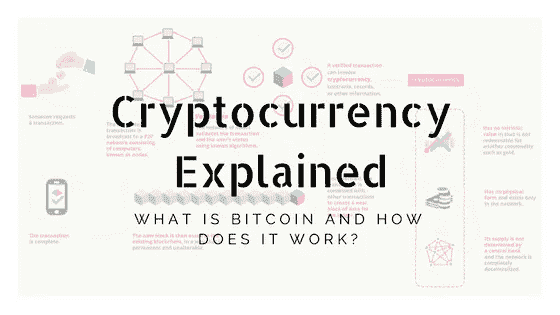
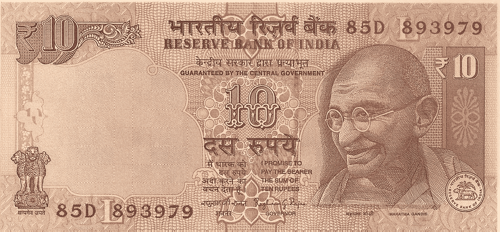

# 加密货币:比特币是什么，它是如何工作的？-概述

> 原文：<https://medium.com/coinmonks/cryptocurrency-what-is-bitcoin-and-how-does-it-work-an-overview-7d5b1bf2a1f4?source=collection_archive---------7----------------------->

*(Image Source: Block Geeks)*

加密货币是当今的流行语，人们急于了解这项并不算新的技术，预计它将在未来几年扰乱金融业。让我们试着从这一篇开始，一部分一部分地解读它。我们将在每一部分尝试回答的问题是:

## **什么是比特币，它是如何工作的？—概述**

吃加密蔬菜——比特币的积木
为什么马洛里不能篡改账本？区块链作为永久总账
鲍勃的哥哥是怎么挣钱的？挖掘和创造新的比特币，交易费用
比特币网络和分布式共识
安全和比特币——一个讨论

## **比特币是什么？维基百科说:**

> “比特币是一种加密货币和全球支付系统”

从这一陈述中得出两件事是微不足道的。比特币是一种基于密码术的货币系统，它可以用于在全球范围内进行支付，我们将尝试理解这两种说法。

我们熟悉由印度储备银行(和其他国家的其他中央银行)担保的纸币，它有印度储备银行行长的签名，上面写着:

我答应付给持票人 10 卢比。

Currency (INR)

在比特币的案例中，它会带有谁的签名？谁拥有它？谁来担保货币？当我们已经有了卢比、美元和 Ngultrum(货币)时，为什么我们还需要它？

比特币是由计算机网络运行的货币系统，由网络担保。

因此，我们可以说，要么没有人拥有它，也就是说，没有一个人或实体对它拥有垄断权。或者我们可以说是网络集体所有。

谁是该网络的一部分？技术上来说，任何人都可以。是的，甚至是你。

**谁的** [签名](https://en.bitcoin.it/wiki/Transaction)会承担？用比特币支付的人。

## **比特币支付**

这行得通吗？要理解这一点，不妨大胆假设比特币具有货币价值。我们会在这个博客的最后访问这个问题。

例如，你是鲍勃，你有 5 个比特币。你想付给爱丽丝 3 个比特币。所以你向网络宣布你从鲍勃的兄弟那里收到了 5 个比特币，你想把其中的 3 个给爱丽丝。

但是电视台怎么知道是你宣布的而不是马洛里像你一样想打动爱丽丝呢？通过验证签名是鲍勃的——他早先从鲍勃的兄弟那里收到硬币，而不是马洛里，马洛里只是想花鲍勃的钱。

H **ow** 网络验证签名吗？它是否已经知道 Bob 的签名并可以与之进行比较？但如果是这样，那么非常聪明的马洛里岂不是伪造了鲍勃的签名？

不，网络不需要知道 Bob 的签名，但是仍然可以验证它是否是真实的 Bob 的签名，而不是来自 Mallory 的伪造签名。怎么会？答案在于一种称为数字签名的加密技术，我们将在下一部分讨论这种技术。

好吧。但是鲍勃的哥哥是怎么牵扯进来的呢？因为要想拥有金钱，必须有人给你钱。也可能是你努力“赚”来的。在这种情况下，鲍勃的兄弟通过努力工作获得了 12.5 个比特币，并给了他非常尊敬的鲍勃 5 个比特币。至于鲍勃的哥哥是如何赚到他的 12.5 比特币的，他是通过一个叫做挖掘的过程赚到的，这是计算性苦工的另一种说法，我们将在下一部分讨论这一点。

现在，当你向网络宣布你要从你的 5 个比特币中支付 3 个给爱丽丝时，网络会做什么？它将执行以下操作:

检查你是否至少有 3 个比特币可以消费——它将验证你消费的比特币是在之前的交易中支付给你的
检查是否真的是你宣布的——它将验证你公告中的签名
如果检查成功，它将接受这笔交易，将其添加到网络上每个人都可以看到的公共分类账中
到目前为止，我一直在说“网络”检查、验证、添加等。但是一个技术上任何人都可以加入的网络是如何做到这一切的呢？

实际上，只有一个节点进行验证并将交易添加到分类帐中。但是我们怎么能信任那个节点呢？如果马洛里有一个知情人——他姐姐马洛里在网络中的姐姐，不管马洛里说什么，他都会把这笔交易加到账上，那该怎么办？或者，如果马洛里就是网络中的他自己——鉴于他拥有巨大的权力。

答案在于这样一个事实，即马洛里不能挑选他的审计员，也就是说，谁来核实他的交易。“网络”随机选择谁来验证交易。鉴于鲍勃·拉杰亚 50%以上的人都很诚实，马洛里的努力不太可能成功。

又“网络”如何选择？我们将在第 3 部分回到这个问题。

*提示:这与鲍勃的哥哥如何挣钱有关*

好吧，网络接受了交易并把它放在公共账上。如果马洛里后来试图篡改账本，试图证明鲍勃的哥哥给了他 5 个比特币，而不是鲍勃，那该怎么办？嗯，以比特币使用的分类账类型，这是不可能做到的。怎么会？

用非常通俗的话来说，每一笔交易都包含分类账中前一笔交易的一部分。因此，如果您试图修改一个事务，您也必须修改前一个事务。但是因为前一个包含了前一个的一部分，所以也必须修改。因为在它之前有一部分事务，所以它之前的事务必须被修改。我希望你明白我的意思。要改变一个，就要从时间开始改变所有的交易。即使有十个头的马洛里也不可能做到。

这在技术上已经完成了，我们将在下一部分吃加密蔬菜时讨论它。

经济学——比特币如何获得价值并成为一种货币？

好了，现在我们知道了比特币是如何被用来支付的，我们将首先看看它是如何获得价值并成为货币的？让我们分两部分来回答这个问题——某物如何成为货币，货币如何获得价值。

要理解这一点，我们需要理解货币是如何运作的。我们先来看传统货币。

这是一张由印度储备银行行长签署的保证其价值的毫无价值的纸。有了担保，它的价值就由我们能用它买什么来衡量。例如，如果在某一天，65 卢比值 1 美元，这意味着你需要 65 卢比来购买一美元钞票。

政府担保中隐含的意思是，另一个人不能花你拥有的钱，或者同样的钱不能花两次——否则，钱就会失去价值。

传统货币之所以有效，是因为人们相信政府保证纸币有价值。

总而言之，货币应该难以伪造，应该值得信任
应该使用方便——如果使用货币非常困难，以至于超过了你试图进行的交易的价值，就没有人会使用这种货币
现在，假设有一个系统具备所有这些特征，但不包括政府和纸质账单。如果这个系统足够安全，值得信任，比传统货币更便宜，它会足够激励你使用它而不是卢比、美元或 Ngultrum 吗？

比特币内置了安全功能，使其相当可信。因此，它具有作为货币使用的特性。

现在让我们来关注它获得的价值，它已经获得的价值，它现在拥有的价值——在我写这篇文章的时候，高达 7，750.22 美元。正如我们之前讨论的，钱的价值取决于你能用它买什么。或者翻转它，需要什么来拥有它。拥有一样东西的成本是由需求和供给决定的。需求越多，供应越少，你买它的成本就越高。

现在，货币需求如何增加？希望投资者能从中获得回报。这种“希望”可以被称为投资者对所投资货币的信任。

总而言之，比特币已经被很多人所信任，并在这个过程中增值。

我希望到目前为止，你对比特币的工作原理有所了解。在下一部分，我们将看看让比特币成功的现代密码学的构建模块。

**在这里你可以找到区块链的简单实现:** [**VCoin**](https://github.com/farhan711/blockchain-VCoin)

**喜欢这个帖子就分享吧，别忘了鼓掌，觉得值得看的就评论分分钟。我希望我的作品能引起你的共鸣。**