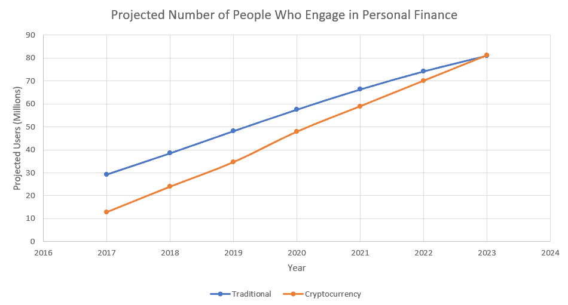

# 加密货币将引爆个人金融市场

> 原文：<https://medium.com/coinmonks/cryptocurrency-will-explode-the-personal-finance-market-61e5669d6221?source=collection_archive---------1----------------------->

在过去的 3 年里，加密货币市场的投资者数量激增。2017 年，投资者以如此快的速度进入加密市场，以至于无数的交易所[会因前所未有的服务器负载](https://www.businessinsider.com/crypto-exchanges-are-shutting-out-new-users-because-they-cant-keep-up-with-demand-2017-12)而持续崩溃。

2017 年，[比特币基地甚至成为苹果应用商店](https://www.vox.com/2017/12/7/16749536/coinbase-bitcoin-most-downloaded-app-iphone)排名第一的应用。自那以来，投资者涌入市场的速度仅略有放缓。2019 年，比特币基地宣布他们的用户已经突破 3000 万。[比嘉信理财](https://www.investopedia.com/news/coinbase-has-more-users-schwab/)的用户还多。

简而言之，加密货币市场的发展速度远远快于传统金融市场。尤其是在某一方面。

> 个人理财

目前有超过 4000 万的加密货币投资者。虽然所有这些人都对加密货币感兴趣，但几乎所有这些投资者都有另一个共同的属性。那就是他们管理自己的投资组合。

加密货币投资者不会去第三方管理他们的资金。几乎所有的投资者要么把他们的数字资产存在个人硬件钱包里，要么存在他们信任的交易所账户里，要么存在像比特币基地这样的在线钱包账户里。转移、管理和交易资产的整个过程都是手动的。每个人都痛苦地跟踪自己的资产，同时实施对自己最有利的策略。

个人资产管理已经成为密码市场的一种文化规范。它已经在独立的信念系统中根深蒂固，并由 crypto 延续。一个简单的想法是，你可以也应该拥有管理自己财富的权力。

> 但是，有一个问题。

以如此惊人的速度加速已经导致了方便地管理加密资产组合所需的工具和服务的短缺。本质上，它们是不存在的。市场增长如此之快，以至于资产管理领域的创新跟不上需求。市场上有一个巨大的缺口，目前还没有被填补。

# 看看传统市场

传统金融市场中有一个价值数十亿美元的行业，专注于个人资产管理。像 Wealthfront、Mint、Acorns、FutureAdvisor、Betterment 和 SIGFIG 这样的服务。这些公司都找到了一种以引人注目的方式为消费者服务的方法，并在这个过程中赚了很多钱。这还没有考虑到在传统个人理财市场竞争的无数其他公司。

这些公司开始变得如此有利可图的核心原因是，个人控制其财务的运动正在缓慢发展。仔细管理我们分配资金的方式，跟踪我们的财务目标，并根据我们生活中的个人抱负调整我们的资产。

这一运动在过去十年中发展缓慢，为个人理财解决方案注入我们的生活提供了机会。

# 为什么这很重要？

加密货币市场充斥着管理自己投资组合的投资者。与该运动多年来建立的传统市场不同，加密货币从第一天起就带着个人资产管理的理念诞生了。事实上，第一块矿开采出来的时候，让别人管理你的比特币这个概念甚至都不存在。个人估计，迄今为止，从事个人金融业务的加密投资者比例超过 90%。

在 4000 万的市场规模中，90%的个人资产管理市场大约有 3600 万从事个人理财的投资者。这个市场的年增长率高达 50%。迅速超越传统市场。

根据我们的预测，我们预计到 2023 年，加密货币市场中参与个人金融的人数将超过传统市场中的人数。

这是增长最快的个人理财市场——没人知道。

不仅没有足够的服务来填补这个市场的巨大空白，而且空间增长如此之快，加密投资者的需求每年都在变化，这使其难以跟踪。

# 你为什么要在乎？

在下一个市场周期，最大的机会不会在交易所或 ico，最大的看不见的机会将在个人加密资产管理市场。数百万投资者涌入加密领域，他们需要更好的方式来管理他们的个人投资。

传统市场正在发生的事情将会消耗加密市场，但是是以放大的方式。如前所述，几乎每个加密投资者都管理自己的基金。这在传统金融体系中是不会发生的。

密码是一种思考个人理财的新方式。拥有你的资金，管理你的投资，控制你的钱。我们需要个人理财解决方案来满足需求。

# 我们能做些什么呢？

现在是我们将注意力转移到加密货币领域的个人金融的时候了。我们呼吁开发商关注这个新兴市场，并帮助我们推出将改变我们拥有财务的方式的服务。

如果你对构建个人理财的未来感兴趣，请查看我们的开发者 API。这些 API 只需几行代码就可以让您开始连接到每个主要的交易所、收集数据和管理用户投资组合。这是最快速的开始开发的方式，不需要太多的基础设施开销。

让我们知道你的想法！你对个人理财市场有不同的看法吗？

# 关于我们

[Shrimpy](https://shrimpy.io/referral?r=I6VFZ7d2E) 作为首屈一指的加密投资组合管理应用程序引领市场。用户能够配置定制的加密组合并实施被动组合策略，消除了必须主动交易加密的麻烦。

[Shrimpy 的开发者交易 API](https://developers.shrimpy.io/) 是一种整合各大交易所交易功能的统一方式。收集历史市场数据，访问实时 WebSockets，执行高级交易策略，并管理无限数量的用户。

不要忘记在 [Twitter](https://twitter.com/ShrimpyApp) 和[脸书](https://www.facebook.com/ShrimpyApp)上关注我们的更新，并在 [Telegram](https://t.me/ShrimpyGroup) 上向我们令人惊叹的活跃社区提出任何问题。

*捕虾队*

