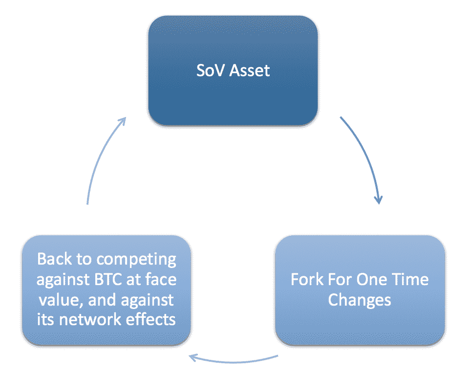
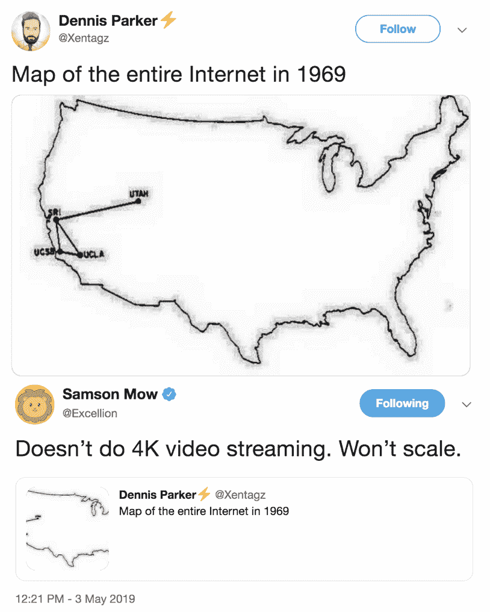
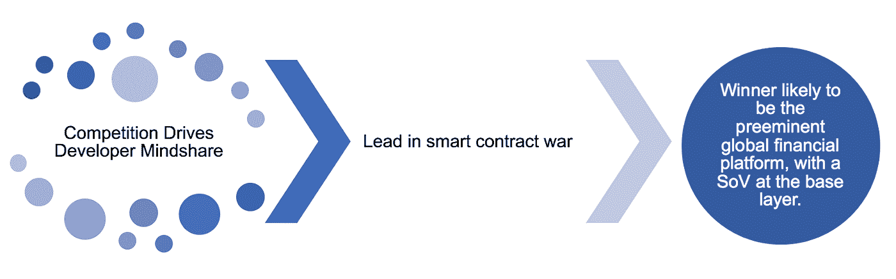
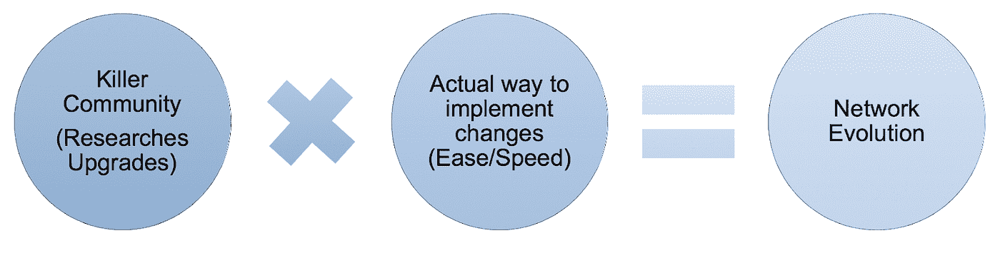
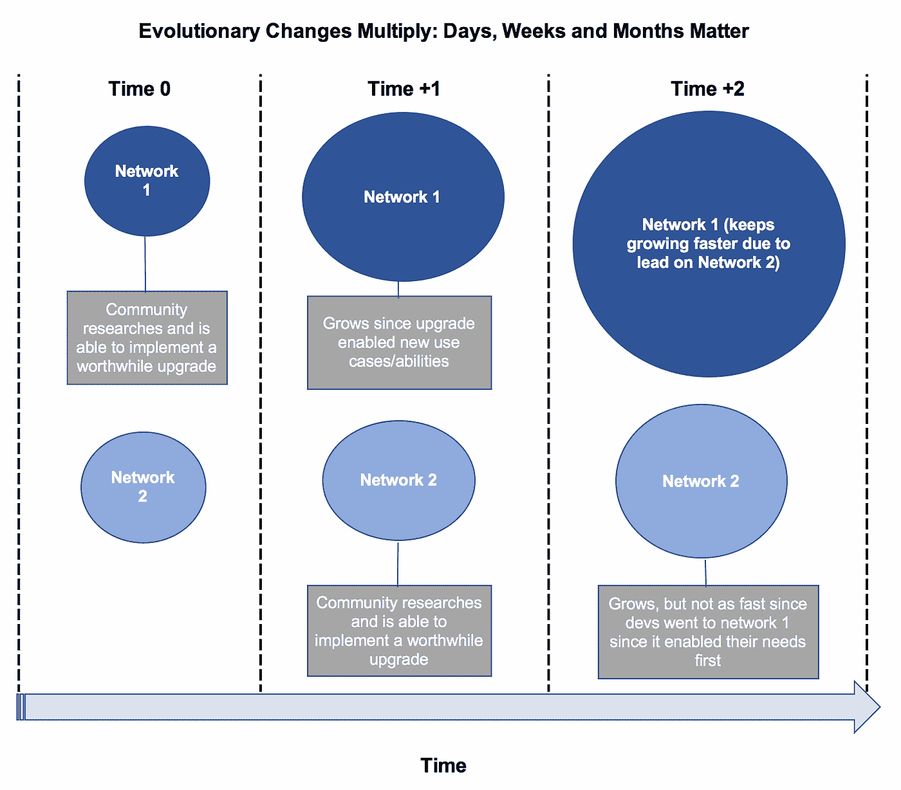
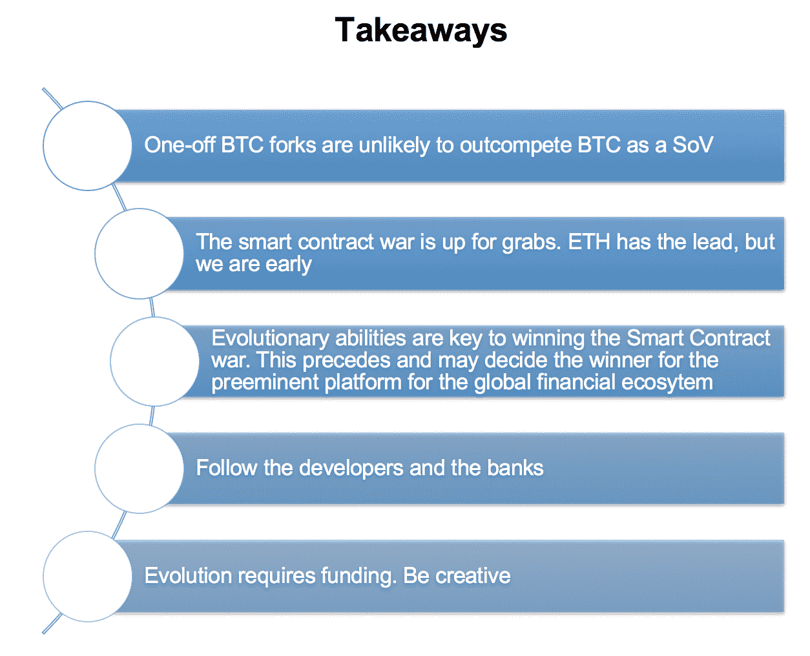

# 密码进化——向卓越协议转变

> 原文：<https://medium.com/coinmonks/cryptoevolution-mutating-toward-preeminent-protocols-97b6a9b824?source=collection_archive---------1----------------------->

***作者:*** [***汤姆沙乌格内西***](https://twitter.com/Shaughnessy119)

## **开启**

我关注加密货币市场的发展。公共网络与生物生命的相似之处太明显了——两者都在你有时间去理解它们之前发生了变化，并且都发生了变异以主宰它们的环境。我以前写过这个话题。下面举两个例子:*(*[*cryptography Part 1*](https://twitter.com/Delphi_Digital/status/1097860073928511488)*，* [*竞赛*](https://twitter.com/shaughnessy119/status/1092765280399437824) *)。*

当我涉猎加密领域，首先在 [Oppenheimer](https://www.oppenheimer.com/) 进行研究，然后是[51%](https://twitter.com/51percentCrypto)和现在的 [Delphi Digital](https://www.delphidigital.io/) 时，我对加密货币的发展形成了一些看法。

我认为，一次性的 BTC 福克斯不太可能战胜 BTC，智能合约战争正在升温，以太坊处于领先地位，进化能力是赢得智能合约战争的关键，也是成为全球金融生态系统平台的更大目标的前提。此外，跟着银行和开发者走，进化需要资金，所以要有创造性。

在我们继续之前，我想提醒你我可能完全错了。同样，如果你认为第一层区块链*永远不会*进化，那么这篇文章就不是你的茶。

当你在细胞水平上研究密码时，有时放大一下是值得的。让我们从显微镜换成望远镜。

## **一次性比特币叉子是非竞争性储值工具**

早期的比特币(BTC)叉子通过一次性的变化，或者对 BTC 的一个或多个方面进行一次性编辑的“调整”而变得突出。Litecoin 是 BTC 核心客户端的一个分支，它将 BTC 的阻塞时间减少了 75%至 2.5 分钟，并改变了其脚本算法(来自 SHA-256 的 Scrypt)。比特币现金分叉显著地将块大小从 1MB 增加到 8MB，以分散化的潜在成本增加链上扩展。

有[无数](https://unhashed.com/bitcoin-cryptocurrency-forks-list/)个比特币分叉，大部分都是不相关的。从安全角度来说，分叉更弱；攻击 BitcoinGold 的 T2 成本约为 1100 到 51%,攻击 BitcoinZ 的成本约为 67 美元。从发展的角度来看，比特币的衍生产品也更弱；莱特币有[有限](/@ElectricCapital/dev-report-476df4ff1fd2)开发活动。

我对像 BTC 这样的 SoV 资产的一次性分叉的问题是，一旦做出改变，那么你必须返回并再次与 BTC 竞争，因为它是不可改变的，很难改变 SoV 资产的表面价值，并对抗 BTC 的整体网络效应。莱特币和比特币现金有一次性的变化，现在它们又回来与 BTC 竞争。

这么想吧:脸书是占主导地位的社交网站。有人来了，叉脸书改变主题颜色，编辑帖子的长度，增加你可以拥有的朋友数量。一旦这些一次性的改变完成，脸书 V.2 必须回去和脸书 V.1 竞争，成为占主导地位的社交网站。你又回到了起点，减去所有的网络效应。

此外，即使脸书 V.2 奇迹般地获胜，下一次必须做出改变时会发生什么呢？新版本必须在表面价值上击败脸书，并击败其网络效应。你又回到起点了。

我用这个例子是因为它容易理解，但也有缺陷。比特币不是一个网站，它是一种由安全性培育的货币形式，与比特币的价值挂钩。货币是通用的，而脸书是发达国家的新事物。

任何有一次性变化的 BTC 分叉都将很难与 BTC 竞争。考虑到职位的变化，它必须回头，竞争，并最终在自己的游戏中击败 BTC，大多数人会同意这是一个不可逾越的目标。在德尔福数码，我们[相信](https://www.delphidigital.io/bitcoin)比特币作为一种数字化、抗审查、反通胀和全球储值手段的长期成功。

## **演进适用于智能合约平台**

我认为，BTC 可以成为一个全球性的、数字化的、不可改变的储值工具。当然，我认为假设我们将生活在只有一种加密货币的未来是狭隘的。我们今天有许多权衡，随着世界从模拟向数字过渡，这些权衡只会越来越多。

随着加密货币目标市场规模的增长，它们之间的权衡也将增加。因此，不同加密货币的 TAM 应该不断增长，为一种以上的加密货币打开大门。这是真的，除非最终每个第 1 层资产都必须竞争成为 SoV。

虽然智能合约平台目前有限(吞吐量、用例、采用)，但我认为不值得放弃这项技术，因为它可能会不断改进和发展。例如，以太坊目前每秒只能处理 7-15 笔交易，远远不足以支持病毒性智能合同或用例，但如果升级成功，Serenity 下的重大潜在改进可以增加这一点。

这同样适用于 BTC 的闪电网络，容量只有 600 万美元[今天](https://1ml.com/)，但理论上可以随着基础技术的改进而提高几个数量级。

([Link](https://twitter.com/Excellion/status/1124393507551006720))

在智能合约领域，我认为需要对进化进行微观监控。升级以实现最大增量功能的平台将可能胜出，鉴于我们正处于一个爆炸性实验的时代，这一方面将被密切跟踪。

以太坊在这个领域有着明显的优势。在该平台上工作的团队[的广度、深度和数量](https://twitter.com/sassal0x/status/1121419329084375043)使其领先于所有其他智能合约平台。现在还差得远呢。对自己诚实点，这关系到你的钱。

话虽如此，这是以太坊的游戏输了。Tezos 已经通过了合法的[ringer](http://news.trust.org/item/20171018220552-1rdtw/)，幸存下来，现在看到了一个强大的社区，它有一个实况的、利益相关的网络，超过 80%的令牌持有者验证交易。尽管如此，我不确定 Tezos 的代币持有者的集中程度，他们可能会占这个赌注百分比的很大一部分。最初，Tezos 的 ICO [吸引了](https://multicoin.capital/2018/11/09/new-models-for-token-distribution/) ~30k 的参与者(可能是 [5x](https://multicoin.capital/2018/11/09/new-models-for-token-distribution/) 以太坊的 ICO ),但我现在无法找到 Tezos 的代币发行。

泰佐斯的雅典升级进展顺利，而以太坊的君士坦丁堡升级至少可以说是摇摇欲坠。诚然，Tezos 的升级很简单，社区也小得多。以太坊的升级有更多的利益相关者团体和对更发达的网络的看法。 ***虽然*** ，但是作为一个利益相关者，如果不去质疑是否有更好的方法来发展这些系统，那将会被误导。

Polkadot 是一个智能合约平台，也是一个互操作平台。基本上，它是后者，目标是在我看来占主导地位。开发人员一天只有这么多时间。

这一理论没有错，但双方的利益相关者都需要解读这一格局的竞争力。Polkadot 正致力于[吸引](https://forum.aragon.org/t/discussion-regarding-agp-aragon-acquisition-of-dots/779)项目到*在其平台上建立*，这与*仅仅* *营销*连接不同平台上的项目略有不同。

我是一个完全拥抱竞争的研究者。以太坊 2.0，波尔卡多，阿尔格兰德，Dfinity，Tezos，Cosmos 等。艾尔。，都在赛跑。未知的协同效应可能会浮出水面，比特币和宇宙没有理由在未来无法与以太坊和其他公司竞争。

你能做的最好的事情就是观察开发人员，关注时间表。Polkadot 甚至还没有推出，所以当它推出时，它将与以太坊、Tezos 和所有明天的公司竞争，而不是今天。

当许多人看着 Ameen Soleimani(首席执行官 SpankChain)和 Lane Retting(以太坊核心开发者)在以太坊的治理问题上争论不休时，我在看 Lane 是否会离开，去另一个智能合约平台工作。

跟着开发者走，他们是负责改变这些平台进化的密码医生。

## **跟着银行走**

**尽管智能合约如今竞争激烈，但最终目标是让这些协议之一成为卓越的全球金融平台，并在基础层提供 SoV。**这一切都归结为安全性，因为如果开发者不信任平台的长期可靠性，他们就不会在分散平台上构建。我相信今天的智能合同竞争先于这一宏伟目标。

因此，跟踪银行和企业家，看看他们在构建什么平台，以及为什么这样做，也是值得的。我们需要银行和大公司在这些平台上创建面向消费者的金融应用，无论是 DeFi 的混合还是基于 crypto 的集中式应用，以满足数十亿人的需求。

现在已经不是 2009 年了。我们无法抗拒华尔街能给 crypto 带来的协同效应。

摩根大通正在以太坊科技上建立自己的稳定资本，T2 兴业银行在区块链以太坊发行了 1 亿美元的债券。这不是为了推动以太坊的车轮，而是为了证明也要跟随银行，因为他们拥有数万亿的资产和任何加密平台都无法想象的更多客户关系，所以我们应该对传统银行参与加密持开放态度，因为他们可以在一夜之间引导用例并采用。也就是说，脸书的用户比任何一家银行都多，他们的参与可以一夜之间启动 crypto。

一个“战争”场景可能是 BTC 与比特币银行(普通机构)构建用例，要求 BTC 作为 SoV，而在“以加密为中心”的世界中，DApps 用例(如 MakerDAO)使用 ETH 作为 SoV。因此，跟着银行和开发商走。

## 进化有多种形式

Decred 和 Tezos 吸引了我的注意，因为它们与进化系统非常相似。他们实现改变的容易程度(代币持有者只需通过钱包投票)简单易行。

Decred 最近投票启用了 lightning 功能( [DCP-0004](https://voting.decred.org/) )，Tezos 的雅典升级正在向前推进。许多人都没有听说过，因为没有任何烟花。戏剧吸引人群的方式很有趣，也许这就是以太坊现在的剧本，因为这既是非正式治理的副作用，也是被吸引到战斗中，然后以某种身份参与其中的人类本性。

链上治理可能更有组织性，但分散化权衡是房间里的危险大象。

易于实现只是进化等式的一半。一个平台需要成千上万的人从事特定的研究和升级，以改进平台本身或在其上构建的东西。称之为研究池。Tezos 和 Decred 的研究池比今天的以太坊小得多。

需要注意的是，我们还处于链上治理方法实验的早期。快速简单的升级能力会将平台置于风险之中，因为这些变化可能会对平台产生负面影响，而没有正确了解下游影响。

一个想法是，让一个竞争平台复制并粘贴另一家连锁店已经实施的升级版，但你仍在追赶，进入脸书 V.2。有人可能会说，例如，法令 d 是复制并粘贴比特币，但为了避免成为脸书 V.2。在这种情况下，法令 d 必须证明其长期国债模型能够为升级提供资金，以使其区别于其他密码货币。一种方法可能是法令的混合 PoW/PoS 共识机制，这可能有助于该平台在我们一直在追溯的安全领域展开竞争。Tezos 必须证明，在关注金融使用[案例](https://cryptobriefing.com/real-estate-tokens-tezos/)方面，它能够做的不仅仅是跟随 Ethereum 的脚步。

为了避免混淆，我不认为 Tezos 和 Decred 在竞争，而是分别是 Ethereum 和比特币新进化形式的例子。

一个例子是币安带头开发 BNB 作为其交易所使用的折扣代币。这个概念被霍比、比伯克斯和库坎复制到了手中，这并不重要，因为币安仍然是销量第一的交易所。其他三个交易所分别排名第 3、12 和 18 位。你不能复制并粘贴你的方式到前面，这是假的进化。

跟上快速发展的研究群体很难。试着跟上以太博物馆的[新闻](https://www.weekinethereum.com/)以及建立在它上面的项目——这是不可能的。这种原始的、混乱的、疯狂的新闻流是在这个平台上工作的开发者的全球基础的顶点。

享受混乱吧，它是主动的。这与医学界相似，在医学界，我们将通过由高素质医生组成的大型团队对重大疾病进行研究来解决这些疾病。即使一个智能合同平台的研究人员不能解决一个问题，在这个过程中，太空中大量的资本[部署](https://twitter.com/spencernoon/status/1122914164752683008)将导致其他的创造和解决方案。

礼来公司花了大量的钱创造了药物 [Evista](https://www.theguardian.com/business/2012/nov/27/new-uses-old-drugs-business) ，这是用来治疗骨质疏松症，然后发现是可行的，以减少乳腺癌。Gemzar 是一种[药物](https://www.theguardian.com/business/2012/nov/27/new-uses-old-drugs-business)，已针对其抗病毒特性进行了研究，目前用于治疗癌症。

## **进化需要钱**

细菌进化需要能量，而智能合同协议的燃料是金钱。这很有趣——我们需要使用的东西是我们试图摆脱的东西(菲亚特)，以建立我们想要的未来(crypto)。

大多数人认为 BTC 不需要资金，这在一定程度上是对的。建设 BTC 未来的两家著名公司需要资金: [Blockstream](https://blockstream.com/2016/02/02/en-blockstream-new-investors-55-million-series-a/) 和 [Lightning Labs](https://techcrunch.com/2018/03/15/lightning-labs-just-raised-millions-from-jack-dorsey-and-others-to-supercharge-blockchain-transactions/) 。这甚至适用于麻省理工学院的数字货币倡议，该倡议有助于资助协议级研究；虽然你可以捐赠来支持他们的研究(无私的),但是资金的主要来源来自 80 个公司成员(企业)。

无私的开发者只能到此为止。租金于每月 1 日到期。

用投资者的钱资助这些协议的未来没有错。但值得记住的是，这些营利性企业最终会将他们的发明产品化，以获得回报。现在还为时过早，但这可能会给新发明增加摩擦。

涉足链上国债的新平台很有趣。法令规定的每笔奖金的 10%进入国库，代币持有者可以很容易地提议如何使用这些资金并对其进行投票。如果 Decred 成功，这是一个长期、持续的不需要产品化的资助模式。开发人员可以通过升级获得报酬，而不必将升级产品化并为公司赚取收入。那是强大的。

一个想法是以太坊基金会将其资金投入到股权凭证中，并将这些回报作为可持续的长期资金来源。

其他想法正在涌现。MolochDAO 是一个由社区资助的基金，为以太坊项目提供资金。不管怎样，我对协议如何获得资金不感兴趣，无论是通过盈利性公司还是连锁公司。BTC 的第二层是由投资者的资金资助的，而不仅仅是无私的开发者。

关键是进化需要资金，如果一个协议没有资金，它就不会变异来主宰它的环境。比特币已经进化了。BTC 改进协议( [I](https://bravenewcoin.com/insights/the-3-most-promising-bitcoin-improvement-proposals-bips) 、 [II](https://coinjournal.net/checksequenceverify-what-is-it-and-why-is-it-relevant/) )向前推进，以更改协议来支持新技术(BIP 112 和其他用于闪电/支付通道)。以太坊也有它的 EIP [列表](http://eips.ethereum.org/core)，随着升级周期变长。

最终我们会到达一个协议不再需要发展的点(TCP/IP ),但我目前认为我们在这些协议的生命周期中冻结和稳定还为时过早(BTC 和以太坊的新 bip 和 EIP 的增加证明了这一点)。

## 互操作性和可组合性使得新平台更难超越现有平台

互操作性(利用其他区块链对一个用例进行不同权衡的能力)和可组合性(在一个区块链上利用多个基础设施)表明，我们更不需要其他新的区块链。

例子显而易见。如果有人正在构建一个需要强大的州级安全保证的用例，他们会将数据存储在 BTC。不需要另一个 BTC，特别是随着时间的推移越来越多的人这样做，进一步为这个用例建立一个网络效果护城河。

如果您正在构建一个去中心化的金融应用程序，请注意以太坊已经有了许多 DeFi 构建模块(稳定币、去中心化交易所、预测市场),任何开发人员都可以利用，因此没有必要在其他链上重新创建这些轮子，然后*在您的原始项目上工作。*

当您可以在现有链上开始并构建您的项目时，为什么要重新创建针头和显微镜？**称之为可组合性锁定，很难打破。**

**当其他链寻求复制这些基本构建模块时，领先的链在另一个层面上工作，开发捆绑这些模块的应用**(即 Tezos 可能会发布 stablecoin，但以太坊的开发人员已经利用其现有的 stablecoin，Dai，开发面向[消费者](https://cryptoslate.com/breaking-down-augur-v2-prediction-market-upgrades-now-using-ethereum-stablecoin-dai/)的应用)。

不要忽视这种时间上的优势。如果一个杀手级的未来用例需要一些已经存在于另一个链上的基本构件，那么如果杀手级应用可以使用已经存在于主导链上的构件更快地进入市场，那么亚军有多接近并不重要。

## **VHS vs Betamax:网络效应至关重要**

索尼 Betamax 提供了比 VHS 更高的图像质量，比 VHS 早一年推出，但 VHS 最终胜出，因为它对消费者来说更便宜，初始播放时间更长(两小时对一小时)，发行范围更广，并拥有[许可](https://pdfs.semanticscholar.org/3510/2a811cf7271f62456a1a3cbdd6233f69c4d3.pdf)网络。 **VHS 在 1976 年引入了两小时回放时间，Betamax 在一年后的 1977 年实现了这一功能，但为时已晚，消费者和电影制片人更喜欢更长的格式能力。时间很重要。**

VHS 专注于广泛的消费者吸引力和更简单、更开放的许可模式(想想大规模开发人员对智能合约平台的吸引力)，这最终导致了相对于 Betamax 的巨大分发优势。

索尼最终赶上了与 VHS 的每个功能(自动定时器、预编程等)相匹配的[,但那时要击败 VHS 的主导市场地位已经太晚了。VHS 成为行业标准。](https://pdfs.semanticscholar.org/3510/2a811cf7271f62456a1a3cbdd6233f69c4d3.pdf)

Net，你不需要成为第一个进入市场的人来赢得胜利，当技术只有微弱优势时，网络效应真的很重要。

## **最终模块**

我的观点是，一次性的 BTC 福克斯是不相关的，因为他们正在进行一次性的改变，必须回头与 BTC 在网络效应和它的理想上竞争，这很可能是不可能的。

对于旨在实现金钱以外的功能的智能合约平台，应该用显微镜来跟踪演变。雇佣一组人，给他们都发显微镜。

首先，这些平台不仅需要展示一种高效的升级方式，还需要展示一个拥有创新广度和深度的全球研究池。没有先购买*的*配料，你就不能烤蛋糕。

作为一个天生的金融人，虽然新连锁店在竞争中成功的机会很小，但如果他们赢了，可能会带来巨大的回报。Tezos 有点低调，如果它能吸引以太坊的部分开发者或全球关注，回报可能会很大。在调整后的基础上考虑它，百分比很低，但回报可能很高。

我的观点是，把一次性的 BTC 福克斯留在门口和智能合同平台上，尽可能密切地跟随有资金的开发者(协议和那些构建在上面的)和银行。所有的 cryptos 和智能合约平台都在安全性方面展开竞争，但警告是，它必须是一个开发者可以实际构建的平台。

病毒在传播，但也在变异。赢家不仅将主导智能合约领域，还将主导作为卓越全球金融体系的宏伟愿景。

__________________________________________________________________

在[推特](https://twitter.com/Shaughnessy119)上关注汤姆

**表彰**:特别感谢[瑞安·西恩·亚当斯](https://twitter.com/RyanSAdams)抽出时间，与我进行有见地的谈话，帮助我形成对这些话题的看法，并感谢[斯潘塞·努恩](https://twitter.com/spencernoon)、[格雷戈里·罗科](https://twitter.com/Obstropolos)、[凯文·凯利](https://twitter.com/Kevin_Kelly_II)、[萨姆·科尔索](https://twitter.com/samc621)和[阿尼尔·卢拉](https://twitter.com/anildelphi)对本报告的建议、更正和见解。

**德尔福数码:**如果你是一家基金、分析师或公司，正在寻找分析这些趋势的最坚持不懈的研究团队，请访问[德尔福数码](https://www.delphidigital.io/)。

**披露:**本帖仅提供信息和教育，并不鼓励买卖任何证券或代币。永远做你自己的研究，不要根据这篇文章做财务决策。作者在 BTC、瑞士联邦理工学院、DCR、XTZ、MKR 和织机上持有代币。