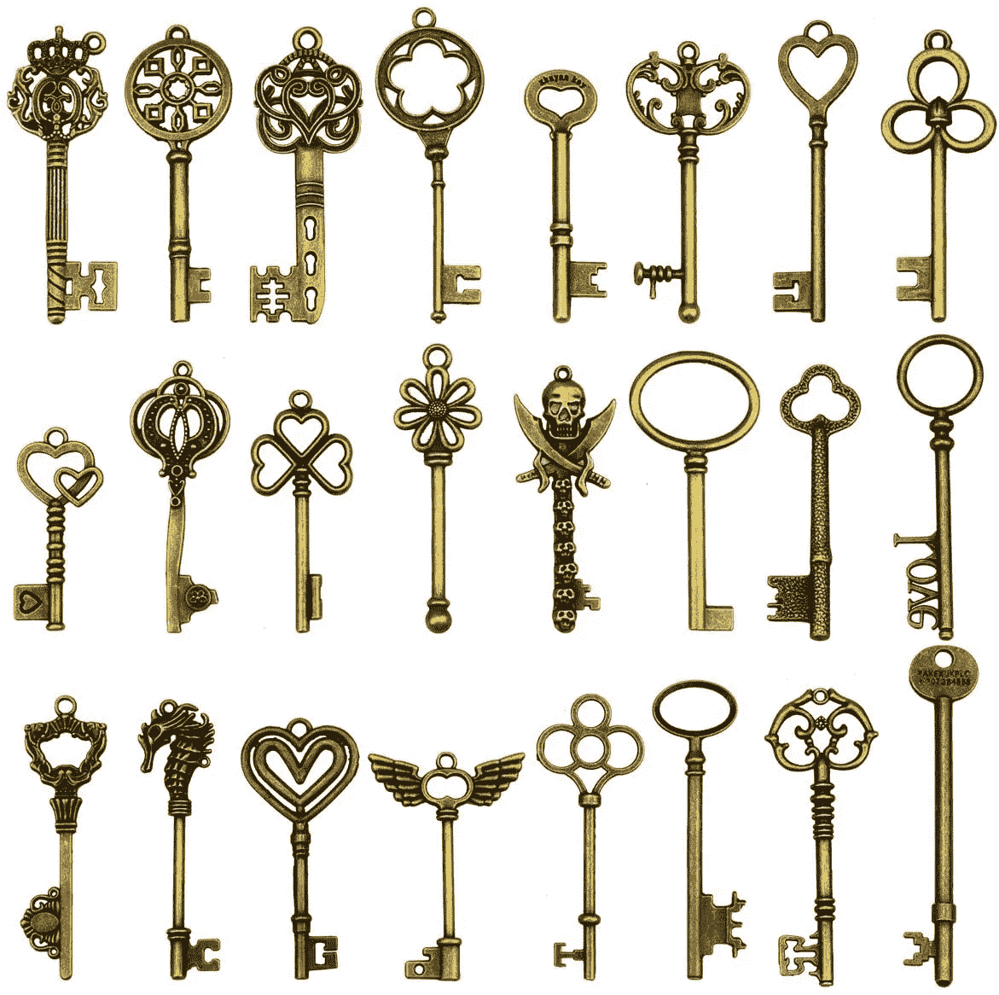
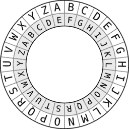
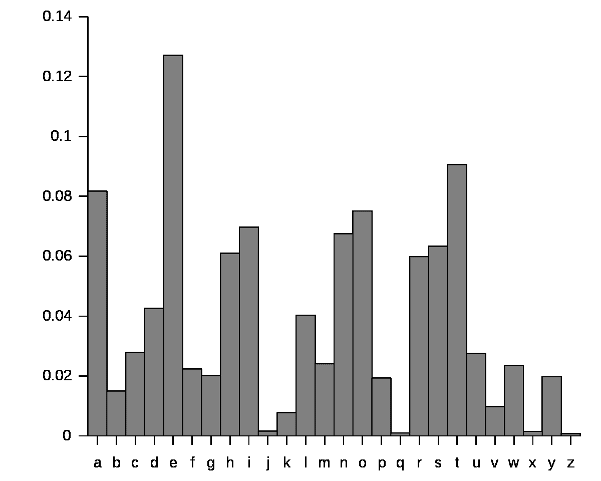
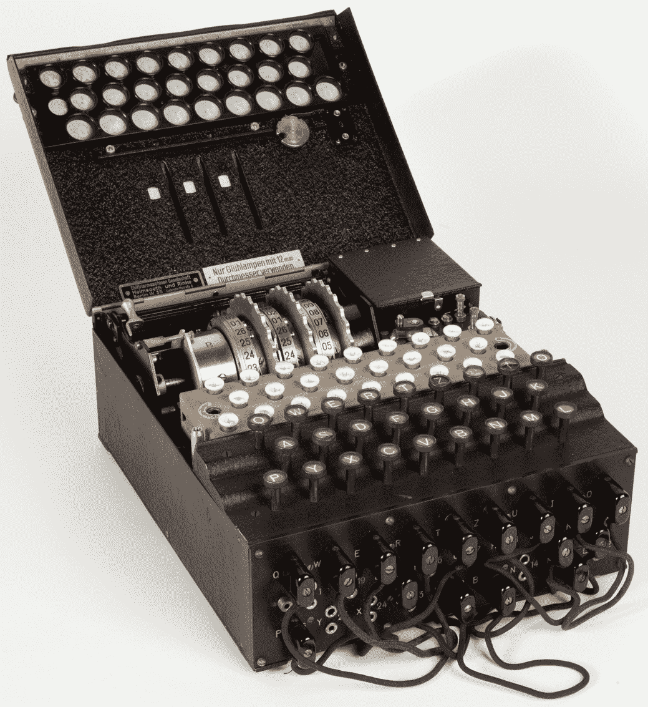
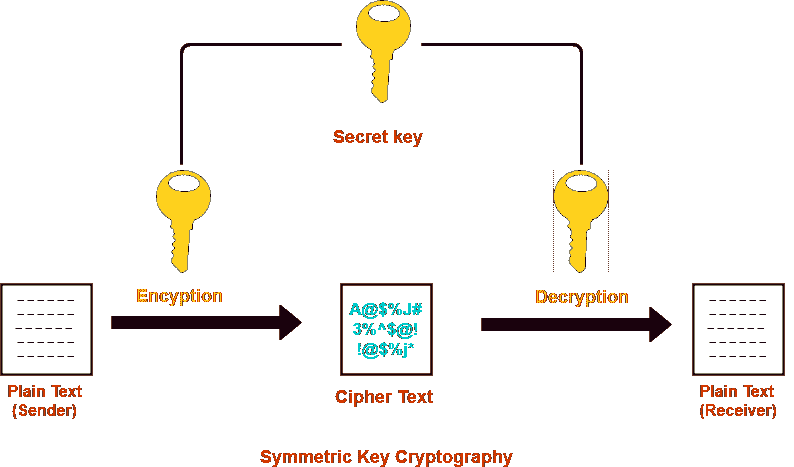
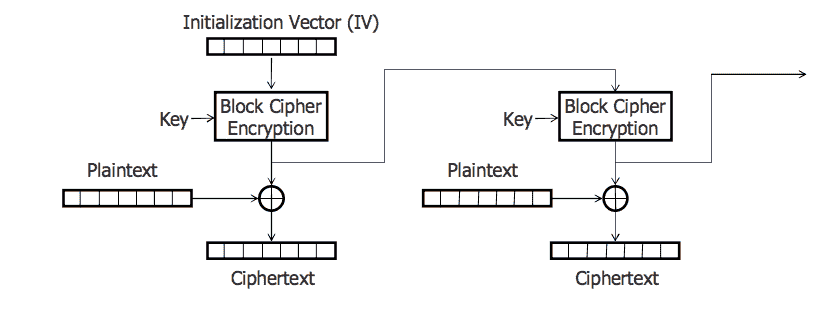
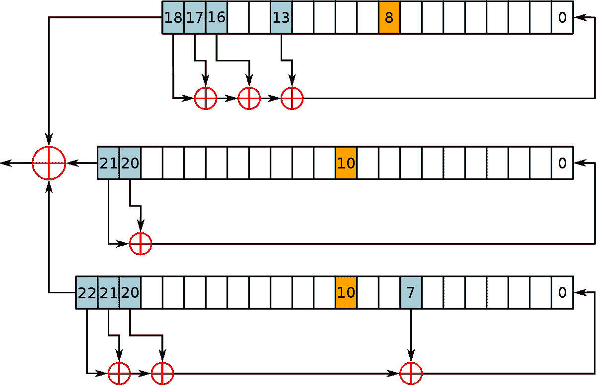
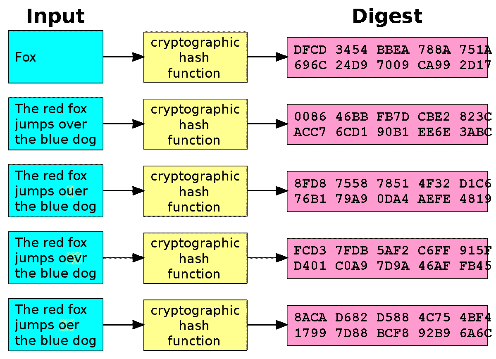
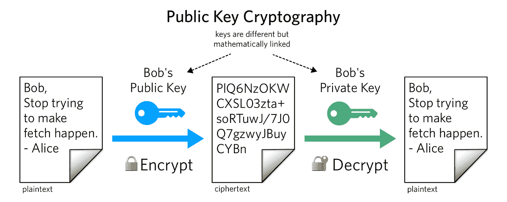

# 密码学及其在过去、现在和未来的意义

> 原文：<https://medium.com/coinmonks/cryptography-and-its-implication-in-the-past-in-the-present-and-in-the-future-6838ae3a3727?source=collection_archive---------4----------------------->

Antique Keys

人类在这个星球上的成功之所以成为可能，是因为我们有能力进行沟通，以集体的方式解决复杂的问题。然而，一些团体并不总是意见一致，导致了塑造我们历史的多重冲突。密码学本身已经被证明是一种工具，可以使双方之间的通信对任何一方保密。这个工具比我们想象的要重要得多，我们将探索它是如何在过去、现在和未来塑造历史的。在一个庞大的实体和政府越来越多地出现在个人日常生活中的世界里，用加密技术保护数据将是一个必备的工具。

密码学已经存在了几千年。

公元前 1900 年，人们在古埃及的墓墙上发现了第一种形式的加密技术。克努莫特普二世的坟墓上雕刻了不寻常的符号，以迷惑读者，增加神秘感。

此外，在公元前 5 年，斯巴达人创造了一种被称为 Scytale 的密码装置。工具是一根用一块皮革包裹的棍子，上面有信息。只有当包裹在这个特殊直径的圆柱体上，让字母对齐时，它才是可读的。消息的接收者需要完全相同直径的 Scytale 来解密消息。

Spartan Scytale

另一个很好的例子是凯撒密码，以在背信弃义的时代创造这种秘密通信技术的皇帝命名。这种技术被称为替换，即用只有收件人知道的另一个字母替换每个字母。

Caesar Cipher

古代世界中还有许多其他历史上使用的密码学的例子，允许双方之间的交互保持秘密。

在历史上，统治君主或皇帝经常使用加密技术进行内部通信。通信加密通常专用于军事计划或任何宗教作品。朱利叶斯·凯撒用他著名的密码和他的将军们组织战略。公元前 100 年的希腊魔法纸莎草纸包含了仪式、赞美诗和用古希腊语写成的咒语，对于普通读者来说是不可能读懂的。创建加密消息意味着在群体内保持通信秘密，并为群体成员形成排他性。这些密码只有这些成员知道。

然而，在公元 700 年，阿拉伯语言学家塔里写了第一份关于密码技术标准的文档，名为《密码信息书》。这是第一次存在正式的技术文件。这为密码学提供了一个新的研究视角。这门科学在 9 世纪继续发展，当时 Al-Kindi 发明了频率分析，这是阿拉伯语中字母频率的测量方法。这是有史以来第一个已知的密码破解技术，标志着该领域的开始。然而，直到第二次世界大战，我们才看到任何重大的进步。

Generic Frequency Analysis Table

第二次世界大战期间，德国人创造并使用了著名的名为“谜”的转子机器。这台机器基本上是由一个键盘、一个灯板和中间的一组转子组成的。在键盘上键入一个字母会点亮灯板上的另一个字母。这种替换是通过由转子控制的特定布线实现的，这将根据用户可以手动改变的配置来改变连接。这使得机器可以进行多字母替换，也就是说每个字母可以被不同的字母替换。字母表可以被多种字母表代替。所有的功能都是机电的。

Enigma Machine used by Nazis during WW2

这台机器在当时是一项重大的技术进步，它被英国人用 Ultra 打破也是如此。德国人通过无线电摩尔斯电码传递军事信息，这种电码最初是用英格玛密码编写的。通讯是牢不可破的，这使得德国人可以利用战场优势。当英国人打破了机器，盟军夺回了优势，赢得并结束了战争。据估计，随着破裂，战争缩短了两到四年。

所有以前的密码技术或机器主要使用词典编纂和硬件。随着计算机的出现，隐藏信息的相同原理被翻译到了软件中。

现代密码学利用数学将数据加密成不可读的数据。通过复杂的数学算法，发送的信息被加密成一组不可读的字符。

现在有两种主要的加密技术:对称密钥和非对称密钥(或公钥加密)。

# 对称密钥

对称密钥加密是指发送方和接收方使用相同的密钥对消息进行加密和解密。如果 Alice 向 Bob 发送一条消息，该消息将用 Alice 的密钥加密，Bob 将使用同一密钥解密该消息。对称密钥有三种不同的实现方式:分组密码、流密码和哈希函数。

Symmetric Key Cryptographic Method Schema

简单地说，块密码是对固定长度的 f 个文本块的加密，而流密码是通过将每个字符组合成密钥流中的数字来加密每个字符。

Block Cipher Schema

Stream Cipher Schema

两者都是由确定性算法决定的。

确定性算法是这样一种算法，即给定一个输入，它将总是产生与该特定输入相同的输出。

最后，散列函数是一种单向函数，它将把消息输入加密成数字的固定数组输出。哈希函数是不可逆的，找到输入的唯一方法是强力执行该函数，并将所有结果与我们现有的固定数组进行匹配。然而，可能性的数量是巨大的。这就是哈希函数成为强大工具的原因。

Hash Function Schema

对称密钥加密的主要问题是在发送方和接收方之间交换密钥。这就允许了安全漏洞，正如现在通常的情况一样，加密是在互联网上运行的，双方不能秘密会面来交换密钥。这就是不对称密码发挥作用的地方。

# **非对称密钥**

1976 年，研究人员强调了使用一个密钥进行加密和解密的安全性问题，并提出了一个公钥和私钥对系统。加密通信将使用公钥加密消息，使用私钥解密消息。公钥可以自由分发，而私钥必须保密。两个键在数学上是相关的，但是这种关系很复杂，需要解决一个难题。

这种方法的主要进步是，使用公钥解密消息的接收者实际上验证了消息是由拥有相应私钥的人创建的。

Asymmetric Key Schema

假设爱丽丝和鲍勃都有钥匙对。爱丽丝知道鲍勃的公钥，反之亦然。如果爱丽丝用鲍勃的公钥加密一条消息并将其发送给鲍勃，鲍勃将能够使用他的私钥来验证该消息是否已被爱丽丝用鲍勃的公钥发送和加密。因此，通信是完全安全的，双方不需要私下交换任何东西。一切都基于验证。如果一个叫约翰的第三方截获了消息，他会知道鲍勃的公钥，但不能用它的私钥来验证消息。因为一对密钥在数学上是相关的，所以约翰的私钥与鲍勃的公钥不对应。他需要鲍勃的私钥来解密这条消息。

这种基于验证的加密解决方案在该领域是一个突破性的进步，但在整个历史上也是如此。

如上所述，密码学在历史上一直被军队和政府大量使用。随着计算和互联网的到来，力量正在从垂直逐渐转移到水平。与政府这样的高层人物相比，现在的个人比以前更有权力。随着互联网的发展，机会平等显著增加，为人们打开了一大堆可供选择的道路。

由于有了互联网，人们更加自由了，但大型实体仍然控制着大量的互联网用户。像谷歌、脸书或亚马逊这样的大公司拥有用户的私人数据，打破了加密技术必须提供的分散模式。然而，这是可以改变的。随着对形势认识的提高，人们对这些巨头的信任正在转变。《剑桥分析》之类的丑闻凸显了这些实例拥有的过度权力。

互联网已经成为一个圆形监狱。圆形监狱是一种监狱建筑，由哲学家杰里米·边沁设计。这个概念是在一个圆形房间的中间放置一个单独的守卫，让所有的囚犯都有可能被这个守卫观察到。警卫实际上不可能监视所有的囚犯。主要的想法是，囚犯会感到不断被观察，不知道警卫会在某个时间点看哪里。他们会不断地表现出被监视的样子。这和互联网给人的感觉一模一样。一场心理战在我们的网络私人活动中不断进行。

Panopticon Prison

大型互联网公司的模式可能会开始转变。举个例子，app Signal to communication private 标志着一种新模式的到来:一个完全依赖捐赠和同行评审验证的开源非政府组织。像你我这样的审查者，验证用于加密消息通信的信号加密协议是正确和可靠的。这种模式开始吸引许多用户的注意。2021 年 1 月，在脸书宣布将能够访问 Whatsapp 数据后，2000 万用户从 Whatsapp 转移到 Signal。

这种权力模式也(大部分)存在于比特币中。创建于 2009 年的比特币基本面主要依赖于密码学。在[比特币](https://blog.coincodecap.com/a-candid-explanation-of-bitcoin)中使用了非对称密钥加密技术，允许用户私下交易，阻止任何第三方(如政府或公司)干涉这一过程。个人手中有这种权力，这在历史上还是第一次。这都要归功于数学和密码学。

如果一个通信工具和一种货币从一个集中的实例变成完全独立的，极限是什么？这个模型可以应用于任何其他在线工具，加密是这个革命性系统的主要支柱。

> 加入 Coinmonks [电报集团](https://t.me/joinchat/EPmjKpNYwRMsBI4p)，了解加密交易和投资

## 另外，阅读

*   [什么是融资融券交易](https://blog.coincodecap.com/margin-trading)
*   最好的[密码交易机器人](/coinmonks/crypto-trading-bot-c2ffce8acb2a) | [网格交易](https://blog.coincodecap.com/grid-trading)
*   [3 商业评论](/coinmonks/3commas-review-an-excellent-crypto-trading-bot-2020-1313a58bec92) | [Pionex 评论](/coinmonks/pionex-review-exchange-with-crypto-trading-bot-1e459d0191ea) | [Coinrule 评论](/coinmonks/coinrule-review-2021-a-beginner-friendly-crypto-trading-bot-daf0504848ba)
*   [AAX 交易所评论](/coinmonks/aax-exchange-review-2021-67c5ea09330c) | [德里比特评论](/coinmonks/deribit-review-options-fees-apis-and-testnet-2ca16c4bbdb2) | [FTX 交易所评论](/coinmonks/ftx-crypto-exchange-review-53664ac1198f)
*   [n ave 零点回顾](/coinmonks/ngrave-zero-review-c465cf8307fc) | [Phemex 回顾](/coinmonks/phemex-review-4cfba0b49e28) | [PrimeXBT 回顾](/coinmonks/primexbt-review-88e0815be858)
*   [Bybit Exchange 审查](/coinmonks/bybit-exchange-review-dbd570019b71) | [Bityard 审查](/coinmonks/bityard-review-7d104239be35) | [CoinSpot 审查](https://blog.coincodecap.com/coinspot-review)
*   [3 commas vs crypto hopper](/coinmonks/3commas-vs-pionex-vs-cryptohopper-best-crypto-bot-6a98d2baa203)|[赚取加密利息](/coinmonks/earn-crypto-interest-b10b810fdda3)
*   最好的比特币[硬件钱包](/coinmonks/the-best-cryptocurrency-hardware-wallets-of-2020-e28b1c124069?source=friends_link&sk=324dd9ff8556ab578d71e7ad7658ad7c) | [BitBox02 回顾](/coinmonks/bitbox02-review-your-swiss-bitcoin-hardware-wallet-c36c88fff29)
*   [莱杰 vs n rave](/coinmonks/ledger-vs-ngrave-zero-7e40f0c1d694)|[莱杰 nano s vs x](/coinmonks/ledger-nano-s-vs-x-battery-hardware-price-storage-59a6663fe3b0)
*   [密码本交易平台](/coinmonks/top-10-crypto-copy-trading-platforms-for-beginners-d0c37c7d698c)
*   [CoinLoan 评论](/coinmonks/coinloan-review-18128b9badc4) | [YouHodler 评论](/coinmonks/youhodler-4-easy-ways-to-make-money-98969b9689f2) | [BlockFi 评论](/coinmonks/blockfi-review-53096053c097)
*   最好的[加密税务软件](/coinmonks/best-crypto-tax-tool-for-my-money-72d4b430816b) | [硬币追踪评论](/coinmonks/cointracking-review-a-reliable-cryptocurrency-tax-software-5114e3eb5737)
*   最佳[密码借贷平台](/coinmonks/top-5-crypto-lending-platforms-in-2020-that-you-need-to-know-a1b675cec3fa) | [杠杆令牌](/coinmonks/leveraged-token-3f5257808b22)
*   [block fi vs Celsius](/coinmonks/blockfi-vs-celsius-vs-hodlnaut-8a1cc8c26630)|[Hodlnaut Review](/coinmonks/hodlnaut-review-best-way-to-hodl-is-to-earn-interest-on-your-bitcoin-6658a8c19edf)
*   [Bitsgap 审查](/coinmonks/bitsgap-review-a-crypto-trading-bot-that-makes-easy-money-a5d88a336df2) | [Quadency 审查](/coinmonks/quadency-review-a-crypto-trading-automation-platform-3068eaa374e1) | [Bitbns 审查](/coinmonks/bitbns-review-38256a07e161)
*   [埃利帕尔泰坦评论](/coinmonks/ellipal-titan-review-85e9071dd029) | [赛克斯斯通评论](/coinmonks/secux-stone-hardware-wallet-review-15-discount-coupon-2020-7577032faa6e)
*   [本地比特币评论](/coinmonks/localbitcoins-review-6cc001c6ed56) | [加密货币储蓄账户](https://blog.coincodecap.com/cryptocurrency-savings-accounts)
*   最佳[区块链分析](https://bitquery.io/blog/best-blockchain-analysis-tools-and-software)工具| [赚比特币](/coinmonks/earn-bitcoin-6e8bd3c592d9)
*   [加密套利](/coinmonks/crypto-arbitrage-guide-how-to-make-money-as-a-beginner-62bfe5c868f6)指南| [如何做空比特币](/coinmonks/how-to-short-bitcoin-568a2d0b4ae5)
*   最佳[加密制图工具](/coinmonks/what-are-the-best-charting-platforms-for-cryptocurrency-trading-85aade584d80) | [最佳加密交易所](/coinmonks/crypto-exchange-dd2f9d6f3769)
*   [如何在印度购买比特币？](/coinmonks/buy-bitcoin-in-india-feb50ddfef94) | [WazirX 评论](/coinmonks/wazirx-review-5c811b074f5b)
*   [印度比特币交易所](/coinmonks/bitcoin-exchange-in-india-7f1fe79715c9) | [比特币储蓄账户](/coinmonks/bitcoin-savings-account-e65b13f92451)
*   [CoinDCX 评论](/coinmonks/coindcx-review-8444db3621a2) | [加密保证金交易交易所](https://blog.coincodecap.com/crypto-margin-trading-exchanges)

> [在您的收件箱中直接获得最佳软件交易](/coinmonks/newsletters/coinmonks)

