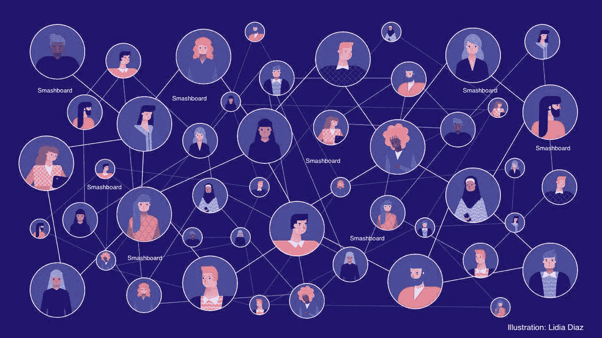
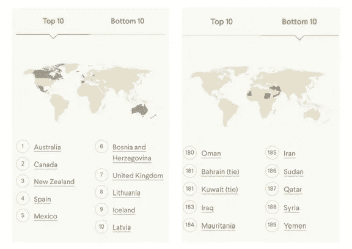
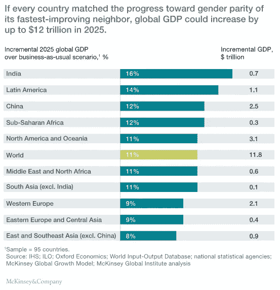
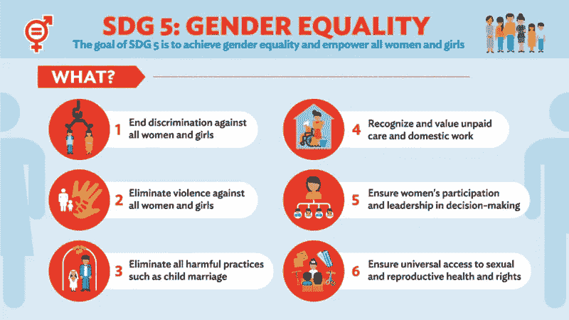
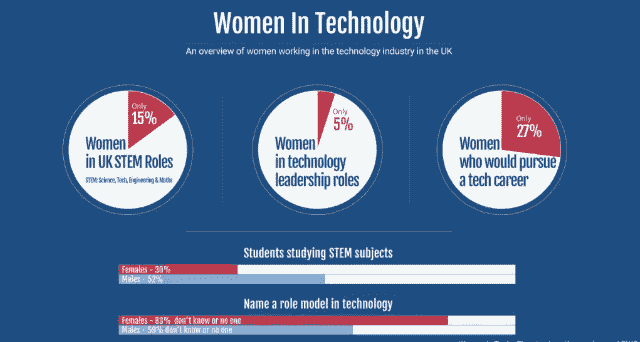

# 密码学将治愈性别不平等

> 原文：<https://medium.com/coinmonks/cryptography-will-cure-gender-inequality-659cc418cd95?source=collection_archive---------0----------------------->

这个世界还没有接受这样一个事实:女人是令人敬畏的 T2。

对我来说没有任何意义。等等——算了吧。

我有*的特权*知道在相对进步的西方世界出生和长大是没有意义的。

如今，我们在地球的这一边看不到太多的前期不平等。细致入微。

**微妙。**

不知何故这并没有更好。男孩俱乐部的遗产仍然在大公司的血管中流动。

女权运动始于 18 世纪初。这太疯狂了。已经过去两个世纪了。

在我看来，女权主义是进步的标志。我的意思是，不要得到*超内在的，*但是持续的进步是对进步的**需求的持续证明。**

女性正在尽自己的一份力量。工作场所没有尽到自己的责任。麦肯锡发表了一篇关于女性如何继续被低估的文章。

为了正确看待的事情，女性工作场所平等指数根据工作场所的性别平等对各国进行了全球排名。这是前十名和后十名。

我可以没完没了地谈论不平等是多么不公平，然后大发雷霆，但事实是这不是新闻。这些与密码学有什么关系？

# 我打算画一幅画。

争取平等的一个驱动因素一直是建立独立。不只是在法律上，而是在社会上获得他人的认可。

目前，身份和经济独立支配着我们的社会权力和影响力。

出生证明和身份证是我们身份不可或缺的一部分，然而世界上数以百万计的女性没有出生证明和身份证。

想象一下没有证据证明你的存在。

这是一个怎样的问题的细节开始进入实际找工作的过程，获得护照甚至公民资格。没有证件是另一个完全不同的问题——但这是一个因女性不平等而长期存在的问题。

这是一道**巨大的**屏障。女性已经缺乏对经济的参与——在女性不能仅仅控制自己身份的地方，她们当然也不能控制自己进入社会。

性别不平等与经济独立有着非常密切的关系。许多第三世界国家的女性已经无法获得传统的金融服务，而这在西方世界是很正常的。

这些女性比男性**拥有一个* ***个人*** *财务账户的可能性低 30%**

**为什么财务自由如此重要？因为建立对令人震惊的事件或痛苦的恢复力的唯一真正的方法是控制价值储存。**

**区块链进入舞台右侧**

# *为什么性别平等很重要*

> *除了主要的论点**这是公平的，**还有很多其他的理由说明性别平等是公平的🔑钥匙。*

*我现在将集中讨论其中的一个——解释区块链是如何干预的。*

> *性别不平等剥夺了社区的财富*

*目前全球性别工资差距为 50%。如果我们克服了这一差距，普通社区或国家的 GDP 将增长 25%。*

*世界银行发现，由于性别差异，全球各国每年损失 160 万亿美元。*

> *“由于女性收入低于男性，全球人力资本财富比应有水平低 20%左右。”*

# *区块链将如何支持性别平等的斗争*

*这一切都归结于独立。*

*利用区块链技术，我们可以给女性更多参与经济的机会。它可以作为所有权的保障和防止伪造文件。*

*所有权+参与权= *权力。**

*尤其是女性难民。移动中的女士将受益于有一个地方来存储和保护医疗记录、身份证件和所有权文件。*

*区块链将成为一个有效的替代选择，在传统上，金融还没有成功地提供坚实的基础设施。*

> *区块链可以打破经济弊端，促进女性的经济自主。*

# ****工作原理****

*区块链是一个*数字化的分布式分类账*，它使用数学和加密技术为所有交易创建一个分散的数据库。*

*这将创建一个可供整个社区查看的记录。任何能上网的人都可以访问这个。因为是公开账本，财务造假就会减少。*

*由于比特币网络提供了绕过传统中介的新可能性，公共当局将更难*执行传统金融法规*。*

*如果你想了解更多关于区块链和加密货币如何工作的信息，特别是向链中添加块的过程、哈希函数等等，[请查看我的文章](/@ruhani.walia/an-introduction-to-cryptocurrencies-c0b8673aec30)进行深入探讨。*

# *什么会改变*

*来吐槽一些事实。*

*在妇女和男子的经济自主和参与方面，有无数个均等点。此刻，[**10 亿女性**](https://www.forbes.com/sites/thestoryexchange/2018/05/24/there-are-1-billion-unbanked-women-in-the-world-this-mobile-initiative-could-transform-their-lives/#4785560f1e9d) 正在**全球无证**。*

*这意味着他们无法获得金融机构或其服务。*

*在一个“充分发挥潜力”的理想世界中，女性在劳动力市场上拥有与男性平等的地位，**到 2025 年，全球年度 GDP 将增加高达 28 万亿美元**，即 26%。*

*这太疯狂了。*

> **这种影响大约相当于中美经济的* ***合力*** *那么大。**

*这一切都取决于女性充分实现其经济潜力。*

*另一种情况是，妇女没有在全球范围内达到与男子平等的地位，而是在“区域最佳”的基础上提高了参与率。*

*这是假设如果所有国家都以各自区域中变化最快的国家的速度向性别平等迈进，就会取得进展。*

*他们估计，到 2025 年，每年的 GDP 将增加 12 万亿美元。*

**

***支持妇女参与经济活动，缩小工作领域的性别差距，是实现 2030 年可持续发展议程**的关键，特别是代表联合国实现性别平等的目标 5。*

**

*但是，我们如何实现这些指标呢？女性将如何实现其全部经济潜力？*

# ***它的用途是什么***

*一家名为 **IDbox** 的公司试图通过展示基于区块链技术的太阳能设备来解决身份问题。*

*该设备仅使用 2G 手机▶️就能创建独特的数字身份和钱包，这意味着它可以在没有互联网或电力的情况下工作。*

*这个盒子首先在巴布亚新几内亚进行了测试，该国 80%以上的人口没有银行账户或官方身份证明文件。*

*另一个例子是一家名为 Blockbands 的公司的 SPENN。他们创造了一种数字钱包，为货币的存储和交换提供基本的金融服务。*

*他们在东非开展业务，也是一个创收机会。世界银行发表文章称，如果联合国选择这款应用程序在难民营中使用，安全性将得到提高。*

*这是因为它将减少实物现金的转手，并将促进女性账户的发展——这意味着女性已经不再拥有账户了(T2)。*

*妇女的财务自由也将刺激难民营的经济，并保障妇女的经济自由权。*

# *盖茨基金会*

*来自盖茨基金会的资金将用于减少 T4 使用区块链的无银行人口。*

*该基金会已经与 Ripple 和 Coil 合作，为同行支付系统提供资金支持。*

*2017 年，**17 亿人**没有银行账户*这意味着由于没有身份信息，他们无法使用任何常规银行服务。**

*有了区块链驱动的平台，这些人有了数字身份和更多的财政渠道。*

*盖茨基金会对区块链的技术并不陌生。他们有自己的一级项目，也推出了 Mojaloop。*

*如果像盖茨基金会这样的强大支持者开始支持像 [CryptoChicks](https://cryptochicks.ca/) 或[Global Women in block chain](https://globalwomeninblockchain.org/)这样的公司或会议会怎么样？*

*梅林达·盖茨最近承诺投入 10 亿美元用于消除性别不平等。使用我已经谈到的工具，加密货币和区块链，这里有一些具体的方法可以用这笔钱来解决这个问题:*

1.  ***打破女性职业发展的障碍***

*如果这笔钱的一部分用于鼓励工作场所的儿童日托或护理服务，用于让女性在产假后获得平等地位，或者培养一个没有性骚扰和偏见的工作环境，那么突然之间，对女性不利的最大因素，即使是在科技以外的行业，也变得没有意义了。*

***2。创造更多的切入点***

*传统上，工作场所是男人的天下。将这一意图与管道的建造方式联系起来并不遥远。这种结构有利于男性。举个例子，我们来说说推荐信。管道主要建立在认可的基础上。大多数教授或更高级别的学术界人士都是男性。这有很多原因，最主要的原因是男性通常会继承这一职位，这份工作的性质要求长期的承诺——他们不会太快离开自己的职位。对于字母来说，培养已经存在的东西已经变得很自然——男性在等级制度中的主导地位。*

*如果部分资金用于支持女性追求高等教育，那么情况可能会开始发生变化，培养女青年的态度也会随之发生变化。*

***3。在需要召唤的地方召唤***

*只有当变革者大声疾呼时，变革才会真正发生。知道**要叫谁**和**要多大声**很大程度上需要数据。了解妇女的生活，特别是那些处于更远的少数群体中的妇女的生活，是真正提高认识的必要步骤。此外，在我看来，解决被误解的问题比根本没有解决方案更有害。它强调了问题的错误方面并改变了意图。那是我们最不想做的事。让我们得到那些数据。*

# ***二级发行***

*这听起来很棒。给女性经济自由，一堆积极的事情就会发生。*

*我有一些讽刺的事情要分享。*

*华威商学院(Warwick Business School)进行了一项研究，发现女性投资者的投资表现优于男性投资者。*

**牛逼吧？**

*尽管女性在科技行业有超越男性的潜力，但即使在传统行业，我们也缺乏代表性。*

> *更不用说区块链和加密货币了。*

*甚至接触这些技术的人也主要是男性。在所有乙醚使用者中，96%是男性。在所有比特币区块链社区参与者中，只有 5%是女性。*

**

*女性在这个领域的代表性不足——如果女性不参与其中，我们如何启动这项技术的使用来提高女性的地位？*

*更有趣的是，从生物学角度来看，女性可能比 T21 更擅长使用区块链和加密货币。*

*[**《哈佛商业评论》**发现男性比女性更倾向于冒险。他们发现，在压力下，性别差异会放大压力。在压力下，▶️男人冒更多的风险，而女人冒更少的风险。](https://hbr.org/2013/02/do-women-take-as-many-risks-as)*

*现在回溯一下，文章接着说*也许*女人**和男人**冒的风险一样多——我们对“风险”的定义只是不同。*

*男人承担身体和经济上的风险。女性认为风险是面对压迫坚持正确的事情，或者是合乎道德的 T21。*

*这些都是可能对这个领域的工作产生巨大影响的难题。区块链主要与金融分析有关，是的，我会给你这个。*

*但是**研究**像*因果*、*伦理问题*和*用区块链和加密货币做正确的事情*都是女性**擅长改进的事情。***

*这些都是技术的基石。例如，对因果关系的深刻理解将允许女性对社区共识做出深刻的贡献，并理解密码加密的过程。*

*理解带来进步。*

> *当面临一个有风险的决定时，领导者必须权衡很多因素。两个最大的问题是，第一，正在讨论的风险有助于实现战略目标的可能性，第二，风险将对相关人员产生的影响……在我的咨询实践中，我注意到一种趋势，即男性更重视前者，而女性更重视后者。”——区块链的风险逆境在生物学上可以分配给男人 ***但是*区块链的伦理道德可以分配给女人。***

*我认为情商和道德的重要性还没有得到足够的强调——更不用说它在像区块链这样的技术中的作用了。*

*[麻省理工学院讲述了这两者是如何联系在一起的。](https://www.technologyreview.com/s/614531/why-its-time-to-start-talking-about-blockchain-ethics/)他们提出的一些要点包括*

*   *思考这项技术能做什么以及潜在的后果*
*   *去中心化的自然——如果出了问题，责任在哪里？*
*   *研究加密网络是否侵犯了隐私？*

*在区块链伦理学中有许多证据和许多问题有待回答。女性需要参与进来。*

# *将这些点连接起来*

*也许如果更多的女性参与到科技的发展和创新中来，多样性实际上已经存在了，这将成为一个不成问题的问题！*

*人们只会在他们解决问题的领域制造问题。*

> *你无法想象你没有遇到过的问题的解决方案。*

*如果技术领域继续充斥着年轻的男性开发人员，这个领域将继续为琐碎的年轻问题创新解决方案。我说的是像按需女佣或 grubhub 这样的计划。*

# ***的知名度是*而不是*的老生常谈。***

*让女性参与科技，并对科技如何弥合不平等的鸿沟感兴趣，可能会带来巨大的回报。*

*《女性加密》的凯尔西·科尔概述了三个步骤，她认为所有女性都应该采取这些步骤来熟悉这项技术。*

1.  ****设置钱包****
2.  ****【增加知识和声望】****
3.  ****因为尽职调查而研究技术和市场=成功****

*技术空间*需要改变。*T22 它**正在**变化着。*

*我认为这是非常疯狂的，区块链和密码的影响如此深远和有影响力，以至于促成了几十年来的社会不公正和偏见的问题。*

**喜欢，这* ***连接*** *怎么可能呢？为什么没人告诉我这件事？**

> *为什么没有更多的女生知道这件事？*

*我认为，在正确的支持和意识水平下，区块链和加密货币可以改变性别不平等的游戏。*

*我只是一个想把*讲不通的东西讲通的女生。**

*我也碰巧是一个 16 岁的区块链爱好者、初级开发人员、密码专家和文学爱好者。*

*几个月来，我一直在研究和学习区块链和加密货币技术。*

*我对行为经济学也很感兴趣，行为经济学是指资金如何流动以及金融领域内的混乱。*

*在学习如何编码和区块链的本质时，我最近制作了我的加密货币——统一货币。随着我们对加密货币的不断了解，我渴望改变传统经济的中央集权性质。*

*如果你喜欢这篇文章，并且有兴趣了解更多关于加密货币和区块链的知识，看看我的其他文章，给这篇文章一些👏在灵媒上跟着我！*

*在 LinkedIn 上与我联系[这里](http://www.linkedin.com/in/ruhaniwalia)。*

> *[在您的收件箱中直接获得最佳软件交易](https://coincodecap.com/?utm_source=coinmonks)*

**