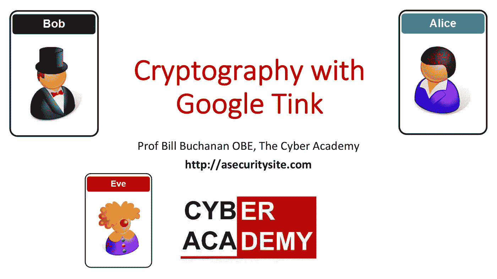

# 使用 Google Tink 加密

> 原文：<https://medium.com/coinmonks/cryptography-with-google-tink-33a70d71918d?source=collection_archive---------0----------------------->

## 向 OpenSSL 说再见，向实践中的最佳者问好

自从 RSA 方法诞生以来，已经有 40 多年的历史了，这是一部密码学方法来来去去的历史。新的攻击媒介也出现了，看起来不可战胜的方法已经崩溃。我们现在有一个加密方法的补丁，它经常不能正确地保护…