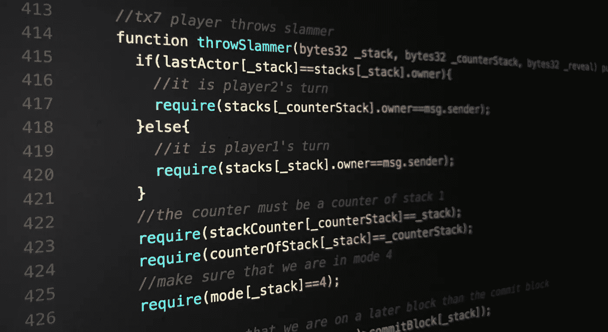
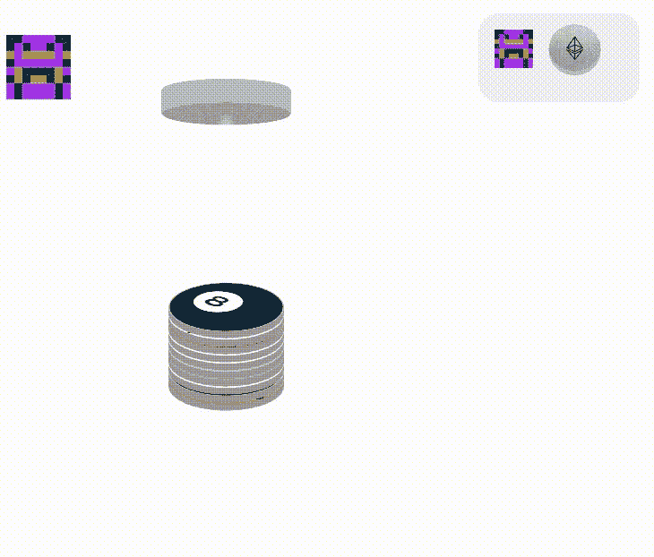

# 将“D”放在 Dapp 中

> 原文：<https://medium.com/coinmonks/cryptogs-io-putting-the-d-in-dapp-b7e40ca594dd?source=collection_archive---------7----------------------->

1993 年，[埃里克·休斯](https://en.wikipedia.org/wiki/Eric_Hughes_(cypherpunk))发表了[一个赛博朋克的宣言](https://www.activism.net/cypherpunk/manifesto.html)详细说明了如果我们希望在一个开放的社会中维护我们的隐私，就需要加密技术和匿名货币。

我当时的雄心没有那么宏大；我在玩 pogs，听 2Pac，培养一个史诗碗切。

几十年后，赛博朋克的愿景正在实现。越来越多的人开始使用加密货币，新闻里到处都是关于隐私的报道。我要展示什么呢？

可悲的是，我还在玩 pogs，我的碗切变薄。

当我们开始构建 [Cryptogs.io](https://cryptogs.io/) 时，我们引导了我们内心的密码朋克，并确保游戏**完全去中心化**。我们的源代码是[公开](https://github.com/austintgriffith/cryptogs)的，任何人都可以免费使用本地以太坊节点进行游戏，而无需接触中央服务器。更重要的是，合同是[部署](https://cryptogs.io/contracts)的，没有任何形式的自毁；即使是我的私人钥匙也不能阻止你和你的匿名兄弟扔大牢。

类似于我那篇关于[把区块链的 random 看得太重](/@austin_48503/is-block-blockhash-block-number-1-okay-14a28e40cc4b)的文章，我认为我们可能也过度设计了#ETHDenver 的 [Cryptogs](https://cryptogs.io) 的去中心化。

玩完全分散的 [Cryptogs](https://cryptogs.io) 需要*很多*事务。前三个交易只是让游戏开始，我们认为一点点可选的集中化可能会让事情运行得更顺利。这就是为什么我们添加了一个短命的后端缓存，以允许离线游戏协调。但是不要担心，你可以在任何时候使用 cypherpunk:

隐私对我们来说非常重要，但说真的，这只是区块链·波格斯。我们存储的只是游戏元数据，它会很快过期:

我们还整合了繁琐的提交/展示仪式，这样整个游戏每个玩家只需进行一到两次交易。我们认为现在流畅多了，我们希望您能在[不和谐](https://discord.gg/RhqxSj7)或[松弛](https://join.slack.com/t/cryptopogs/shared_invite/enQtMzIyNTI4Njc5MDMwLTkyZTczMTgwYzU2YTZhNmFiMDg5YTFkOGQzYmNlMGZhYmRmNmQ4ZTM2MGRkMjEyYmRmYWZiNzIzMDVhNDA3NDk)中给出反馈！

**我们站在密码巨人的肩膀上。我真的希望我的下一个项目能公正地对待他们。现在，去 [Cryptogs.io](https://cryptogs.io) 创建一个游戏吧！**

> [直接在您的收件箱中获得最佳软件交易](https://coincodecap.com/?utm_source=coinmonks)

# ❤️喜欢，分享，留下你的评论

如果你喜欢这篇文章，不要忘记喜欢，与你的朋友和同事分享，并在下面留下你对这篇文章的评论。跟我来……