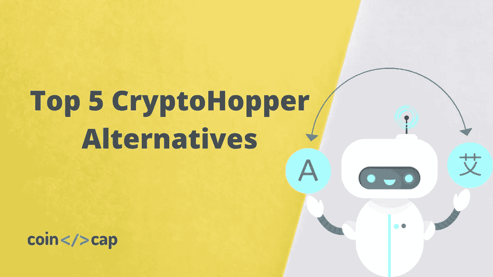
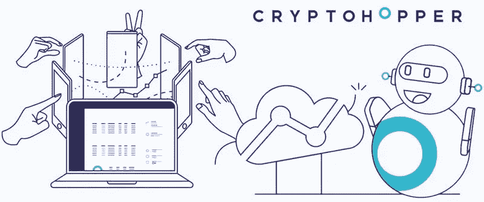
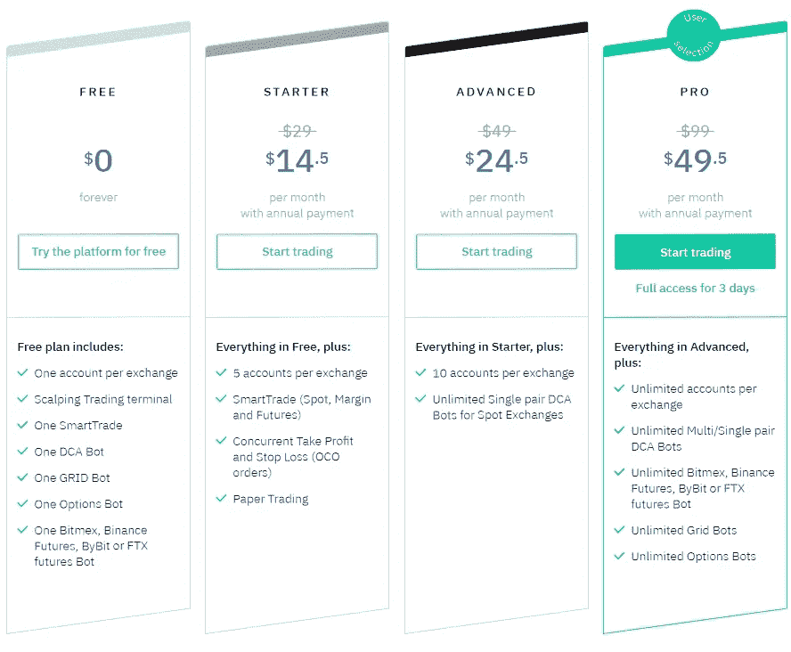
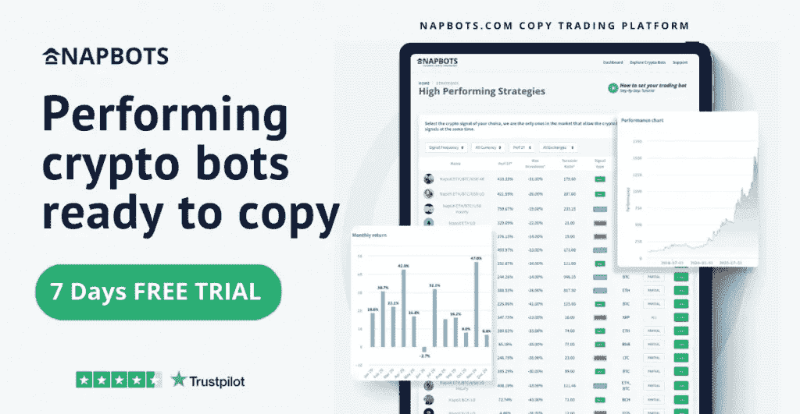
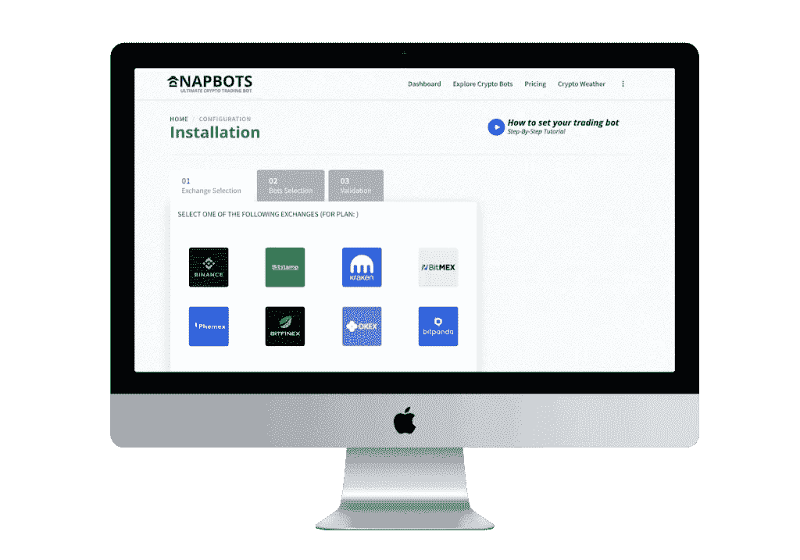
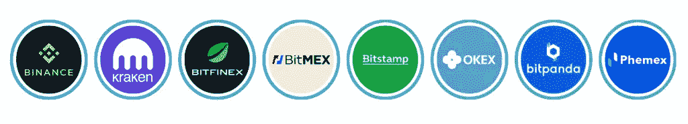
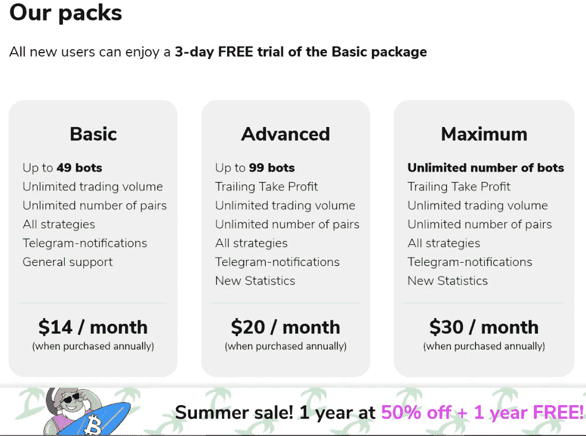

# 五大隐漏斗替代品

> 原文：<https://medium.com/coinmonks/cryptohopper-alternatives-d67287b16d27?source=collection_archive---------3----------------------->

CryptoHopper Alternatives

如果你正在寻找[交易机器人](/coinmonks/crypto-trading-bot-c2ffce8acb2a)，那么**是一个最好的去处。此外，该平台因其市场而闻名。然而，在这篇文章中，我们将看看五个最好的隐漏斗替代品。因为你不一定要坚持一个特定的平台，而是尝试市场上所有可用的选项。**

# **总结(TL；博士)**

*   **CryptoHopper 是密码交易机器人的最佳去处之一。**
*   **[**3Commas**](https://3commas.io/?c=tc252152) 是一个非常知名的加密货币交易 bot 平台，总部位于加拿大温哥华，于 2017 年上线。**
*   **最后， [**Bitsgap**](https://bitsgap.com/?ref=2cb1231&utm_source=coincodecap&utm_medium=article&utm_campaign=promo) 是一个加密交易机器人，你可以把它连接到超过 25 个最著名的[加密货币交易所](https://blog.coincodecap.com/go/crypto-exchange)。**
*   **曾经只为对冲基金提供的 Napbots 是一个基于云的人工智能系统，让每个人都可以交易加密资产。**
*   **[**TradeSanta**](https://tradesanta.com/en/site/set-referral-cookie?referral_id=177722) ，是一个专注于自动化交易策略的加密交易机器人平台。**
*   **[**zig analy**](https://zignaly.com/trader/qrNzUFvY)，基于云的加密交易 bot 平台，为各类投资者提供各种有用的功能。**

# **什么是隐漏斗？**

**[**CryptoHopper**](https://www.cryptohopper.com/?atid=15596) 是市面上设计最精良的加密交易 bot 平台之一。此外，其市场为您提供各种产品，如加密信号、交易策略、Dapps 和模板。**

**CryptoHopper 是一个加密货币交易机器人，旨在帮助所有级别的交易者，充分利用他们的交易技能，优化他们的收益，并最小化他们的风险。**

****

**该平台适合交易者，包括新手，因为其直观的设计和简单的功能。简而言之，CryptoHopper 是加密机器人交易的行业标准。**

**要了解更多信息，请阅读 [CryptoHopper 评论](https://coincodecap.com/cryptohopper-review)。大家也可以参考[排名前 5 的 CryptoHopper 应用](https://coincodecap.com/cryptohopper-apps)。**

**然而，在今天的文章中，我们将看看 CryptoHopper 的竞争对手，它们也一样简单易用。**

# **最佳隐跳虫替代品**

**市场上有许多加密交易机器人提供商。此外，很少有公司能像 CryptoHopper 一样提供如此多的服务。然而，我们仍然会在下面列出最好的 5 种隐漏斗替代品。**

# **隐漏斗替代品:3 种**

## **什么是 3Commas？**

**[**3Commas**](https://3commas.io/?c=tc252152) 是总部位于加拿大温哥华的知名加密交易 bot 平台，成立于 2017 年。该应用程序链接到多达 23 个主要的加密货币交易所，并允许您在一个地方管理您所有的加密货币账户。它有一个复杂的交易终端，可以让你设计自己的交易方法，模仿成功交易者的交易策略。**

**CryptoHopper Alternatives: [**3Commas**](https://blog.coincodecap.com/go/3commas)**

**短机器人、简单机器人、复合机器人和复合短机器人是 3Commas 提供的四种机器人。例如，Options Bot 允许您自动执行期权交易策略。要了解更多信息，请阅读[3 商业评论](https://coincodecap.com/3commas-review-an-excellent-crypto-trading-bot)。**

## **3 商品定价**

**3Commas 没有免费帐户，启动计划每月收费 14.50 美元。专业版和高级版的月费分别为 49.50 美元和 24.50 美元。交易机器人只适用于专业和高级帐户持有人。**

****

# **使用 3Commas 有什么好处？**

1.  ****3Commas** 提供对最流行的加密货币交易所的访问。**
2.  **为社交交易提供选项。**

# **隐跳虫替代品:Bitsgap**

## **什么是 Bitsgap？**

**[**Bitsgap**](https://bitsgap.com/?ref=2cb1231&utm_source=coincodecap&utm_medium=article&utm_campaign=promo) 是一个位于爱沙尼亚的一体化加密交易平台，创建于 2018 年。该软件允许您连接超过 25 个最受欢迎的加密货币交易所，并在一个地点进行交易。**

****

**您可以使用 Bitsgap 平台交易和分析 10，000 多个加密配对中的信号，从交易所之间的价格差异中套利，自动化您的交易技术，并使用 Bitsgap 平台自动找到最具潜力的货币信号。**

**要了解更多信息，请阅读 [Bitsgap 评论](https://coincodecap.com/bitsgap-review)。如果你正在寻找一个期货交易机器人，那么你可以选择一个同类的 [Bitsgap 币安期货交易机器人](https://coincodecap.com/bitsgap-futures-bot)。**

## **Bitsgap 定价**

**Bitsgap 免费计划具有标准功能和 1000 美元的交易限额。基本计划每月花费 19 美元，包括 25000 美元的交易限额和两个交易机器人的访问权限。高级和专业帐户的月费分别为 44 美元和 110 美元。**

****

## **Bitsgap 有什么好处？**

1.  **包括近 30 家[加密货币交易所](https://coincodecap.com/crypto-exchange)。**
2.  **大量的交易选项可用，并且能够设置多个货币账户。**
3.  **Bitsgap 允许法定货币兑换。**

# **隐翅虫替代品:NapBots**

## **什么是 Napbots？**

**[**【nap bots**](https://www.napbots.com/?tap_a=84278-ba9a21&tap_s=996331-8d624e&utm_source=affiliation&utm_medium=gaurav)之前只对对冲公司开放，是一个基于云的人工智能应用，允许每个人交易加密资产。**

**这意味着您可以根据从可用选项中选择的加密策略来执行交易。拥有超过 15 年交易经验的专业交易者带来了这些技术。**

**AMF 管理着拿破仑集团，它的姐妹公司 Napbots 提供交易机器人服务。大约三年前，Napbots 开始开发加密交易技术，该平台于 2018 年 4 月向公众展示了其第一个战略。从那以后，又发布了 20 个策略，每个策略都有基本的 KPI 和测试模板。**

**例如，他们最古老的技术“BTC LO”提供手动[加密交易信号](https://coincodecap.com/best-crypto-signals-telegram)，其自动化版本目前已经可以使用，并正在破解新 ATH。**

****

**此外，在一年多的时间里，旗舰策略 BTC/ ETH/美元的表现超过了基础策略 233%。因为它允许短，这种技术是更积极的。然而，过去的成就并不能保证未来的成功。**

**事实上，Napbots 技术的主要数据库是价格，该团队提供趋势跟踪和均值回归方法(每周、每天和每小时)。**

**除此之外，NapBots 的美妙之处在于，它是一个面向各种背景投资者的交易机器人。不仅仅是新手或临时交易者，他们可以简单地让机器人处理一切，而且是经验丰富的交易者，他们可以关闭“仅机器人模式”，不利用机器人的自动化系统进行交易。它是唯一一个允许你组合战术的[比特币交易机器人](/coinmonks/crypto-trading-bot-c2ffce8acb2a)。**

**Napbots 将根据市场价格变化等数据在用户处运行。要了解更多，请阅读 [Napbots 评论](https://coincodecap.com/napbots-review-crypto-trading-on-autopilot)。**

## **如何入门 NapBots 并赚钱？**

**你可以通过自动驾驶仪交易加密货币并赚钱来实现与 NapBots 的财务独立。要让它工作，请遵循以下步骤:**

*   **首先，首先连接到一个可用的交易平台。**
*   **其次，从[睡眠机器人](https://blog.coincodecap.com/go/napbots)令人印象深刻的表演机器人列表中选择。**
*   **最后，选择一个最适合你的投资策略。**

**一旦你完成了这三个步骤，NapBots 就准备好交易密码并为你赚钱了。交易愉快！**

****

## **Napbots:支持的交换**

**该平台允许您从八个最著名的加密货币交易所中进行选择，以实现您的首次飞跃。其中有[币安](https://www.binance.com/en/register?ref=UARTH1S1)、[比特梅克斯](https://www.bitmex.com/register/kOHufx)、[比特芬尼克斯](https://www.bitfinex.com/?refcode=7P5O4Dyt2)、[奥克克斯](https://www.okx.com/join/8432835)、[菲梅克斯](https://phemex.com/bonus?group=923&referralCode=DDLJW)、[北海巨妖](https://r.kraken.com/e44GD1)、[比特熊猫](https://www.bitpanda.com/en)、[比特斯坦普](https://www.bitstamp.net/)。 [CoinBase](https://coinbase-consumer.sjv.io/7mbkNg) ， [Kucoin](https://www.kucoin.com/ucenter/signup?rcode=rJ45SVB) ， [HitBTC](https://hitbtc.com/) ，还有很多其他的即将加入。有了如此广泛的交换，它可以轻松地实现它的算法方法。**

****

**将 Napbots 连接到您的交换机很简单。您只需要从您选择的 Exchange 帐户生成一个 API 密钥，并在 Napbots 网站上输入它。**

## **Napbots 定价**

**NapBots 定价包分为三种不同的价格计划，适合所有预算，并根据交易量而变化。每个计划都有一个交易限额，通过支付额外费用可以增加到 25，000 美元，如下所示:**

****

# **为什么选择 NapBots？**

*   **通过应用他们已建立的交易技术，该平台可以向公众提供以前只为对冲基金保留的量化交易策略。**
*   ****nap bot**独特而简单的方法带来了出色的投资回报。此外，NapBots 的创造者拥有相当丰富的金融市场专业知识。此外，像这项服务这样的被动收入来源甚至在你睡觉的时候也能发挥作用。**
*   **定价很简单，而且没有启动成本。**

# **隐翅虫替代品:TradeSanta**

## **什么是 TradeSanta？**

**[**TradeSanta**](https://tradesanta.com/en/site/set-referral-cookie?referral_id=177722) 是一个专注于交易策略自动化的加密交易 bot 平台。它于 2018 年首次发布，但在 2019 年下半年获得了人气。它现在拥有一个蓬勃发展的社区，有 25，000 多名成员，完成了 100 多万笔交易。**

****

**TradeSanta 简化了加密交易机器人领域，并为其成员提供了一些优秀的交易工具。它现在拥有竞争对手中最活跃的交易机器人，超过 6400 个。**

**冗长的 bot 模板、简短的 bot 模板和自定义 bot 模板都可用。额外的订单，鞅，购买硬币的佣金，复杂的技术指标，和其他 TradeSanta 功能可用。**

**要了解更多信息，请阅读 [TradeSanta 评论](https://coincodecap.com/tradesanta-crypto-trading-bot-review)。**

## **TradeSanta 支持的交易所**

**它现在链接到七个主要的加密货币交易所，包括 HitBTC、币安、Bitfinex、Bittrex、Huobi、Upbit 和 OKEx，OKEx 将在不久后加入 BitMEX。**

## **TradeSanta 定价**

**与其他加密交易机器人平台相比，TradeSanta 相对便宜。当每年购买时，最低(免费计划)、基本(14 美元/月)、高级(20 美元/月)和最高(30 美元/月)是四个选项。**

****

## **使用 TradeSanta 有什么好处？**

1.  **简单而基本的平台**
2.  **TradeSanta 支持几种不同的交易机器人和其他交易工具。**
3.  **该平台托管在云上。**

# **隐跳虫替代品:Zignaly**

## **Zignaly 是什么？**

**Zignaly 是下一代基于云的加密交易机器人平台，具有几个方便的功能，可以满足各种各样的交易者。目前只有币安和库币与交易平台相连，但预计未来还会有其他加密交易所加入。**

**它主要提供复制交易、加密交易机器人和交易终端。一个与众不同的特点是，它允许你使用第三方[加密交易信号](https://coincodecap.com/free-crypto-signals)自动交易。它现在支持超过 21 种不同的加密信号源，所有这些信号源都能产生高质量的信号。**

**用户目前可以免费使用 Zignaly，拥有无限的兑换账户、硬币配对、位置和优先支持。**

****

## **Zignaly 定价**

**Zignaly 交易机器人平台没有订阅费，完全免费。**

## **使用 Zignaly 有什么好处？**

1.  **集成第三方信号提供商有几个好处。**
2.  **你可以在 Zignaly 开设一个免费账户。**
3.  **该平台托管在云上。**

# **隐跳虫替代品:结论**

**如你所见，有许多 [**Cryptohopper**](https://www.cryptohopper.com/?atid=15596) 选项可供选择，每个平台都有自己的一套特性。**

**这里提到的交易机器人是最好的和最可靠的加密交易机器人平台。然而， [3Commas](https://3commas.io/?c=tc252152) 在功能和性能方面要先进得多。**

**[加密交易机器人](/coinmonks/crypto-trading-bot-c2ffce8acb2a)是加密货币交易的未来，让你从每一个原本无法获得的市场机会中获益。结果是，明智地选择平台，你会得到很好的认可。**

****披露—关联链接包括在内****

> **加入 Coinmonks [电报频道](https://t.me/coincodecap)和 [Youtube 频道](https://www.youtube.com/c/coinmonks/videos)了解加密交易和投资**

## **另外，阅读**

*   **[氹欞侊贸易评论](https://coincodecap.com/anny-trade-review) | [霍比保证金交易](/coinmonks/huobi-margin-trading-b3b06cdc1519)**
*   **[去中心化交易所](https://coincodecap.com/what-are-decentralized-exchanges) | [比特恩斯 FIP](https://coincodecap.com/bitbns-fip) | [Pionex 评论](https://coincodecap.com/pionex-review-exchange-with-crypto-trading-bot)**
*   **[用信用卡购买密码的 10 个最佳地点](https://coincodecap.com/buy-crypto-with-credit-card)**
*   **[最好的卡达诺钱包](https://coincodecap.com/best-cardano-wallets) | [Bingbon 副本交易](https://coincodecap.com/bingbon-copy-trading)**
*   **[印度最佳 P2P 加密交易所](https://coincodecap.com/p2p-crypto-exchanges-in-india) | [柴犬钱包](https://coincodecap.com/baby-shiba-inu-wallets)**
*   **[8 大加密附属计划](https://coincodecap.com/crypto-affiliate-programs) | [eToro vs 比特币基地](https://coincodecap.com/etoro-vs-coinbase)**
*   **[最佳以太坊钱包](https://coincodecap.com/best-ethereum-wallets) | [电报上的加密货币机器人](https://coincodecap.com/telegram-crypto-bots)**
*   **[交易杠杆代币的最佳交易所](https://coincodecap.com/leveraged-token-exchanges) | [购买 Floki](https://coincodecap.com/buy-floki-inu-token)**