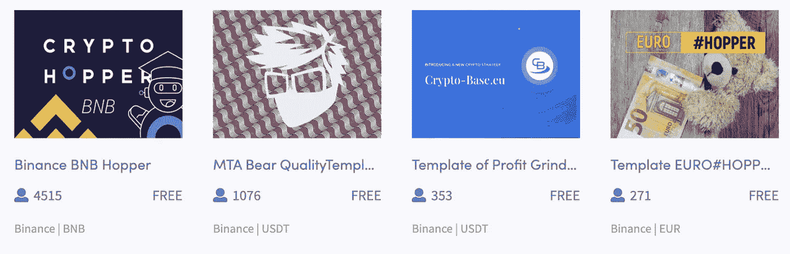

# Cryptohopper 评论—2021 年仍是最佳交易机器人平台？

> 原文：<https://medium.com/coinmonks/cryptohopper-review-a388ff5bae88?source=collection_archive---------1----------------------->

本文将回顾 [**Cryptohopper**](https://blog.coincodecap.com/go/cryptohopper) ，这是一个一体化的交易平台，旨在自动化交易，模仿有经验的交易者，设置信号和警报，等等。

虽然投资者必须付费才能使用 Cryptohopper 最先进的功能，但该平台并不要求每次交易付费。相反，它根据投资者可以获得的资源数量，每月向他们收取固定费用。

# 什么是隐漏斗？

[路德·费特坎普](https://twitter.com/ruudfeltkamp?lang=en)于 2017 年 9 月创作了 Cryptohopper。 [**Cryptohopper**](https://blog.coincodecap.com/go/cryptohopper) 是一个[交易机器人](https://blog.coincodecap.com/best-crypto-trading-bots)，声称可以帮助交易者利用加密货币市场的交易机会。你也可以使用 Cryptohopper [应用](https://play.google.com/store/apps/details?id=com.cryptohopper_mobile&hl=en_US&gl=US)在手机上自动完成交易。该软件进行投资分析，并自动定位汽车交易中的交易。Cryptohopper 软件扫描市场，寻找可交易的新闻，并使用高频策略进行交易。

当谈到半自动交易时，这个应用程序复制并建议最好的加密交易者的策略。这种方法被称为[复制交易](/coinmonks/top-10-crypto-copy-trading-platforms-for-beginners-d0c37c7d698c)，人们在外汇和股票交易中广泛使用。在使用半自动方法时，用户负责决定在他们的账户中使用哪些交易策略。

点击 [**此处**](https://blog.coincodecap.com/go/cryptohopper) 立即注册账户，或继续阅读更多内容。

# 隐跳虫综述

*   [**Cryptohopper**](https://blog.coincodecap.com/go/cryptohopper) 支持 13 大交易所。在这里检查。
*   直观；将专家级工具与用户友好的工具和配置选项相结合。
*   功能齐全，镜像桌面框架
*   0 美元连接您的经纪账户。
*   基于人工智能的交易平台。
*   新手可以进行演示交易
*   新用户 7 天免费试用期。
*   也可在移动应用程序中使用

# Cryptohopper 是如何工作的？

如前所述， [**Cryptohopper**](https://blog.coincodecap.com/go/cryptohopper) 提供全自动和半自动的加密货币交易。

全自动交易需要机器人做所有的投资分析并自动下单。另一方面，半自动交易需要交易机器人进行研究，并为消费者提供可交易的见解。

还值得注意的是，Cryptohopper 允许保证金交易，其大多数经纪人提供的杠杆高达 1:100 倍。

当你使用[保证金交易](https://blog.coincodecap.com/margin-trading)时，你可以进行大于你交易资源的交易。例如，1:100 的杠杆意味着你可以设定比你的钱大 100 倍的交易。阅读更多关于杠杆/ [保证金交易](https://blog.coincodecap.com/go/margin-trading) [这里](https://blog.coincodecap.com/margin-trading)。

# 如何入门 Cryptohopper？

使用 [**Cryptohopper**](https://blog.coincodecap.com/go/cryptohopper) 进行注册的过程既安全又简单。你可以在不到十分钟的时间内开户并开始交易。这里有一个逐步开始使用这个机器人的指南。

## 第一步。创建一个帐户

使用 [**Cryptohopper**](https://blog.coincodecap.com/go/cryptohopper) 创建账户的第一步是在他们的网站上填写表格。

注册后，您将在电子邮件中获得一个激活链接，单击该链接激活您的 Cryptohopper 帐户。

## 第二步——建立你的密码器账户

从这里，只需按照向导，这将有助于您快速配置您的漏斗。您需要选择一个交换，使用您想要的交换的 API 密钥配置 bot，并设置简单的 hopper 配置。这个过程是毫不费力的，每一步都包括教程和其他有价值的细节的链接。

您可以立即开始使用您的 hopper，一旦您使用了向导并设置了您的帐户，您将能够从仪表板访问大量功能。您可以订阅信号，定制模板，开始回溯测试您的 bot，并在您的帐户上启用双因素身份验证。

[**Cryptohopper**](https://blog.coincodecap.com/go/cryptohopper) 符合 GDPR 标准，因此具备保护其客户的所有安全措施。我们还可以核实他们的关联经纪人监管良好，能力很强。CySEC、ASIC 和 FCA 管理绝大多数。

## 第三步。连接您的交换机

下一步是连接你的[密码交易所](https://blog.coincodecap.com/crypto-exchange)，正如我们上面提到的，Cryptohopper 支持所有主要的[密码交易所](https://blog.coincodecap.com/go/crypto-exchange)，你可以在这里查看列表[。您需要提供 API 密钥和 API 机密，以便访问您的 exchange。](https://www.cryptohopper.com/exchanges?atid=15596)

**注意:**切勿向任何交易机器人提供完整信息，仅提供该交易机器人所需的信息，并注意应用程序是否要求撤回权限。

## 第四步。创建一个漏斗或选择现有模板

现在是时候自动化你的策略了，这些策略在 Cryptohopper 上被称为 Hoppers。您需要定义何时以及如何购买资产，以及何时以及如何出售资产，hopper 将根据您的参数自动执行该任务。

对于初学者，我会推荐使用预建的漏斗。然而，在允许任何人用真正的资金交易之前，你应该对他们进行适当的回溯测试。

你也可以在 [**Cryptohopper**](https://blog.coincodecap.com/go/cryptohopper) 市场上找到很多 hopper 模板。

# Cryptohopper 评论:演示交易

[**Cryptohopper**](https://blog.coincodecap.com/go/cryptohopper) 允许回溯测试或演示交易。您必须选择交易策略，设置止损，并在模拟交易账户中使用收益功能。

回溯测试是基于历史数据的，因此不能代表你在实时交易中会赚多少。我们建议您在进入 live to trade 之前先注册一个模拟账户。

# 隐跳者费用

手动投资者可以免费使用 Cryptohopper 的平台。跟踪您的投资组合，使用 Cryptohopper 的交易终端实时执行交易，并免费使用策略回溯测试功能。开始使用任何 Cryptohopper 套件都不需要最低存款额。

尽管如此，该平台确实建议至少向你的首选交易所存入 300€，以便 Cryptohopper 可以通过多次交易分散风险，同时仍满足最低交易要求。

# Cryptohopper 评论:功能

[**Cryptohopper**](https://blog.coincodecap.com/go/cryptohopper) 提供了一个易于使用的策略设计者，信号提供者市场场所，[社交交易平台](/coinmonks/top-10-crypto-copy-trading-platforms-for-beginners-d0c37c7d698c)，票据交易模式，做市 Bot，交易所/市场[套利](https://blog.coincodecap.com/crypto-arbitrage-guide-how-to-make-money-as-a-beginner)工具。

Cryptohopper 的上述特性使其吸引了更广泛的用户。因此，我们认为大多数搜索[加密交易机器人](/coinmonks/crypto-trading-bot-c2ffce8acb2a)的用户应该尝试一下。

# 做市商机器人

许多人会对做市机器人感到困惑。所以让我们用一个例子来解释一下。

假设你推出了一种新的代币或交易所，因此你需要流动性，这样人们就可以轻松地买卖资产，获得最佳市场价格。这里做市商 bot 不断追加买卖单，因为价差差距而小赚一笔。 [**Cryptohopper**](https://blog.coincodecap.com/go/cryptohopper) 帮助您针对不同的市场趋势，打造自己的做市机器人。查看以下视频，了解更多关于做市机器人的信息。

# Cryptohopper 市场套利工具

[套利](https://blog.coincodecap.com/crypto-arbitrage-guide-how-to-make-money-as-a-beginner)是一种技术，当你在一个市场买入一项资产，在另一个市场卖出，并因该资产在这些市场的价格差异而建档。如果操作正确，由于交易所之间的价格差异，这是一个非常有利可图的交易。

Cryptohopper 为您提供自己开始套利交易所需的资源。它有两种类型的套利:

1.  **交易所套利**:交易所之间的价格根据供求关系可以有所不同。要从事[外汇套利](https://www.cryptohopper.com/features/exchange-arbitrage)，你必须拥有你想要套利的硬币。假设你的基础货币是美元，你已经注意到 T21、ATOM 和 ADA 倾向于在某些交易所提供套利机会。然后，你需要在两个(或更多)你想套利的交易所拥有这两种硬币。
2.  市场套利:[市场套利](https://www.cryptohopper.com/features/exchange-arbitrage)机器人会在单个交易所内寻找市场的无效率。它可以通过利用交易所挂牌交易的货币之间的价格差异来实现这一目的。更准确地说，它将执行三种不同的交易来增加所选基础硬币的总和。市场套利在交易量低的市场上最有效。

要了解更多，请阅读我们的[加密套利指南](https://blog.coincodecap.com/crypto-arbitrage-guide-how-to-make-money-as-a-beginner)。

[**Cryptohopper**](https://blog.coincodecap.com/go/cryptohopper) 的套利工具得心应手，尤其适合新手。有些时候，你会从交易所之间的差价中获利。

# Cryptohopper 战略设计师

[策略生成器](https://docs.cryptohopper.com/docs/en/Strategy%20Designer/strategy-designer/)是[密码漏斗](https://blog.coincodecap.com/go/cryptohopper)的核心功能。策略设计器帮助你设计你的交易策略。策略是技术指标和蜡烛图的集合，可以用来自动开仓和平仓。您还可以通过 Cryptohopper marketplace 与其他用户分享和销售您的策略。

# Cryptohopper 评论:纸张交易模式

我再怎么强调也不为过，大多数用户在他们不熟悉的平台上花钱之前，应该使用纸上交易。第二，这是一个极好的功能，可以测试你的策略，看看它们是否有利可图。

在这种模式下，您将向您的票据交易账户存入虚构的资金。这将帮助你了解不同数量的交易会是什么样子。

在 [**Cryptohopper**](https://blog.coincodecap.com/go/cryptohopper) 上，创建和删除纸面交易账户轻而易举。因此，您将再次学习如何安全且有利地使用该平台。

# 隐漏斗市场

[Cryptohopper market place](https://www.cryptohopper.com/marketplace)帮助你获得免费和付费的机器人交易策略。这对新手来说是理想的，因为它允许你“即插即用”由更有经验的交易者开发的你喜欢的策略，并在你的账户上测试它。

如果你是构建交易机器人的专家，你可以通过在市场上创建和销售你的模型来赚钱。

您还可以与其他用户共享策略和模型。此外，你还可以参与他们的[加密货币社交交易](/coinmonks/top-10-crypto-copy-trading-platforms-for-beginners-d0c37c7d698c)并从其他用户那里收集加密信号。最后，你可以使用 App marketplace 链接到 Telegram bot、 [TradingView](https://blog.coincodecap.com/go/tradingview) 等资源，以及其他与 Cryptohopper 平台配合使用的不同小工具/实用程序。

隐漏斗市场分为四类。**模板**、**策略**、**信号、**和**应用**。

**模板**为你提供各种现成的信息，帮助你设计你的交易机器人。

**策略**是决定你的机器人买卖时机的战术。

**信号**允许专业交易者被复制并自动在你的交易所开仓或平仓。

**Apps** 展示第三方 [**Cryptohopper**](https://blog.coincodecap.com/go/cryptohopper) 与其他服务的集成。

它完善并帮助交易者充分利用 Cryptohopper 网络。Cryptohopper 的市场对于新的和经验丰富的加密货币交易者来说都有很多。如果你是自动化的、基于机器人的交易的新手，这是一个很好的起点，因为有很多市场卖家出售交易信号、模型和策略。

该市场允许有经验的交易者在他们的 Cryptohopper 聊天频道中出售他们的交易技巧并指导他们的追随者。

# 密码漏斗定价

如果你想使用 Cryptohopper 的自动投资功能，你必须升级到付费账户。目前， [**Cryptohopper**](https://blog.coincodecap.com/go/cryptohopper) 提供三层付费账户访问。

探险家套装带有 1 个模拟交易机器人、80 个地点、15 个精选硬币的限制和 2 个触发器。要获得探索者工具包，你可以预计每月支付约 19 美元。

**冒险者套装**是 Cryptohopper 的中级账户层。冒险者套装包含了探险者套装的所有功能，另外还有 50 个额外的硬币，5 个最大触发点和贸易套利。你必须每月支付 49 美元才能使用冒险家套装的功能。

如果你是一个寻找最强大的可用资源套件的专家级投资者，你应该考虑 Cryptohopper 的全包英雄套件。**英雄套装**允许你一次到达多达 500 个地方，最多 75 个硬币，10 个提示，所有硬币为信号。您还可以使用 Cryptohopper 的所有高级功能和高级技术研究功能。英雄套装每月售价 99 美元。

**记住 Cryptohopper 不是交易所；而是一个提供各种交易工具的交易平台。**

这意味着您必须支付您的订单执行地交易所征收的费用，以及 Cryptohopper 收取的任何月付款。

这项服务可以按月或按年付费。同样重要的是要记住 Cryptohopper 不提供退款，客户应该在坚持订阅之前利用免费试用。

# Cryptohopper 移动应用审查

Cryptohopper 的简单设置和全面的功能现在可以在它的[苹果](https://apps.apple.com/us/app/cryptohopper/id1463052050?l=en&ls=1)和[安卓](https://play.google.com/store/apps/details?id=com.cryptohopper_mobile&hl=en_US&gl=US)智能手机平台上使用。我们喜欢 Cryptohopper 应用程序的几个功能如下:

*   **高级安全特性**:Cryptohopper 应用程序包括生物安全特性，以确保您的资产只有您自己才能访问。
*   **可选推送通知**:配置推送通知，以接收预定义原因、趋势、未决订单和其他事件的实时更新。从你手机的主屏幕上，你可以监控你的进度和位置。
*   只需轻轻一点就能下单。Cryptohopper 的网络应用和桌面应用一样简单易用。
*   使用单一订单执行交易，并从任何地方控制您的头寸。

# Cryptohopper 评论:用户体验

虽然有几个交易机器人更适合经验丰富的交易者，但 [**Cryptohopper**](https://blog.coincodecap.com/go/cryptohopper) 有一系列面向新手的功能。Hopper Academy 向所有成员开放，提供视频库，讨论 Cryptohopper 如何操作以及使用该服务的最佳方式。

Cryptohopper 还开发了一个活跃的论坛，应该对加密货币交易的新手大有裨益。有活跃的 [Discord](https://discord.gg/qdv6RJx) 和 [Telegram](https://t.me/CryptohopperToday) 论坛，以及一个英语、法语、西班牙语、荷兰语和葡萄牙语的会员专用社区。

因此，新用户可以与来自世界各地的更高级的用户交谈并向他们学习，并且他们可以全天候地继续学习。

他们开发了一个简单易用的平台，不需要任何编码经验或专业技术知识或技能。

此外， [**Cryptohopper**](https://blog.coincodecap.com/go/cryptohopper) 允许广泛的回溯测试，初学者可以通过修补和测试他们的设置来快速检查他们的配置是否正常工作。

用户将看到他们在过去可能赚了多少钱，并调整他们的机器人，以更好地了解它是如何工作的，同时还在学习诀窍。

# Cryptohopper 评论:客户服务

Cryptohopper 为用户提供了许多联系客户服务的选项:

**在线聊天支持**

要使用 Cryptohopper 的在线聊天，请访问他们的网站。要进入实时聊天，请点按主屏幕右下角的蓝色语音气泡。

**票务服务**

要使用票务客户支持，您必须已经拥有 Cryptohopper 帐户。客户服务需求目前没有电话选项。

# Cryptohopper 合法吗？

Cryptohopper 似乎是一个值得信赖的交易机器人。我们的调查显示，这个机器人是真实的(它代表你进行交易)，简单明了，用户友好。此外，我们可以确认他们所有的合作经纪人都受到了良好的控制。

此外，该平台已经运行了 3 年多，没有出现给用户造成损失的重大故障。

这个机器人使取款成为可能，它帮助交易者随时提取他们的资金。根据我们的测试，Cryptohopper 处理的所有交易最多需要 48 小时才能完成。我们还发现，这种机器人客户服务是容易接近的、有能力的、有礼貌的。

请记住，与自动机器人(如 Cryptohopper)进行交易是有风险的。请不要投入超过你承受能力的钱。

# 隐跳虫评论:利弊

**Cryptohopper 提供了几个竞争优势和安全特性。但是，它不提供电话客服。此外，Cryptohopper 不提供完整的功能，除非你订阅。下面列出了 Cryptohopper 的其他优点和缺点:**

****

# **隐跳虫综述:结论**

**[**Cryptohopper**](https://blog.coincodecap.com/go/cryptohopper) 允许交易者产生更一致的收入。技术指标和第三方交易专家或加密信号提供商的结合，模板和回溯测试功能给了交易者更多的选择。**

**虽然 Cryptohopper 从根本上说是一个算法交易机器人，但它的设置和使用都很简单，适合新手和有经验的交易者。该公司努力为初学者创建一个用户友好的平台，新用户也可以访问全面的教育和社区主导的资源页面。**

**该平台能够很好地支持新的和经验丰富的交易者，它包括一系列的功能，所有成员都将从中受益。它构建良好，使用简单，多年来赢得了良好的声誉，所以我们建议您查看一下。**

*   **最好的[加密交易机器人](/coinmonks/crypto-trading-bot-c2ffce8acb2a)**
*   **[3 commas vs Pionex vs Cryptohopper |什么最适合你？](https://blog.coincodecap.com/3commas-vs-pionex-vs-cryptohopper)**
*   **[crypto hopper vs 3 commas vs Shrimpy——你困惑了吗？](https://blog.coincodecap.com/cryptohopper-3commas-shrimpy)**
*   **[CryptoHopper vs NapBots |如何实现密码交易的自动化？](https://blog.coincodecap.com/cryptohopper-vs-napbots)**
*   **[CryptoHopper vs TradeSanta |使用加密机器人实现交易自动化](https://blog.coincodecap.com/cryptohopper-vs-tradesanta)**
*   **[Crypto.com NFT 平台回顾【2021】](https://blog.coincodecap.com/crypto-com-nft-platform)**

***原载于 2021 年 5 月 12 日 https://blog.coincodecap.com**的* [*。*](https://blog.coincodecap.com/cryptohopper-review)**