# Cryptohopper vs 3Commas vs Shrimpy

> 原文：<https://medium.com/coinmonks/cryptohopper-vs-3commas-vs-shrimpy-a2c16095b8fe?source=collection_archive---------1----------------------->

## 最好的密码交易机器人是什么？

[交易机器人](/coinmonks/crypto-trading-bot-c2ffce8acb2a)已经成为加密货币市场交易者必不可少的服务。在没有自动化帮助的情况下，与在交易所执行交易相关联的手动过程既麻烦又低效。没有交易机器人，加密用户就无法有效地管理交易所的资产组合(T3)。

在整篇文章中，我们将探索市场上最受欢迎的 [3 个交易机器人](/coinmonks/crypto-trading-bot-c2ffce8acb2a):

1.  [**Shrimpy**](https://www.shrimpy.io/signup?r=I6VFZ7d2E)**——*加密货币的社交交易平台***
2.  **[**Cryptohopper**](https://www.cryptohopper.com/?atid=15596)**——*世界级自动化密码交易机器人*****
3.  ****[**3 商业**](https://3commas.io/?c=tc252152) — *智能交易终端和汽车交易机器人*****

****根据我们作为交易者的目标，这些交易机器人都可能是理想的解决方案。在高层次上，Shrimpy 是为投资组合管理而设计的，而 3Commas 和 Cryptohopper 是为日间交易而设计的。****

# ****1.投资组合跟踪****

****使用加密货币监控资产组合并不总是那么容易。分散的市场使得我们难以在单一平台上管理所有资产。因此，这 3 个交易机器人都提供了可以帮助我们跟踪投资组合的功能。****

## ****[隐漏斗](https://www.cryptohopper.com/?atid=15596)****

****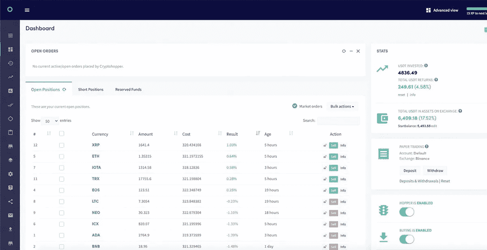****

****Cryptohopper 比 3Commas 或 Shrimpy 更关注个人立场。Cryptohopper 专注于提供单个交易的统计数据，而不是提供整个投资组合的信息。****

****我们可以从 Cryptohopper 仪表板上看到，该设计不适合投资组合跟踪，而是适合交易跟踪。****

## ****[3 条消息](https://3commas.io/?c=tc252152)****

****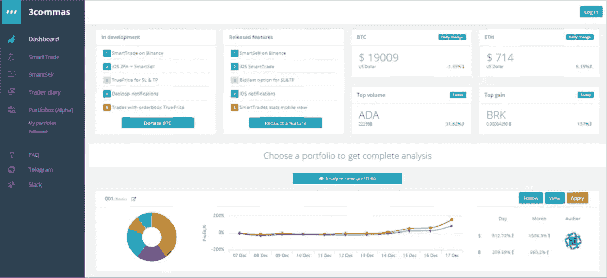****

****3Commas 主要关注单个交易对的交易策略的执行。因此，该平台是围绕跟踪单个交易对的交易而构建的。3Commas 不是对我们的整个投资组合提供高层次的概述，而是对希望跟踪其交易的日内交易者的理想选择。****

****投资者不会在 3Commas 上找到各种各样的投资组合跟踪功能。相反，对于那些想要对他们的投资组合表现有一个高层次的概述的交易者来说，只有简单的表现指标可用。****

## ****[虾肉](https://www.shrimpy.io/signup?r=I6VFZ7d2E)****

****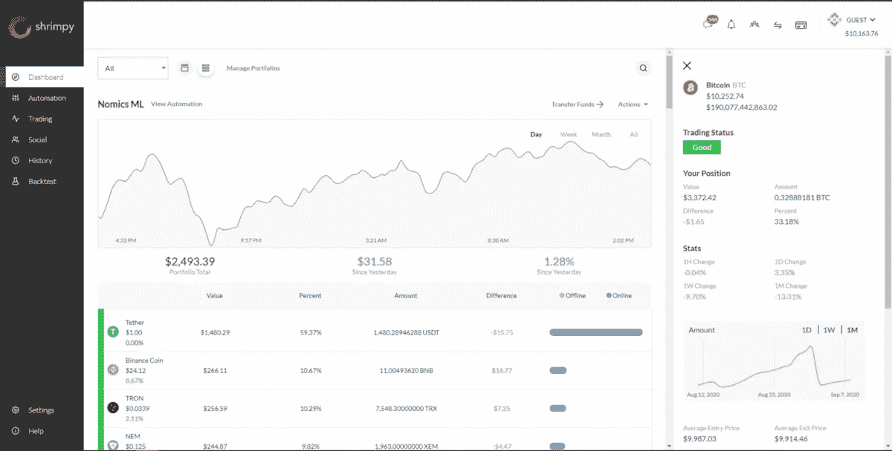****

****Shrimpy 提供了一个组织良好的仪表板，提供了一个投资组合的总体概述。这包括投资组合中包含的每项资产的细分，每项资产的统计数据，以及投资组合在不同时间范围内的性能指标。****

****除了干净的仪表板， [Shrimpy](https://www.shrimpy.io/signup?r=I6VFZ7d2E) 用户还可以在历史标签中跟踪他们的历史交易和投资组合更新。投资者还可以通过选择仪表板上的资产来查看资产的历史表现。****

> ****此外，请阅读我们的[新闻评论](https://coincodecap.com/shrimpy-crypto-trading-bot-review)****

# ****2.贸易自动化—3 commas vs Cryptohopper vs Shrimpy****

****在讨论贸易自动化时，哲学上的差异显露无遗。 [3Commas](https://3commas.io/?c=tc252152) 和 [Cryptohopper](https://www.cryptohopper.com/?atid=15596) 专注于为单个交易对提供交易策略自动化，而 [Shrimpy](https://www.shrimpy.io/signup?r=I6VFZ7d2E) 专注于投资组合自动化。本质上，你可以把 3Commas 看作一个短期交易平台，把 Shrimpy 看作一个中长期的交易管理解决方案。****

## ****[隐漏斗](https://www.cryptohopper.com/?atid=15596)****

****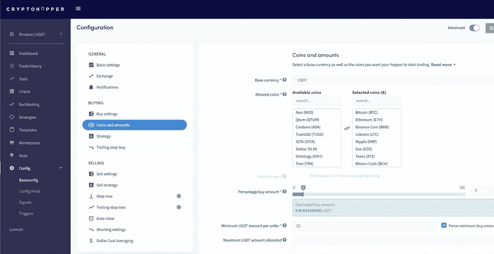****

****与 3Commas 非常相似，Cryptohopper 专注于个人交易对。当配置机器人的交易策略时，每个单独的交易对被视为一个单独的策略。****

****虽然这允许对每项资产的交易方式进行精细控制，但这也成为一项繁重的任务，以确保一切都完全按照预期进行设置。****

****随着时间的推移，Cryptohopper 用户也需要维护他们的机器人，因为市场条件会发生变化，特定交易策略的有效性会降低。****

****对于有时间和耐心管理一套复杂策略的高级交易者来说，Cryptohopper 是一个很好的资源，但新手交易者肯定很难用 Cryptohopper 管理多样化的投资组合。****

## ****[3 条消息](https://3commas.io/?c=tc252152)****

****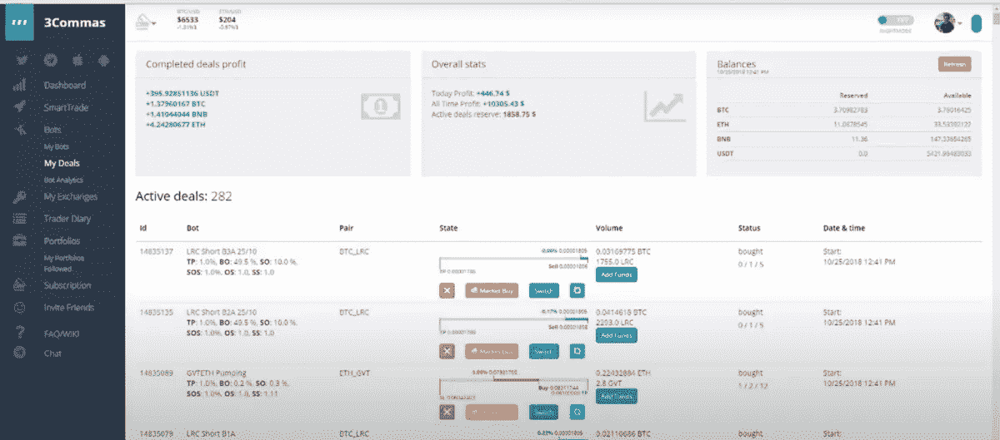****

****3 由于自动化交易机器人的大量选择，Commas 已经成为日内交易者的首选平台。3Commas 并没有专注于投资组合自动化，而是提供了跨单个交易对进行交易的工具。****

****在 3Commas 上配置一个交易机器人有无限的可能性。客户可以利用信号、技术指标和无数其他触发因素。****

****建立一个有效的交易机器人的过程并不容易。每个机器人都需要单独配置和定期维护。这使得在 3Commas 上开始管理各种交易机器人非常耗时。****

****此外，第一次入门让很多投资者感到迷茫。大量的技术指标和复杂的配置使得 3Commas 对新手来说太复杂了。****

## ****[虾肉](https://www.shrimpy.io/signup?r=I6VFZ7d2E)****

****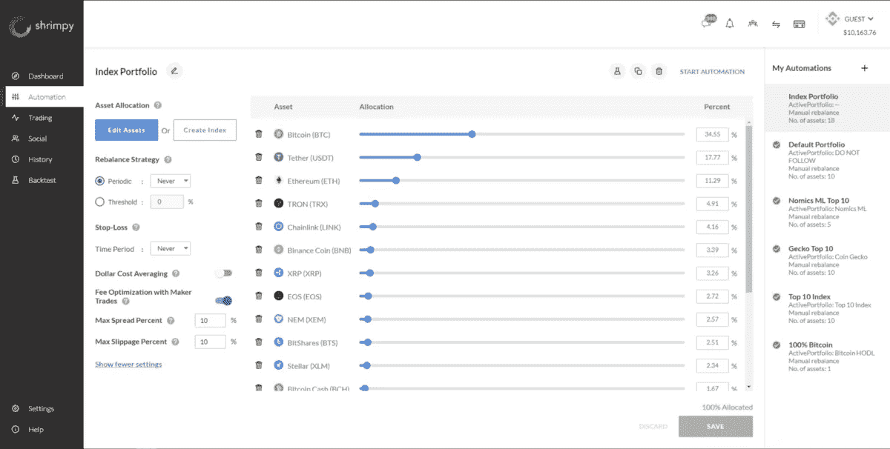****

****投资组合自动化是 Shrimpy 的面包和黄油。没有哪个平台做得更好。如果你想让你的投资获得长期成功，看看 T2 的施莱姆皮就知道了。****

****使用 Shrimpy，投资组合的分配和自动化非常简单。图 4 展示了投资者如何选择资产，配置自动再平衡设置，启用[美元成本平均](https://coincodecap.com/dca)，以及使用 Shrimpy 实现投资组合止损。****

****投资者能够将他们的资金分成多个投资组合，并分别对每个投资组合进行自动化操作。这些多投资组合的特点是 Shrimpy 的独特卖点，因为没有其他服务提供在交易所分割资金的能力。****

****只需点击几下，用户就可以在他们的投资组合中添加或删除资产。Shrimpy 将自动使用智能订单路由在交易所买卖资产，以达到指定的目标分配。****

****客户还可以使用控制面板上的“操作”选项立即执行重新平衡。只需点击一下，Shrimpy 就可以在交易所买卖资产，重新平衡投资组合。只需几秒钟就可以完成手动需要几个小时才能完成的过程。****

> ****另外，请阅读我们的 [3Commas review](/coinmonks/3commas-review-an-excellent-crypto-trading-bot-2020-1313a58bec92) 。****

# ****3.智能交易终端-3 commas vs Cryptohopper vs Shrimpy****

****智能交易终端是交易平台的组成部分。当策略不可能完全自动化时，交易者可以手动执行策略。****

****延续这一趋势，我们很快注意到，即使在他们的智能交易终端中，Shrimpy 也提供投资组合管理功能，而 3Commas 和 Cryptohopper 专注于交易的更多技术方面。****

## ****[隐漏斗](https://www.cryptohopper.com/?atid=15596)****

********

****Cryptohopper 为人工交易提供了广泛的资源。从止损到获利的选择。然而，你想管理你的交易策略，通过 Cryptohopper 交易终端手动执行交易是一个完整的体验。****

****当然，使用 Cryptohopper 这样的高级终端进行交易并不适合所有人。交易者在开始使用这个解决方案之前，应该熟悉先进的交易概念。****

## ****[3 条消息](https://3commas.io/?c=tc252152)****

****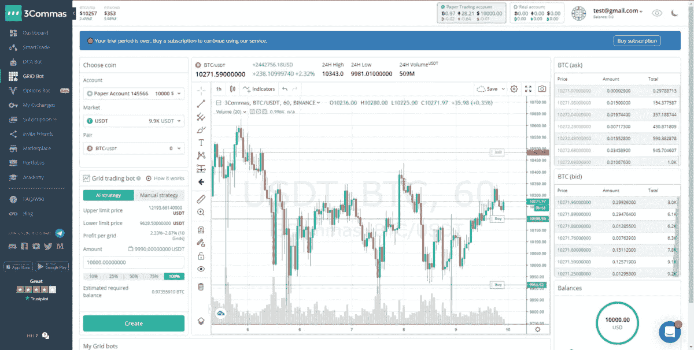****

****3Commas 在其智能[交易终端](https://coincodecap.com/crypto-trading-terminals)中提供了广泛的技术指标、控制和智能交易功能。****

****智能终端为交易员提供了一种管理自己订单执行的方式，而无需依赖机器人来实现交易自动化。****

****这种资源非常适合想维持手动策略的日内交易者或波段交易者。****

## ****[虾米](https://www.shrimpy.io/signup?r=I6VFZ7d2E)****

****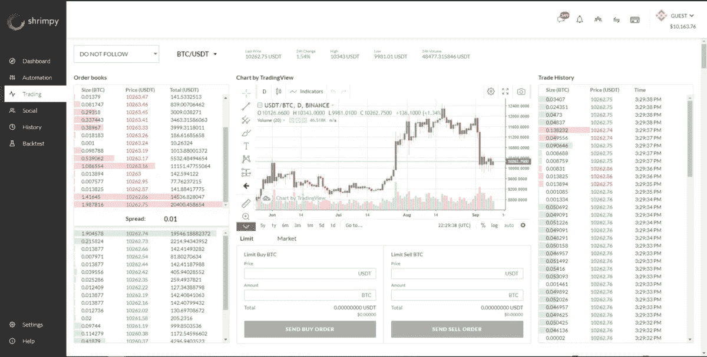****

****Shrimpy 在其智能交易终端中提供了许多关键功能。除了图表和数据功能，交易者还可以执行限价单和智能市价单。****

****交易终端中的实时订单簿和交易数据利用了 Shrimpy 的实时 WebSocket 流，以确保提供一种与交易所相似的体验。****

> ****另外，请阅读我们对[最佳加密交易机器人](/coinmonks/crypto-trading-bot-c2ffce8acb2a)的比较。****

# ****4.副本和社交交易-Cryptohopper vs 3 commas vs Shrimpy****

****[社交交易](/coinmonks/top-10-crypto-copy-trading-platforms-for-beginners-d0c37c7d698c)正在成为加密货币中的一个成长中的行业。在过去的几年里，平台一直在努力寻找新的方法，通过整合社交交易、信号和策略市场来区分自己和竞争对手。在这个意义上，Shrimpy、Cryptohopper 和 3Commas 没有什么不同。****

## ****[隐漏斗](https://www.cryptohopper.com/?atid=15596)****

********

****[Cryptohopper](https://www.cryptohopper.com/?atid=15596) 提供 3 种不同类型的市场。每个市场都是为不同的交易策略而设计的。****

****模板为交易者提供了一种交流想法的方式，用于[配置交易机器人](https://coincodecap.com/a-guide-to-cryptocurrency-trading-bots)。这些模板可以为没有经验的交易者理解如何开始建立交易策略提供基础。****

****策略是一组指标，用来决定何时执行交易。这些指标是由策略的销售者挑选的。****

****信号是由交易者提供的通知，告诉你的机器人该购买哪项资产以及何时进行交易。这些信号可以是手动的，也可以基于许多定制的指示器。****

## ****[3 条消息](https://3commas.io/?c=tc252152)****

********

****[3Commas](https://3commas.io/?c=tc252152) 拥有最大的交易信号市场之一。这些信号可以附加到应用程序中的交易机器人上，根据信号自动进行交易。****

****这些信号的价格从免费到每月几百美元不等。信号的价格和技术要求对新手密码交易者来说是个问题。****

## ****[虾米](https://www.shrimpy.io/signup?r=I6VFZ7d2E)****

********

****Shrimpy 开发了一种独特的社交交易方式。与其他关注信号、指标和市场的平台不同，Shrimpy 正在发展一个交易者社区。每个交易者可以决定跟随平台上的另一个交易者，或者领导他们自己的小组。****

****社交领袖和追随者之间的关系使 Shrimpy 成为投资者了解加密货币、遵循成功策略和增加资产组合的完美场所。当领导者更新他们的投资组合时，这些更改将立即发送给追随者以进行相同的更改。****

****在一天结束时，Shrimpy 比任何人都更容易复制市场上顶级加密交易者的交易策略。****

# ****5.支持的交换****

****在我们决定交易机器人之前，我们必须首先确保我们的资金在一个受支持的交易所。每个交易机器人只支持有限的交易所选择。大多数交易机器人不会试图整合每一个交易所，而是选择一些受欢迎的特定交易所。****

## ****[隐漏斗](https://www.cryptohopper.com/?atid=15596)****

********

****Cryptohopper 目前支持 13 种不同的交易所。每个交易所都可以连接到该平台，实现交易自动化，交换策略，并管理多样化的投资组合。****

****虽然 Cryptohopper 支持的交易所比其他一些交易机器人少，但最受欢迎的交易所仍然得到支持。****

## ****[3 条消息](https://3commas.io/?c=tc252152)****

****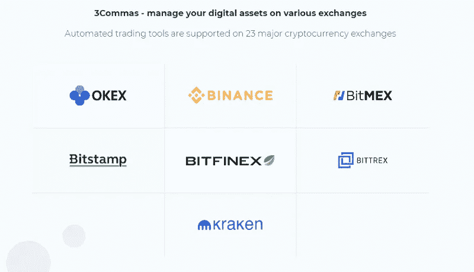****

****3Commas 支持 23 种不同的交换。这些交易所中的每一个都可以连接到平台，用于管理不同数量的交易策略。****

****不幸的是，并不是所有 3Commas 支持的交换都有相同的功能。这可能会给那些希望在多个交易所实现策略自动化的新投资者带来极大的困惑。****

## ****[小虾](https://www.shrimpy.io/signup?r=I6VFZ7d2E)****

********

****Shrimpy 插入 16 个不同的交换机，以便立即访问。客户可以将无限数量的 exchange 帐户连接到一个 Shrimpy 帐户。这意味着，无论你有 31 个币安账户，还是每个交易所一个账户，它们都可以与 Shrimpy 关联。****

****最棒的是，在 Shrimpy 中，每个交易所都有一套相同的功能。这意味着当链接一个新的 exchange 帐户时，什么样的功能是可用的，这一点不会引起混淆。****

# ****6.定价-3 commas vs Cryptohopper vs Shrimpy****

****构建金融产品是昂贵的。因此，这些平台都决定瞄准专业投资者市场。这些平台最常见的赚钱方式是通过分层订阅服务。****

## ****[隐翅虫](https://www.cryptohopper.com/?atid=15596)****

********

****Cryptohopper 的定价计划起价为 19 美元/月。在这一层，你将获得 80 个头寸，投资组合中多达 15 项资产，以及 1 个模拟交易机器人。****

****由于较低层对交易功能有很大的限制，我们相信 Hero 软件包对大多数交易者来说是理想的。不幸的是，这个套餐的起价是 99 美元/月。****

****Cryptohopper 的高昂价格可能会使许多小投资者无法获得这项交易服务。****

## ****[3 条消息](https://3commas.io/?c=tc252152)****

****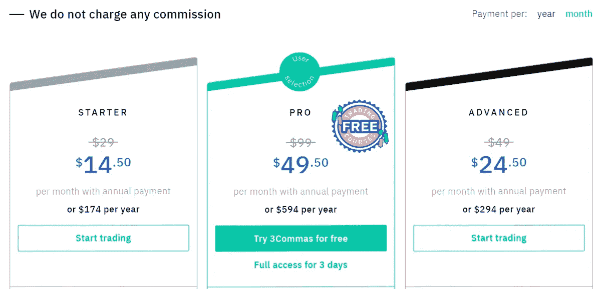****

****3Commas 定价计划更加细致入微。起价为 14.50 英镑/月的首发计划限制性很强。这意味着您将无法访问您可能想要的大多数功能。****

****高级计划有更多的功能，但它仍然不提供对全套交易工具的访问。****

****提供所有功能的推荐计划是 49.50 美元的专业计划。在这个价位上，3Commas 很贵，但它确实提供了广泛的交易功能。****

## ****[虾米](https://www.shrimpy.io/signup?r=I6VFZ7d2E)****

****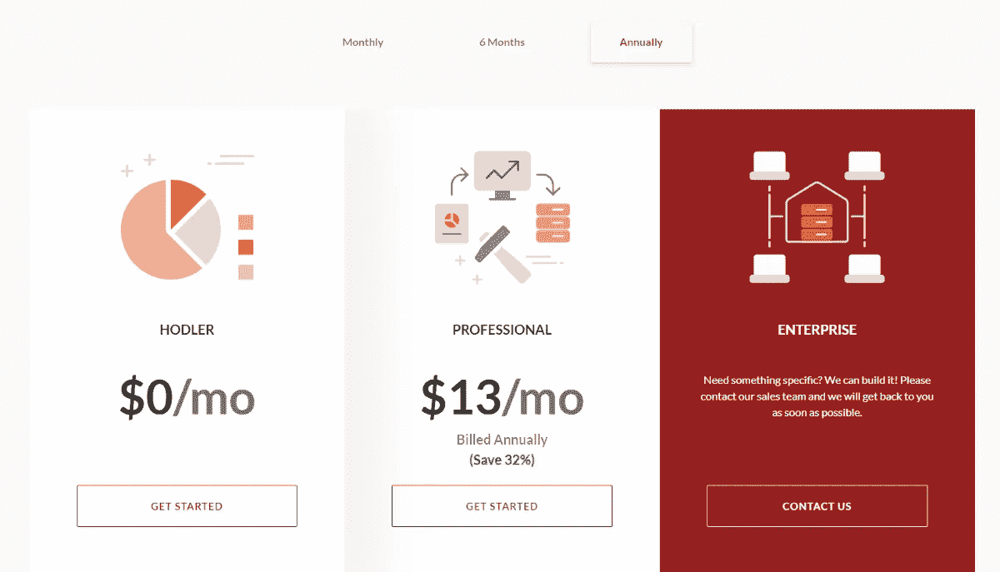****

****Shrimpy 的定价计划非常简单。本质上只有一个付款计划，即 13/mo 选项。这个计划将让你获得 100%的 Shrimpy 功能，无限的交易，无限的社会关注，等等。****

****任何使用 Shrimpy 的人都会想订阅专业计划。****

# ****cryptohopper vs 3 commas vs Shrimpy-结论****

****加密货币社区开始看到能够自动管理一系列加密资产的强大平台的出现。虽然 Shrimpy 专注于投资组合管理和提供愉快的用户体验，但 3Commas 和 Cryptohopper 是为希望实施复杂策略的高级交易者设计的。****

****尽管不熟悉加密货币的投资者会从这种简单的交易服务中受益匪浅，但经验丰富的专业人士可能会更倾向于 3Commas 和 Cryptohopper 提供的复杂性。****

****我们建议尝试这些平台，找到最适合您的平台。没有适合所有人的完美平台。****

# ****常见问题****

*   ****Cryptohopper 或 3Commas 或 Shrimpy 哪个是最好的交易机器人？****

****如果你正在寻找投资组合管理，试试 Shrimpy。如果你正在寻找创建交易策略和自动化你的交易，你可以试试 3Commas。****

# ****另类交易机器人****

1.  ****[Bitsgap](https://bitsgap.com/?ref=2cb1231-3) ，是一个满足您所有交易需求的一站式加密交易平台。它允许用户将他们所有的密码交易账户放在同一个屋檐下，通过一个集成的界面进行交易。阅读我们的 [Bitsgap 评论](/coinmonks/bitsgap-review-a-crypto-trading-bot-that-makes-easy-money-a5d88a336df2)。****
2.  ****2018 年推出的加密交易自动化平台 Quadency。它给你带来了一个更聪明的方式来交易和管理你的密码。阅读我们的[季度回顾](https://coincodecap.com/quadency-review-a-crypto-trading-automation-platform)。****
3.  ****哈森在线是最古老和最著名的加密自动交易公司之一。他们的卓越声誉来自于他们的交易自动化软件，该软件自 2014 年以来一直为加密交易员执行交易策略。阅读我们的[哈森在线评论](/coinmonks/haasonline-review-d8d1a3400419)。****

# ****折扣🔥****

> *****通过使用多种交易所分散您的资金并降低您的风险，阅读我们关于* [***加密副本交易***](/coinmonks/top-10-crypto-copy-trading-platforms-for-beginners-d0c37c7d698c) *的博客。*****
> 
> *****使用推荐代码*[***rj 45 svb***](https://www.kucoin.com/ucenter/signup?rcode=rJ45SVB)*为*[***Kucoin***](/coinmonks/kucoin-review-bb5e3071f0e)*并收取交易费用。*****
> 
> *****使用推荐代码(****coin monks****)为***)并获得 5%的交易费用优惠。******
> 
> ******使用推荐代码****UART 1 S1****为**[*币安*](https://accounts.binance.com/en/register?ref=UARTH1S1)******
> 
> *******加入我们的* [***电报频道***](https://t.me/coincodecap) *免费获取密码交易分析、* [*密码信号*](/coinmonks/best-crypto-signals-telegram-5785cdbc4b2b) *等新闻。*******
> 
> *******对于印度来说，加密社区检查了* [*最好的印度加密交易所*](/coinmonks/bitcoin-exchange-in-india-7f1fe79715c9) *和* [*在印度购买比特币的应用*](/coinmonks/buy-bitcoin-in-india-feb50ddfef94) *。*******
> 
> *******使用* [*最佳加密税务软件*](/coinmonks/best-crypto-tax-tool-for-my-money-72d4b430816b) *支付您的加密税款，使用* [*最佳加密硬件钱包*](/coinmonks/the-best-cryptocurrency-hardware-wallets-of-2020-e28b1c124069) *保护您的加密。*******

> ******加入 Coinmonks [电报频道](https://t.me/coincodecap)和 [Youtube 频道](https://www.youtube.com/c/coinmonks/videos)了解加密交易和投资******

## ******另外，阅读******

*   ******[3 商业评论](/coinmonks/3commas-review-an-excellent-crypto-trading-bot-2020-1313a58bec92) | [Pionex 评论](https://coincodecap.com/pionex-review-exchange-with-crypto-trading-bot) | [Coinrule 评论](/coinmonks/coinrule-review-2021-a-beginner-friendly-crypto-trading-bot-daf0504848ba)******
*   ******[莱杰 vs Ngrave](/coinmonks/ledger-vs-ngrave-zero-7e40f0c1d694) | [莱杰 nano s vs x](/coinmonks/ledger-nano-s-vs-x-battery-hardware-price-storage-59a6663fe3b0) | [币安评论](/coinmonks/binance-review-ee10d3bf3b6e)******
*   ******[Bybit Exchange 评论](/coinmonks/bybit-exchange-review-dbd570019b71) | [Bityard 评论](https://coincodecap.com/bityard-reivew) | [Jet-Bot 评论](https://coincodecap.com/jet-bot-review)******
*   ******最好的比特币[硬件钱包](/coinmonks/hardware-wallets-dfa1211730c6) | [BitBox02 回顾](/coinmonks/bitbox02-review-your-swiss-bitcoin-hardware-wallet-c36c88fff29)******
*   ******[block fi vs Celsius](/coinmonks/blockfi-vs-celsius-vs-hodlnaut-8a1cc8c26630)|[Hodlnaut 点评](/coinmonks/hodlnaut-review-best-way-to-hodl-is-to-earn-interest-on-your-bitcoin-6658a8c19edf) | [KuCoin 点评](https://coincodecap.com/kucoin-review)******
*   ******[CBET 评论](https://coincodecap.com/cbet-casino-review) | [库科恩 vs 比特币基地](https://coincodecap.com/kucoin-vs-coinbase)******
*   ******[折叠 App 审核](https://coincodecap.com/fold-app-review) | [Kucoin 交易机器人](/coinmonks/kucoin-trading-bot-automate-your-trades-8cf0ca2138e0) | [Probit 审核](https://coincodecap.com/probit-review)******
*   ******[如何匿名购买比特币](https://coincodecap.com/buy-bitcoin-anonymously) | [比特币现金钱包](https://coincodecap.com/bitcoin-cash-wallets)******
*   ******[币安 vs FTX](https://coincodecap.com/binance-vs-ftx) | [最佳(索尔)索拉纳钱包](https://coincodecap.com/solana-wallets)******

************