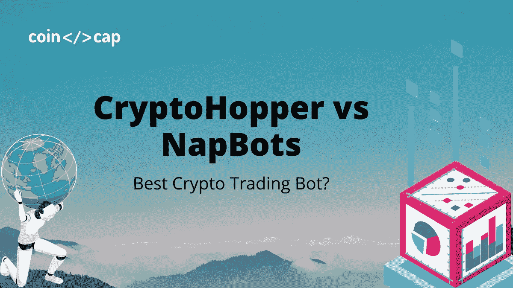
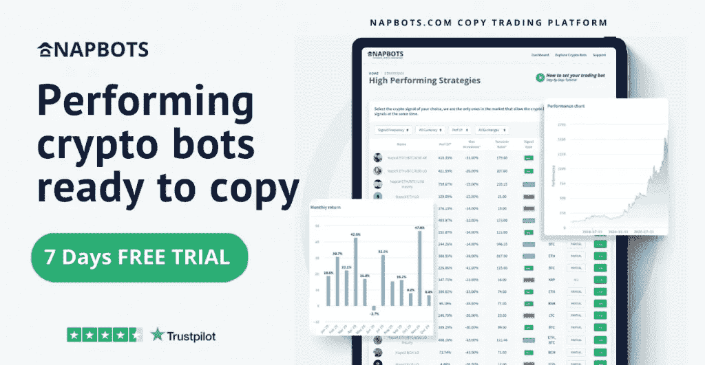
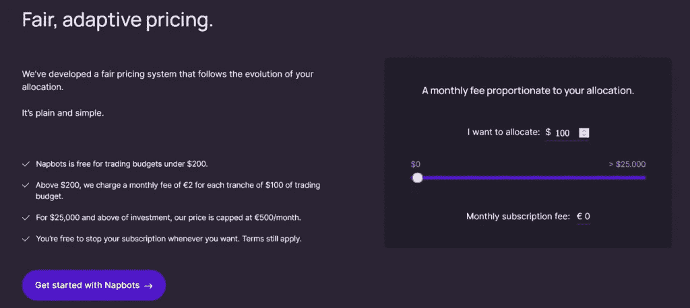
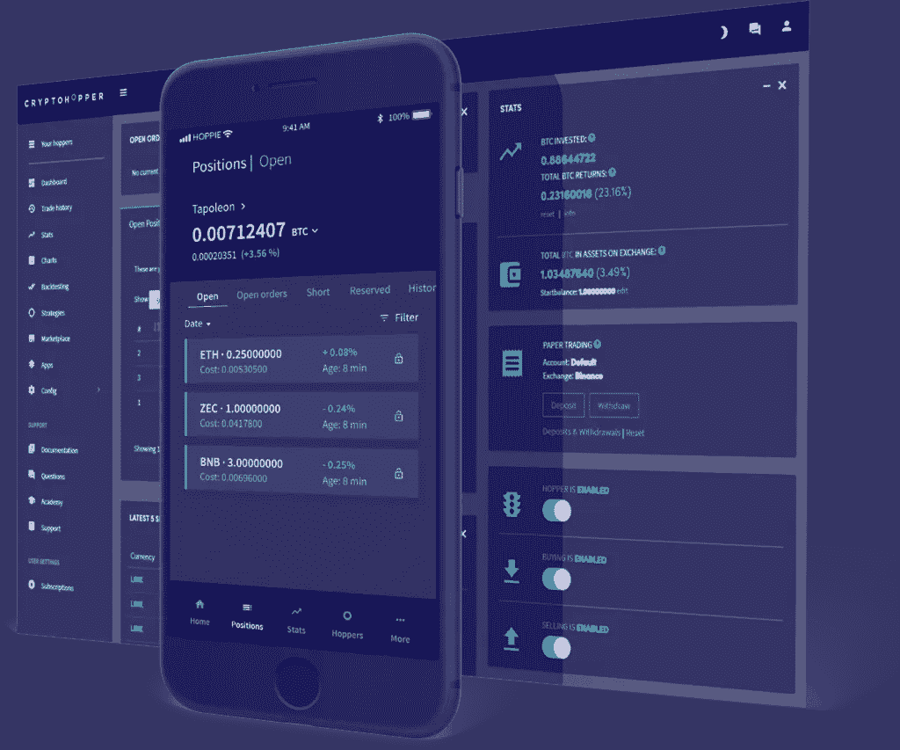

# CryptoHopper vs NapBots:最好的加密交易机器人？

> 原文：<https://medium.com/coinmonks/cryptohopper-vs-napbots-5bacbdd91851?source=collection_archive---------0----------------------->

机器人或自动交易系统已经成为一种流行的加密货币交易方式。加密交易机器人会为你处理大部分工作，而不是盯着加密市场，寻找进出点。在这里，我们将看看[crypto hopper](https://blog.coincodecap.com/go/cryptohopper)vs[nap bot](https://blog.coincodecap.com/go/napbots)，因为这两个平台都提供了广泛的工具来自动化您的密码交易。

# 总结(TL；博士)

Cryptohopper 和 NapBots 都依赖 API 密钥在几个主要的加密货币交易所代表你进行交易。这两个平台共享许多功能，并将提供以下功能:

*   基于云的平台，支持 24/7 全天候连接。
*   这两个平台都支持订阅计划。
*   通过 API 密钥与最著名的加密交易所合作。
*   自动化交易选项。
*   限价单的多头/空头交易。
*   用户友好的交易界面。

# 隐漏斗 vs nap bot:nap bot

## 什么是 Napbots？

[**nap bots**](https://coincodecap.com/napbots-review)**是 CoinShares International Ltd .全资子公司拿破仑集团于 2019 年推出的平台。**

**该平台的用户界面简洁明了。Napbots 兼容大多数行业领先的交易所，包括币安、FTX、北海巨妖等。，并正在积极扩充名单。它支持三种语言——英语。法语和德语。**

**有超过 30 种密码可以与 Napbots 进行交易，包括 BTC、ETH、SOL 和 BNB。此外，交易者可以很容易地使用专业人士为交易设计的 15 种工作策略。**

**要了解更多信息，请阅读[nap bot 评论](https://blog.coincodecap.com/napbots-review-crypto-trading-on-autopilot)。**

****

## **Napbots 策略**

**[Napbots](https://blog.coincodecap.com/go/napbots) 最近推出了 20 多种策略，每种策略都有自己的基线 KPI 和测试模板。例如，他们最古老的技术“BTC LO”现在正在为人工交易提供指示，并接近历史最高点。**

**此外，旗舰策略 BTC/ ETH/美元 AR 的表现超过基础策略约 2.5 倍。然而，过去的成功并不能确保未来的成功。**

**该团队提供趋势跟踪和均值回归方法，以价格作为主要数据库(每周、每天和每小时)。**

**[NapBots](https://blog.coincodecap.com/go/napbots) 也是一个交易机器人，可以容纳各种背景的投资者。该平台允许机器人为初学者或临时交易者执行所有工作；对于专业人士，你需要激活“机器人专用模式”，在不使用机器人自动化的情况下交易头寸。它是市场上唯一一个同时使用战术和战略的机器人。**

**您也可以浏览我们的一篇对比文章，以更好地了解 Napbots 的优势。**

**【https://blog.coincodecap.com/mudrex-vs-tokensets-vs-napbots 号**

## **Napbots 入门步骤**

**总而言之，基于市场价格波动等事实，[**nap bot**](https://blog.coincodecap.com/go/napbots)**会站在用户的立场上采取行动。只需三个简单的步骤，您就可以获得现成的加密机器人:****

*   ****注册，然后选择一个交换。****
*   ****选择你最喜欢的加密策略。****
*   ****让机器人为你交易。****

## ****Napbots 支持交换****

****第一步，NapBots 给出了八个最受欢迎的加密货币交易所的选择。****，** [**Bitmex**](https://blog.coincodecap.com/go/bitmex) **，Bitfinex，**[**Okex**](https://blog.coincodecap.com/go/okex)**，**[**Phemex**](https://blog.coincodecap.com/go/phemex)**，** [**北海巨妖**](https://blog.coincodecap.com/go/kraken) **，**[**bit panda**](https://blog.coincodecap.com/go/bitpanda)并在不久后添加[**【coin base】**](https://blog.coincodecap.com/go/coinbase)**[**Revolut**](https://blog.coincodecap.com/go/revolut)**，Kucoin，**[**hit BTC**](https://blog.coincodecap.com/go/hitbtc)**，**等等。如此多样的交易所为执行其算法策略提供了高水平的流动性。********

********

****将 Napbots 连接到您的交换机很容易。您只需要从您选择的 Exchange 帐户生成一个 API 密钥，并在 Napbots 网站上输入它。****

# ****CryptoHopper vs nap bot:nap bot 定价****

********

# ****隐漏斗 vs 机器人:隐漏斗****

## ****什么是隐漏斗？****

****另一方面，Cryptohopper 提供了一个基于云的平台，允许用户管理八个主要(法律认可的)交易所的若干加密资产。以下交易所正式支持 Cryptohopper:****

****[**【KuCoin】**](https://blog.coincodecap.com/go/kucoin)**【币安】【比特币基地】Pro、**[**Bittrex**](https://blog.coincodecap.com/go/bittrex)**[**Poloniex**](https://blog.coincodecap.com/go/poloniex)**【北海巨妖】**[**Huobi**](https://blog.coincodecap.com/go/huobi)**和[**Bitfinex**](https://blog.coincodecap.com/go/bitfinex)**都是一些最流行的加密货币交易所**********

******Cryptohopper 的客户将能够在这些交易所使用一系列半自动交易工具。一旦用户设置了 Cryptohopper bot，它将自动与客户的账户进行交易。******

************

******您还可以在平台上获得交易指示，以帮助您决定是否进入或退出交易。Cryptohopper 除了自动化交易之外，还提供社交交易，让交易者一起合作产生金钱。******

******要了解更多信息，请阅读 [CryptoHopper 的评论](https://blog.coincodecap.com/cryptohopper-review)。你也可以浏览[排名前五的免费 CryptoHopper 应用](https://blog.coincodecap.com/cryptohopper-apps)。******

## ******隐蚱蜢的工具******

******您可以在任何支持 Cryptohopper 平台的密码交易所设置买卖设置。您选择的触发器可以设置为在任何市场场景下运行，但该软件不提供完全自动化的交易算法。******

******在 [Cryptohopper](https://blog.coincodecap.com/go/cryptohopper) 上提供以下订单类型/交易工具:******

1.  ********止损单:**当头寸进展对你有利时，使用根据市场调整的止损单是个好主意，这样可以保证一部分利润。Cryptohopper 在其平台上提供了一个主要功能，即跟踪止损，它会为您处理这个问题。******
2.  ****交易者不能一周七天、一天 24 小时都呆在交易终端，这就是使用自动化系统的原因。 [Cryptohopper](https://blog.coincodecap.com/go/cryptohopper) 将随时出现在所有交易所，目标是**在市场达到你指定的水平时开仓或平仓**。这对于那些不能把交易作为全职工作，但对自己想做的职位有清晰想法的交易者来说尤其有益。****
3.  ******预留资金:** Cryptohopper 有一个预留资金功能，让你设置特定数量的代币，让你的账户里永远有东西。这个功能可能对你的交易风格有利，也可能不利，但它是一个有用的工具。****
4.  ****头皮交易是一种从小的市场波动中快速获利的方式。在 [**Cryptohopper**](https://blog.coincodecap.com/go/cryptohopper) 上，倒票过程已经自动化，平台会根据你的喜好替你倒票。****
5.  ******正对交易:**趋势是你的朋友，Cryptohopper 打造了正对交易工具，帮助你找到最佳的交易机会。Cryptohopper 的正配对工具将寻找在过去 24 小时内表现良好的令牌配对，并进入这些市场。****
6.  ******Cryptohopper 的触发器**允许您参与快速发展的加密货币市场。您可以设置触发器，在市场向您预期的方向发展时，买入或卖空任何由 [**Cryptohopper**](https://blog.coincodecap.com/go/cryptohopper) 支持的硬币并进行交易。****
7.  ****卖空:卖出特定的代币意味着从其价值的下跌中获利。此外，在 Cryptohopper，当价格达到触发点时，很容易做到这一点。你也可以选择一个平仓的时机，这样你的利润就有保障了。****
8.  ******平均美元成本:**当你在更小的阶段购买更突出的位置时，获得完整位置的成本会有所不同。这被称为美元成本平均，Cryptohopper 的交易平台上有一个美元成本平均工具。此外，[美元成本平均法](https://blog.coincodecap.com/dca)可以以多种方式应用，如 Cryptohopper 网站上所解释的。****
9.  ******加密信号:** Cryptohopper 允许第三方交易者充当信号员，作为其社交交易网络的一部分。你可以通过订阅其中一个提供商来接收[加密交易信号](https://blog.coincodecap.com/best-crypto-signals-telegram)。当然，过去的交易成功并不能保证未来的收益，但如果你想从以前的交易者的经验中受益，这是一个可行的选择！****

# ****CryptoHopper vs nap bot:CryptoHopper 定价****

****该平台有三级定价体系，最低的一级免费一周。****

********

******先锋计划:**免费试用 7 天****

****探索者:启动计划(每月 19 美元)是一个很好的开始。第一个月的套餐会花掉你 19 美元。如果您选择此套餐，您将能够从多达 15 个令牌的池中处理 80 个头寸，每 10 分钟进行一次技术分析。您将能够使用该技术设置两个触发器。****

******冒险:** [Cryptohopper](https://blog.coincodecap.com/go/cryptohopper) 的中档计划是冒险 hopper，每月 49 美元。该计划将头寸数量增加到 200 个，并允许您交易 50 种不同的代币。你还将得到一个五分钟的技术分析，并获得五个触发器。****

******Hero:**Cryptohopper 的 Hero Hopper 计划是公司最昂贵的选择。它允许您使用总共 75 个令牌管理多达 500 个位置。它每月花费 99 美元，包含十个触发器和两分钟的技术分析。除了其他功能，Hero Hopper 计划还提供比特币信号。****

# ****隐漏斗 vs NapBots:结论****

****CryptoHopper 和 Napbots 都是著名的[密码交易机器人](/coinmonks/crypto-trading-bot-c2ffce8acb2a)提供商。他们每个人都因为特定的原因而出名。一方面， [**CryptoHopper**](https://blog.coincodecap.com/go/cryptohopper) 提供其 MarketPlace，市场上最受欢迎的服务之一。另一方面，Napbots 提供了一个相当有经验的创作者团队。****

****如果你正在寻找多种选择，那么你可以选择 CryptoHopper。然而，如果你在寻找易于使用的交易机器人，那么[**nap bot**](https://blog.coincodecap.com/go/napbots)**就是你的目的地。******

# ******常见问题******

******Napbots 上有哪些交易所？******

******Napbots 为投资者提供多种多样的本地和国际交易所，包括币安、北海巨妖、FTX 和 Bitfinex(更多交易所即将推出)。******

******NapBots 安全吗？******

******是的，NapBots 是安全可靠的。该团队会尽一切可能保护您的帐户和个人信息。他们定期对 NapBots 网站进行安全审计，并尽一切努力为您提供最安全的加密交易体验。******

********Crtptohopper 合法吗？********

****是的，Cryptohopper 是合法的，并且看起来是一个值得信赖的交易机器人。我们的调查显示，这个机器人是真实的(它代表你进行交易)，简单明了，用户友好。此外，我们可以确认他们所有的合作经纪人都受到了良好的控制。****

*   ****[Napbots 评论 2021 |增加加密回报的简单方法](https://blog.coincodecap.com/napbots-review-crypto-trading-on-autopilot)****
*   ****[Cryptohopper 点评:2021 年仍是最佳交易 Bot 平台？](https://blog.coincodecap.com/cryptohopper-review)****
*   ****[CryptoHopper vs NapBots |如何实现密码交易的自动化？](https://blog.coincodecap.com/cryptohopper-vs-napbots)****
*   ****[Quadency vs Bitsgap vs nap bots |哪个交易机器人适合你？](https://blog.coincodecap.com/quadency-vs-bitsgap-vs-napbots)****

******披露—包括附属链接******

> ****加入 [Coinmonks 电报频道](https://t.me/coincodecap)，了解加密交易和投资****

## ****另外，阅读****

*   ****[什么是保证金交易](https://blog.coincodecap.com/margin-trading) | [美元成本平均法](https://blog.coincodecap.com/dca)****
*   ****[BigONE 交易所评论](/coinmonks/bigone-exchange-review-64705d85a1d4) | [电网交易 Bot](https://blog.coincodecap.com/grid-trading)****
*   ****[3 商业评论](/coinmonks/3commas-review-an-excellent-crypto-trading-bot-2020-1313a58bec92) | [Pionex 评论](/coinmonks/pionex-review-exchange-with-crypto-trading-bot-1e459d0191ea) | [Coinrule 评论](/coinmonks/coinrule-review-2021-a-beginner-friendly-crypto-trading-bot-daf0504848ba)****
*   ****[莱杰 vs n rave](/coinmonks/ledger-vs-ngrave-zero-7e40f0c1d694)|[莱杰 nano s vs x](/coinmonks/ledger-nano-s-vs-x-battery-hardware-price-storage-59a6663fe3b0) | [币安评论](/coinmonks/binance-review-ee10d3bf3b6e)****
*   ****[Bybit 交易所评论](/coinmonks/bybit-exchange-review-dbd570019b71) | [Bityard 评论](/coinmonks/bityard-review-7d104239be35) | [CoinSpot 评论](https://blog.coincodecap.com/coinspot-review)****
*   ****[3 commas vs crypto hopper](/coinmonks/3commas-vs-pionex-vs-cryptohopper-best-crypto-bot-6a98d2baa203)|[赚取加密利息](/coinmonks/earn-crypto-interest-b10b810fdda3)****
*   ****最好的比特币[硬件钱包](/coinmonks/the-best-cryptocurrency-hardware-wallets-of-2020-e28b1c124069?source=friends_link&sk=324dd9ff8556ab578d71e7ad7658ad7c) | [BitBox02 回顾](/coinmonks/bitbox02-review-your-swiss-bitcoin-hardware-wallet-c36c88fff29)****
*   ****[block fi vs Celsius](/coinmonks/blockfi-vs-celsius-vs-hodlnaut-8a1cc8c26630)|[Hodlnaut 审核](/coinmonks/hodlnaut-review-best-way-to-hodl-is-to-earn-interest-on-your-bitcoin-6658a8c19edf) | [KuCoin 审核](https://blog.coincodecap.com/kucoin-review)****
*   ****[Bitsgap 审查](/coinmonks/bitsgap-review-a-crypto-trading-bot-that-makes-easy-money-a5d88a336df2) | [Quadency 审查](/coinmonks/quadency-review-a-crypto-trading-automation-platform-3068eaa374e1) | [Bitbns 审查](/coinmonks/bitbns-review-38256a07e161)****
*   ****[加密复制交易平台](/coinmonks/top-10-crypto-copy-trading-platforms-for-beginners-d0c37c7d698c) | [Coinmama 评论](/coinmonks/coinmama-review-ace5641bde6e)****
*   ****[印度加密交易所](/coinmonks/bitcoin-exchange-in-india-7f1fe79715c9) | [比特币储蓄账户](/coinmonks/bitcoin-savings-account-e65b13f92451)****
*   ****[CoinDCX 评论](/coinmonks/coindcx-review-8444db3621a2) | [加密保证金交易交易所](https://blog.coincodecap.com/crypto-margin-trading-exchanges)****
*   ****[CoinLoan 评论](/coinmonks/coinloan-review-18128b9badc4) | [YouHodler 评论](/coinmonks/youhodler-4-easy-ways-to-make-money-98969b9689f2) | [BlockFi 评论](/coinmonks/blockfi-review-53096053c097)****
*   ****最好的[加密税务软件](/coinmonks/best-crypto-tax-tool-for-my-money-72d4b430816b) | [硬币追踪评论](/coinmonks/cointracking-review-a-reliable-cryptocurrency-tax-software-5114e3eb5737)****
*   ****[Stackedinvest 评论](https://blog.coincodecap.com/stackedinvest-review) | [北海巨妖评论](/coinmonks/kraken-review-6165fc1056ac) | [期货交易机器人](/coinmonks/futures-trading-bots-5a282ccee3f5)****
*   ****最佳[加密借贷平台](/coinmonks/top-5-crypto-lending-platforms-in-2020-that-you-need-to-know-a1b675cec3fa) | [杠杆令牌](/coinmonks/leveraged-token-3f5257808b22)****
*   ****最佳[加密制图工具](/coinmonks/what-are-the-best-charting-platforms-for-cryptocurrency-trading-85aade584d80) | [最佳加密交易所](/coinmonks/crypto-exchange-dd2f9d6f3769)****
*   ****[如何在印度购买比特币？](/coinmonks/buy-bitcoin-in-india-feb50ddfef94) | [瓦济里审查](/coinmonks/wazirx-review-5c811b074f5b) | [HitBTC 审查](/coinmonks/hitbtc-review-c5143c5d53c2)****
*   ****[WazirX vs CoinDCX vs bit bns](/coinmonks/wazirx-vs-coindcx-vs-bitbns-149f4f19a2f1)|[block fi vs coin loan vs Nexo](/coinmonks/blockfi-vs-coinloan-vs-nexo-cb624635230d)****
*   ****[本地比特币评论](/coinmonks/localbitcoins-review-6cc001c6ed56) | [加密货币储蓄账户](https://blog.coincodecap.com/cryptocurrency-savings-accounts)****
*   ****[比特币基地评论](/coinmonks/coinbase-review-6ef4e0f56064) | [德里比特评论](/coinmonks/deribit-review-options-fees-apis-and-testnet-2ca16c4bbdb2) | [FTX 评论](/coinmonks/ftx-crypto-exchange-review-53664ac1198f)****
*   ****[n 零审核](/coinmonks/ngrave-zero-review-c465cf8307fc) | [Phemex 审核](/coinmonks/phemex-review-4cfba0b49e28) | [PrimeXBT 审核](/coinmonks/primexbt-review-88e0815be858)****
*   ****最佳[区块链分析](https://bitquery.io/blog/best-blockchain-analysis-tools-and-software)工具| [赚比特币](/coinmonks/earn-bitcoin-6e8bd3c592d9)****
*   ****[加密套利](/coinmonks/crypto-arbitrage-guide-how-to-make-money-as-a-beginner-62bfe5c868f6)指南| [如何做空比特币](/coinmonks/how-to-short-bitcoin-568a2d0b4ae5) | [Prokey 点评](/coinmonks/prokey-review-26611173c13c)****
*   ****[币安交易机器人](/coinmonks/binance-trading-bots-d0d57bb62c4c) | [OKEx 评论](/coinmonks/okex-review-6b369304110f) | [Atani 评论](https://blog.coincodecap.com/atani-review)****
*   ****[最佳加密交易信号电报](/coinmonks/best-crypto-signals-telegram-5785cdbc4b2b) | [MoonXBT 评论](/coinmonks/moonxbt-review-6e4ab26d037)****
*   ****[Godex.io 审核](/coinmonks/godex-io-review-7366086519fb) | [邀请审核](/coinmonks/invity-review-70f3030c0502) | [BitForex 审核](/coinmonks/bitforex-review-c4bb28d9e271)****